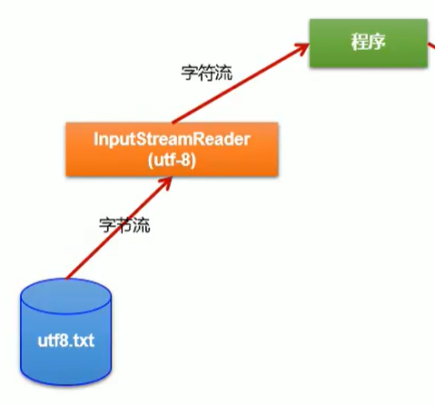

设计结构

```java
public class FirstDemo{
	public static void main(String[] args){
	system.out.println("hello word");
	} 
}
```

**区分大小写**

## **编写类名**

- public 修饰符 

- class 类

- FirstDemo 类名

##**方法**

- **main方法的修饰符必须是public,static**

##**语句**

- .用于调用方法
  - object.method(parameters)
- **分号**表示句子**结束**,回车不是结合苏标志,可以将多句写在一行

## 注释

三种标记注释

- //   :从//到本行结束
- /*, */ 两个界定一段注释
- /* *  , */


{}:划分程序的各个部分,成对出现,空白符会被编译器忽略

## 编译

编译这段源代码后会得到一个包含这个**类字节码**的文件,编译器会自动命名成类名.class,并存储在源文件的同一目录下

运行已编译的程序,虚拟机总是从main方法开始执行.因此需要执行的类必须拥有main方法


# 数据类型

java是==强类型语言==:必须为**每个变量声明一种类型**


## 基本类型

一共有8种==基本类型==:4种整型,2种浮点类型,1种字符串类型char和表示真值的类型boolean


### 整型

表示**没有小数部分**的数值

- int   4字节  2的32次方
  - 最常用
- short 2字节 2的16次方
- byte 1字节  2的8次方
- long   8字节
- byte   1字节   2的8次


### 浮点数

表示**有小数部分**的数值

- float  4字节  精度6-7位
  - 不适用于金融计算,使用BigDecimal
- double 8字节  精度15位
  - 最常用

**溢出或出错**的三种特殊情况

- 正无穷大(POSITIVE_INFINITY)
  - 正数除以0
- 负无穷小(NEGATIVE_INFINITY)
- NaN
  - 0/0或者负数的平方根
  - NaN互不相等,可以用isNaN判断


### char

原本表示**单个字符**,现在有些Unicode可以使用一个char表示,有些需要两个char

字面量需要**单引号**括起来:

- 'A'表示编码为65的字符常量
- "A"表示字符A的字符串


> Unicode和char

Unicode打破了传统字符编码的限制:多个地区多个标准会对应不同的字母


### boolean

false和true判断逻辑条件,整型值和布尔值**不能相互转化**


## 基本类型包装器

将**基本类型转换为对象**,所有基本类型都有一个与之对应的类,这些类被称为==包装器==.**包装类不可变**,且是**final**,没有子类

- Numer超类
  - Integer
  - Long
  - Float
  - Double
  - Short
  - Byte
- Chararcter
- Bollean


**泛型尖括号中的类型不能基本类型**,所以需要用到包装器.

```java
//不允许
ArrayList<int> list = new ArrayList<>();

//包装类
ArrayList<Integer> list = new ArrayList<>();
```

使用包装器还可以**调用一些基本方法**,如将字符串转换成数值

```
int x = Integer.parseInt(s);
```


> API

- int intValue()
  - 将一个Integer对象的值作为int返回
- static int parseInt(String s)
- static int parseInt(String s,int radix)
  - 返回字符串的整数,第一个为十进制,第二个radix进制
- static Integer valueOf(String s)
- Number pase(String s)
  - 返回数字值,如果字符串内容为数字


> 装箱拆箱

**自动装箱**:即你输入的基本类型会自动转化为对应的包装类.

```java
list.add(3);
//会自动转换成
list.add(Integer.valueOf(3));
```

**自动拆箱**:与装箱的反操作

```java
int n = list.get(1);
//会自动转换成
int n = list.get(1).intValue();
```

混用Integer和Double时，Integer会拆箱成int,再提升到double,再装箱成Double.这说明了**包装类之间不会自动转化,需要通过基本类型转换**

装拆箱是编译器的工作,,在生成类的字节码时会自动调用方法.


> 相等判断

**基本类型只能使用==判断值**,而**包装类**用 ==判断的就变成了是否为**相同地址**,即使值相等也可能为false.

包装类使用equals比较值

当包装类引用为**null时报空指针异常**


## **引用数据类型**

- String
- StringBuffer和StringBulider（可变的字符串）
- 数组
- 集合（可拓展的数组）
- 枚举


### String字符串常量

Java字符串就是Unicode字符序列,Java没有内置字符串类型,在类库中提供

```
String e = "yy";
```

#### 不可变

String类对象是不可变的

**字符串存放在存储池中**,当**创建**变量并赋值,就会将该**变量指向字符串**.

每次对 String 类型进行**改变**的时候其实都等同于**生成了一个新的 String 对象**，然后将**指针指向新的 String 对象**

内存泄漏?**垃圾回收**


#### 方法

**不会改变原本字符串**,都是创建新的字符串

- **子串**

  截取一段字符串

  ```
  String h = "hello"
  // 截取[0,3),hel
  String h1 = h.substring(0,3)
  ```

  计算长度就是3-0=3

 **拼接**

- **+**

  拼接两个字符串

  ```
  String p1 = "yy";
  String p2 = "yzy";
  //yyyzy
  String p3 = p1+p2;
  ```

  任意类型与字符拼接都会变成字符串

- **join**

  多个字符拼接,用界定符分隔

  ```
  //	第一个参数为界定符,后面为字符串     aa
  String p4 = String.join("/","aa","bb","cc")
  ```

- **repeat**

  重复拼接某个字符串

  ```
  //  拼接3次   ababab
  String repeated = "ab".repeat(3);
  ```

#### 相等

> equals

检测两个字符串是否相等,可以是字面量和变量名

```
s.equals("yy");
//忽略大小写
s.equalsIgnpreCase("YY");
```

==不要使用＝＝==

==判断的是是否指向同一个位置，但是子串等拼接的字符串不共享，所以内容一样但是指向的是副本，会显示false


### String字符串变量类

底层存储数据的Char[]数组

经常**改变内容的字符串**最好不要用 String,这样不仅**效率低下**，而且大量**浪费有限的内存空间**

当**对字符串进行修改的时候，特别是字符串对象经常改变的情况下**，需要使用 StringBuffer 和 StringBuilder 类,两者用法相同

#### StringBuffer 字符串变量（线程安全）

- 效率低
- 线程安全

```java
StringBuffer s = null; //结果警告：Null pointer access: The variable result can only be null at this location

StringBuffer s = new StringBuffer();//StringBuffer对象是一个空的对象

StringBuffer s = new StringBuffer(“abc”);//创建带有内容的StringBuffer对象,对象的内容就是字符串”
```


#### StringBuilder 字符串变量（非线程安全)

JDK1.5

- 效率高
- 非线程安全
- 多数情况下使用


### 数组

存储**相同类型**的集合,通过整型**下标**访问值

> 声明

两种写法,第一种较为常用

1.int[] a;

数组类型[] 数组名;

2.String b[];

数组类型 数组名[];

> 赋值

**a = new int[100]**

数组名 = new 数组的类型[长度]

- **确定了长度，无法更改**
- 所有元素没有值
  - 数字－０
  - boolean- false
  - String-null
  - 对象－null

**b = {"yy","zz"};**

提供初始值的简写形式


#### 访问元素

通过下标［］访问

```
		//循环赋值
		int b[] = new int[100];
        for(int i=0;i<100;i++){
            b[i] = i;
        }
        //循环遍历
        for(int i = 0;i<100;i++){
            System.out.println(b[i]);
        }
```


> for each

用来处理数组或集合中的每个元素，不用考虑下标

定义一个**变量**用于**存储每个取出来的元素**，并执行语句

for(数组类型  变量名:数组或集合)

​	｛执行语句；｝


####　拷贝

> 浅拷贝

如果改变t2的值，t1的值也会发生改变，他只拷贝了地址，两个数组**指向同一个地方**:

```
int[] copyNum = num;
copyNum[5] = 12;
//num[5] 也会变成12
```

copyOf(数组名,新数组的长度)

```
int[] copynum = Arrays.copyOf(num,2*num.length);
//长度多于原数组,多余的元素赋值初始值(数值为0,字符串为null...)
//长度小于原数组,只拷贝前面的值
```

> 深拷贝

改变了array2的值，array的值并不改变

```java
	int [] array = {1,2,3,4,5};
    int [] array2 = new int[array.length];
    for (int i = 0; i < array2.length; i++) {
    array2[i] = array[i];
    }

```


#### 排序

快速排序:Array.sort(数组名)


####　多维数组

二维：

```
double[][] a = new double[2][3];

double[][] a = {{2,2,2},
                {3,3,3}};
```

> 遍历

```
 //for each输出格式  2,2,2,3,3,3
 for (double[] x : a){
            for(double y:x){
                System.out.println(y);
            }
        }
        
        //第二种方法的输出输出格式  [[2, 2, 2], [3, 3, 3]]
System.out.println(Arrays.deepToString(m));
 
```


#### main方法的参数

public static void main(String[] args)

main函数的String[] args有什么意义?

==参数String[ ] args的作用就是可以在main方法运行前将参数传入main方法中。==

这个数组存储的就是传入的参数

使用命令行:java Message -h world

java Message是类名,不存入数组,存入的是args[0] = "-h" ,args[1] = "world"


###  集合

解决数组大小固定的问题

==ArrayList类==,类似于数组,但是**在添加或删除元素时,能够自动调整数组容量**

```
//右边引用的类型可以省略
ArrayList<类型> staff = new ArrayList<>();
```

> 数组和集合的互相转化

```java
		Collection c = new ArrayList();
        c.add("yy");

		//将集合转化为数组,集合对象调用方法
        Object[] o = c.toArray();
        
        //将数组转化为集合,调用Arrays类的静态方法
        List<Object> c1 = Arrays.asList(o);
```


### 枚举

```
public enum Size{SMALL,MUDIUM,LARGE}
```

枚举的类型**是一个类**，刚好有三个枚举常量，不能构造实例．

**官方文档**：

```
JLS 8.9 Enums 一个枚举类型除了定义的那些枚举常量外没有其他实例了。 试图明确地说明一种枚举类型是会导致编译期异常。在枚举中final clone方法确保枚举常量从不会被克隆，而且序列化机制会确保从不会因为反序列化而创造复制的实例。枚举类型的反射实例化也是被禁止的。总之，以上内容确保了除了定义的枚举常量之外，没有枚举类型实例。
```

> 相等

**比较时直接使用＝＝**就行，因为都是常量，没有实例

因为在Enum类里面，已经**重写了equals方法**，而方法里面比较就是＝＝比较2个对象的


#### Enum超类

所有枚举类型都是Enum类的子类，继承了超类的许多方法

> toString

**toString**返回枚举常量名

```
Size.SMALL.toString()
```

返回字符串SMALL.

> valueOf

**valueOf**:toString的逆反法,通过提供枚举常量名获得枚举常量

```
Size s = Enum.valueOf(Size.class,"SMALL")
```

s变成了Size.SMALL

> values

返回一个包含全部枚举值的数组

```
Szie[] values = Size.values()
```

返回数组包含Size.SMALL , Size.MUDIUM ,Size.LARGE

> ordinal

返回enum声明中**枚举常量**的**位置**,从0开始计数

```
int ord = Size.MEDIUM.ordinal();
```

返回1

> compareTo

比较前后次序

```java
//SMALL与MEDIUM比较次序,在之前返回负数,相等返回0,否则返回正整数
        int s = Size.SMALL.compareTo(Size.MEDIUM);
```

SMALL在MEDIUM前,返回-1


## 变量与常量

###　变量

用来**储存**值

> 1.声明变量

需要指定变量的类型

声明可以放在任意地方,但是尽量靠近变量第一次使用的地方

```java
int a;
String b;
boolean c;
//也可以一次性定义多个变量,不建议
int e,f;
```

**变量名**


- 必须以字母开头
- 由字母或数字构成
- 不能出现+,空格等符号
- 不能以保留字为名

> 2.变量初始化

用赋值语句对变量初始化

变量名=赋值

```java
ａ = 100;
b = "ss";
c = true;
```

声明赋值可以写成一句

```java
int a = 100;
```


### 常量

不变的变量

> 使用关键词final

final表示这个变量只能赋值一次，不能更改

常量名习惯**全大写**

> 类常量 static final

可以在一个类中的多个方法使用,static final

需要放在main方法的外部,public 就可以被其他类使用


### 枚举

变量的取值是有限集合

```java
// enum 枚举类型 {枚举内容}
enum Size {small,medium,large}
//枚举类型 枚举名 = 枚举类型.内容  内容可以为null
Size s = Size.small
```


## 运算符

> 算数运算符

- +
- -
- *
- /
  - 两边为整数时,表示整数除法
  - 否则为浮点数除法
  - **异常**:整数被0除
  - **NaN**:浮点数被0除
- %
  - 求余


### Math函数

**平方根**

```
double b = Math.sqrt(4)//2.0
```

**幂运算**

```
//x的a次方
double y = Math.pow(x,a)
```

```
Math.PI
	.E
```

**异常**:计算一处,运算符只会返回错误结果而不报错

```
//捕捉异常
Math.multiplyExact()
	.addExact()
	.increateExact()
	.negeteExact()
```

**赋值和运算符结合**

```
x = x+4
//运算符放在等号左边
x += 4
```

**自增自减**

```
int n=10;
//运算后+1
n++
//运算前+1
++n
```


### 类型转换


实线没有丢失,虚线有精度丢失

- 自动转换优先级
  - 低优先级向高优先级转化,高优先级不会转化
  - double>float>long>int

- long类型位数长,**转换到其他类型**(浮点数)都有**精度丢失**
- **转换到float**的都有**精度丢失**


> 强转

```
double x= 2.11;
int y =(int)x;
```

允许高优先级向低优先级**强制类型转化**

- 浮点数转int,截断小数部分(不四舍五入)

- 舍入计算
  - Math.round()
  - **舍入计算类型不变**,仍需强转


```
//如果x是int类型,会自动强转  ,(int)x += 3.5
x +=3.5;
```

### 关系

**==**

检测相等性,与=(赋值)不同

```
3==7 //flase
3!=7 //true
```

**&&与运算符**

```
//两个条件都要满足
a==3&&b==2
```

**||或运算符**

```
//任意条件满足
a==3||b==2
```

**?:三元操作符**

```
//条件?满足的语句:不满足的语句
a==3?system.out.print(true):system.out.print(false)
```


## 大数

任意精度

> BigInteger和BigDecimal

任意精度的**整数**

valueOf()将普通数转换为大数

```java
BigInteger b = BigInteger.valueOf(100);
```

定义一个足够大的数

```java
//有双引号
        BigInteger big = new BigInteger("22222222222222222222222222222222222222222222222222");
        System.out.println(big);
```


> 运算

不能使用常用运算符+,*

**add**,**multiply**,substract(差),divide(商),mod(余数):

```
		BigInteger c = b.add(big);
        BigInteger d = b.multiply(b);
```


# 流程控制

- if
- 循环
- switch

## 块作用域

块｛｝确定了变量的作用域，可以嵌套．

嵌套的块中变量不可同名

```
{
int a;
	{
		int a;
	}
}
```

## if

if(条件１){

条件1成立执行的语句

}

if else(条件２){

条件2成立执行的语句

}

else{

条件1,条件２不成立执行的语句  

}

> 错误点

if()里面**无法声明变量**


## 循环

>  while

while(条件1)

{执行的语句}

条件成立时,执行语句,循环执行到条件不成立

>  do....while

 do{执行语句}while(条件)

 先执行语句,但条件成立,循环

**与while的关系**

- 有一个先执行语句,不管条件是否成立,第一次一定执行

>  for循环

由一个计数器或变量控制迭代次数

```
// 定义计数器,检测条件,计数器执行一次的步长
for(int i=1;i<=10;i++){
	执行语句;
}
```

  int如果定义在for()内部,就无法在外部使用,可以在外部定义

```
int i;
for(i=1;i<3;i++){}
//两个循环可以使用相同的计数器名
for(i=1;i<4;i++){}
```

**与while的关系**

- 可以转化成while

  ```java
  for(int i=1;i<=10;i++){
  	执行语句;
  }
  
  int i=1;
  while(i<=10){
  执行语句;
  i++;
  }
  ```

> 错误点

1.while()里无法声明变量

2.for循环的**计数器**,即使外部已经赋值,也不可直接使用,仍需**赋值**


## switch

当处理多个选项时,比if/else结构简洁

```java
switch(匹配的变量或字面量){
	case 条件1:
		语句1;
		break;
	case 条件2:
		语句2;
		break;
	...
}


switch(choice){
//  choice = 1
	case 1:
		system.out.println("choice的值为:"+1);
	 break;
	 //choice = 2
	case 2:
		system.out.println("choice的值为:"+2);
		break;
	 ...
}
```

**注意事项**

- 每个case标签下需要加break语句,否则会接着执行下一个语句


## 中断控制流程

> break

break**退出当前循环**,不是跳到下一个条件

```java
int i;
        for(i=1;i<4;i++){
//	当i=2的时候退出当前循环,循环执行完i的最终值是2
            if(i==2){
                System.out.println("当i="+i+"时退出for循环");
                break;
            }
            System.out.println(i);
        }
		<------break跳出了循环
        System.out.println("循环结束时i的值:"+i);

```


> continue

continue跳过这一个条件,进入下一个条件

```java
		int i;
        for(i=1;i<4;i++){
            		<------continue跳转到下一个条件的开始
            if(i==2){
                System.out.println("当i="+i+"时continue");
                continue;}
            System.out.println(i);
        }
```


# 类和对象

**类**:构造对象的模板

**实例**:类构造对象的过程

**封装**:将数据和行为组合在一个包中,并隐藏具体实现形式

- **实例字段**:对象中的数据
- **方法**:操作数据的过程


类之间的三个关系

- 依赖  user-a
  - 类A的方法使用类B的对象
  - 应尽可能减少依赖,即减少耦合
- 聚合  has-a
  - 类A的对象包含了类B的对象
- 继承:  is-a
  - 类A扩展类B,继承了类B的方法,还有额外的功能


## 封装

封装的==关键==在于,**类的方法不能直接访问**其他类的**实例字段**,只能**通过对象的方法**与数据**进行交互**

- 提高重用性和可靠性的关键
- 不必了解类里的具体实现


> 自定义类

```java
public class SearchBlog {

    private String title;
    private Long typeId;

    public SearchBlog() {
    }

    public SearchBlog(String title, Long typeId) {
        this.title = title;
        this.typeId = typeId;
    }

    public String getTitle() {
        return title;
    }

    public void setTitle(String title) {
        this.title = title;
    }

    public Long getTypeId() {
        return typeId;
    }

    public void setTypeId(Long typeId) {
        this.typeId = typeId;
    }
}
```


## 关键字

### private

**只有这个类**可以访问这些实例字段


### final

可用于字段,方法,类,**一次赋值终身不变**

必须在**构造对象时初始化**，在构造之后这个字段不会发生变化，就不需要ｓｅｔ方法了


### static

用于字段和方法

同一个类下的**所有对象共享**．属于类，不属于任何对象

```java
public class S{
private static int number = 1;
public void add(){
	number++;
}

public static void main(String[] args) {
        S s1 = new S();
        s1.add();
        System.out.println(s1.getNumber());
        S s2 = new S();
        s2.add();
        System.out.println(s2.getNumber());
    }
}
```


观察输出的结果,发现s2调用方法时,number已经在s1中增加过,所以**变量共享**

**具体内容**可以查看类和对象中的静态


### abstract

位于上层的类更具有**一般性**,适合作为抽象类

使用==关键字abstract==,可以将一个类或者方法定义为抽象,抽象的方法**不需要实现**;

- 包含抽象方法的类**必须抽象**
- 抽象类可以**不含抽象方法**
- 抽象方法充当占位,在**子类中具体实现**
- **抽象类不能被实例化**
  - 可以有抽象类型**引用非抽象的子类**


抽象类的子类:

- 当子类中的**抽象方法未实现**,那么这个**子类也必须是抽象类**
- **抽象方法全部被实现**,子类不是抽象的


### protected

最好将所有类中字段都标记为private,方法标记为public

有时想要**限制方法只能子类访问**,或者**开放字段给子类访问**,需要用到==关键字protected==受保护的.

- **默认**默认是只对本包可见

- **protected**是对**本包和所有子类可见(可以不再本包内)**
- **public**:对外部可见
- **private**:对本类可见


## 字段

可以看下面的关键字


对一个null值的字段使用方法会发生**空指针异常**，怎么避免这种情况

- 宽容型:将ｎｕｌｌ转化成一个默认的值

  ```java
  public SearchBlog( Long typeId) {
  	//构造器中没有设置ｔｉｔｌｅ参数，就默认设置成unkonwn
          title = Objects.requireNonNullElse(n,"unknow")
          this.typeId = typeId;
      }
  ```

- 严格型：拒绝ｎｕｌｌ

  ```
  public SearchBlog( Long typeId) {
  	
          Objects.requiredNonNull(n,"The name cannot be null");
          this.typeId = typeId;
      }
  ```


## 方法

**方法**都用关键字public：任何类的方法都可以调用这些方法


### 构造器

- 构造器是一种**特殊的方法**，用于**构造并初始化实例**

- **与类同名**
- 可以创建多个构造器，但是参数不同（重载），用于多种初始化对象的情况．

- 构造器总是**结合new来调用**
- 已经存在的对象不调用构造器初始化字段


### 访问器方法

只访问对象而不修改的方法：get方法

    public String getTitle() {
            return title;
        }
    
        public Long getTypeId() {
            return typeId;
        }

相比于直接操作字段，这样做虽然比较麻烦，但是也有**好处**

- 在方法内添加语句可以**改变实现**并对其他没有影响，比如在显示字段前添加字符串等．

  ```
  public String getTitle() {
      return "title"+title;
  }
  ```

- 错误检查


> 不要编写返回可变对象应用的访问器方法

- 可变对象:
  - 创建之后会发生变化的，如含ｓｅｔ方法
- 不可变对象
  - 创建之后在生命周期内不可变，如String对象，关键字ｆｉｎａｌ修饰，没有ｓｅｔ方法的对象

```
class Employee{
	private Date hireDay;
	//其他
	public Date getHireDay() {
		return hireDay;//不好的写法
	}
}
```


　解决方法：

```
public Date getHireDay() {
		return (Date)hireDay.clone();//使用clone,返回一个副本
	}
```


### 参数

- 隐式参数：方法名前的对象

  - 关键字this表示隐式参数,取代前面的对象名，可以**将实例字段与变量区分开来**

  ```java
  public SearchBlog(String title, Long typeId) {
          SearchBlog02.title = title;
          SearchBlog02.typeId = typeId;
      }
  
  
  public SearchBlog(String title, Long typeId) {
          this.title = title;
          this.typeId = typeId;
      }
  ```

- 显示参数：构造器等方法后面括号内的参数


### 方法参数

将参数传递给方法,有两种方式

#### 按值调用(基本数据类型)

- 方法接受的是调用者**提供的值**,创建一个**相同值的副本**
- 只拷贝数据,不会改变传递的变量的值(**方法里改变,其他地方不会改变**)

Java总是采用**按值调用**（java中方法的参数传递都是值传递，没有引用传递）,方法得到的是参数值的一个副本,不能修改传递给他的任何参数变量

> 流程:

```
public static void triple(double x){
	x = 3*x;
}

doubel persent = 10;
triple(persent);
```

1.**创建**一个参数的**副本**(x初始化为persent的一个副本,值为10,因为为基本类型,所以指向的新地址)

2.执行语句,对副本进行操作(x=30),**传入参数不受影响**(persent=10)

3.**方法结束,该副本不再使用**,下次执行会创建一个**全新的副本**


#### 按引用调用(对象引用)

- 调用者提供的**变量地址**,创建一个**指向地址的副本**
- 指向的地址,所以会改变地址里的内容,可以修改传递变量的值(**方法里改变,其他地方也会改变**)


> 流程

```java
public static void add(Employee e){
	//	将e职工的工资增加200
	e.raiseSalary(200)
}

Employee yy = new Employee(...);
add(yy);
```

1.创建参数的副本,指向引用的地址(e初始化yy的一个副本,指向yy地址)


> 构造语句

- 使用**默认构造器**（没有参数）:创建出来的对象**字段为null**

```
SearchBlog blog = new SearchBlog();
```

- 使用**带参数的构造器**:创建出来的对象已经**初始化对应的字段**

```
SearchBlog blog = new SearchBlog("YY",22);
```

```java
//　声明一个student类的变量，当前ｓ并不是一个对象，因为没有引用任何的对象，因此不能使用任何student的方法
Student s ;
s = new Student();
```


## 静态

查看下面**关键字**中static的定义


> 静态常量

```
public class Math{
	public static final double PI=3.1415926
}
```

所有Math类的对象都有一个PI的副本

当静态常量被定义成final,就无法修改


> 静态方法

静态方法是不在对象上执行的方法.**,不需要创建对象也能直接使用**(建议使用),也可以使用对象调用用该方法

```
//			类名.静态方法名
int n = Employee.getNextId();
```

(因为不使用任何对象)**不能访问实例字段**,但是可以访问**静态字段**(因为静态字段属于类)


> main方法

main也是一个静态方法,main不对任何对象进行操作.


##　构造

### 重载

多个方法拥有相同名字，不同参数
参数的顺序不同也是可以的，比如int,float,int 和 int ,int ,float

```java
 public SearchBlog() {
    }

    public SearchBlog(String title, Long typeId) {
        this.title = title;
        this.typeId = typeId;
    }
```

**仅仅返回类型不同，不算重载**


> 默认字段初始化

如果构造器没有为字段设置初值,就会设置默认值:数值为0,布尔值为false,对象引用为null


### 无参构造器

```
public SearchBlog() {
    }
```

无参构造器创建的对象会设置为默认值


如果一个**类没有写构造器,系统会自动生成无参构造**

如果**写了构造器,就不会生成无参构造器**


> 显式赋值

```java
class Employee{
//	类共享
	private static int nextId;
	private int id = nextID();
	
	//每增加一个对象,id增加1
	private int nextID(){
		int i = nextId;
		nextId++;
		return i;
	}
}
```


> 初始化块

在类的声明中，可以**包含多个代码块**，只要**构造类的对象**，**代码块就会被执行**.**首先运行**的就是初始化块.通常会将初始化块的代码直接放在构造器中

```java
class Employee{
//	类共享
	private static int nextId;
	private int id;
	
	//每增加一个对象,id增加1
    {
        id = nextId;
        nextId++;
    }
}
```

### 过程

1.调用构造器,将**所有数据字段初始化为默认值**,再按**类中声明的顺序**,**依次执行**初始化的方法和初始化块

- 提供初始值

  ```
  private static int nextId = 1;
  ```

- 初始化块(复杂)

  ```
  static{
  	var g = new Random();
  	nextId = g.nextInt(10000);
  }
  ```

2.执行构造器主体代码


## 内部类

定义在一个类中的类

> 为什么要使用

- 内部类可以对同一包中的其他类**隐藏**
- 可以**访问**这个类的作用域中的**数据**,包括**私有的**

```java
public class deepclone  {
    private String name;

    class plat{
        String getName(){
            return name;
        }
    }
}
```


### 外围类

内部类的对象总有一个隐式引用,指向它的外部对象


**外围类的引用在构造器中设置**．编译器会修改内部类构造，添加外围引用的参数

```java
public class deepclone  {

    private String name = "yzy";

    class plat{
        String name = "yy";

         String getName(){
            return name;
        }
        //可以访问外部类的私有字段,OutClass.this 访问
        void setName(){
            deepclone.this.name = name;
        }

        plat(String name){
            deepclone.this.name = name;
        }
    }
}
```

外部类引用可以用**外部类名.this**

>  实现内部类实例

成员内部类是**依附**外部类而存在的，也就是说，如果要创建成员内部类的对象，**前提**是必须**存在一个外部类的对象**

```java
       //外围类的实例
        deepclone d = new deepclone();
        //1.内部类实例,需要为外部类实例来new,OutClass.innerClass代表内部类
        deepclone.plat plat = d.new plat("yy");

		//2.外部类创建一个返回内部类的方法,外部类对象调用方法
		public plat getPlat(){
            
        return new plat();
            
    	}

		deepclone.plat plat1 = d.getPlat();
```


> 注意点

- **不能拥有static**的字段和方法
- 内部类的权限更加强大,可以**访问外围类的私有数据**,但是外围类则不行,**如果要访问**,就要**创建内部类实例**


## 局部类

在一个方法中局部定义一个类

```java
	void add(){
            class time{
                String getName(){
                    return plat.this.name;
                }
            }
        }
```

- 局部类**不能有访问修饰符**
- 对外部世界完全隐藏
- 权限大,可以访问外部类字段
- 可以访问方法里的**局部变量**,必须是final

> 实现内部类

```java
 	void add(){
            class time{
                String getName(){
                    System.out.println(plat.this.name);
                    return plat.this.name;
                }
            }
        //方法内创建实例并调用方法
            time t = new time();
            t.getName();
        }

//	调用方法
	plat.add();
```

局部类的后面,方法里面直接实例化并调用,当外部类调用后会直接执行内部类方法

```
deepclone d = new deepclone();
plat.add();
```


> 注意点

- 类中的所有静态字段都必须是**final**，并初始化为一个编译时常量

- 类**不能有static方法**，如果有，也只能访问外围类的静态字段和静态方法


## 匿名内部类

在局部内部类的基础上,只创建类的对象,不需要类名

> 什么时候使用

- 只用到类的一个实例

- 类在定义后马上用到

- 类很小

  


> 写法

1.想要**实现一个接口**,不用特意写一个类去的实现,看似是实例化,其实是使用匿名实现

```java
interface Print{
        void print(String s);
        default void show(){
            System.out.println("yy");
        }
    }


Print print = new Print() {
            @Override
            public void print(String s) {
                System.out.println(s);
            }
        };

        print.print("yy");
```


> 注意点

- 构造器的名字必须与类名相同，所以匿名内部类**没有构造器**，构造参数传递给超类构造器


## 静态内部类

只是为了把一个类隐藏在类的内部，**不需要外围类的引用**．可以将内部类声明为**static**，可以直接调用

```java
public class deepclone  {
	static class n{
        public void get(){
            System.out.println("获取内部类");
        }
    } 
   }
   
   
    deepclone.n n = new deepclone.n();
        n.get();
```

可以直接使用**outer.inner**　类创建实例


> 注意点

- 当内部类不需要引用外部类时（常规内部类），就应该使用静态内部类，即加上static
- 不引用外部类即**不能访问外部类字段**
- 相比于常规内部类，可以有静态字段和方法
- 在**接口**中的内部类**自动static和final**


# 继承

==基本思想==:可以**基于已有的类创建新的类**,**复用**已有类的方法和功能,**增加**一些新的方法和字段,使新类适应新的情况


使用==关键字extends==表示继承
==只能继承一个类==

```java
//超类,父类
class Employee{
	
	private String ename;
    private int id;

    public void setId(int id){
        this.id = id;
    }

    public int getid(){
        return id;
    }
    public String go(){
        return "上班";
    }
	
}

//子类
public class Manage extends Employee {

	private double bonus;

    public void setBouns(double bouns){
        this.bonus = bouns;
    }
	
}
```


子类继承了父类的所有功能(setId,getId,go方法),并且**增加**了一个setBouns方法.

> 设计思想

- 虽然子类中**没有显式定义父类的方法,自动继承了**(Manager类中没有写字段和方法,但是依旧可以调用),
  - 所以**定义子类**时,**只要指出子类与父类的不同之处**,相同的会自动继承.

- 将最一般的方法放在父类中,特殊的方法放在子类中


## 覆盖方法

如果想要**改写父类的方法,但是又想访问父类的私有字段**,以下面这段代码为例

```java
//父类的方法
public double getSalary(){
        return salary;
    }
```

子类想要改写,在工资的基础上增加奖金,如果这样写

```java
//子类改写1
public double getSalary(){
        return salary+bouns;
    }
```

显然是不对的,因为**子类访问不了父类的salary私有字段**,那么就需要**调用父类的方法**

```
//子类改写2
public double getSalary(){
		//调用父类的方法
        double salary = getSalary();
        return salary+bouns;
    }
```

显然这样也行不通,**调用的方法其实是子类的方法**,会无限循环.

怎么**调用父类的方法**?

```
//子类改写3
public double getSalary(){
		//调用父类的方法
        return super.getSalary()+bonus;
    }
```

==关键字super==代表了父类


## 子类构造器

子类不能访问父类的私有字段,所以构造方法时**通过父类的构造方法初始化私有字段**

super调用构造器必须是子类构造器的第一条语句


```
private Manager(String name,int id,double salary,double bonus){
		//调用父类构造器
        super(name,id,salary);
        this.bonus = bonus;
    }
```

如果子类**没有显式调用超类的构造器**,**自动调用父类的无参构造**,如果**父类没有无参构造,就会报错**


## 继承层次

由一个公共超类派生出来的**所有类的集合**称为==继承层次==


从特定类到祖先的路径成为**继承链**

平行子类之间没有任何关系

JAV**不支持多重继承**(一个类有多个父类)


## 多态


```java
public static void main(String[] args) {
        //创建１个manager对象和两个Employee对象
        Manager m = new Manager("yzy",22,2300,3000);
        Employee e1 = new Employee("e1",23,3000);
        Employee e2 = new Employee("e2",23,3000);
        //放入数组
        Employee[] staff = new Employee[3];
        staff[0] = m;
        staff[1] = e1;
        staff[2] = e2;
        //循环输出数组
        for(Employee e:staff){
            System.out.println(e.getEname()+":"+e.getSalary());
        }
    }
```

观察循环输出:e.getSalary()方法,当**e类型是Manager**,就调用**Manager的getSalary()方法**,当**e类型是Employee**,就调用**Employee的getSalary()方法**

> ==多态==:一个对象变量能够**指示多种实际类型**

**父类**的(Employee类型)变量既可以**引用自身**(Employee类型),也可以**引用子类**(Manager)

```
Employee e = new Employee();
Employee e = new Manager();
```

  如上图中,staff数据的类型是Employee,m为Manager类型,staff[0] = m,将m看成Employee类型

==动态绑定==:运行时自动选择适当的方法


## 抽象类

位于上层的类更具有**一般性**,适合作为抽象类

使用==关键字abstract==,可以将一个类或者方法定义为抽象,抽象的方法**不实现**;

- 包含抽象方法的类**必须抽象**
- 抽象类可以**不含抽象方法**
- 抽象方法充当占位,在**子类中具体实现**
- **抽象类不能被实例化**
  - 可以有抽象类型**引用非抽象的子类**


抽象类的子类:

- 当子类中的**抽象方法未实现**,那么这个**子类也必须是抽象类**
- **抽象方法全部被实现**,子类不是抽象的


## 超类Object


**Object**:是所有类的超类


Java中只有**基本类型不是对象**,**所有的数组都扩展了Object类**

由于**java不能多继承**,如果一个**类没有指出继承父类**,那么**Object就是他的父类**

因此体现多态,**Object类型可以引用任何类型的对象**.(之前有个疑惑,子类不能多继承,为什么Object还能引用不是它的子类,因为子类的祖先是Object,所以可以引用)

```
Object object = new Employee("yy",22,2000);
```

但是如果想要对object进行操作,还是要**强转之后才能**

```
Employee e = (Employee)object;
```


### abstract

位于上层的类更具有**一般性**,适合作为抽象类

使用==关键字abstract==,可以将一个类或者方法定义为抽象,抽象的方法**不需要实现**;

- 包含抽象方法的类**必须抽象**
- 抽象类可以**不含抽象方法**
- 抽象方法充当占位,在**子类中具体实现**
- **抽象类不能被实例化**
  - 可以有抽象类型**引用非抽象的子类**


抽象类的子类:

- 当子类中的**抽象方法未实现**,那么这个**子类也必须是抽象类**
- **抽象方法全部被实现**,子类不是抽象的


### equals

检测两个对象**引用是否相同**,地址不同就false

**getClass()**返回一个对象所属的类

A **instanceof** B 允许A是B的子类返回true


### hashCode

散列码(hash code)是由对象导出的**整型值**. **不同对象,散列码不同**.

hashCode方法定义在Object类中,因此**所有对象都有一个默认的散列码**,其值由**对象的存储地址得出**.

```java
		String s = "yy";
        String y = "yy";
        System.out.println("s:"+s.hashCode());
        System.out.println("y:"+y.hashCode());

        StringBuilder s1 = new StringBuilder(s);
        StringBuilder s2 = new StringBuilder(y);
        System.out.println("s1:"+s1.hashCode());
        System.out.println("s2:"+s2.hashCode());
```


**String类型,发现散列码相同**,因为String内容相同地址相同

**StringBuilder,发现散列码不同**,因为它没有定义hashCode方法.

hashCode返回的是一个**整数(可以是负数)**

> equals和hashCode的关系

两者定义相容,即equals成立,hashCode也相等


> API

- static int hash(Object... objects)
  - 返回一个散列码,由提供的所有对象的散列码组合而成
- static int hashCode(Object a)
  - 如果a为null则返回0,否则返回它的散列码.


### toString

返回表示**对象值的一个字符串**

```java
public String toString() {
        return "admin{" +
                "username='" + username + '\'' +
                ", password='" + password + '\'' +
                '}';
    }
```

如果想**让子类也调用**,可以将类名改成通过getClass().getName()获得类名的字符串.

```java
public String toString() {
         return getClass().getName()+
                "username='" + username + '\'' +
                ", password='" + password + '\'' +
                '}';
    }
```


**println方法**就是简单的调用x.toString(),并打印的得到的字符串.


> 数组的toString

```java
int[] a = new int[22];
System.out.println(a.toString());
```


使用**Array.toString**,显示数组结构,要显示多维数组,需要调用Arrays.deepToString

```java
		int[] a = new int[22];
        String ss = Arrays.toString(a);
        System.out.println(ss);
```


> API

- Class getClass()
  - 返回对象的类
- Class getSuperClass()
  - 返回超类


## 继承的设计

1.将**公共操作和字段**放在超类中

2.**不要使用protected**字段

- 子类集合是无限制的,任何人都能通过派生子类访问字段,破坏封装性
- 同一个包中的所有类都可以访问

3.使用继承**实现is-a的关系**,如果不是,就不要用继承

​	比如钟点工(没有工资,小时计费)和员工(工资)不是is-a的关系,就不要用继承,钟点工会包含无用的字段

4.除非**所有继承方法都有意义**,否则不要使用继承

5.覆盖方法时,不要**改变预期行为**

6.使用**多态**而不是多类型

​	使用多态或接口实现的代码比使用多个类型检测更**易于维护和拓展.**

```java
if (x is of type1){
 action1(x);
    }
else if(x is of type2){
 action2(x);
}
```

action如果是相同的概念,就为概念定义一个方法,并将其放置在两个类型的超类或接口中,然后调用

```
x.action();
```

不同的子类会调用自己的具体方法.


# 接口

接口用来描述类应该做什么,但是不指定应该如何做

1.==一个类可以**实现**多个接口==,**实现接口的类都需要包含所有接口的内容**

2.接口中所有**方法自动public**,可以不提供关键字.

3.接口绝**不会有实例字段**,可以看成没有实例字段的抽象类. 

4.**实例字段**和**方法实现**由**实现接口的类**完成


## 声明

定义一个接口,使用**关键字interface**表示接口

```java
public interface CommentService {

    List<Comment> queryCommentByBlogId(Long blogId);

    int addComment(Comment comment);
}
```


**关键字implements**表名类实现某个接口,**必须实现接口中的所有方法**,void类型可以为空

```java
public class CommentServiceImpl implements CommentService {

    @Autowired
    CommentMapper commentMapper;

    @Override
    public List<Comment> queryCommentByBlogId(Long blogId) {
        return commentMapper.queryCommentByBlogId(blogId);
    }

    @Override
    public int addComment(Comment comment) {
        return commentMapper.addComment(comment);
    }
}
```

## 属性

**不能**用new 构造**接口的实例化**,但是**匿名内部类**可以实现.即创建一个匿名的类实现接口,然后实例化这个接口,再将其来信

```
interface Print{
        void print(String s);
    }
    
    
    //匿名内部类实例化
        Print print = new Print() {
            @Override
            public void print(String s) {
                System.out.println(s);
            }
        };
```

可以**声明接口类型**的变量,**引用实现接口的类**

```java
CommentService comment = new ComentServiceImpl()
```

使用instanceof检查对象是否实现特定接口

```java
CommentService comment = new CommentServiceImpl();
        if(comment instanceof CommentService){
            System.out.println("true");
        }
```


### 接口层次

类似继承层次,**接口也可以扩展接口**,**子接口默认继承**父接口的所有方法,不用写出.类实现子接口需要实现父子接口的所有方法

接口可以**包含常量**,有些接口**只定义了常量,没有定义方法.**子接口会**继承所有常量**

接口中的字段自动被设置成public static final

==多实现==:可以实现多个接口


### 抽象类和接口的区别

1.抽象类只能**继承一个类**,而接口可以**实现多个**

2.抽象类有实例变量,接口只有类变量


###　默认方法

> 背景

Java8以前,功能不断添加,就会**修改接口,实现类也要改变**,非常繁琐

所以在接口中增加了默认方法,实现类就可以不修改也不报错,**默认使用接口中的方法**,也可以**实现方法用于重写**


可以为**接口**提供一个默认实现．必须用**default修饰符,必须有大括号**

```java
interface Print{
        void print(String s);
        
        default void show(){
            System.out.println("yy");
        }
    }
```

**实现类**

```java
class tt implements deepclone.Print{

    @Override
    public void print(String s) {
    }

    public static void main(String[] args) {
        tt t = new tt();
        t.show();
    }
}
```

如果实现类没有重写默认方法,就是用接口中的默认方法,重写了就调用自己写的方法


> 默认方法冲突

一个接口中有一个默认方法，在超类或另一个接口中定义相同的方法．

１.**超类优先**，与超类中的方法同名且有相同参数的默认方法会被忽略

２.**接口冲突**．一个接口提供了默认方法，另一个接口提供了同名同参数的方法（不管是否是默认方法），必须覆盖这个方法解决问题．

```java
interface Person{
	defalut String getName(){
	 return "";
	}
}

interface Named{
	default String getName(){
	return getClass().getName;
	}
}
```

上面两个接口有名字和参数相同的默认方法getName（）；

```
class Student inplements Person,Named{
	...
}
```

**解决方法**：在Student类中制定那个接口的方法

```java
class Student inplements Person,Named{
	public String getName(){
		return Person.super.getName();
	}
}
```


### 对象克隆

Cloneable接口,**提供一个安全的clone方法**

> 克隆与拷贝

1.**copy**:前面了解的创建对象**副本是引用相同的地址**,即对任意一个操作对两者都有影响.

**2.clone**:希望副本是一个**新对象**,初始状态相同,但是互不影响.

- clone**默认是浅拷贝**:新对象的**元素**如果是**对象**,引用的还是**原来的地址**
- 想要**实现深拷贝,需要重写**:新对象的元素如果是对象,**创建新对象**.


实现拷贝(无论深浅)的两个**条件**

- 实现Cloneable接口
  - 讲道理clone是从Object中继承过来,应该不用实现接口,只是用做一个标记,**标志我重写了clone方法**
  - 但是对象
- 重写clone方法,并用public修饰


#### 浅拷贝

**浅拷贝也要实现Cloneable接口**,将方法定义为public,再调用super.clone()

```java
public class Employee extends Person implements Cloneable{
    public Employee clone() throws CloneNotSupportedException {
        return (Employee)super.clone();
    }
}
```


#### 深拷贝

写在需要调用拷贝的类中

```java
public class Employee extends Person implements Cloneable{
    private Manager manager;

    public Employee clone() throws CloneNotSupportedException {
        // 对象拷贝
        Employee cloned = (Employee) super.clone();
        // 类里的对象字段拷贝
        cloned.manager = (Manager) manager.clone();

        return cloned;
    }
```


# 异常,断言,日志


## 异常

当运行发生错误，程序会抛出一个异常．**抛出异常比终止程序灵活**，因为可以提供*处理器***捕获**异常并**处理**．没有提供处理器就会终止程序，打印异常


> 类型

- 非检查型
  - 不期望用户能为这些异常提供处理器,应避免发生而不是去解决
  - **Error和RuntimeException**
- 检查型
  - 检查用户是否知道异常并做好准备来处理后果


> 声明


### 分类

所有的一场都是继承Throwable,下一层分为两个分支


#### Error

描述**Java运行时系统的内部错误和资源耗尽错误**.程序不应该抛出这种类型的错误.

如果出了这种错误,除了终止无法解决.


#### Exception

设计着重关注这方面,

- **RuntimeException**:由**编译错误**导致的异常
  - 错误的强制类型转换
  - 数组访问越界
  - null指针
- **其他类型**:程序本身没有问题,其他I/O等导致的异常
  - 视图超越文件末尾继续读取数据
  - 试图打开一个不存在的文件
  - 查找Class对象不存在


###　声明异常

１.方法首部的异常规范，声明方法可能抛出的异常

在方法名后面**增加throw子句**

```java
public void add() throws Exception{
        a++;
    }
```

调用该方法的**任何方法也要增加throw子句**(main方法也要)

```
public static void main(String[] args) throws Exception {
```


２.**必须声明所有异常**，在首部列出所有异常，用，隔开

```java
public void add() throws IndexOutOfBoundsException,IllegalAccessException{
```


3.**不需要声明**Error和非检查型异常


### 抛出异常

以EOFException为例

```java
public void read() throws EOFException{
            int a = 1;
            String name = "error message";
            if(a>2){
                throw new EOFException(name);
            }
        }
```


### 创建异常类

定义一个派生Exception的类或者派生Exception的子类

包含两个构造器

- 默认构造器
- 包含详细描述信息的构造器(超类Throwable的toString会返回这个详细信息,在调试中非常有用)

```java
class outputerException extends Exception{
        public outputerException(){
            
        }
        public outputerException(String message){
            super(message);
        }
    }
```

抛出异常

```java
 class n{
        public void get(){

            System.out.println("获取内部类");
        }
        public void read() throws outputerException{
            int a = 1;
            String name = "error message";
            if(a>2){
                throw new outputerException(name);
            }
        }
    }
```


### 抛出异常

####　**处理**知道如何处理的异常

设置**try/catch语句块**

```java
		void add() {
                   try {
                        执行语句
                    }catch (ExceptionType1 e){
                        e.printStackTrace();
                    }catch (ExceptionType2 e){
                        e.printStackTrace();
                    }
                }
```

> 流程

- 抛出异常
  - 1.如果任何代码抛出了一场,将**跳过try中其余代码**
  - 2.程序根据**异常类型**选择对应的catch语句
  - 3.抛出catch子句中**没有的异常**,会立刻退出.
- 没有抛出异常
  - 跳过catch子句


catch**获取更多信息**可以使用**e.getMessage()**,异常对象的**实际类型**：**e.getClass()).getName()**


#### **传播**不知道怎么处理的异常

只在方法名后**声明异常**,提醒可能出现的异常

```java
		void add() throws Exception{
                    执行语句
                }
```

> 注意点

当编写的子类方法覆盖超类的方法，子类方法**不允许抛出超类方法未声明的异常**，可以抛出少于超类方法的异常

```java
        void print(String s) throws EOFException, FilerException;
        
        
        @Override
            public void print(String s) throws FilerException {
                System.out.println(s);
            }
```


#### finaly 子句

如果在抛出异常后，想要处理已经获取的资源，其中一种解决方法是**捕获所有异常，完成对资源的清理，但是比较繁琐**．第二种就是finall子句

**不管异常是否被捕获，finaly子句都会执行．**

```java
void add() throws Exception{
                    int i=1;
                    try {
                    i += 1;
                    i = 1/0;
                    }catch (Exception e){
                        e.printStackTrace();
                    }finally {
                        System.out.println(i);
                    }
    				System.out.println("没有异常");
                }
```

> 流程

- **没有抛出异常**：（假设i = 1/0正常）
  - １．执行完try的所有代码，
  - ２.执行finally的所有代码．
  - 3. 执行try/catch下面的其他语句,System.out.println("没有异常");

- **抛出异常并被捕获**：
  - １.try子句中执行到异常语句（i = 1/0）
  - ２.跳转到捕获异常的catch子句并执行代码 
  - 3.跳转到finally子句执行代码
  - 4.抛回到调用者手里
- **抛出异常但是没有捕获**：
  - １.try子句中执行到异常语句（i = 1/0）
  - 2.跳转到finally子句,执行代码
  - 3.抛回异常到调用者手里


> 注意点

- 如果try子句中出现return语句,也会执行finally子句.
  - 将结果保存在一个**临时栈**中，接着执行完finally中的语句，最后才会从临时栈中取出之前的结果返回。
  - finally中的代码对临时栈中的数据没有影响,除了return覆盖

- **如果finally子句中也有return,会覆盖try中的return**

- finally子句主要用于**清理资源**,不要增加改变控制流的语句(return,throw,break,continue);


> 例题

```java
public class test {
	public int add(int a,int b) {
		try {
			return a+b;
		}catch(Exception e){
			System.out.println("catch语句块");
		}finally {
			System.out.println("finally语句块");
		}
		return 0;
	}
	public static void main(String[] args) {
		test t=new test();
		System.out.println("和是"+t.add(9, 34));
	}
}
```

输出的结果:


try中return将结果保存在一个**临时栈**中，接着执行完finally中的语句，最后才会从临时栈中取出之前的结果返回。


> resources

```
try (var in = new Scanner("")){
            while(in.hasNext()){
                System.out.println();
            }
        }
```

try退出时(执行完或抛出异常),会自动调用close方法


### 使用异常的技巧

1.异常处理不能代替简单的测试,只有在一场情况下使用

isEmpty方法的时间**远小于**捕获异常的时间

2.不要过分细化异常,一句一个try/catch

3.不要压制异常

4.不要羞于传递异常


## 断言

具有自我保护能力的程序中经常使用断言.

断言机制允许在**测试期间**向代码**插入一些检查**,而在生产代码中会自动删除.

启用或禁用断言是**类加载器的功能**.禁用时会删除断言代码.**不会降低程序运行速度**

==关键字assert==

- assert 条件;
  - 计算条件,抛出异常
- assert 条件:表达式(唯一作用是产生一个消息字符串)
  - 表达式AssertionError对象的构造器,转换成一个消息字符串


> 打开断言

在idea中,VM opeation中输入-ea即可打开


> 表达式

1、assert <boolean表达式>

```
//断言x是个非负数
assert a >= 0;
```


2、assert <boolean表达式> : <错误信息表达式>

```
//判断并将a的值传递给AssertionError对象
assert a>=0:a;
```


断言失败是**致命的错误**,因此不应该向其他部分通知错误,只用于**测试阶段**.用于**自我检查**

约定前置条件,不满足则断言失败.


## 日志

> 优点:

- 可以**轻易的打开和关闭**所有日志记录
- 日志代码**开销很小**
- 可以进行**过滤**
- 采用**多种方式**,如XML,纯文本
- 可以拥有**多个**日志记录器
- 由**配置文件控制**


### 基本日志

1.全局日志记录器

```
//全局日志输出info级别的信息:log1
Logger.getGlobal().info("log1");
```


2.关闭所有日志

```
       //关闭全局日志
       Logger.getGlobal().setLevel(Level.OFF);
```


### 高级日志

**自定义日志记录器**

```java
/*自定义记录器名层次
    *      层次性相比于包更强,子包会继承父包的日志级别
    * */
    private static final Logger logger = Logger.getLogger("com.example.log");
```


> 七个日志级别

- SEVERE
- WARNING
- INFO
- CONFIG
- FINE
- FINER
- FINEST

默认情况只记录前三个级别,高级别记录对用户意义不大的调试信息.

**设置日志级别**,

```java
//开启所有级别
logger.setLevel(Level.ALL);

//关闭所有级别
logger.setLevel(Level.OFF);
```

**使用log方法并指定级别**

```
	logger.log(Level.FINE,"fff");
```


### 配置文件

jdk/jre/lib/logging.properties


> 修改日志级别

- **全局日志级别**

  .level = 日志级别

- **自定义日志记录器**的日志级别

  记录器名.level = 日志级别


> 设置处理器级别

显示FINEST**及之前**的所有记录

```
java.util.logging.ConsoleHandler.level = FINEST
```


### 处理器

日志记录器将记录发送到**父处理器**,最终发送到祖先处理器(名为"")的**ConsoleHandler**.

处理器也有日志级别,设置如上.

```java
//不使用父类处理器
        logger.setUseParentHandlers(false);
        //创建自定义处理器
        Handler handler = new ConsoleHandler();
        //设置处理器级别
        handler.setLevel(Level.FINE);
        //装上处理器
        logger.addHandler(handler);
```


### 日志文件

- FileHandler

  - 保存到文件

  ```java
  try {
              FileHandler file = new FileHandler();
              logger.addHandler(file);
          } catch (IOException e) {	
              e.printStackTrace();
          }
  ```

  

- SocketHandler

  - 保存到指定主机和端口


> append

如果多个应用程序使用一个日志文件,开启append,在文件名模式中使用%u


### 过滤器

默认情况下根据日志记录级别进行过滤.

**同一时刻只能有一个过滤器**

```java
//创建实现Filter接口的实现类
class filte implements Filter{

    @Override
    public boolean isLoggable(LogRecord record) {
        System.out.println(record.getMessage());
        return true;
    }
}

//安装过滤器
logger.setFilter(filte);
```


## 调试

> 打印

System.out.println输出数值

Logger.getGlobal().info()日志打印数值

> 单元测试

ｊｕｎｉｔ或者在每个类中设置ｍａｉｎ方法

> 输出异常

e.printStackTrace方法输出异常


#  泛型

规定类型

## 泛型数组

解决数组大小固定的问题

==ArrayList类==,类似于数组,但是**在添加或删除元素时,能够自动调整数组容量**

```
//右边引用的类型可以省略
ArrayList<类型> staff = new ArrayList<>();
```


> 设置列表大小

如果能估计出数组可能存储的数量,可以调用**ensureCapacity方法**

```
//当列表已存在,设置列表的大小,
staff.ensureCapacity(23);
```

当列表不存在,**初始化时设置**

```java
ArrayList<String> staff = new ArrayList<>(22);
```


> 对元素的操作

和数组不同,不能通过[]下标来访问和改变数组,而要使用**get和set方法**

- get

  - staff.get(1);等价于staff[1]
  - 初始化**未赋值时使用会报错**

- set

  - staff.set(2,"yy");等价于staff[2]=  "yy"
  - set只能替换**已存在的元素**

- remove

  - staff.remove(2)

- add

  - 使用add可以将**元素添加到数组列表末尾**

    ```java
    staff.add("yy");
    //可以使用索引，第一个参数为索引，第二个为添加的值
    staff.add(2,"yy");
    ```

    数组列表管理一个**内部的对象引用数组**.如果**调用add而内部数组已满**,就会**自动创建一个更大的数组,并拷贝到里面**


插入和删除元素的**操作效率很低**,元素较多时,需要考虑链表

```java
//可以省略右边的类型参数
        ArrayList<String> staff = new ArrayList<>(22);
        int i = 0;
        //赋值
        while(i<22){
            String x = "xx";
            staff.add(x);
            i++;
        }
        //新增元素
        staff.add(0,"yy");
        //替换
        staff.set(15,"yy");
        //移除
        staff.remove(15);
        //访问
        staff.get(1);

        //定义相同长度的数组
        String[] s = new String[staff.size()];
        //将数组列表的内容放入数组
        staff.toArray(s);
```


## 通配符

泛型中只能放入符合类型的参数,如果是

> 错误例子

有这么一个方法,能够遍历输出传入的泛型数组

```
public  void print(List<Employee> pair){
        int value = 0;
        for(Employee e : pair){
            System.out.println(e);
        }
    }
```

调用传参出错


> 正确例子

```
public  void print(List<? extends Employee> pair){
        int value = 0;
        for(Employee e : pair){
            System.out.println(e);
        }
    }
```

不报错


### 无限定通配符

有一个类:pair<?> 里两个方法

- ? getName();
  - **返回结果只能赋给Object.**
- void setName();
  - Object对象可以调用该方法


```

```


不能在编写代码中用于表示类型,如

```
? play = p.getFist();
```


> 作用

操作简单,不需要实际类型


## 泛型类

拥有一个或多个类型变量的类

> 定义一个泛型类

引入类型变量T,用<>尖括号,放在类名后面,用于**方法的返回类型和字段的类型**

```java
public class pair<T,U> {
    private T t1;
    private U u1;
    
    public pair(){
        
    }
    public pair(T t1,U u1){
        this.t1 = t1;
        this.u1 = u1;
    }
    
    public T getT1(){
        return t1;
    }
    public U getU1(){
        return u1;
    }
    public void setT1(T t1){
        this.t1 = t1;
    }
    public void setU1(U u1){
        this.u1 = u1;
    }
}
```

如上,所有需要类型的地方全部用T和U代替.

当实例化时,就能直接用**具体类型代替**.T = String  ,U = Integer   ,**不能用基本数据类型**

```java
pair<String,Integer> p = new pair<>();
```

## 返回泛型类的方法

当方法引用该泛型类

```java
public pair<Integer> minmax(int[] ints){
        int min = ints[0];
        int max = ints[0];
        for(int i : ints){
            if(min>i)
                min = i;
            if(max<i)
                min = i;
        }
        return new pair<>(min,max);
    }
```

方法中需要指定泛型参数

```java
        int[] p = {5,8,34,0,2};
        pair<Integer> m = new pair<>();
        pair<Integer> n = m.minmax(p);
        System.out.println("min:" +n.getT1());
        System.out.println("max:" +n.getU1());
```


##　泛型方法

方法中的**泛型声明<T>**这是一个泛型方法

- **只有泛型声明的方法才是泛型方法**,泛型类中的方法并不是泛型方法

- 只有泛型方法才可以**使用泛型类型T**

```java
public static <T> void getMiddle(T[] ints){
    T sum = null;
    for(T i : ints){
        System.out.print(i);
    }
}
```

实现: 静态类

```java
//调用静态类
pair.<String>getMiddle(pp); 
//省略类型参数,通过参数判断类型
pair.getMiddle(pp);
```

泛型可以**继承类和实现接口**(继承和接口都使用extends)用于调用方法,

限制T是只能实现Comparable接口的类,T是限定类型的字类型选择extends更接近子类型这个概念.

```java
public static <T,U extends Comparator& Serializable> void getMiddle(T[] ints){
        T sum = null;
        U um = null;
        for(T i : ints){
            System.out.print(i);
        }
    }
```

**限定类型**用&份额,**类型变量**用,分隔


## 虚拟机泛型

虚拟机中没有泛型类型对象,所有对象都是普通类.那么虚拟机怎么接收并执行泛型类呢?

### 类型擦除

编译器会擦除类型参数,转换成普通类提供给虚拟机

**原始类型**:

- 原始类型名为去掉类型参数后的泛型名
- 将类型的限定类转移到原始类型上,无限定类就替换成Object(不显示)
  - 由于只能**单继承**,所以只会选择第一个限定类继承

```java
public class pair<T extends Comparator> {

    public pair<Integer> minmax(Integer[] ints){
    }

    public static <T> void ss(T[] ints){
    }
    }
```

擦除后

```java
public class pair extends Comparator {

    public pair minmax(Integer[] ints){
    }

    public static void ss(T[] ints){
    }
    }
```

如果有多个类型不同pair,如pair<String> ,pair<LocalDate> 擦除后都会变成原始的pair类型


## 泛型的局限

- **不能用基本类型**,用包装类取代

  - 本质原因就是类型擦除.**原始类型为Object**.而Object不是基本类型的父类

  ```java
  //错误
  pair<int>   
  //使用包装类
  pair<Integer>
  ```

  

- 不能判断类型和强制类型转换

  - 原因还是类型擦除,原始类型为Object, 是所有类的父类

  ```java
  //会报错   instanceof(用来测试一个对象是否为一个类的实例,直接或间接子类,或是接口的实现类)
  a instanceof pair<T>
  pair<String> a = (pair<String>)b
  ```


- 不能创建参数化类型的数组

  ```
  var t = new pair<String>[10];
  ```


- 不能实例化类型变量T

  ```
  first = new T();
  ```

  - 类型擦除之后变成new Object(),这个类型没有意义


- 不能构造泛型数组

  ```
  T[] m = new T[2];
  ```

  

- 泛型类中的静态的泛型类的变量无效

  ```
  private static T single;
  
  private static T getSingle(){
  	return single;
  }
  ```

  

- 类型的继承关系对泛型类不起作用

  - Manager是Employee的子类,但是pair<Manager> 和 pair<Employee>没有任何关系


# 集合

用于解决数组的弊端

- 无法修改长度

- 提供的方法非常有限，增删改非常不便，效率不高

- 不能满足无序，不可重复的需求 

  

```java
public interface Collection<E> extends Iterable<E> { 
    // 添加元素,集合中不允许有重复的元素,添加成功返回true,否则false
		boolean add(E e);
    // 	返回迭代器对象用于访问集合中的元素
		Iterator<E> iterator();	
}
```

==集合类的基本接口是Collection==


## 集合的性质和方法


### 分离

java集合类库将**接口**与**实现**分离,达到**多态**的目的

> 举例

队列接口可以在尾部添加元素,头部删除元素."**先进先出原则**"

**接口**

```
interface Queue<E>{
    void add(E e);
    E remove();
    int size();
}
```

**实现类**

- 循环数组-CircularArrayQueue
  - 比链表更高效,多数人选择.
  - 有界集合,容量有限
- 链表-LinkedListQueue

```java
//一个队列接口的实现类
class CircularArrayQueue<E> implements Queue<E>{
    //队列头部
    private int head;
    //队列尾部
    private int tail;
    
    @Override
    public void add(E e) {}

    @Override
    public E remove() {return null;}

    @Override
    public int size() { return 0;}
}
//另一个队列的实现类
class LinkedListQueue<E> implements Queue<E>{
    //队列头部
    private int head;
    //队列尾部
    private int tail;

    @Override
    public void add(E e) {}

    @Override
    public E remove() {return null; }

    @Override
    public int size() { return 0; }
}
```

**构建集合对象**

```java
    //左边可以使用接口类型存放集合引用,右边构造集合对象是才会使用具体的类  
        Queue<Manager> managerQueue = new CircularArrayQueue<>();
        managerQueue.add(new Manager());
```

当你**想要改变时**,不需要重写代码,只需要把第一行使用的**具体类改成另一个具体类**

```java
        Queue<Manager> managerQueue = new LinkedListQueue<>();
        managerQueue.add(new Manager());
```


### 迭代器

每次调用iterator方法都会**创建全新的迭代器**

四个方法

- hasNext()
- next
- remove
- forEachRemaining

```java
//迭代器接口
public interface Iterator<E> {
    //判断是否在末尾,当还有元素就返回true
    boolean hasNext();
    // 反复调用该方法,逐个访问每个元素.
    //到达末尾,抛出异常NoSuchElementException,因此调用该方法之前都要调用hasNext()方法
    E next();
    
    // 删除迭代器上次调用next方法返回的元素
    default void remove() {
        throw new UnsupportedOperationException("remove");
    }
    
    default void forEachRemaining(Consumer<? super E> action) {
        Objects.requireNonNull(action);
        while (hasNext())
            action.accept(next());
    }
}
```


#### 两种遍历方式

1.for each

2.next(可以用fori)

3**.while，推荐**

```
while(iterator.hasNext()){
    Object next = iterator.next();
    System.out.println(next);
}
```

#### next

**查看集合中所有元素**

```java
Collection<String> c = new PriorityQueue<>();
        c.add("yy");
        c.add("yzy");
        c.add("yy");
        //创建迭代器
        Iterator<String> iterator = c.iterator();
        while(iterator.hasNext()){
            String element = iterator.next();
            System.out.println(element);
        }
```

> for each 循环 :

编译器将该循环**转换**为带有迭代器的循环,所以**可以处理任何实现了Iterable接口的对象**

**Collection接口拓展了Iterable接口**,所以可以使用该循环

```java
		for(String s : c){
            System.out.println(s);
        }
```

> 访问元素的顺序取决于集合类型

- ArrayList
  - 迭代器从索引０开始，每迭代一次索引值＋１
- ＨashSet
  - 基本随机的顺序获得元素，确保可以遍历到所有元素，但是无法预知顺序．

> 迭代器处理

查找与位置紧密关联．==查找元素的唯一方法==是调用next方法，使得迭代器向前移动

当调用next时,迭代器越过这个元素,返回该元素的引用.


#### remove

**remove方法**会删除迭代器上次调用next方法返回的元素:

因此如果想要删除某个元素需要**先next**.**连续两次remove之间要需要增加next**

如果remove之前没有调用next,会**报错**IlleagalStateException

```java
Iterator<String> iterator = c.iterator();
        //  删除第一个元素之前先要next
        iterator.next();
        iterator.remove();
        //相邻两个元素删除要加上next
        iterator.next();
        iterator.remove();
```


### 泛型的实用方法

Collection和Iterator都是泛型接口,可以编写处理集合类型的方法

检测一个集合中是否有某个元素,**参数**为任意类型的集合

```java
public  <E> boolean container(Collection<E> collection){
        for(E e : collection){
            if(e.equals("yy"))
                return true;
        }
        return false;
    }


		container container = new container();
        System.out.println(container.container(c));

```

Collection接口中就声明了很多泛型方法,**实现类必须提供这些方法**

```java
public interface Collection<E> extends Iterable<E> {
	boolean removeAll(Collection<?> c);
	boolean retainAll(Collection<?> c);
	boolean containsAll(Collection<?> c);
	...
	}
```

> AbstractCollection

这么多类都要去实现显然很麻烦,类库提供了**AbstractCollection**,保持基础方法size和iterator仍为抽象方法,**为其他方法提供了例行方法**.

```java
public abstract class AbstractCollection<E> implements Collection<E> {
    protected AbstractCollection() {
    }
    public abstract Iterator<E> iterator();
    public abstract int size();
    public boolean isEmpty() {
        return size() == 0;
    }

    
    public boolean contains(Object o) {
        Iterator<E> it = iterator();
        if (o==null) {
            while (it.hasNext())
                if (it.next()==null)
                    return true;
        } else {
            while (it.hasNext())
                if (o.equals(it.next()))
                    return true;
        }
        return false;
    }
```

集体集合类可以拓展这个类,只需实现iterator方法,其他方法可自行重写.


## 类库

在正常实现方法和关注性能时,选择不同的**数据结构**会带来很大差异.,用java类库帮我们实现数据结构


### 特点总结

**可添加重复元素**

- **ArrayListList**:
  - 基于数组(连续的存储位置存放对象引用),通过下标**查询速度快**
  - 


- **LinkedList**
  - 
  


- Queue
  - PriorityQueue


还有一个**Map**是独立接口

- HashMap
- LinkedHashMap
- HashTable
- TreeMap


## List

- **有序**集合,元素会添加到特定位置.
- **元素可重复**

### 三个实现类异同

实现list接口的三个实现类

- ArrayList
  - 实现List接口的主要实现类，动态数组
  - 线程不安全，所以效率高
  - 底层使用Object[]存储。
  - **查询速度快**，**增删改慢**,修改后该元素后面的所有元素都要移动
- LinkedList
  - 底层使用双向链表
  - **查询速度慢**,**增删改速度快**,基于链表(每个对象存放在单独的连接中,每个链接存放前后链接的引用),增删改只要改变前后的引用就行
- Vector
  - 古老实现类，比list接口还要早（1.0），list接口出现（1.2）后归于list接口下
  - 线程安全，效率低


> 访问方式

- 迭代器访问
  - 必须按顺序访问
- 整数索引
  - 随机访问,按任意顺序访问元素


```java
public interface List<E> extends Collection<E> {
		    void add(int index, E element);
			E remove(int index);
			E get(int index);
			E set(int index, E element);
		}
```

数组支持的有序集合可以随机访问速度很快，因此适合使用List方法并提供一个**整数索引来访问**

```
void add(int index, E element);
```


### ArrayList类

类似于数组,但是**在添加或删除元素时,能够自动调整数组容量**，创建elementData数组

```
//右边引用的类型可以省略
ArrayList<类型> staff = new ArrayList<>();
```

#### 源码

> 创建对象

```java
public ArrayList() {
        this.elementData = DEFAULTCAPACITY_EMPTY_ELEMENTDATA;
    }
    
private static final Object[] DEFAULTCAPACITY_EMPTY_ELEMENTDATA = {};
//判断是否为空,进行调用add方法进行初始化长度
private static int calculateCapacity(Object[] elementData, int minCapacity) {
        if (elementData == DEFAULTCAPACITY_EMPTY_ELEMENTDATA) {
            return Math.max(DEFAULT_CAPACITY, minCapacity);
        }
        return minCapacity;
    }
```

创建对象时，elementData数组为空（jdk1.7时默认为10）

当调用add方法时，先进行是否为空的判断，如果为空，就取默认10和添加长度中的最大值，返回给扩容判断（10-0>0），发现需要扩容，将10赋给扩容长度，生成长度为10的新数组并添加新元素。

>  add方法

```java
public boolean add(E e) {
    	//扩容判断
        ensureCapacityInternal(size + 1);  
    	//数组的下一个索引的值为新元素
        elementData[size++] = e;
        return true;
    }

private void ensureExplicitCapacity(int minCapacity) {
        modCount++;
        // 如果添加之后超出了数组长度就扩容
        if (minCapacity - elementData.length > 0)
            grow(minCapacity);
    }
```

当增加后，先进行扩容判断，是否超出长度需要扩容，

1.需要扩容，创建新的一个数组（大小为旧的1.5倍），将就数组中的所有元素转移到新数组，在新数组中增加元素

```java
//扩容方法
private void grow(int minCapacity) {
        // 记录原来的数组长度
        int oldCapacity = elementData.length;
    	// 新的数组长度为原来的1.5倍
        int newCapacity = oldCapacity + (oldCapacity >> 1);
    	//如果还是小于添加后的长度，将添加后的长度变成新的数组长度
        if (newCapacity - minCapacity < 0)
            newCapacity = minCapacity;
    	//如果比数组的最大值Integer.MAX_VALUE - 8大，就执行hugeCapacity方法，报异常
        if (newCapacity - MAX_ARRAY_SIZE > 0)
            newCapacity = hugeCapacity(minCapacity);
        // 生成新的数组并赋值
        elementData = Arrays.copyOf(elementData, newCapacity);
    }
```

2.不需要扩容，将新元素增加到数组中


#### 方法

> 设置列表大小

如果能估计出数组可能存储的数量,可以调用**ensureCapacity方法**

```
//当列表已存在,设置列表的大小,
staff.ensureCapacity(23);
```

当列表不存在,**初始化时设置**

```java
ArrayList<String> staff = new ArrayList<>(22);
```


> 对元素的操作

和数组不同,不能通过[]下标来访问和改变数组,而要使用**get和set方法**

- **get**(int index)：获取指定下标的元素，初始化**未赋值时使用会报错**

- **add**(Object e)：按顺序添加一个元素

- add(int index,Object e):按照索引插入元素

- addAll(Collection c):将一个集合中的所有元素逐个放入该集合中，如果add（集合），放入的是一个值为集合的元素

- **indexOf**(Object o):返回输入内容第一次出现的索引，如果不存在，返回-1

- lastIndexOf(Object o):返回最后一次出现的索引。

- **remove**(Obejct o):删除第一次出现的输入内容

- remove(int index):删除指定下标的索引

  - 怎么区分下标和内容？但输入int时默认为索引，因为默认装箱
  - 想要使用值，就是用new Integer(2)；

- removeAll(Collection c)：输入一个集合，这个集合给出的所有元素将在本集合中不存在

- **set**(int index,Object o):将指定下标中的内容改变

- subList(int index1,int index2):返回一个从index1开始到index2（不包含）的子集合，

  

插入和删除元素的**操作效率很低**,元素较多时,需要考虑链表

```java
//可以省略右边的类型参数
        ArrayList<String> staff = new ArrayList<>(22);
        int i = 0;
        //赋值
        while(i<22){
            String x = "xx";
            staff.add(x);
            i++;
        }
        //新增元素
        staff.add(0,"yy");
        //替换
        staff.set(15,"yy");
        //移除
        staff.remove(15);
        //访问
        staff.get(1);

        //定义相同长度的数组
        String[] s = new String[staff.size()];
        //将数组列表的内容放入数组
        staff.toArray(s);
```


### LinkedList

- 基于链表(每个对象存放在单独的连接中,每个链接存放前后链接的引用),增删改只需要改变前后连接的引用,所以**增删改速度快**
- **查询速度稍慢**
- **不支持随机访问**，只能顺序一个个越过元素查找


#### 源码

```java
	//链表的头尾两个元素比较重要
	transient Node<E> first;
	transient Node<E> last;

//内部类
private static class Node<E> {
        E item;
        Node<E> next;
        Node<E> prev;
	//由三部分组成，前后链接和数据
        Node(Node<E> prev, E element, Node<E> next) {
            this.item = element;
            this.next = next;
            this.prev = prev;
        }
    }
```

> add

```java
public boolean add(E e) {
		//增加到尾部
        linkLast(e);
        return true;
    }
    
	//添加到链表尾部
    void linkLast(E e) {
        //获得尾部元素，如果首次调用add方法，即链表为空，就为null
        final Node<E> l = last;
        //调用创建方法（前链接，数据，后链接），添加元素的前链接指向最后一个元素
        final Node<E> newNode = new Node<>(l, e, null);
        //将新元素变成尾部节点
        last = newNode;
        //判断链表中的尾部是否为空（即判断链表是否为空）
        if (l == null)
            first = newNode;
        else
            //此时将l的后链接指向新元素
            l.next = newNode;
        size++;
        modCount++;
    }
```

1.如果第一次add，那就说明该**链表为空**，此时l为null，新元素设置成尾元素，并该**新元素设置成头元素**

2.不是第一次add，读取链表的尾元素，将新元素设置成尾元素，并将读取的尾元素的next指向新元素。


> remove

```java
public boolean remove(Object o) {
    //如果输入为空，就删除所有元素
        if (o == null) {
            for (Node<E> x = first; x != null; x = x.next) {
                if (x.item == null) {
                    //删除操代码
                    unlink(x);
                    return true;
                }
            }
            //先遍历链表找到该元素，然后删除
        } else {
            for (Node<E> x = first; x != null; x = x.next) {
                if (o.equals(x.item)) {
                    unlink(x);
                    return true;
                }
            }
        }
        return false;
    }


E unlink(Node<E> x) {
        //取出该元素和
        final E element = x.item;
        final Node<E> next = x.next;
        final Node<E> prev = x.prev;
		//前链接部分
        if (prev == null) {
            //如果没有前链接（即当前为头元素），将头元素的下一个元素设置成头元素，这样即可删除头元素
            first = next;
        } else {
            //当前不是头元素，将该前元素的后链接指向后元素，将该元素的前链接删除
            prev.next = next;
            x.prev = null;
        }
    	//后链接部分
			//如果该元素是尾元素，将该元素的前一个元素设置成尾元素，即可删除尾元素
        if (next == null) {
            last = prev;
        } else {
            //该元素不是尾元素，将后一个元素的前链接指向前元素，该元素的后链接删除
            next.prev = prev;
            x.next = null;
        }

    //将该元素的数据删除，链表长度-1
        x.item = null;
        size--;
        modCount++;
        return element;
    }
```

**unlink**：获取某个元素及其前后元素

1.如果该元素没有前元素（该元素为头元素），将后元素设置为头元素，将该元素删除

2.如果该元素没有后元素（该元素为尾元素），将前元素设置成尾元素，将该元素删除

3.将后元素指向前元素，将前元素指向后元素。


**remove**：

1.如果没有参数，则遍历所有元素并删除。

2.遍历匹配元素，并删除。


#### 方法

##### Itertor

相比于Collection的Itertor,链表使用的是ListItertor方法.可以从前后两个方向遍历集合

```java
public interface ListIterator<E> extends Iterator<E> {
    	//增删改
    	void add(E e);
    	void set(E e);
    	void remove();
    	//方向遍历
		boolean hasPrevious();
		E previous();
    
}


		List<String> c1 =  new LinkedList<>();
        c1.add("yy");
        c1.add("yzy");
        c1.add("yy");
        ListIterator<String> listIterator =c1.listIterator();
```

#####　previous

与next方法一样,previous会向前越过这个元素,然后才会返回该元素

```java
listIterator.previous();
```

##### add

**新增元素后,迭代器跑到了新增元素后面**

增加的位置

- 当迭代器在表头,新增的元素变成新表头

- 但迭代器在表尾,新增的元素变成新表尾

```java
listIterator.add("next1");
        //新增后迭代器跑到了新增元素后面
        listIterator.next();
        listIterator.remove();
```

由结果可得,迭代器在表头,增加了一个元素后,迭代器跳到了它的后面,yy的前面,然后执行remove,删除了yy

#####　set

set方法会替换调用next或previous方法返回的上一个元素。


#####　索引

１.链表提供了一个访问特定元素的ｇｅｔ方法,但是效率不高

```java
c1.get(i)
```

当你发现在用该方法时，思考是否使用了错误的数据结构。当链表中只有几个元素时，效率损失虽然不大，但是就不需要使用链表了（选择它的唯一理由就是减少增删改的开销），完全可以使用ＡrrayList

２.**告诉你当前位置的索引**

```java
System.out.println(listIterator.previousIndex());  //-1
```

**该方法会返回执行跳跃之后返回的索引**。开始的索引为０，执行previousIndex就会返回向前越过一个元素返回的索引：－１


#####　注意点

1.一个迭代器修改时,另一个迭代器遍历就会出现混乱.一个迭代器删除了一个元素,另一个迭代器就是无效的.链表迭代器设置可以检测这种情况并返回异常

如果需要多个迭代器,那么他们只能读取，不能修改。

2.多个修改方法不能连续使用，需要在之间添加next或previous方法

```java
		listIterator.add("next1");
        listIterator.previous();
        listIterator.remove();
        listIterator.next();
        listIterator.set("next");
```

３.**不要使用ｆｏｒ循环来访问便利链表，效率极低**

​		每次查找元素都要从头部重新搜索


## 散列表

- 底层由链表+数组实现
- 无法控制元素出现的次序
- **快速查找元素**


#### 散列码

散列表为每个对象计算出一个**整数**。由对象的实例字段得出，**不同对象的散列码不同**。

由**hashCode方法产生**，与**equals同步**（hashCode相等，equal为true）


#### 实现

每个列表被称为**桶**。

数组+链表

每一个桶都会对应一条链表，所有哈希值相同的元素放到相同槽位对应的链表中


1.将一个数放入Set红，求余，找到指定位置

​		1.桶为空，就添加成功

​		2.桶不为空，就与桶中的所有元素比较哈希值

​				1.哈希值不同，添加成功

​				2.哈希值相同，调用该元素类中的equals方法，返回true添加失败，否则添加成功


> 索引

当想要插入或查询时，为一个对象生成一个索引

**先计算对象的散列表，再对桶的总数取余**。

如一个对象的散列码是76268，有128个桶，那么索引就是余数：108.，将该数插入桶中

> 时间复杂度

在**插入**的时候，我们可以通过散列函数计算出对应的散列槽位，将元素插入到对应的链表即可，时间复杂度为**O（1）**

在**查找或删除**元素时，我们同样通过散列函数计算出对应的散列槽位，然后再通过遍历链表进行查找或删除，时间复杂度为**O（k）**，k为链表长度

### 散列冲突

但是可能这个**索引已经被其他元素填充**，那么就会产生散列冲突。这时将新对象与桶中的所有对象进行比较

1.如果相等，就代表该元素已经存入表中了，就不用存了（符合Set不允许重复的原则）。

2.如果不相等，该元素的位置被其他元素所占领，产生了散列冲突。

> 解决方法

1.桶的数目足够大，散列码合理分配，出现的次数就会较少。

2.使用各种方法，比如**拉链法**：将存放在同一个桶中的不同元素变成一个链表，就可以存放多个元素。这就是数组+链表

JDK7中使用头插法：后插入的元素放在头部，新加入的元素会**占据数组的位置**，并指向前一个元素

JDK8中使用尾插法：后插入的元素放在尾部。


#### 控制性能（减小冲突）

如果想降低冲突，可以指定一个初始的桶数。

> 已知元素个数

桶数预计为元素个数的75%-150%。桶数为2的幂，默认16.设定的值会自动转换成最接近的大于等于该值的2的幂值。


#### 再散列

散列表太满，就需要**再散列**。

对散列表再散列就需要创建一个桶数更多的散列表，将**旧表的元素插入新表，然后丢弃旧表**。

> 填装因子

必须在 "冲突的机会"（填装因子过小）与"空间利用率"（填装因子过大）之间寻找一种平衡与折衷

**填装因子**判断何时再散列，**默认为0.75**，根据泊松分布。

当**元素数量超过桶数乘填装因子**，就会再散列成**2的下一次幂个**桶数


#### 树化

jdk1.8之后，当桶满时，会将链表变成平衡二叉树

链表的长度至少大于8，数组的大小最小为64才会进行树化

当散列函数不好，产生很多冲突或者恶意代码填充多个相同对象，改成**平衡二叉树能提高性能**


## 集Set

**最重要的特征**

- ==**无序的**==
- ==**不可重复的**==

set接口是Collection接口的**子接口**,更加严谨,集（set,不是集合）的add方法不允许增加重复的元素.


### 无序性重复性的体现

在上面的散列表的描述中，存放地址依靠哈希值与容量的余数，哈希值不同，余数不同，无法估计，所以是无序性的

上面的散列表的描述中，存放时会比较桶中的元素来判断是否重复


### hashSet

**最简单的散列表**

- 因为是Set（集），所以**没有重复元素**，
- ==无序集合==：不保证元素的排列顺序，即输入的顺序和输出的顺序不一样
- 使用Hsh算法来存储元素，拥有很好的性能
- 底层使用数组
- 线程不安全
- 可以存储null值


#### LinkedHashSet

- 输出的顺序按照插入的顺序，但是排序依然是无序的（依然是按照哈希值进行存放）

- 双向链表，前后元素引用

- **优点**：对于频繁的便利操作，可以通过链表快速找到下一个元素，提高效率

  


**hashCode源码**

```java
public static int hashCode(Object a[]) {
        if (a == null)
            return 0;

        int result = 1;

        for (Object element : a)
            result = 31 * result + (element == null ? 0 : element.hashCode());

        return result;
    }
```


#### 判断重复

通过**equals和hashCode来判断元素是否重复**，如果没有重写该方法，就不会判断重复

- equals方法

  ​	只要有两个**集**包含有相同的元素就算相等的.

- hashCode

  ​	包含相同元素的两个**集**得到相同的散列值

**举个例子**

```
set.add(new user(1,"ss"));
set.add(new user(1,"ss"));
```

user类**没有重写两个方法**，两个对象信息相同但是地址不同，不会判断重复，会输出两个对象


**重写两个方法后**，两个对象会判断成**重复元素**，==两者缺一不可==。


> **设定初始容量和加载因子**

```java
		//空散列集
        HashSet<Object> set1 = new HashSet<Object>();
        //拥有初始容量
        HashSet<Object> set2 = new HashSet<Object>(20);
        //拥有初始容量和加载因子
        HashSet<Object> set3 = new HashSet<Object>(20, (float) 0.75);
```

> **方法**

当使用**add**方法，会先判断是否有重复元素

**contains**用于快速查找某个元素是否已经在集中，它只查看一个桶中的元素。

```java
		set1.add("hh");
        set1.add("h1h");
		boolean hhh = set1.contains("hh");
        
        Iterator<Object> iterator = set1.iterator();
        while(iterator.hasNext()){
            Object next = iterator.next();
            System.out.println(next);
        }
```


### treeSet

- 是个==无序集合==（插入顺序无序，排列顺序有序）

- 排序使用**红黑树**完成。每将一个元素添加到红黑树中，就会放置在正确的位置上。

- 要能够**比较元素**，就要实现**Comparable接口**


#### 只能添加相同类型的元素

```
TreeSet tree = new TreeSet();
        tree.add("aa");
        tree.add(11);
```


同类型的元素会按照自然排序


#### 对象需要满足能够进行排序

```
		tree.add(new Employee("yy",1));
        tree.add(new Employee("sy",4));
        tree.add(new Employee("wr",2));
        tree.add(new Employee("c",5));
```


该对象无法排序，如果想要排序，就需要写排序方法，如实现Comparator

```java
 @Override
//按照名称进行排序
    public int compareTo(Object o1) {
        if(o1 instanceof Employee){
            Employee employee1 = (Employee) o1;
            return this.getEname().compareTo(((Employee) o1).getEname());
        }else{
            throw new RuntimeException("类型不匹配");
        }
    }	
```


> 但是会出现一个问题，如果名称相同时，id不同，他会不会判断成相同

```java
		tree.add(new Employee("c",5));
        tree.add(new Employee("c",6));
```

增加两个名称相同但是id不同的对象


事实发现会**判断成相同的对象**，需要增加名称相同时，id再次比较

```java
@Override
        public int compareTo(Object o1) {
            if(o1 instanceof Employee){
                Employee employee1 = (Employee) o1;
                //当相同时会返回0
                int i = this.getEname().compareTo(((Employee) o1).getEname());
                if(i!=0){
                    return i;
                }else{
                    return Integer.compare(this.getid(),((Employee) o1).getid());
                }
            }else{
                throw new RuntimeException("类型不匹配");
            }
        }
```


#### 定制排序

```
Comparator com = new Comparator() {
            @Override
            //比较年龄
            public int compare(Object o1, Object o2) {
                Employee e1 = (Employee) o1;
                Employee e2 = (Employee) o2;
                return Integer.compare(e1.getid(),e2.getid());
            }
        };
        
        TreeSet trr = new TreeSet(com);
```


#### 红黑树

红黑树是一个**自平衡**的**二叉查找树**，

> 什么是自平衡？举个例子

一个二叉查找树：

想要查询226，那么**查找顺序**为100-210-623-230-226，**最大查找次数**为二叉树的**高度**。当含有n个元素，平均查找时间为log2 n次

当然，**插入顺序**也是这样。

那么会出现一个问题：如果插入的数一直在一个区间内，那么二叉树的长度就会一直增加，比如我插入9，8，7.。。那么就会在10的下面一直向左插入，就会很畸形。


### TreeSet和hashSet的比较

- TreeSet是个有序集，用红黑树放置位置
  - 需要比较元素，需要实现Comparable接口
  - 添加元素速度比hashSet慢
  - 检查重复速度快
- hashSet是个无序集
  - 添加元素速度比TreeSet快
  - 检查速度慢

如果不需要排序就选择hashSet，不必增加开支


## Queue

队列接口可以在尾部添加元素,头部删除元素."**先进先出原则**"

**双端队列**允许**头部和尾部高效添加和删除元素**

双端队列（java6的Depue接口）

- ArrayDeque类
- LinkedList类

```java
		//双端队列
        Deque<Object> d1 = new LinkedList<>();
        Deque<Object> d2 = new ArrayDeque<>();
        //队列
        Queue<Object> d3 = new CircularArrayQueue<>();
        Queue<Object> d4 = new LinkedListQueue<>();
```

> 方法

```java
		//添加元素
        d1.add("yy");   //如果已满抛出异常
        d1.offer("yy"); //如果已满返回false
        d1.addFirst(1);
        d1.addLast(2);

        //删除队列头的元素
        d1.remove(); //如果已满抛出异常
        d1.poll();	//如果已满返回false
```


## Map

映射数据结构。用来存放**键值对**，如果提供了键，就能查找到值。

提供了两个通用的实现

- **HashMap**:**主要实现类**，线程不安全，效率高，key和value可以为空
  - **LinkedHashMap**：可以按照添加的顺序进行遍历，**当频繁遍历时，效率高于hashMap**
- TreeMap：按照添加的key进行排序
- hashtable：线程安全，效率低，key和value不能为null
  - properties：配置文件，key-value都是String类型

两者的**散列或树化只应用于键**，对值没有影响。


### HashMap

散列映射对键进行散列

> 底层

JDK7：底层使用数组+链表

JDK8：底层使用数组+链表+红黑树，提高效率


#### HashMap的底层实现原理


## 问题

> 什么是集合

用于存储数据的容器

> 为什么要使用集合

集合用于存储对象

相比于数组,对象个数不确定时可以存储在集合中


# I/O

输入输出流**

输入流：从其中读入字节序列的对象

输出流：向其中写入字节序列的对象

流的本质就是数据传输，主要对象就是文件。那么我们就要学习File类，对文件进行操作


## 文件

### File构造器

1.new File(String pathname):**文件的路径**,可以是文件夹

```java
File file = new File(f+"newFile");
        if(file.exists()){
            System.out.println("文件夹已存在");
        }else{
            file.mkdirs();
            System.out.println("创建文件夹");
        }
```

2.new File(String parentPath,chilePath):在**parentPath目录下选择路径**

**注意点**：不加\ \也会在文件下创建

```java
File file1 = new File(f,"fileSrc1");
        if(!file1.exists()){
            file1.mkdir();
        }
```

3.new File(File parentFile,chilePath):在partentFile**文件下选择路径**

**注意点**：不加\ \也会在文件下创建

```java
	File file2 = new File(file,"fileSrc2.txt");
        if(!file2.exists()){
            file2.mkdir();
        }
```


### **创建文件**

```java
File textFile = new File(f+"text.txt");
        try {
            if (!textFile.exists())
            {       //创建新文件
                textFile.createNewFile();
        }else
                System.out.println("文件已存在");
        }catch (Exception e){
            e.printStackTrace();
        }
```

### **创建文件夹**

**mkdir和mkdirs的区别**是

- mkdirs会创建多级文件夹,比如上面的newFile就会一直新建文件夹
- mkdir只会生成一个文件夹,如果上一级文件夹不存在,就不会创建

```java
File file = new File(f+"newFile\\newFile1\\newFile2");
        if(file.exists()){
            System.out.println("文件夹已存在");
        }else{
            //file.mkdir();
            file.mkdirs();
            System.out.println("创建文件夹");
        }
```

API

```java
 		//判断是否为文件
        System.out.println("是否为文件:"+file.isFile());

        //是否为目录
        System.out.println("是否为目录文件:"+file.isDirectory());

        //返回文件名
        System.out.println("文件名"+file.getName());

        //文件的长度
        System.out.println("文件的长度"+file.length());

        //文件的绝对路径
        System.out.println("文件的绝对路径"+file.getAbsolutePath());

        //目录下所有文件和目录的绝对路径,返回的是File数组
        for(File file1: file.listFiles()){
            System.out.println(file1);
        }

        //目录下所有文件名,返回的是String数组
        for(String s : file.list()){
            System.out.println(s);
        }

        //文件最后修改时间
        System.out.println("文件最后修改时间:"+file.lastModified());

        //将文件重命名(移动位置)
                //目前测试失败,无法移动当其他目录,只能下相同目录下重命名
        File file1 = new File("C:\\Users\\Barcelona\\Desktop\\text4.txt");
        File file2 = new File("C:\\Users\\Barcelona\\Desktop\\text3.txt");
        System.out.println(file2.renameTo(file1));

        //删除文件
        //目录文件下有子文件时无法删除
        System.out.println(file.delete());

```


### 遍历目录下所有文件

```java
//遍历目录下所有文件
    public long readAll(String p) {
        File desktop = new File(p);
        for (File file3 : desktop.listFiles()) {
            if (file3.isDirectory()) {
                readAll(file3.getAbsolutePath());
            }else
            {
                length = length+file3.length();
                System.out.println(file3.getName());
            }
        }
        return length;
    }
```


## 流的操作

### 大概过程

1.创建文件对象或者具体的文件路径

2.创建访问文件的**输入输出流**


3.对输入输出流的**包装**(如转换流或者缓冲流)


4.用数组**读取数据和写入数据**,如果是缓冲流,可以读取一行的数据

5.**关闭流**(如果有包装,只需要关闭包装流,其他的会自动关闭)

### 需要手动关闭流

### 四个抽象基类


红色的是基类,蓝色的重点掌握

### 三种分类

#### 传输数据的单位

- **字节流**：用来操作二进制文件。因为一字节可以操作的数据是8位，也就是一字节。1 byte = 8 bit
  - **非文本文件（doc,jpg,mp3,mp4,avi,ppt等），可以使用字节流操作**
  - 传输单位是byte
- **字符流**：一个汉字占据两个字节，就是16位，**字符流可以操作汉字（文本）**
  - **对于文本文件（txt,java,c,cpp）字符流操作**
  - 传输单位是char

#### 传输的性质

- **节点流**
  - 两个点之间的传输
- **处理流**
  - 对节点流的**包装**，赋予其更多功能，如BufferedWriter

#### 传输的起点

输入输出要站在**程序的角度**看

- **输入流**
  - 从文件读到程序中叫输入
- **输出流**
  - 从程序写到文件中叫输出


FileInputStream和FileOutputStream是字节流比较重要的操作输入输出的两个类

> Q：前面不是说有字节流和字符流吗？为什么只是字节流的重要操作

使用字节流还是字符里主要取决于文件的内容，如果是字母数字就是用字节流，如果是中文就是用字符流。

字节流和字符流都可以操作文件。


###　字节流

字节流读取的单位是byte

#### FileInputStream

```java
//创建一个读取text字节的字节流
                FileInputStream i = new FileInputStream(textFile);
                //read的方式是一个个读取,调用就会读取下一个字节,返回读入的一个字符,转化成数字.当到达文件末尾,则返回-1
                int read = i.read();

                //当read=-1,代表文件已读完
                while(read>0){
                    System.out.println(read);
                    //读取下一个字节
                    read = i.read();
                }
				i.close();
```


为了保证能够最终能够关闭流，需要**把close放在try中的finally中**，并且给他加上try，catch

```java
			finally {
                    try {
                    if(i != null)
                        i.close();
                    }catch (Exception e){
                        e.printStackTrace();
                    }
```


一个个显然有点麻烦：可以使用**byte数组的方式一次性读取多个字节**

定义一个多字节的byte数组，将读取的数据存储到byte数组上（以前是一个一个字节读，这次是一个数组一个数组的大小读），然后将其转化成string类型打印

```java
				//定义一个byte数组,设置1kb的字节
                   byte[] bytes = new byte[1024];
                   FileInputStream f1 = new FileInputStream(textFile);
                   //按照byte数组的大小读取数据,一次读取1kb的字节,将数据存放在bytes
                   int read = f1.read(bytes);
                   //需要将存储数据的数组转换成string类型
                   String data = new String(bytes);
                   System.out.println(data);
                   System.out.println(read);
```


#### fileOutputStream

将刚才获取的数据写入一个文件里，这个文件可以是路径（不存在就会新建）

```java
				//写入的目标,可以是文件,也可以是路径,true代表续写文件内的内容,false代表覆盖
                   FileOutputStream out = new FileOutputStream(f+"text2.txt",true);
                   out.write(bytes);
```

#### 复制图片

```java
File img = new File("C:\\Users\\Barcelona\\Desktop\\1.jpg");
            File img2 = new File("C:\\Users\\Barcelona\\Desktop\\2.jpg");
            FileInputStream in = new FileInputStream(img);
            FileOutputStream out = new FileOutputStream(img2);
            byte[] bytes = new byte[1024];
            int length;
            while((length = in.read(bytes))>0){
                out.write(bytes,0,length);
            }
            in.close();
            out.close();
```


### **字符流**

字符流具有两个接口Reader和Writer,


#### Reader

##### FileReader

不需要字节流，可以直接读取文件，不能指定编码格式

在FileWriter中介绍了和OutputStreamWriter的关系，这里同理

```java
				FileReader reader = new FileReader(textFile);//读取文件,不需要字节流
               char[] chars = new char[64];
                int read = reader.read(chars);
                System.out.println(new String(chars));
```


#### Writer

- reader和writer的**类型不需要一致**，只要能读出内容就行
- 使用writer需要**关闭流才会生效**


##### **注意点**

这样的写法是错误的。例如chars长度为5，chars的逻辑是，当char从文件读取数据时，会将长度填满，然后将存储的数据输出到另一个文件。当再次读取时，会读取书记并替换chars中当前存储的数据。

所以如果读取到最后几个数据（长度小于5），那么前几个数据会被替代，但是**后面没有被替代的位置还有上次读取留下的数据**，这就会导致输出时**后面的数据有多余错误的**

```
				while ((reader.read(chars)) > 0) {
                        writer.write(chars);
                    }
```

正确写法

```java
				while ((i = reader.read(chars)) > 0) {
                        System.out.println(chars);
                        writer.write(chars, 0, i);
                    }
```


##### FileWriter

继承自OutputStreamWriter。FileWriter只有构造器方法，创建一个OutputStream用于提供给父类构造一个OutputStreamWriter，然后调用的writer也是父类的方法，**相当于简化了OutputStreamWriter要创建stream这一步**

```java
try {
                    char[] chars = new char[10];
                    FileReader reader = new FileReader(textFile);
                    FileWriter writer = new FileWriter(f + "text2.txt", true);
                    int i;
                    while ((i = reader.read(chars)) > 0) {
                        System.out.println(chars);
                        writer.write(chars, 0, i);
                    }
                    reader.close();
                    writer.close();
                }catch (Exception e){
                    e.printStackTrace();
                }
```


### 转换流

转换流能提供字符流与字节流之间的转换,**属于字符流**

#### InputStreamReader

- 将字节流转换为字符流的输入流
  - 将字节转换成字符串相当于解码(97->'a')

- **需要以一个字节流作为基础，可以指定编码格式**



```java
 FileInputStream inputStream = new FileInputStream(textFile);
               //当使用字符流时,需要传入字节流作为参数,可能会乱码,需要传入一个编码格式
                InputStreamReader reader = new InputStreamReader(inputStream,"utf-8");
                char[] chars = new char[1024];
                int read = reader.read(chars);
                System.out.println(new String(chars));
                System.out.println(read);
```


#### OutputStreamWriter

- 将字符流转换成字节流的输出流
  - 将字符串转换成字节流相当于编码


```java
try {
    				FileInputStream in = new FileInputStream(textFile);
                    InputStreamReader reader = new InputStreamReader(in);
    				
                    FileOutputStream out = new FileOutputStream(f+"text2.txt",true);
                    OutputStreamWriter writer = new OutputStreamWriter(out,"gbk");
                    char[] chars = new char[20];
                    int i;
                    while (( i = reader.read(chars)) > 0) {
                        writer.write(chars,0,i);
                        System.out.println(chars);
                    }
                    reader.close();
                    writer.close();
                }catch (Exception e){
                    e.printStackTrace();
                }
```

#### 完整的转换

```java
//完整的转换流
                //创建一个输入字节流用于转换成字符流
                FileInputStream in = new FileInputStream(f+"text3.txt");
                //将字节流转换成字符流
                Reader reader = new InputStreamReader(in,"utf-8");

                //创建一个输出字节流,用于将字符流转换成它
                FileOutputStream out = new FileOutputStream(f+"text2.txt",true);
                OutputStreamWriter writer = new OutputStreamWriter(out);

                char[] chars = new char[50];
                int len;
                while((len = reader.read(chars))>0){
                    writer.write(chars,0,len);
                }
                //关闭流
                reader.close();
                writer.close();
                in.close();
                out.close();
```


### 缓冲流

- 缓冲流要在输入输出流的基础上 
- 提高传输效率
- 内部提供了缓冲区，存放缓存区，达到最大容量之后一次性写出


#### bufferedInputStream/Output

```java
//创建输入输出流
            FileInputStream in = new FileInputStream(img);
            FileOutputStream out = new FileOutputStream(img2);

            //创建输入输出的缓冲流
            BufferedInputStream bin = new BufferedInputStream(in);
            BufferedOutputStream bout = new BufferedOutputStream(out);

            byte[] bytes = new byte[10];
            int len;
            while((len = bin.read(bytes))>0){
                bout.write(bytes,0,len);
            }

            try {
                //关闭流，先关闭外层流，再关闭输入输出流
                bin.close();
                bout.close();
                //内存流会随着外层流的关闭而关闭，可以忽略
                in.close();
                out.close();
            }catch (Exception e){
                e.printStackTrace();
            }
```


#### BufferedReader/Writer

- **需要以Reader和Writer作为基础**

- 使用newline可以**保证文本内容格式不被打乱**


```java
				File text = new File(f+"text3.txt");
                if(!text.exists()){
                    text.createNewFile();
                }
                FileReader fileReader = new FileReader(textFile);
                BufferedReader reader = new BufferedReader(fileReader);
                FileWriter fileWriter = new FileWriter(text);
                BufferedWriter writer = new BufferedWriter(fileWriter);
                char[] chars = new char[10];
                int len;
                while((len = reader.read(chars))>0){
                    //格式可能会改变
                    writer.write(chars,0,len);
                }
                /*String line;
                while((line = reader.readLine())!=null){
                    //使用readline不包含换行符，会合并在一行中
                    //1.手动在后面增加一个换行符
                    writer.write(line+"\n");
                    //2.使用提供的方法newline,不需要加参数，格式不会改变
                    writer.newLine();
                }*/
                writer.close();
                reader.close();		
```


### 对象流

用于存储和读取基本数据类型和**对象的处理流**,可以将java的对象写入数据源和读出

- ObjectInputStream**保存**对象需要**序列化**
- ObjectOutputStream**读取**对象需要**反序列化**


#### 序列化

==序列化机制==是指把内存中的java对象转化为**二进制流**,从而**持久化**到磁盘中,或者通过**网络传输**到其他节点(**在前端后台传输数据也需要可序列化**)

1.创建一个对象

发现了一个错误,该对象没有序列化,即**对象需要支持序列化机制**,必须让对象是可序列化的

##### **1.必须实现两个接口之一**

- Serializeble
- Externalizable

```
public class object1 implements Serializable {
```

##### 2.序列化编号:全局常量UUID

当object1对象没有显式定义常量UUID,类会**自动生成**,但是当**对对象进行修改**时,自动生成的**UUID会发生变化**与之前的不同,所以**最好显式定义**

反序列化时会对比类的UUID和序列化后的对象的UUID,如果对上了就反序列化成功

```java
//ANY-ACCESS-MODIFIER static final long serialVersionUID = 42L;
    static final long serialVersionUID = 42124123;
```

##### 3.类的所有属性都必须可序列化

基本类型都是可序列化的,如果有内部类,该内部类也必须实现两个接口

**static**修饰的变量序列化时值为空


2.将对象序列化

```java
 ObjectOutputStream out = null;
        try{
            out = new ObjectOutputStream(new FileOutputStream("Object.dat",true));
            out.writeObject(new object1("yzy",22));
        }catch (Exception e){
            e.printStackTrace();
        }finally {
            try {
                if (out != null) {
                    out.close();
                }
            }catch (Exception e){
                e.printStackTrace();
            }
        }
```

##### 序列化多个对象

将多个对象存入list中写入

```
out = new ObjectOutputStream(new FileOutputStream("Object.dat"));
            ArrayList< object1 > list = new ArrayList<>();
            list.add(new object1("yzy",22));
            list.add(new object1("yy",21));
            out.writeObject(list);
```


#### 反序列化

```java
ObjectInputStream in = null;
        try {
            in = new ObjectInputStream(new FileInputStream("Object.dat"));

            //List<object1> list = (List< object1 >) in.readObject();
            object1 o = (object1) in.readObject();
            System.out.println(o);
            
        }catch (Exception e){
            e.printStackTrace();
        }finally {
            if (in != null) {
                try{
                    in.close();
                }catch (Exception e){
                    e.printStackTrace();
                }
            }
        }
```

##### **反序列化多个对象**

readObject读取的是首个对象,如果**存入的是list结构**,那么能读取到list,然后遍历所有对象,否则只会读取对象

```java
				 in = new ObjectInputStream(new FileInputStream("Object.dat"));
                //readObject只能读取首个对象,如果存进去的不是list结构,那么读取出来的也不是list结构,只是一个对象,不能遍历
                List<object1> list = (List< object1 >) in.readObject();
                for(object1 object1 : list){
                    System.out.println(object1);
                }
```


### *标准流*

- System.in
- System.out
- 两者都是字节流

```java
/*  标准输入输出流
                    - System.in
                    - System.out   两个类型都是字节流类型

                * */
                //读取键盘输入的字符串,将读取到的字符串大写输出,知道输入e或者exit退出

                //将System.in转换成字符流
            InputStreamReader reader= new InputStreamReader(System.in);
            //读取整行可以使用buffered
            BufferedReader reader1 = new BufferedReader(reader);
            String date;
            while(true){
                date = reader1.readLine();
                if (date.equalsIgnoreCase("e") || date.equalsIgnoreCase("exit")) {
                    System.out.println("程序结束");
                        break;
                }
                System.out.println("大写:"+date.toUpperCase());
            }

            //单个字节读取
            /*int len;
            char[] bytes = new char[1];
            while((len = reader.read(bytes))>0){
                String s = new String(bytes);
                if(s.equalsIgnoreCase("e")){
                    System.out.println("程序结束");
                    break;
                }
                System.out.println(s.toUpperCase());
            }*/
```

#### 实现能够像scanner一项分出不同类型输出

```
static class myInput{
        public static String read() {
            String date = null;
            try {
                InputStreamReader reader = new InputStreamReader(System.in);
                //读取整行可以使用buffered
                BufferedReader reader1 = new BufferedReader(reader);
                date = reader1.readLine();
                System.out.println("大写:" + date.toUpperCase());

            } catch (IOException e) {
                e.printStackTrace();
            }
            return date;
        }

        public static int readInt(){
            return Integer.parseInt(read());
        }
        public static Double readDouble(){
            return Double.parseDouble(read());
        }
        public static Float readFloat(){
            return Float.parseFloat(read());
        }
    }
    
    Double aDouble = myInput.readDouble();
        System.out.println(aDouble);
```

当类型不匹配时会报错


### *数据流*

- 数据流的文件打开可能会乱码,需要通过数据流读取
- 读取的顺序要与写入的顺序一致,即类型相同才能读取,否则会乱码

```java
//写入		
		DataOutputStream dataout = new DataOutputStream(new FileOutputStream( "test4.txt",true));
        //数据流的输出有很多种类型,如writeUTF(String),writeInt,writeByte,writeDouble等等
        dataout.writeUTF("yzy");
        dataout.writeInt(22);
        dataout.writeBoolean(true);
        //将数据流中的内容属性到文件中
        dataout.flush();
        //关闭
        dataout.close();


//读取
        DataInputStream dataInputStream = new DataInputStream(new FileInputStream("test4.txt"));
        byte[] bytes = new byte[4];
        int len;
        //如果用byte读取,其他地方就会出现乱码,所以要根据写入的类型和顺序读取
        /*while((len = dataInputStream.read(bytes))>0){
            System.out.println(new String(bytes));
        }*/
        String s = dataInputStream.readUTF();
        int i = dataInputStream.readInt();
        boolean b = dataInputStream.readBoolean();

        System.out.println("姓名"+s);
        System.out.println("年龄"+i);
        if (b == true) {
            System.out.println("性别男");
        } else {
            System.out.println("性别女");
        }
        dataInputStream.close();
    }
```


### 压缩流


压缩

```
String f = "C:\\Users\\Barcelona\\Desktop\\";
        //输入流的文件
        File file1 = new File(f+"newfile");
        ZipOutputStream zipout = null;
        ZipInputStream zipin = null;
        ZipEntry zipEntry = null;
        try {
        int len;
        //要将输出流放在循环外
        zipout = new ZipOutputStream(new FileOutputStream(f + "zip.zip"));
            for(File file:file1.listFiles()){
                zipin = new ZipInputStream(new FileInputStream(file));

                //一个ZipEntry表示一个压缩文件或目录，如果是压缩文件，我们就用read()方法不断读取，直到返回-1：
                zipEntry = new ZipEntry(file.getName());
                //将文件放入压缩文件输出流中
                zipout.putNextEntry(zipEntry);

                byte[] bytes = new byte[1024];
                while((len = zipin.read(bytes))>0){
                    zipout.write(bytes,0,len);
                }
            }
        }catch (Exception e){
            e.printStackTrace();
        }finally {
            try {
                //这个要放在zipoutclose前面
                //zipout.closeEntry();
                zipout.close();
                zipin.close();

            }catch (Exception e){
                e.printStackTrace();
            }
        }
    }
```


### *练习*

#### 文件加密

```java
			//文件加密
            FileInputStream in = new FileInputStream(img);
            FileOutputStream out = new FileOutputStream(img2);
            BufferedInputStream i = new BufferedInputStream(in);
            BufferedOutputStream o = new BufferedOutputStream(out);
            int len;
            byte[] bytes = new byte[1024];
            while((len = i.read(bytes))>0){
                for (int j = 0; j < bytes.length; j++) {
                    bytes[j] = (byte) (bytes[j] + 2);
                }
                o.write(bytes,0,len);
            }
            i.close();
            o.close();
            
```

解密

```java

            FileInputStream in = new FileInputStream(img2);
            FileOutputStream out = new FileOutputStream(img3);
            BufferedInputStream i = new BufferedInputStream(in);
            BufferedOutputStream o = new BufferedOutputStream(out);
            int len;
            byte[] bytes = new byte[1024];
            while((len = i.read(bytes))>0){
                for (int j = 0; j < bytes.length; j++) {
                    bytes[j] = (byte) (bytes[j] - 2);
                }
                o.write(bytes,0,len);
            }
            i.close();
            o.close();
```

#### 统计文本中出现的各个字符的出现次数并写入文件

读取文本中每一个字符，将其存入到map中，然后遍历map，写入文件

```java
 FileReader r = new FileReader(f+"text3.txt");
                BufferedReader reader = new BufferedReader(r);
                FileWriter w = new FileWriter(f+"text4.txt");
                BufferedWriter writer = new BufferedWriter(w);

                Map< Character, Integer > map = new HashMap<Character, Integer>();

                int s;
                char ch;
                while((s = reader.read())!=-1){
                    //遍历读取一个字符
                        ch = (char) s;
                        //如果在map中没有记录过这个值,就存储,将其值设为1
                        if(map.get(ch)==null){
                            map.put(ch, 1);
                            //如果存在,就使其值+1
                        }else {
                            map.put(ch, map.get(ch) + 1);
                        }
                }
                //遍历map中的元素
                for(Map.Entry<Character,Integer> entry:map.entrySet()){
                            System.out.println(entry.getKey()+":"+entry.getValue());
                            writer.write(entry.getKey()+":"+entry.getValue()+"\n");
                        }


                writer.close();
                reader.close();
            }
```


# lambda

lambda表达式是一个**可传递的代码块**

由于java面向对象的特性,如果传递代码块需要搭载在对象上,为方便创建出lambda表达式

```java
{

    //内部接口
    interface Print{
        void print(String s);
    }

    //内部实体类
    public void Print(String something,Print print){
        print.print(something);
    }

    public static void main(String[] args) {
        deepclone d = new deepclone();
        //匿名内部类实例化
        Print print = new Print() {
            @Override
            public void print(String s) {
                System.out.println(s);
            }
        };
        d.Print("yy",print);
    }
}
```

使用lambda表达式,会自动从接口的方法中推断参数类型和返回值

```java
/*lambda*/
        //1.完整写法
        Print print1 = (String s)->{System.out.println(s); };
        //2.去掉大括号,如果只有一行代码
        Print print2 = (String s)-> System.out.println(s);
        //3.去掉类型,如果只有一个参数,可以去掉括号
        Print print3 = s -> System.out.println(s);
```


## 函数式接口

>  特点

- 接口**仅有一个抽象方法**
- 允许定义**静态非抽象方法**
- 允许定义**默认defalu**t非抽象方法
- 允许Object中的**public 的覆盖方法**,如equals,toString
- FunctionInterface注解不是必须的,检查


# 内存

> 堆

- 存放**对象和数组**

- 可以被所有线程共享


> 栈

虚拟机栈：表示Java方法执行的**内存模型**，**存取速度比堆要快，仅次于寄存器**

- 存放**基本变量类型**或对象的地址
- 栈数据可以共享

> 方法区

- 可以被所有线程共享
- 所有的class和static变量


## 引用和基本的区别

### 基本类型:

8种基本类型

> 存储方式

具体内容**存储在栈**中,即**变量存储的就是值**


>  传递方式

调用方法时作为参数时**按值传递**,即方法接受的是调用者提供的**值**

当调用方法时，**开辟新的内存空间存储值**，执行语句，**方法结束释放内存**

改变新的内存空间的值**对原本的值没有影响**


### 引用类型

不属于基本类型的都是引用类型:类,接口,数组,枚举,注解,字符串

> 存储方式

具体**内容**存储在**堆**中,**栈**存放堆的**地址**,即**变量存储的是对象的地址**


> 传递方式

调用方法时作为参数时**按引用传递,**即方法接受的是调用者提供的**变量地址**

当调用方法时，**开辟新的内存空间指向对象的地址**，执行语句，**执行完毕释放内存**

改变新的内存空间的值**会影响原本的值**


# 包

将类组织在一个集合中,方便找到和管理代码

> 包名

**确保类名的唯一性**,不同包内的类名相同不会冲突

包名:逆序域名+工程名:com.yzy.corejava

类的完全限定名名:包名+类名:com.yzy.corejava.Emp;


##　导入

类可以使用**所属包中的所有类**和其他包中的**公共类**

使用公共类，需要使用**完全限定名**

```java
com.yzy.corejava.Emp emp = new com.yzy.corejava.Emp();
```

显然，使用完全限定名写**很繁琐**，可以导入

> 类导入

可以导入特定类或者整个包

```java
import com.yzy.corejava.Emp;
import com.yzy.corejava．*;

Emp emp = new Emp();
```

当导入的类发生冲突，就需要写完全限定名．


> 静态导入

允许导入**静态方法**和**静态字段**

```
importstaticjava.lang.System.*;

//Ｓystem.out.println();
out.println("hello");
```


## 类的设计

- 保证数据私有
  - 最重要,不要破坏封装性
- 对数据进行初始化
  - 不要依赖系统的默认值
  - 显式初始化所有数据
- 不要再类中使用过多基本类型
  - 用其他类代替多个基本类,一个类代替多个实例字段
  - 更利于理解
- 不是多有字段都需要访问器和更改器
- 分解有过多职责的类
  - 一个过于复杂的类可以拆解成多个具有单一职责的类

- 类名和方法名要体现职责
  - 名字符合规范,不要随便取名
  - 驼峰命名法
- 优先使用不可变类


# 反射

能够**分析类能力**的程序

- 在运行时分析类的能力
- 运行时检查对象
- 实现泛型数组操作代码
- 利用Method对象


## class类

程序运行期间,Java为所有对象维护一个**运行时类型标识**.这个信息会**跟踪每个对象的类**,**虚拟机**通过这些信息去**执行类里方法**.(因为对象是类的实例,当对象调用方法,虚拟机就会通过信息追踪到类里去调用方法)

**虚拟机为每个类型管理唯一的Class对象**，因此可以使用＝＝


特殊的Java类访问这些信息--**Class类**,信息保存在这个类里.

### 三种获取方式

> getClass

返回一个**Class类型的实例**.

getClass().**getName()**:获取类名

```java
		Employee e = new Employee();
        Class c = e.getClass();
        String name = e.getClass().getName();
        System.out.println("类名:"+name);
        System.out.println("Class实例:"+c);
```


如果类在一个包里,包也会作为类名的一部分

> 　forName

通过类名(加上包名)**获取Class**

```
        Class l = Class.forName("com.example.blog.Employee");
```


> T.class

```
System.out.println(Employee.class);
```


### 通过反射构造实例

通过**getConstructor**()**获取一个Constructor（构造器）类型的对象**，再通过**newInstance**方法**构造实例**

```java
			Class cl = Class.forName("com.example.blog.Employee");
			Object o = cl.getConstructor().newInstance();
            System.out.println(o);
```


### 通过反射分析类的结构

java.lang.reflect包中有三个类

- **Field**:描述类的字段
  - **getName**:返回字段
  - **getType**:返回**字段类型**的一个对象,类型为Class
  - **getModifiers**:返回整数,用不同的0/1描述使用的**修饰符**.用Modifier类的**getModifiers分析**这个整数
  - **getFields**:返回这个类**支持**的字段的数组(包括超类的公共成员)
  - **getDeclareFileds** :返回类中**声明**的全部字段(包括私有成员,包成员,受保护成员,不包括超类成员)
- **Method**:类的方法
  - getName:返回方法
  - getModifiers
  - **getMothods**:返回这个类支持的方法的数组
  - **getDeclareMethods** :返回类中声明的全部字段
- **Constructor**:类的构造器
  - getName:返回构造器
  - getModifiers
  - **getConstructors**:返回这个类支持的构造器的数组
  - **getDeclareConstructors** :返回类中声明的全部字段

```java
		String name = "Employee";

        //获取类对应的class
        Class cl = Class.forName(name);

        //获取超类
        Class supercl = cl.getSuperclass();
        //分析类的修饰符
        String modifiers = Modifier.toString(cl.getModifiers());  //public
        if (modifiers!=null){
            System.out.print(modifiers+" ");
        }
        System.out.println("class "+ name);
        if(supercl!=null){
            System.out.println(" extends "+ supercl);
        }
```


通过上述的方法输出类的结构


