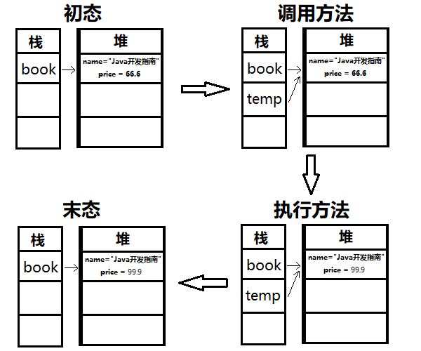

# 设计结构

```java
public class FirstDemo{
	public static void main(String[] args){
	system.out.println("hello word");
	} 
}
```

**区分大小写**

## **编写类名**

- public 修饰符 

- class 类

- FirstDemo 类名

##**方法**

- **main方法的修饰符必须是public,static**

##**语句**

- .用于调用方法
  - object.method(parameters)
- **分号**表示句子**结束**,回车不是结合苏标志,可以将多句写在一行

## 注释

三种标记注释

- //   :从//到本行结束
- /*, */ 两个界定一段注释
- /* *  , */


{}:划分程序的各个部分,成对出现,空白符会被编译器忽略

## 编译

编译这段源代码后会得到一个包含这个**类字节码**的文件,编译器会自动命名成类名.class,并存储在源文件的同一目录下

运行已编译的程序,虚拟机总是从main方法开始执行.因此需要执行的类必须拥有main方法


# 数据类型

java是==强类型语言==:必须为**每个变量声明一种类型**

## 基本类型

一共有8种==基本类型==:4种整型,2种浮点类型,1种字符串类型char和表示真值的类型boolean


### 整型

表示**没有小数部分**的数值

- int   4字节  2的32次方
  - 最常用
- short 2字节 2的16次方
- byte 1字节  2的8次方
- long   8字节
- byte   1字节   2的8次


### 浮点数

表示**有小数部分**的数值

- float  4字节  精度6-7位
  - 不适用于金融计算,使用BigDecimal
- double 8字节  精度15位
  - 最常用

**溢出或出错**的三种特殊情况

- 正无穷大(POSITIVE_INFINITY)
  - 正数除以0
- 负无穷小(NEGATIVE_INFINITY)
- NaN
  - 0/0或者负数的平方根
  - NaN互不相等,可以用isNaN判断


### char

原本表示**单个字符**,现在有些Unicode可以使用一个char表示,有些需要两个char

字面量需要**单引号**括起来:

- 'A'表示编码为65的字符常量
- "A"表示字符A的字符串


> Unicode和char

Unicode打破了传统字符编码的限制:多个地区多个标准会对应不同的字母


### boolean

false和true判断逻辑条件,整型值和布尔值**不能相互转化**


## 基本类型包装器

将**基本类型转换为对象**,所有基本类型都有一个与之对应的类,这些类被称为==包装器==.**包装类不可变**,且是**final**,没有子类

- Numer超类
  - Integer
  - Long
  - Float
  - Double
  - Short
  - Byte
- Chararcter
- Bollean


**泛型尖括号中的类型不能基本类型**,所以需要用到包装器.

```java
//不允许
ArrayList<int> list = new ArrayList<>();

//包装类
ArrayList<Integer> list = new ArrayList<>();
```

使用包装器还可以**调用一些基本方法**,如将字符串转换成数值

```
int x = Integer.parseInt(s);
```


> API

- int intValue()
  - 将一个Integer对象的值作为int返回
- static int parseInt(String s)
- static int parseInt(String s,int radix)
  - 返回字符串的整数,第一个为十进制,第二个radix进制
- static Integer valueOf(String s)
- Number pase(String s)
  - 返回数字值,如果字符串内容为数字


> 装箱拆箱

**自动装箱**:即你输入的基本类型会自动转化为对应的包装类.

```java
list.add(3);
//会自动转换成
list.add(Integer.valueOf(3));
```

**自动拆箱**:与装箱的反操作

```java
int n = list.get(1);
//会自动转换成
int n = list.get(1).intValue();
```

混用Integer和Double时，Integer会拆箱成int,再提升到double,再装箱成Double.这说明了**包装类之间不会自动转化,需要通过基本类型转换**

装拆箱是编译器的工作,,在生成类的字节码时会自动调用方法.


> 相等判断

**基本类型只能使用==判断值**,而**包装类**用 ==判断的就变成了是否为**相同地址**,即使值相等也可能为false.

包装类使用equals比较值

当包装类引用为**null时报空指针异常**


## **引用数据类型**


### String字符串常量

Java字符串就是Unicode字符序列,Java没有内置字符串类型,在类库中提供

```
String e = "yy";
```

#### 不可变

String类对象是不可变的

**字符串存放在存储池中**,当**创建**变量并赋值,就会将该**变量指向字符串**.

每次对 String 类型进行**改变**的时候其实都等同于**生成了一个新的 String 对象**，然后将**指针指向新的 String 对象**

内存泄漏?**垃圾回收**


#### 方法

**不会改变原本字符串**,都是创建新的字符串

- **子串**

  截取一段字符串

  ```
  String h = "hello"
  // 截取[0,3),hel
  String h1 = h.substring(0,3)
  ```

  计算长度就是3-0=3

 **拼接**

- **+**

  拼接两个字符串

  ```
  String p1 = "yy";
  String p2 = "yzy";
  //yyyzy
  String p3 = p1+p2;
  ```

  任意类型与字符拼接都会变成字符串

- **join**

  多个字符拼接,用界定符分隔

  ```
  //	第一个参数为界定符,后面为字符串     aa
  String p4 = String.join("/","aa","bb","cc")
  ```

- **repeat**

  重复拼接某个字符串

  ```
  //  拼接3次   ababab
  String repeated = "ab".repeat(3);
  ```

#### 相等

> equals

检测两个字符串是否相等,可以是字面量和变量名

```
s.equals("yy");
//忽略大小写
s.equalsIgnpreCase("YY");
```

==不要使用＝＝==

==判断的是是否指向同一个位置，但是子串等拼接的字符串不共享，所以内容一样但是指向的是副本，会显示false


### String字符串变量类

经常**改变内容的字符串**最好不要用 String,这样不仅**效率低下**，而且大量**浪费有限的内存空间**

当**对字符串进行修改的时候，特别是字符串对象经常改变的情况下**，需要使用 StringBuffer 和 StringBuilder 类,两者用法相同

#### StringBuffer 字符串变量（线程安全）

- 效率低
- 线程安全

```java
StringBuffer s = null; //结果警告：Null pointer access: The variable result can only be null at this location

StringBuffer s = new StringBuffer();//StringBuffer对象是一个空的对象

StringBuffer s = new StringBuffer(“abc”);//创建带有内容的StringBuffer对象,对象的内容就是字符串”
```


#### StringBuilder 字符串变量（非线程安全)

JDK1.5

- 效率高
- 非线程安全
- 多数情况下使用


### 数组

存储**相同类型**的集合,通过整型**下标**访问值

> 声明

两种写法,第一种较为常用

1.int[] a;

数组类型[] 数组名;

2.String b[];

数组类型 数组名[];

> 赋值

**a = new int[100]**

数组名 = new 数组的类型[长度]

- **确定了长度，无法更改**
- 所有元素没有值
  - 数字－０
  - boolean- false
  - String-null
  - 对象－null

**b = {"yy","zz"};**

提供初始值的简写形式


#### 访问元素

通过下标［］访问

```
		//循环赋值
		int b[] = new int[100];
        for(int i=0;i<100;i++){
            b[i] = i;
        }
        //循环遍历
        for(int i = 0;i<100;i++){
            System.out.println(b[i]);
        }
```


> for each

用来处理数组或集合中的每个元素，不用考虑下标

定义一个**变量**用于**存储每个取出来的元素**，并执行语句

for(数组类型  变量名:数组或集合)

​	｛执行语句；｝


####　拷贝

> 浅拷贝

如果改变t2的值，t1的值也会发生改变，他只拷贝了地址，两个数组**指向同一个地方**:

```
int[] copyNum = num;
copyNum[5] = 12;
//num[5] 也会变成12
```

copyOf(数组名,新数组的长度)

```
int[] copynum = Arrays.copyOf(num,2*num.length);
//长度多于原数组,多余的元素赋值初始值(数值为0,字符串为null...)
//长度小于原数组,只拷贝前面的值
```

> 深拷贝

改变了array2的值，array的值并不改变

```java
	int [] array = {1,2,3,4,5};
    int [] array2 = new int[array.length];
    for (int i = 0; i < array2.length; i++) {
    array2[i] = array[i];
    }

```


#### 排序

快速排序:Array.sort(数组名)


####　多维数组

二维：

```
double[][] a = new double[2][3];

double[][] a = {{2,2,2},
                {3,3,3}};
```

> 遍历

```
 //for each输出格式  2,2,2,3,3,3
 for (double[] x : a){
            for(double y:x){
                System.out.println(y);
            }
        }
        
        //第二种方法的输出输出格式  [[2, 2, 2], [3, 3, 3]]
System.out.println(Arrays.deepToString(m));
 
```


#### main方法的参数

public static void main(String[] args)

main函数的String[] args有什么意义?

==参数String[ ] args的作用就是可以在main方法运行前将参数传入main方法中。==

这个数组存储的就是传入的参数

使用命令行:java Message -h world

java Message是类名,不存入数组,存入的是args[0] = "-h" ,args[1] = "world"


###  泛型

解决数组大小固定的问题

==ArrayList类==,类似于数组,但是**在添加或删除元素时,能够自动调整数组容量**

```
//右边引用的类型可以省略
ArrayList<类型> staff = new ArrayList<>();
```


> 设置列表大小

如果能估计出数组可能存储的数量,可以调用**ensureCapacity方法**

```
//当列表已存在,设置列表的大小,
staff.ensureCapacity(23);

```

当列表不存在,**初始化时设置**

```java
ArrayList<String> staff = new ArrayList<>(22);
```


> 对元素的操作

和数组不同,不能通过[]下标来访问和改变数组,而要使用**get和set方法**

- get

  - staff.get(1);等价于staff[1]
  - 初始化**未赋值时使用会报错**

- set

  - staff.set(2,"yy");等价于staff[2]=  "yy"
  - set只能替换**已存在的元素**

- remove

  - staff.remove(2)

- add

  - 使用add可以将**元素添加到数组列表末尾**

    ```java
    staff.add("yy");
    //可以使用索引，第一个参数为索引，第二个为添加的值
    staff.add(2,"yy");
    ```

    数组列表管理一个**内部的对象引用数组**.如果**调用add而内部数组已满**,就会**自动创建一个更大的数组,并拷贝到里面**


插入和删除元素的**操作效率很低**,元素较多时,需要考虑链表


```java
//可以省略右边的类型参数
        ArrayList<String> staff = new ArrayList<>(22);
        int i = 0;
        //赋值
        while(i<22){
            String x = "xx";
            staff.add(x);
            i++;
        }
        //新增元素
        staff.add(0,"yy");
        //替换
        staff.set(15,"yy");
        //移除
        staff.remove(15);
        //访问
        staff.get(1);

        //定义相同长度的数组
        String[] s = new String[staff.size()];
        //将数组列表的内容放入数组
        staff.toArray(s);
```


### 枚举

```
public enum Size{SMALL,MUDIUM,LARGE}
```

枚举的类型**是一个类**，刚好有三个枚举常量，不能构造实例．

**官方文档**：

```
JLS 8.9 Enums 一个枚举类型除了定义的那些枚举常量外没有其他实例了。 试图明确地说明一种枚举类型是会导致编译期异常。在枚举中final clone方法确保枚举常量从不会被克隆，而且序列化机制会确保从不会因为反序列化而创造复制的实例。枚举类型的反射实例化也是被禁止的。总之，以上内容确保了除了定义的枚举常量之外，没有枚举类型实例。
```

> 相等

**比较时直接使用＝＝**就行，因为都是常量，没有实例

因为在Enum类里面，已经**重写了equals方法**，而方法里面比较就是＝＝比较2个对象的


#### Enum超类

所有枚举类型都是Enum类的子类，继承了超类的许多方法

> toString

**toString**返回枚举常量名

```
Size.SMALL.toString()
```

返回字符串SMALL.

> valueOf

**valueOf**:toString的逆反法,通过提供枚举常量名获得枚举常量

```
Size s = Enum.valueOf(Size.class,"SMALL")
```

s变成了Size.SMALL

> values

返回一个包含全部枚举值的数组

```
Szie[] values = Size.values()
```

返回数组包含Size.SMALL , Size.MUDIUM ,Size.LARGE

> ordinal

返回enum声明中**枚举常量**的**位置**,从0开始计数

```
int ord = Size.MEDIUM.ordinal();
```

返回1

> compareTo

比较前后次序

```java
//SMALL与MEDIUM比较次序,在之前返回负数,相等返回0,否则返回正整数
        int s = Size.SMALL.compareTo(Size.MEDIUM);
```

SMALL在MEDIUM前,返回-1


## 变量与常量

###　变量

用来**储存**值

> 1.声明变量

需要指定变量的类型

声明可以放在任意地方,但是尽量靠近变量第一次使用的地方

```java
int a;
String b;
boolean c;
//也可以一次性定义多个变量,不建议
int e,f;
```

**变量名**


- 必须以字母开头
- 由字母或数字构成
- 不能出现+,空格等符号
- 不能以保留字为名

> 2.变量初始化

用赋值语句对变量初始化

变量名=赋值

```java
ａ = 100;
b = "ss";
c = true;
```

声明赋值可以写成一句

```java
int a = 100;
```


### 常量

不变的变量

> 使用关键词final

final表示这个变量只能赋值一次，不能更改

常量名习惯**全大写**

> 类常量 static final

可以在一个类中的多个方法使用,static final

需要放在main方法的外部,public 就可以被其他类使用


### 枚举

变量的取值是有限集合

```java
// enum 枚举类型 {枚举内容}
enum Size {small,medium,large}
//枚举类型 枚举名 = 枚举类型.内容  内容可以为null
Size s = Size.small
```


## 运算符

> 算数运算符

- +
- -
- *
- /
  - 两边为整数时,表示整数除法
  - 否则为浮点数除法
  - **异常**:整数被0除
  - **NaN**:浮点数被0除
- %
  - 求余


### Math函数

**平方根**

```
double b = Math.sqrt(4)//2.0
```

**幂运算**

```
//x的a次方
double y = Math.pow(x,a)
```

```
Math.PI
	.E
```

**异常**:计算一处,运算符只会返回错误结果而不报错

```
//捕捉异常
Math.multiplyExact()
	.addExact()
	.increateExact()
	.negeteExact()
```

**赋值和运算符结合**

```
x = x+4
//运算符放在等号左边
x += 4
```

**自增自减**

```
int n=10;
//运算后+1
n++
//运算前+1
++n
```


### 类型转换


实线没有丢失,虚线有精度丢失

- 自动转换优先级
  - 低优先级向高优先级转化,高优先级不会转化
  - double>float>long>int

- long类型位数长,**转换到其他类型**(浮点数)都有**精度丢失**
- **转换到float**的都有**精度丢失**


> 强转

```
double x= 2.11;
int y =(int)x;
```

允许高优先级向低优先级**强制类型转化**

- 浮点数转int,截断小数部分(不四舍五入)

- 舍入计算
  - Math.round()
  - **舍入计算类型不变**,仍需强转


```
//如果x是int类型,会自动强转  ,(int)x += 3.5
x +=3.5;
```

### 关系

**==**

检测相等性,与=(赋值)不同

```
3==7 //flase
3!=7 //true
```

**&&与运算符**

```
//两个条件都要满足
a==3&&b==2
```

**||或运算符**

```
//任意条件满足
a==3||b==2
```

**?:三元操作符**

```
//条件?满足的语句:不满足的语句
a==3?system.out.print(true):system.out.print(false)
```


## 大数

任意精度

> BigInteger和BigDecimal

任意精度的**整数**

valueOf()将普通数转换为大数

```java
BigInteger b = BigInteger.valueOf(100);
```

定义一个足够大的数

```java
//有双引号
        BigInteger big = new BigInteger("22222222222222222222222222222222222222222222222222");
        System.out.println(big);
```


> 运算

不能使用常用运算符+,*

**add**,**multiply**,substract(差),divide(商),mod(余数):

```
		BigInteger c = b.add(big);
        BigInteger d = b.multiply(b);
```


# 流程控制

- if
- 循环
- switch

## 块作用域

块｛｝确定了变量的作用域，可以嵌套．

嵌套的块中变量不可同名

```
{
int a;
	{
		int a;
	}
}
```

## if

if(条件１){

条件1成立执行的语句

}

if else(条件２){

条件2成立执行的语句

}

else{

条件1,条件２不成立执行的语句  

}

> 错误点

if()里面**无法声明变量**


## 循环

>  while

while(条件1)

{执行的语句}

条件成立时,执行语句,循环执行到条件不成立

>  do....while

 do{执行语句}while(条件)

 先执行语句,但条件成立,循环

**与while的关系**

- 有一个先执行语句,不管条件是否成立,第一次一定执行

>  for循环

由一个计数器或变量控制迭代次数

```
// 定义计数器,检测条件,计数器执行一次的步长
for(int i=1;i<=10;i++){
	执行语句;
}
```

  int如果定义在for()内部,就无法在外部使用,可以在外部定义

```
int i;
for(i=1;i<3;i++){}
//两个循环可以使用相同的计数器名
for(i=1;i<4;i++){}
```

**与while的关系**

- 可以转化成while

  ```java
  for(int i=1;i<=10;i++){
  	执行语句;
  }
  
  int i=1;
  while(i<=10){
  执行语句;
  i++;
  }
  ```

> 错误点

1.while()里无法声明变量

2.for循环的**计数器**,即使外部已经赋值,也不可直接使用,仍需**赋值**


## switch

当处理多个选项时,比if/else结构简洁

```java
switch(匹配的变量或字面量){
	case 条件1:
		语句1;
		break;
	case 条件2:
		语句2;
		break;
	...
}


switch(choice){
//  choice = 1
	case 1:
		system.out.println("choice的值为:"+1);
	 break;
	 //choice = 2
	case 2:
		system.out.println("choice的值为:"+2);
		break;
	 ...
}
```

**注意事项**

- 每个case标签下需要加break语句,否则会接着执行下一个语句


## 中断控制流程

> break

break**退出当前循环**,不是跳到下一个条件

```java
int i;
        for(i=1;i<4;i++){
//	当i=2的时候退出当前循环,循环执行完i的最终值是2
            if(i==2){
                System.out.println("当i="+i+"时退出for循环");
                break;
            }
            System.out.println(i);
        }
		<------break跳出了循环
        System.out.println("循环结束时i的值:"+i);

```


> continue

continue跳过这一个条件,进入下一个条件

```java
		int i;
        for(i=1;i<4;i++){
            		<------continue跳转到下一个条件的开始
            if(i==2){
                System.out.println("当i="+i+"时continue");
                continue;}
            System.out.println(i);
        }
```


# 类和对象

**类**:构造对象的模板

**实例**:类构造对象的过程

**封装**:将数据和行为组合在一个包中,并隐藏具体实现形式

- **实例字段**:对象中的数据
- **方法**:操作数据的过程


类之间的三个关系

- 依赖  user-a
  - 类A的方法使用类B的对象
  - 应尽可能减少依赖,即减少耦合
- 聚合  has-a
  - 类A的对象包含了类B的对象
- 继承:  is-a
  - 类A扩展类B,继承了类B的方法,还有额外的功能


## 封装

封装的==关键==在于,**类的方法不能直接访问**其他类的**实例字段**,只能**通过对象的方法**与数据**进行交互**

- 提高重用性和可靠性的关键
- 不必了解类里的具体实现


> 自定义类

```java
public class SearchBlog {

    private String title;
    private Long typeId;

    public SearchBlog() {
    }

    public SearchBlog(String title, Long typeId) {
        this.title = title;
        this.typeId = typeId;
    }

    public String getTitle() {
        return title;
    }

    public void setTitle(String title) {
        this.title = title;
    }

    public Long getTypeId() {
        return typeId;
    }

    public void setTypeId(Long typeId) {
        this.typeId = typeId;
    }
}
```


## 关键字

### private

**只有这个类**可以访问这些实例字段


### final

可用于字段,方法,类,**一次赋值终身不变**

必须在**构造对象时初始化**，在构造之后这个字段不会发生变化，就不需要ｓｅｔ方法了


### static

用于字段和方法

同一个类下的**所有对象共享**．属于类，不属于任何对象

```java
public class S{
private static int number = 1;
public void add(){
	number++;
}

public static void main(String[] args) {
        S s1 = new S();
        s1.add();
        System.out.println(s1.getNumber());
        S s2 = new S();
        s2.add();
        System.out.println(s2.getNumber());
    }
}
```


观察输出的结果,发现s2调用方法时,number已经在s1中增加过,所以**变量共享**

**具体内容**可以查看类和对象中的静态


### abstract

位于上层的类更具有**一般性**,适合作为抽象类

使用==关键字abstract==,可以将一个类或者方法定义为抽象,抽象的方法**不需要实现**;

- 包含抽象方法的类**必须抽象**
- 抽象类可以**不含抽象方法**
- 抽象方法充当占位,在**子类中具体实现**
- **抽象类不能被实例化**
  - 可以有抽象类型**引用非抽象的子类**


抽象类的子类:

- 当子类中的**抽象方法未实现**,那么这个**子类也必须是抽象类**
- **抽象方法全部被实现**,子类不是抽象的


### protected

最好将所有类中字段都标记为private,方法标记为public

有时想要**限制方法只能子类访问**,或者**开放字段给子类访问**,需要用到==关键字protected==受保护的.

- **默认**默认是只对本包可见

- **protected**是对**本包和所有子类可见(可以不再本包内)**
- **public**:对外部可见
- **private**:对本类可见


## 字段

可以看下面的关键字


对一个null值的字段使用方法会发生**空指针异常**，怎么避免这种情况

- 宽容型:将ｎｕｌｌ转化成一个默认的值

  ```java
  public SearchBlog( Long typeId) {
  	//构造器中没有设置ｔｉｔｌｅ参数，就默认设置成unkonwn
          title = Objects.requireNonNullElse(n,"unknow")
          this.typeId = typeId;
      }
  ```

- 严格型：拒绝ｎｕｌｌ

  ```
  public SearchBlog( Long typeId) {
  	
          Objects.requiredNonNull(n,"The name cannot be null");
          this.typeId = typeId;
      }
  ```


## 方法

**方法**都用关键字public：任何类的方法都可以调用这些方法


### 构造器

- 构造器是一种**特殊的方法**，用于**构造并初始化实例**

- **与类同名**
- 可以创建多个构造器，但是参数不同（重载），用于多种初始化对象的情况．

- 构造器总是**结合new来调用**
- 已经存在的对象不调用构造器初始化字段


### 访问器方法

只访问对象而不修改的方法：get方法

    public String getTitle() {
            return title;
        }
    
        public Long getTypeId() {
            return typeId;
        }

相比于直接操作字段，这样做虽然比较麻烦，但是也有**好处**

- 在方法内添加语句可以**改变实现**并对其他没有影响，比如在显示字段前添加字符串等．

  ```
  public String getTitle() {
      return "title"+title;
  }
  ```

- 错误检查


> 不要编写返回可变对象应用的访问器方法

- 可变对象:
  - 创建之后会发生变化的，如含ｓｅｔ方法
- 不可变对象
  - 创建之后在生命周期内不可变，如String对象，关键字ｆｉｎａｌ修饰，没有ｓｅｔ方法的对象

```
class Employee{
	private Date hireDay;
	//其他
	public Date getHireDay() {
		return hireDay;//不好的写法
	}
}
```


　解决方法：

```
public Date getHireDay() {
		return (Date)hireDay.clone();//使用clone,返回一个副本
	}
```


### 参数

- 隐式参数：方法名前的对象

  - 关键字this表示隐式参数,取代前面的对象名，可以**将实例字段与变量区分开来**

  ```java
  public SearchBlog(String title, Long typeId) {
          SearchBlog02.title = title;
          SearchBlog02.typeId = typeId;
      }
  
  
  public SearchBlog(String title, Long typeId) {
          this.title = title;
          this.typeId = typeId;
      }
  ```

- 显示参数：构造器等方法后面括号内的参数


### 方法参数

将参数传递给方法,有两种方式

#### 按值调用(基本数据类型)

- 方法接受的是调用者**提供的值**,创建一个**相同值的副本**
- 只拷贝数据,不会改变传递的变量的值(**方法里改变,其他地方不会改变**)

Java总是采用**按值调用**,方法得到的是参数值的一个副本,不能修改传递给他的任何参数变量

> 流程:

```
public static void triple(double x){
	x = 3*x;
}

doubel persent = 10;
triple(persent);
```

1.**创建**一个参数的**副本**(x初始化为persent的一个副本,值为10,因为为基本类型,所以指向的新地址)

2.执行语句,对副本进行操作(x=30),**传入参数不受影响**(persent=10)

3.**方法结束,该副本不再使用**,下次执行会创建一个**全新的副本**


#### 按引用调用(对象引用)

- 调用者提供的**变量地址**,创建一个**指向地址的副本**
- 指向的地址,所以会改变地址里的内容,可以修改传递变量的值(**方法里改变,其他地方也会改变**)


> 流程

```
public static void add(Employee e){
	//	将e职工的工资增加200
	e.raiseSalary(200)
}

Employee yy = new Employee(...);
add(yy);
```

1.创建参数的副本,指向引用的地址(e初始化yy的一个副本,指向yy地址)


> 构造语句

- 使用**默认构造器**（没有参数）:创建出来的对象**字段为null**

```
SearchBlog blog = new SearchBlog();
```

- 使用**带参数的构造器**:创建出来的对象已经**初始化对应的字段**

```
SearchBlog blog = new SearchBlog("YY",22);
```

```java
//　声明一个student类的变量，当前ｓ并不是一个对象，因为没有引用任何的对象，因此不能使用任何student的方法
Student s ;
s = new Student();
```


## 静态

查看下面**关键字**中static的定义


> 静态常量

```
public class Math{
	public static final double PI=3.1415926
}
```

所有Math类的对象都有一个PI的副本

当静态常量被定义成final,就无法修改


> 静态方法

静态方法是不在对象上执行的方法.**,不需要创建对象也能直接使用**(建议使用),也可以使用对象调用用该方法

```
//			类名.静态方法名
int n = Employee.getNextId();
```

(因为不使用任何对象)**不能访问实例字段**,但是可以访问**静态字段**(因为静态字段属于类)


> main方法

main也是一个静态方法,main不对任何对象进行操作.


##　构造

### 重载

多个方法拥有相同名字，不同参数

```java
 public SearchBlog() {
    }

    public SearchBlog(String title, Long typeId) {
        this.title = title;
        this.typeId = typeId;
    }
```


> 默认字段初始化

如果构造器没有为字段设置初值,就会设置默认值:数值为0,布尔值为false,对象引用为null


### 无参构造器

```
public SearchBlog() {
    }
```

无参构造器创建的对象会设置为默认值


如果一个**类没有写构造器,系统会自动生成无参构造**

如果**写了构造器,就不会生成无参构造器**


> 显式赋值

```java
class Employee{
//	类共享
	private static int nextId;
	private int id = nextID();
	
	//每增加一个对象,id增加1
	private int nextID(){
		int i = nextId;
		nextId++;
		return i;
	}
}
```


> 初始化块

在类的声明中，可以**包含多个代码块**，只要**构造类的对象**，**代码块就会被执行**.**首先运行**的就是初始化块.通常会将初始化块的代码直接放在构造器中

```java
class Employee{
//	类共享
	private static int nextId;
	private int id;
	
	//每增加一个对象,id增加1
    {
        id = nextId;
        nextId++;
    }
}
```

### 过程

1.调用构造器,将**所有数据字段初始化为默认值**,再按**类中声明的顺序**,**依次执行**初始化的方法和初始化块

- 提供初始值

  ```
  private static int nextId = 1;
  ```

- 初始化块(复杂)

  ```
  static{
  	var g = new Random();
  	nextId = g.nextInt(10000);
  }
  ```

2.执行构造器主体代码


# 继承

==基本思想==:可以**基于已有的类创建新的类**,**复用**已有类的方法和功能,**增加**一些新的方法和字段,使新类适应新的情况

使用==关键字extends==表示继承

```java
//超类,父类
class Employee{
	
	private String ename;
    private int id;

    public void setId(int id){
        this.id = id;
    }

    public int getid(){
        return id;
    }
    public String go(){
        return "上班";
    }
	
}

//子类
public class Manage extends Employee {

	private double bonus;

    public void setBouns(double bouns){
        this.bonus = bouns;
    }
	
}
```


子类继承了父类的所有功能(setId,getId,go方法),并且**增加**了一个setBouns方法.

> 设计思想

- 虽然子类中**没有显式定义父类的方法,自动继承了**(Manager类中没有写字段和方法,但是依旧可以调用),
  - 所以**定义子类**时,**只要指出子类与父类的不同之处**,相同的会自动继承.

- 将最一般的方法放在父类中,特殊的方法放在子类中


## 覆盖方法

如果想要**改写父类的方法,但是又想访问父类的私有字段**,以下面这段代码为例

```java
//父类的方法
public double getSalary(){
        return salary;
    }
```

子类想要改写,在工资的基础上增加奖金,如果这样写

```java
//子类改写1
public double getSalary(){
        return salary+bouns;
    }
```

显然是不对的,因为**子类访问不了父类的salary私有字段**,那么就需要**调用父类的方法**

```
//子类改写2
public double getSalary(){
		//调用父类的方法
        double salary = getSalary();
        return salary+bouns;
    }
```

显然这样也行不通,**调用的方法其实是子类的方法**,会无限循环.

怎么**调用父类的方法**?

```
//子类改写3
public double getSalary(){
		//调用父类的方法
        return super.getSalary()+bonus;
    }
```

==关键字super==代表了父类


## 子类构造器

子类不能访问父类的私有字段,所以构造方法时**通过父类的构造方法初始化私有字段**

super调用构造器必须是子类构造器的第一条语句


```
private Manager(String name,int id,double salary,double bonus){
		//调用父类构造器
        super(name,id,salary);
        this.bonus = bonus;
    }
```

如果子类**没有显式调用超类的构造器**,**自动调用父类的无参构造**,如果**父类没有无参构造,就会报错**


## 继承层次

由一个公共超类派生出来的**所有类的集合**称为==继承层次==


从特定类到祖先的路径成为**继承链**

平行子类之间没有任何关系

JAV**不支持多重继承**(一个类有多个父类)


## 多态


```java
public static void main(String[] args) {
        //创建１个manager对象和两个Employee对象
        Manager m = new Manager("yzy",22,2300,3000);
        Employee e1 = new Employee("e1",23,3000);
        Employee e2 = new Employee("e2",23,3000);
        //放入数组
        Employee[] staff = new Employee[3];
        staff[0] = m;
        staff[1] = e1;
        staff[2] = e2;
        //循环输出数组
        for(Employee e:staff){
            System.out.println(e.getEname()+":"+e.getSalary());
        }
    }
```

观察循环输出:e.getSalary()方法,当**e类型是Manager**,就调用**Manager的getSalary()方法**,当**e类型是Employee**,就调用**Employee的getSalary()方法**

> ==多态==:一个对象变量能够**指示多种实际类型**

**父类**的(Employee类型)变量既可以**引用自身**(Employee类型),也可以**引用子类**(Manager)

```
Employee e = new Employee();
Employee e = new Manager();
```

  如上图中,staff数据的类型是Employee,m为Manager类型,staff[0] = m,将m看成Employee类型

==动态绑定==:运行时自动选择适当的方法


## 抽象类

位于上层的类更具有**一般性**,适合作为抽象类

使用==关键字abstract==,可以将一个类或者方法定义为抽象,抽象的方法**不需要实现**;

- 包含抽象方法的类**必须抽象**
- 抽象类可以**不含抽象方法**
- 抽象方法充当占位,在**子类中具体实现**
- **抽象类不能被实例化**
  - 可以有抽象类型**引用非抽象的子类**


抽象类的子类:

- 当子类中的**抽象方法未实现**,那么这个**子类也必须是抽象类**
- **抽象方法全部被实现**,子类不是抽象的


## 超类Object


**Object**:是所有类的超类


Java中只有**基本类型不是对象**,**所有的数组都扩展了Object类**

由于**java不能多继承**,如果一个**类没有指出继承父类**,那么**Object就是他的父类**

因此体现多态,**Object类型可以引用任何类型的对象**.(之前有个疑惑,子类不能多继承,为什么Object还能引用不是它的子类,因为子类的祖先是Object,所以可以引用)

```
Object object = new Employee("yy",22,2000);
```

但是如果想要对object进行操作,还是要**强转之后才能**

```
Employee e = (Employee)object;
```


### abstract

位于上层的类更具有**一般性**,适合作为抽象类

使用==关键字abstract==,可以将一个类或者方法定义为抽象,抽象的方法**不需要实现**;

- 包含抽象方法的类**必须抽象**
- 抽象类可以**不含抽象方法**
- 抽象方法充当占位,在**子类中具体实现**
- **抽象类不能被实例化**
  - 可以有抽象类型**引用非抽象的子类**


抽象类的子类:

- 当子类中的**抽象方法未实现**,那么这个**子类也必须是抽象类**
- **抽象方法全部被实现**,子类不是抽象的


### equals

检测两个对象**引用是否相同**,地址不同就false

**getClass()**返回一个对象所属的类

A **instanceof** B 允许A是B的子类返回true


### hashCode

散列码(hash code)是由对象导出的**整型值**. **不同对象,散列码不同**.

hashCode方法定义在Object类中,因此**所有对象都有一个默认的散列码**,其值由**对象的存储地址得出**.

```java
		String s = "yy";
        String y = "yy";
        System.out.println("s:"+s.hashCode());
        System.out.println("y:"+y.hashCode());

        StringBuilder s1 = new StringBuilder(s);
        StringBuilder s2 = new StringBuilder(y);
        System.out.println("s1:"+s1.hashCode());
        System.out.println("s2:"+s2.hashCode());
```


**String类型,发现散列码相同**,因为String内容相同地址相同

**StringBuilder,发现散列码不同**,因为它没有定义hashCode方法.

hashCode返回的是一个**整数(可以是负数)**

> equals和hashCode的关系

两者定义相容,即equals成立,hashCode也相等


> API

- static int hash(Object... objects)
  - 返回一个散列码,由提供的所有对象的散列码组合而成
- static int hashCode(Object a)
  - 如果a为null则返回0,否则返回它的散列码.


### toString

返回表示**对象值的一个字符串**

```java
public String toString() {
        return "admin{" +
                "username='" + username + '\'' +
                ", password='" + password + '\'' +
                '}';
    }
```

如果想**让子类也调用**,可以将类名改成通过getClass().getName()获得类名的字符串.

```java
public String toString() {
         return getClass().getName()+
                "username='" + username + '\'' +
                ", password='" + password + '\'' +
                '}';
    }
```


**println方法**就是简单的调用x.toString(),并打印的得到的字符串.


> 数组的toString

```java
int[] a = new int[22];
System.out.println(a.toString());
```


使用**Array.toString**,显示数组结构,要显示多维数组,需要调用Arrays.deepToString

```java
		int[] a = new int[22];
        String ss = Arrays.toString(a);
        System.out.println(ss);
```


> API

- Class getClass()
  - 返回对象的类
- Class getSuperClass()
  - 返回超类


## 继承的设计

1.将**公共操作和字段**放在超类中

2.**不要使用protected**字段

- 子类集合是无限制的,任何人都能通过派生子类访问字段,破坏封装性
- 同一个包中的所有类都可以访问

3.使用继承**实现is-a的关系**,如果不是,就不要用继承

​	比如钟点工(没有工资,小时计费)和员工(工资)不是is-a的关系,就不要用继承,钟点工会包含无用的字段

4.除非**所有继承方法都有意义**,否则不要使用继承

5.覆盖方法时,不要**改变预期行为**

6.使用**多态**而不是多类型

​	使用多态或接口实现的代码比使用多个类型检测更**易于维护和拓展.**

```java
if (x is of type1){
 action1(x);
    }
else if(x is of type2){
 action2(x);
}
```

action如果是相同的概念,就为概念定义一个方法,并将其放置在两个类型的超类或接口中,然后调用

```
x.action();
```

不同的子类会调用自己的具体方法.


# 反射

能够**分析类能力**的程序

- 在运行时分析类的能力
- 运行时检查对象
- 实现泛型数组操作代码
- 利用Method对象


## class类

程序运行期间,Java为所有对象维护一个**运行时类型标识**.这个信息会**跟踪每个对象的类**,**虚拟机**通过这些信息去**执行类里方法**.(因为对象是类的实例,当对象调用方法,虚拟机就会通过信息追踪到类里去调用方法)

**虚拟机为每个类型管理唯一的Class对象**，因此可以使用＝＝


特殊的Java类访问这些信息--**Class类**,信息保存在这个类里.

### 三种获取方式

> getClass

返回一个**Class类型的实例**.

getClass().**getName()**:获取类名

```java
		Employee e = new Employee();
        Class c = e.getClass();
        String name = e.getClass().getName();
        System.out.println("类名:"+name);
        System.out.println("Class实例:"+c);
```


如果类在一个包里,包也会作为类名的一部分

> 　forName

通过类名(加上包名)**获取Class**

```
        Class l = Class.forName("com.example.blog.Employee");
```


> T.class

```
System.out.println(Employee.class);
```


### 通过反射构造实例

通过**getConstructor**()**获取一个Constructor（构造器）类型的对象**，再通过**newInstance**方法**构造实例**

```java
			Class cl = Class.forName("com.example.blog.Employee");
			Object o = cl.getConstructor().newInstance();
            System.out.println(o);
```


### 通过反射分析类的结构

java.lang.reflect包中有三个类

- **Field**:描述类的字段
  - **getName**:返回字段
  - **getType**:返回**字段类型**的一个对象,类型为Class
  - **getModifiers**:返回整数,用不同的0/1描述使用的**修饰符**.用Modifier类的**getModifiers分析**这个整数
  - **getFields**:返回这个类**支持**的字段的数组(包括超类的公共成员)
  - **getDeclareFileds** :返回类中**声明**的全部字段(包括私有成员,包成员,受保护成员,不包括超类成员)
- **Method**:类的方法
  - getName:返回方法
  - getModifiers
  - **getMothods**:返回这个类支持的方法的数组
  - **getDeclareMethods** :返回类中声明的全部字段
- **Constructor**:类的构造器
  - getName:返回构造器
  - getModifiers
  - **getConstructors**:返回这个类支持的构造器的数组
  - **getDeclareConstructors** :返回类中声明的全部字段

```java
		String name = "Employee";

        //获取类对应的class
        Class cl = Class.forName(name);

        //获取超类
        Class supercl = cl.getSuperclass();
        //分析类的修饰符
        String modifiers = Modifier.toString(cl.getModifiers());  //public
        if (modifiers!=null){
            System.out.print(modifiers+" ");
        }
        System.out.println("class "+ name);
        if(supercl!=null){
            System.out.println(" extends "+ supercl);
        }
```


通过上述的方法输出类的结构


### 编写泛型数组


# 异常

当运行发生错误，程序会抛出一个异常．**抛出异常比终止程序灵活**，因为可以提供*处理器***捕获**异常并**处理**．没有提供处理器就会终止程序，打印异常


> 类型

- 非检查型
  - 不期望用户能为这些异常提供处理器,应避免发生而不是去解决
  - 如越界错误和访问null
- 检查型
  - 检查用户是否知道异常并做好准备来处理后果

如果**方法可能**包含会抛出检查型**异常的语句**,则在方法名后面**增加throw子句**

```java
public void add() throws Exception{
        a++;
    }
```

调用该方法的**任何方法也要增加throw子句**(main方法也要)

```
public static void main(String[] args) throws Exception {
```


# 接口

接口用来描述类应该做什么,但是不指定应该如何做

1.一个类可以**实现**多个接口,**实现接口的类都需要包含所有接口的内容**

2.接口中所有**方法自动public**,可以不提供关键字.

3.接口绝**不会有实例字段**,可以看成没有实例字段的抽象类. 

4.**实例字段**和**方法实现**由**实现接口的类**完成


## 声明

定义一个接口,使用**关键字interface**表示接口

```java
public interface CommentService {

    List<Comment> queryCommentByBlogId(Long blogId);

    int addComment(Comment comment);
}
```


**关键字implements**表名类实现某个接口,**必须实现接口中的所有方法**

```java
public class CommentServiceImpl implements CommentService {

    @Autowired
    CommentMapper commentMapper;

    @Override
    public List<Comment> queryCommentByBlogId(Long blogId) {
        return commentMapper.queryCommentByBlogId(blogId);
    }

    @Override
    public int addComment(Comment comment) {
        return commentMapper.addComment(comment);
    }
}
```

## 属性

不能用new 构造接口的实例化

可以**声明接口类型**的变量,**引用实现接口的类**

```java
CommentService comment = new ComentServiceImpl()
```

使用instanceof检查对象是否实现特定接口

```java
CommentService comment = new CommentServiceImpl();
        if(comment instanceof CommentService){
            System.out.println("true");
        }
```


> 接口层次

类似继承层次


# 内存

> 堆

- 存放**对象和数组**

- 可以被所有线程共享


> 栈

虚拟机栈：表示Java方法执行的**内存模型**，**存取速度比堆要快，仅次于寄存器**

- 存放**基本变量类型**或对象的地址
- 栈数据可以共享

> 方法区

- 可以被所有线程共享
- 所有的class和static变量


## 引用和基本的区别

### 基本类型:

8种基本类型

> 存储方式

具体内容**存储在栈**中,即**变量存储的就是值**


>  传递方式

调用方法时作为参数时**按值传递**,即方法接受的是调用者提供的**值**

当调用方法时，**开辟新的内存空间存储值**，执行语句，**方法结束释放内存**

改变新的内存空间的值**对原本的值没有影响**


### 引用类型

不属于基本类型的都是引用类型:类,接口,数组,枚举,注解,字符串

> 存储方式

具体**内容**存储在**堆**中,**栈**存放堆的**地址**,即**变量存储的是对象的地址**


> 传递方式

调用方法时作为参数时**按引用传递,**即方法接受的是调用者提供的**变量地址**

当调用方法时，**开辟新的内存空间指向对象的地址**，执行语句，**执行完毕释放内存**

改变新的内存空间的值**会影响原本的值**



# 包

将类组织在一个集合中,方便找到和管理代码

> 包名

**确保类名的唯一性**,不同包内的类名相同不会冲突

包名:逆序域名+工程名:com.yzy.corejava

类的完全限定名名:包名+类名:com.yzy.corejava.Emp;


##　导入

类可以使用**所属包中的所有类**和其他包中的**公共类**

使用公共类，需要使用**完全限定名**

```java
com.yzy.corejava.Emp emp = new com.yzy.corejava.Emp();
```

显然，使用完全限定名写**很繁琐**，可以导入

> 类导入

可以导入特定类或者整个包

```java
import com.yzy.corejava.Emp;
import com.yzy.corejava．*;

Emp emp = new Emp();
```

当导入的类发生冲突，就需要写完全限定名．


> 静态导入

允许导入**静态方法**和**静态字段**

```
importstaticjava.lang.System.*;

//Ｓystem.out.println();
out.println("hello");
```


## 类的设计

- 保证数据私有
  - 最重要,不要破坏封装性
- 对数据进行初始化
  - 不要依赖系统的默认值
  - 显式初始化所有数据
- 不要再类中使用过多基本类型
  - 用其他类代替多个基本类,一个类代替多个实例字段
  - 更利于理解
- 不是多有字段都需要访问器和更改器
- 分解有过多职责的类
  - 一个过于复杂的类可以拆解成多个具有单一职责的类

- 类名和方法名要体现职责
  - 名字符合规范,不要随便取名
  - 驼峰命名法
- 优先使用不可变类


