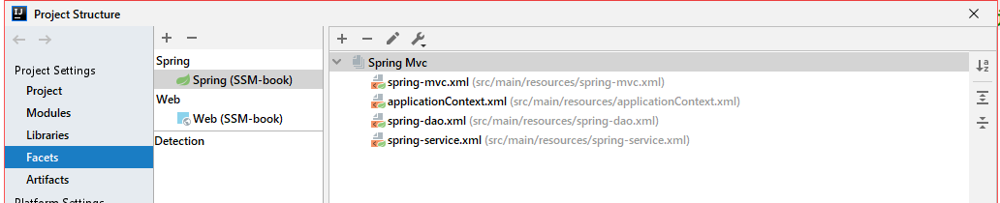
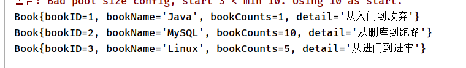
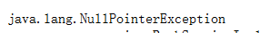
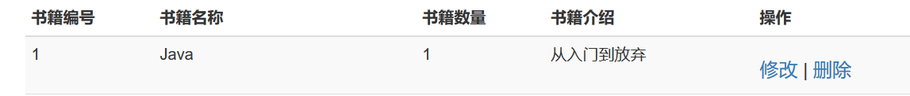
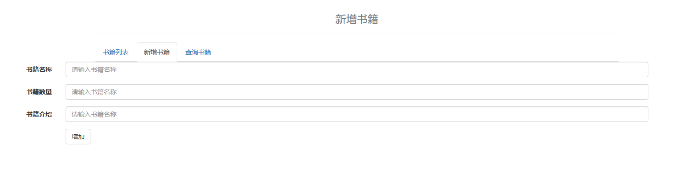
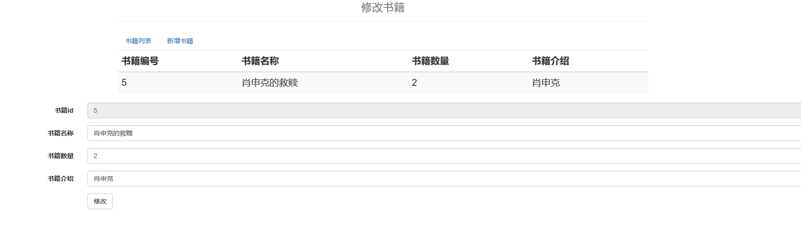
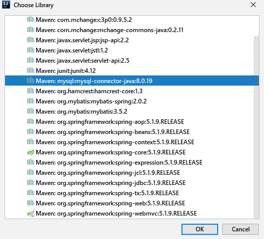

# SSM框架整合

## 注意点

- 几个配置文件需要放在同一个环境内，否则注入时引用会报错

  


**导包**：junit，spring，mybatis,mysql,数据池,springMVC

pom.xml

```xml
<!--    需要哪些依赖包，junit，spring，mybatis,mysql,数据池,springMVC-->
    <dependencies>
        <!--Junit-->
        <dependency>
            <groupId>junit</groupId>
            <artifactId>junit</artifactId>
            <version>4.12</version>
        </dependency>
        <!--数据库驱动-->
        <dependency>
            <groupId>mysql</groupId>
            <artifactId>mysql-connector-java</artifactId>
            <version>5.1.47</version>
        </dependency>
        <!-- 数据库连接池 -->
        <dependency>
            <groupId>com.mchange</groupId>
            <artifactId>c3p0</artifactId>
            <version>0.9.5.2</version>
        </dependency>

        <!--Servlet - JSP -->
        <dependency>
            <groupId>javax.servlet</groupId>
            <artifactId>servlet-api</artifactId>
            <version>2.5</version>
        </dependency>
        <dependency>
            <groupId>javax.servlet.jsp</groupId>
            <artifactId>jsp-api</artifactId>
            <version>2.2</version>
        </dependency>
        <dependency>
            <groupId>javax.servlet</groupId>
            <artifactId>jstl</artifactId>
            <version>1.2</version>
        </dependency>

        <!--Mybatis-->
        <dependency>
            <groupId>org.mybatis</groupId>
            <artifactId>mybatis</artifactId>
            <version>3.5.2</version>
        </dependency>
        <dependency>
            <groupId>org.mybatis</groupId>
            <artifactId>mybatis-spring</artifactId>
            <version>2.0.2</version>
        </dependency>

        <!--Spring-->
        <dependency>
            <groupId>org.springframework</groupId>
            <artifactId>spring-webmvc</artifactId>
            <version>5.1.9.RELEASE</version>
        </dependency>
        <dependency>
            <groupId>org.springframework</groupId>
            <artifactId>spring-jdbc</artifactId>
            <version>5.1.9.RELEASE</version>
        </dependency>
    </dependencies>

<!--    资源过滤问题-->
    <build>
        <resources>
            <resource>
                <directory>src/main/java</directory>
                <includes>
                    <include>**/*.properties</include>
                    <include>**/*.xml</include>
                </includes>
                <filtering>false</filtering>
            </resource>
            <resource>
                <directory>src/main/resources</directory>
                <includes>
                    <include>**/*.properties</include>
                    <include>**/*.xml</include>
                </includes>
                <filtering>false</filtering>
            </resource>
        </resources>
    </build>
</project>
```


## mybatis部分

**组成**

- mybatis.xml		：配置映射
- pojo
  
  - Book			：实体类，信息的载体
- dao
  - BookMapper  	：提供接口用于实现业务
  
  - BookMapper.xml   :为接口提供sql语句
  
    spring-dao.xml	
- service
  - IBookService		:提供调用dao层业务的接口
  
  - BookServiceImpl ：实现接口
  
    


**mybaits.xml**:连接数据库交给了spring 容器

```xml
<?xml version="1.0" encoding="UTF-8" ?>
<!DOCTYPE configuration
        PUBLIC "-//mybatis.org//DTD Config 3.0//EN"
        "http://mybatis.org/dtd/mybatis-3-config.dtd">
<configuration>

    <typeAliases>
        <typeAlias type="yzy.pojo.Book" alias="Book"/>
    </typeAliases>

    <mappers>
        <mapper class="yzy.dao.BookMapper"/>
    </mappers>

</configuration>
```


**Book.xml**:

```java
public class Book {

    private int bookID;
    private String bookName;
    private int bookCounts;
    private String detail;

    public Book() {
    }

    public Book(int bookID, String bookName, int bookCounts, String detail) {
        this.bookID = bookID;
        this.bookName = bookName;
        this.bookCounts = bookCounts;
        this.detail = detail;
    }

    public int getBookID() {
        return bookID;
    }

    public void setBookID(int bookID) {
        this.bookID = bookID;
    }

    public String getBookName() {
        return bookName;
    }

    public void setBookName(String bookName) {
        this.bookName = bookName;
    }

    public int getBookCounts() {
        return bookCounts;
    }

    public void setBookCounts(int bookCounts) {
        this.bookCounts = bookCounts;
    }

    public String getDetail() {
        return detail;
    }

    public void setDetail(String detail) {
        this.detail = detail;
    }

    @Override
    public String toString() {
        return "Book{" +
                "bookID=" + bookID +
                ", bookName='" + bookName + '\'' +
                ", bookCounts=" + bookCounts +
                ", detail='" + detail + '\'' +
                '}';
    }
}
```


**BookMapper**

```java
public interface BookMapper {
//    增
    int addBook(Book book);
//    删
    int deleteBook(int id);
//    改
    int updateBook(Book book);
//    查
    List<Book> findBook(String name);
}
```


**BookMapper.xml**

```xml
<?xml version="1.0" encoding="UTF-8" ?>
<!DOCTYPE mapper
        PUBLIC "-//mybatis.org//DTD Config 3.0//EN"
        "http://mybatis.org/dtd/mybatis-3-mapper.dtd">
<mapper>

    <insert id="addBook" parameterType="Book">
        insert into books
        values (#{bookID},#{bookName},#{bookCounts},#{detail})
    </insert>


    <delete id="deleteBook" parameterType="_int">
        delete from books where bookID=#{id}
    </delete>

    <update id="updateBook" parameterType="Book">
        update books
        <set>
            <if test="bookName != null">
                bookName = #{bookName}
            </if>
            <if test="bookCounts != null">
                bookCounts = #{bookCounts}
            </if>
             <if test="detail != null">
                 detail = #{detail}
             </if>
             <where>
                 bookID = #{bookID}
             </where>
        </set>
    </update>

    <select id="findBook" resultType="Book">
        select * from books where bookID = #{bookID}
    </select>
</mapper>
```


**BookService**

```java
public interface IBookService {

    //    增
    int addBook(Book book);
    //    删
    int deleteBook(int id);
    //    改
    int updateBook(Book book);
    //    查
    List<Book> findBook(String name);
}
```


BookServiceImpl

```java
public class BookServiceImpl implements IBookService{

    private BookMapper mapper;
//      添加set方法用于spring注入
    public void setMapper(BookMapper mapper) {
//        可以在这里横切事务
        this.mapper = mapper;
    }

    public int addBook(Book book) {
        return mapper.addBook(book);
    }

    public int deleteBook(int id) {
        return mapper.deleteBook(id);
    }

    public int updateBook(Book book) {
        return mapper.updateBook(book);
    }

    public List<Book> findBook(String name) {
        return mapper.findBook(name);
    }
}
```


## Spring部分

**组成**：

- service
- spring-service.xml


**spring-service.xml**

```xml
<?xml version="1.0" encoding="UTF-8"?>
<beans xmlns="http://www.springframework.org/schema/beans"
       xmlns:xsi="http://www.w3.org/2001/XMLSchema-instance" xmlns:util="http://www.springframework.org/schema/util"
       xmlns:context="http://www.springframework.org/schema/context"
       xsi:schemaLocation="http://www.springframework.org/schema/beans
        https://www.springframework.org/schema/beans/spring-beans.xsd http://www.springframework.org/schema/util http://www.springframework.org/schema/util/spring-util.xsd http://www.springframework.org/schema/context https://www.springframework.org/schema/context/spring-context.xsd">

    <!--    注解扫描-->
    <context:component-scan base-package="yzy.service"/>

<!--    注入业务-->
    <bean id="BookServiceImpl" class="yzy.service.BookServiceImpl">
        <property name="mapper" ref="bookMapper"/>
    </bean>

<!--声明式事务-->
     <bean id="transcation" class="org.springframework.jdbc.datasource.DataSourceTransactionManager">
         <property name="dataSource" ref="dataSource"/>
     </bean>

<!--    aop事务支持-->


</beans>
```


## SpringMVC

**组成**：

- controller
- web.xml
- spring-mvc.xml


**spring-mvc.xml**

```xml
<?xml version="1.0" encoding="UTF-8"?>
<beans xmlns="http://www.springframework.org/schema/beans"
       xmlns:xsi="http://www.w3.org/2001/XMLSchema-instance" xmlns:util="http://www.springframework.org/schema/util"
       xmlns:context="http://www.springframework.org/schema/context"
        xmlns:mvc="http://www.springframework.org/schema/mvc"
       xsi:schemaLocation="http://www.springframework.org/schema/beans
        https://www.springframework.org/schema/beans/spring-beans.xsd http://www.springframework.org/schema/util http://www.springframework.org/schema/util/spring-util.xsd http://www.springframework.org/schema/context https://www.springframework.org/schema/context/spring-context.xsd http://www.springframework.org/schema/cache http://www.springframework.org/schema/cache/spring-cache.xsd http://www.springframework.org/schema/mvc https://www.springframework.org/schema/mvc/spring-mvc.xsd">

<!--    扫描包-->
<context:component-scan base-package="yzy.controller"/>
<!--    注解驱动 -->
    <mvc:annotation-driven>
        <!--        处理JSON乱码-->
        <mvc:message-converters register-defaults="true">
            <bean class="org.springframework.http.converter.StringHttpMessageConverter">
                <constructor-arg value="UTF-8"/>
            </bean>
            <bean class="org.springframework.http.converter.json.MappingJackson2HttpMessageConverter">
                <property name="objectMapper">
                    <bean class="org.springframework.http.converter.json.Jackson2ObjectMapperFactoryBean">
                        <property name="failOnEmptyBeans" value="false"/>
                    </bean>
                </property>
            </bean>
        </mvc:message-converters>
    </mvc:annotation-driven>
    
<!--        静态资源过滤-->
    <mvc:default-servlet-handler/>

<!--    视图解析器-->
    <bean class="org.springframework.web.servlet.view.InternalResourceViewResolver">
        <property name="prefix" value="/WEB-INF/JSP/"/>
        <property name="suffix" value=".jsp"/>
    </bean>


</beans>
```


**web.xml**

```xml
<?xml version="1.0" encoding="UTF-8"?>
<web-app xmlns="http://xmlns.jcp.org/xml/ns/javaee"
         xmlns:xsi="http://www.w3.org/2001/XMLSchema-instance"
         xsi:schemaLocation="http://xmlns.jcp.org/xml/ns/javaee http://xmlns.jcp.org/xml/ns/javaee/web-app_4_0.xsd"
         version="4.0">

    <servlet>
        <servlet-name>springmvc</servlet-name>
        <servlet-class>org.springframework.web.servlet.DispatcherServlet</servlet-class>
        <init-param>
            <param-name>contextConfigLocation</param-name>
            <param-value>classpath:spring-mvc.xml</param-value>
        </init-param>
    </servlet>

    <servlet-mapping>
        <servlet-name>springmvc</servlet-name>
        <url-pattern>/</url-pattern>
    </servlet-mapping>

    <filter>
        <filter-name>encoding</filter-name>
        <filter-class>org.springframework.web.filter.CharacterEncodingFilter</filter-class>
        <init-param>
            <param-name>encoding</param-name>
            <param-value>utf-8</param-value>
        </init-param>
    </filter>
    <filter-mapping>
        <filter-name>encoding</filter-name>
        <url-pattern>/*</url-pattern>
    </filter-mapping>

<!--    <session-config>15</session-config>-->
</web-app>
```


# 排错思路

==qualifying bean of type 'yzy.service.BookServiceImpl==

1. 查看bean注入情况

   **没有问题**，点小叶子都能跳转

2. **junit单元测试**，检测代码是否正确

   ```java
    @Test
       public void test(){
           ApplicationContext applicationContext = new ClassPathXmlApplicationContext("applicationContext.xml");
           IBookService bookService = applicationContext.getBean("BookServiceImpl", IBookService.class);
           List<Book> books = bookService.findAllBook();
           for(Book book:books){
               System.out.println(book);
           }
       }
   ```

   

   **没有问题**，能够查询结果

3. 底层代码没有问题，**spring出了问题**，尝试不靠spring

   ```java
   //    @Autowired
   //    @Qualifier("BookServiceImpl")
       private BookServiceImpl bookService = new BookServiceImpl();
   
   ```

   

   发现变成了空指针，那么就是springMVC没有调用到service层的bean

    1. **spring-mvc.xml**出问题

       spring-mvc.xml已经被导入applicationContext.xml,**没有问题**

    2. ```xml
       <!--            <param-value>classpath:spring-mvc.xml</param-value>-->
                   <param-value>classpath:applicationContext.xml</param-value>
       ```

       

# 前端考虑思路

1. 本来想创建四个前端页面用于**增删改查**，而后发现这样的话修改和删除页面都需要**经过查询**才能使用其功能。

2. 那个把修改和删除的**选择功能直接交给书单页面**，**删除功能直接执行**，返回书单页面，不用删除页面了。

   

3. 在书单选择修改后跳转到修改页面显示选择的书籍信息和修改表单，提交后跳回修改页面，显示新的修改信息。

4. 查询页面出了点问题：只能将查询框放到了书单页面，取消查询页面合并到书单。

   


## 前端部分

### 书单页面

**功能**：

- 显示所有书籍
- 跳转到新增书籍页面
- 提供查询栏用于查询书籍
- 删除书籍
- 为修改页面提供bookid信息


```jsp
<%@ taglib prefix="c" uri="http://java.sun.com/jsp/jstl/core" %>

<%--
  Created by IntelliJ IDEA.
  User: Barcelona
  Date: 2020/4/16
  Time: 12:14
  To change this template use File | Settings | File Templates.
--%>
<%@ page contentType="text/html;charset=UTF-8" language="java" %>
<html>
<head>
    <title>书籍展示页面</title>
<%--    导入BootStrap --%>
    <link href="https://cdn.staticfile.org/twitter-bootstrap/3.3.7/css/bootstrap.min.css" rel="stylesheet">
    <style>
        /*div{
            width: 2000px;
        }*/
    </style>
</head>
<body>
<%--栅格--%>
<div class="container">
<%--        清除浮动--%>
    <div class="row clearfix">
<%--            把一行分成12格--%>
        <div class="col-md-12 column-drag-header">
            <div class="page-header" align="center">
                <h1>
                    <small>
                            书籍列表
                    </small>
                </h1>
            </div>
        </div>
    </div>
    <div class="row clearfix">
        <div  class="col-md-12 column-drag-header">
            <div align="center">
                <ul  class="nav nav-tabs">
                <%--                    class=active表示这个选项即为点前页面，不可点击--%>
                <li class="active"><a href="${pageContext.request.contextPath}/book/findAllBook">查找所有书籍</a></li>
                <li ><a href="${pageContext.request.contextPath}/book/addBookPage">新增书籍</a></li>
            </ul></div>
        </div>
    </div>
    <div class="row clearfix">
    <div class="col-md-12">
    <form class="form-inline" action="${pageContext.request.contextPath}/book/findByName" class="form-horizontal" role="form">
        <div class="form-group">
            <%--                              占据12格中的3格    右对齐--%>
            <label class="col-md-8 control-label">书籍名称</label>
            <div class="col-sm-8" >
                <input type="text" class="form-control"  name="bookName" placeholder="请输入书籍名称" required >
            </div>
        </div>
        <div class="form-group">
            <%--                    相对于左侧偏移、推、拉 ,offset-4:在左侧补充4列--%>
            <div class="col-sm-offset-4 col-sm-10">
                <button type="submit" class="btn btn-default">查询</button>
            </div>
        </div>
    </form>
    </div>
    </div>


    <div class="row clearfix">
        <div class="col-md-12 column-drag-header">
            <table class="table table-hover table-striped">
                <thead>
                    <tr>
                        <th>书籍编号</th>
                        <th>书籍名称</th>
                        <th>书籍数量</th>
                        <th>书籍介绍</th>
                        <th>操作</th>
                    </tr>
                </thead>
                <tbody>
        <%--                    数据从数据库中查出来，还要遍历foreach--%>
                    <c:forEach var="book" items="${book}">
                        <tr>
                            <td>${book.bookID}</td>
                            <td>${book.bookName}</td>
                            <td>${book.bookCounts}</td>
                            <td>${book.detail}</td>
                            <td>
                                <h3>
                                        <%--          获取bookID的参数用于执行sql语句   --%>
                                    <a href="${pageContext.request.contextPath}/book/updateBookPage?bookID=${book.bookID}">修改</a>
                                      |
                                    <a href="${pageContext.request.contextPath}/book/delete?bookID=${book.bookID}">删除</a>
                                </h3>
                            </td>
                        </tr>
                    </c:forEach>
                </tbody>
            </table>
        </div>
    </div>
</div>

<%--弹窗--%>
<script type="text/javascript">

        <%--var user='<%=request.getAttribute("msg")%>'; //这种方法取出来是user是String类型--%>
        var msg='${msg}'; //这种方法取出来是user是String类型
        switch (msg) {
            case "增加成功":
                alert(msg);
                break;
            case "增加失败":
                alert(msg);
                break;
            case "删除成功":
                alert(msg);
                break;
            case "删除失败":
                alert(msg);
                break;
        }
</script>
</body>
</html>
```


### 增加页面

功能：

- 填写新增书籍信息
- 提交后跳转到书单

```jsp
<%--
  Created by IntelliJ IDEA.
  User: Barcelona
  Date: 2020/4/16
  Time: 16:52
  To change this template use File | Settings | File Templates.
--%>
<%@ page contentType="text/html;charset=UTF-8" language="java" %>
<html>
<head>
    <title>增加书籍页面</title>
    <link href="https://cdn.staticfile.org/twitter-bootstrap/3.3.7/css/bootstrap.min.css" rel="stylesheet">
</head>
<body>

<%--栅格--%>
<div class="container">
    <%--        清除浮动--%>
    <div class="row clearfix">
        <%--            把一行分成12格--%>
        <div class="col-md-12 column-drag-header">
            <div class="page-header" align="center">
                <h1>
                    <small>
                        新增书籍
                    </small>
                </h1>
            </div>
        </div>
    </div>
        <div class="row clearfix">
            <div  class="col-md-12 column-drag-header">
                <div align="center">
                    <ul  class="nav nav-tabs">
                        <%--                    class=active表示这个选项即为当前页面，不可点击--%>
                        <li ><a href="${pageContext.request.contextPath}/book/findAllBook">书籍列表</a></li>
                        <li class="active"><a href="${pageContext.request.contextPath}/book/addBookPage">新增书籍</a></li>
                        <li ><a href="${pageContext.request.contextPath}/book/queryBookPage">查询书籍</a></li>
                    </ul>
                </div>
            </div>
        </div>
</div>

<form action="${pageContext.request.contextPath}/book/add" class="form-horizontal" role="form">
    <div class="form-group">
        <label class="col-sm-2 control-label">书籍名称</label>
        <div class="col-sm-8">
            <input type="text" class="form-control"  name="bookName" placeholder="请输入书籍名称" required>
        </div>
    </div>
    <div class="form-group">
        <label  class="col-md-2 control-label">书籍数量</label>
        <div class="col-sm-8">
            <input type="text" class="form-control"  name="BookCounts" placeholder="请输入书籍名称" required>
        </div>
    </div>
    <div class="form-group">
        <label  class="col-sm-2 control-label">书籍介绍</label>
        <div class="col-sm-8">
            <input type="text" class="form-control"  name="detail" placeholder="请输入书籍名称" required>
        </div>
    </div>
    <div class="form-group">
        <div class="col-sm-offset-2 col-sm-10">
            <button type="submit" class="btn btn-default">增加</button>
        </div>
    </div>
</form>
</body>
</html>

```




### 修改页面

功能：

- 从书单获取bookid信息
- 展示修改书籍的信息
- 提供修改信息表单
- 提交后刷新修改书籍信息

```jsp
<%--
  Created by IntelliJ IDEA.
  User: Barcelona
  Date: 2020/4/16
  Time: 21:46
  To change this template use File | Settings | File Templates.
--%>
<%@ page contentType="text/html;charset=UTF-8" language="java" %>
<html>
<head>
    <title>Title</title>
    <link href="https://cdn.staticfile.org/twitter-bootstrap/3.3.7/css/bootstrap.min.css" rel="stylesheet">
</head>
<body>
<%--栅格--%>
<div class="container">
    <%--        清除浮动--%>
    <div class="row clearfix">
        <%--            把一行分成12格--%>
        <div class="col-md-12 column-drag-header">
            <div class="page-header" align="center">
                <h1>
                    <small>
                        修改书籍
                    </small>
                </h1>
            </div>
        </div>
    </div>
    <div class="row clearfix">
        <div  class="col-md-12 column-drag-header">
            <div align="center">
                <ul  class="nav nav-tabs">
                    <%--                    class=active表示这个选项即为点前页面，不可点击--%>
                    <li ><a href="${pageContext.request.contextPath}/book/findAllBook">书籍列表</a></li>
                    <li ><a href="${pageContext.request.contextPath}/book/addBookPage">新增书籍</a></li>
                </ul></div>
        </div>
    </div>
    <div class="row clearfix">
        <div class="col-md-12 column-drag-header">
            <table class="table table-hover table-striped">
                <thead>
                <tr>
                    <th>书籍编号</th>
                    <th>书籍名称</th>
                    <th>书籍数量</th>
                    <th>书籍介绍</th>
                </tr>
                </thead>
                <tbody>

                    <tr>
                        <td>${updatebook.bookID}</td>
                        <td>${updatebook.bookName}</td>
                        <td>${updatebook.bookCounts}</td>
                        <td>${updatebook.detail}</td>
                    </tr>
                </tbody>
            </table>
        </div>
    </div>
</div>
<form  action="${pageContext.request.contextPath}/book/update" class="form-horizontal" role="form">
    <div class="form-group">
        <label class="col-sm-2 control-label">书籍id</label>
        <div class="col-sm-10">
            <input type="text" class="form-control"  name="bookID" value="${updatebook.bookID}" readonly>
        </div>
    </div>
    <div class="form-group">
        <label class="col-sm-2 control-label">书籍名称</label>
        <div class="col-sm-10">
            <input type="text" class="form-control"  name="bookName" value="${updatebook.bookName}" required>
        </div>
    </div>
    <div class="form-group">
        <label  class="col-md-2 control-label">书籍数量</label>
        <div class="col-sm-10">
            <input type="text" class="form-control"  name="BookCounts" value="${updatebook.bookCounts}"  required>
        </div>
    </div>
    <div class="form-group">
        <label  class="col-sm-2 control-label">书籍介绍</label>
        <div class="col-sm-10">
            <input type="text" class="form-control"  name="detail" value="${updatebook.detail}" required>
        </div>
    </div>
    <div class="form-group">
        <div class="col-sm-offset-2 col-sm-10">
            <button type="submit" class="btn btn-default">修改</button>
        </div>
    </div>
</form>
<script type="text/javascript">

    <%--var user='<%=request.getAttribute("msg")%>'; //这种方法取出来是user是String类型--%>
    var msg='${msg}'; //这种方法取出来是user是String类型
    switch (msg) {
        case "修改成功":
            alert(msg);
            break;
        case "修改失败":
            alert(msg);
            break;
    }
</script>
</body>
</html>
```




# 遇到的问题

## Mapper文件中没有写**namespace**

这边要写**全路径**，不能只写文件名

```xml
<mapper namespace="yzy.dao.BookMapper">
```


## 数据池连接失败

### Connections could not be acquired from the underlying database!

去service看具体的错误！，一般是serverTimezone

### 访问拒绝

we failed to succeed more than the maximum number of allowed acquisition attempts (2). Last acquisition attempt exception:  java.sql.SQLException: Access denied for user XXXXXX(using password: YES)
 意思是：我们连接数据库失败，尝试了最大的连接次数都没有成功，上一次获取的连接异常是：访问user XXX被拒绝

**解决方法：**

 确认了 driver、url、username、password信息是**正确**的，若是仍然有此错误，原因可能是没有读取到username 这些信息，可以修改jdbc.properties 文件和spring.xml 文件如下： 

```xml
<bean id="dataSource" class="com.mchange.v2.c3p0.ComboPooledDataSource">
		<property name="driverClass" value="${jdbc.driver}"/>
		<property name="jdbcUrl" value="${jdbc.url}"/>
		<property name="user" value="${jdbc.username}"/>
		<property name="password" value="${jdbc.password}"/>
```

```xml
jdbc.driver=com.mysql.jdbc.Driver
jdbc.url=jdbc:mysql://localhost:3306/account?useUnicode=true&characterEncoding=UTF-8
jdbc.username=root
jdbc.password=root
```


### No suitable driver

java.sql.SQLException: No suitable driver 

mysql -hlocalhost -uroot -p
show variables like'%time_zone';

set global time_zone = '+8:00';

**前提**

：**junit单元测试可以访问数据库但是web项目中不可以**

**原因**：

在pom.xml更换依赖的时候**没有更换lib中的依赖jar包**


解决方法：

更换jar包



**成功！**


## 刷新不断提交数据

**问题**：增加书籍之后在书单页面不断刷新会不断增加同一本书

**解决方法**：跳转方式不能为forward，要改成redirect

```java
//        return "forward:/book/findAllBook";
        return "redirect:/book/findAllBook";
```

但是改成forward就无法传送我要的**message**，那么用requset的getsession

```java
@Autowired
    HttpServletRequest request;

if(i>0){
            request.getSession().setAttribute("msg","增加成功");
        }
        else {
            request.getSession().setAttribute("msg", "增加失败");
```


## 修改书籍报错

check the manual that corresponds to your MySQL server version for the right syntax to use near 'bookCounts = 1

**原因**：动态sql要在set语句后面加，


## 