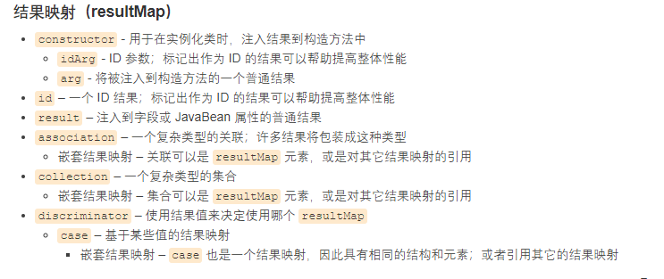
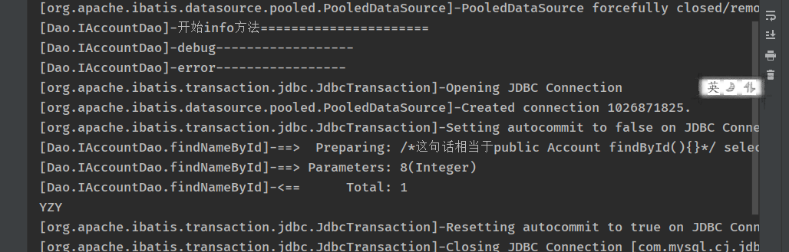
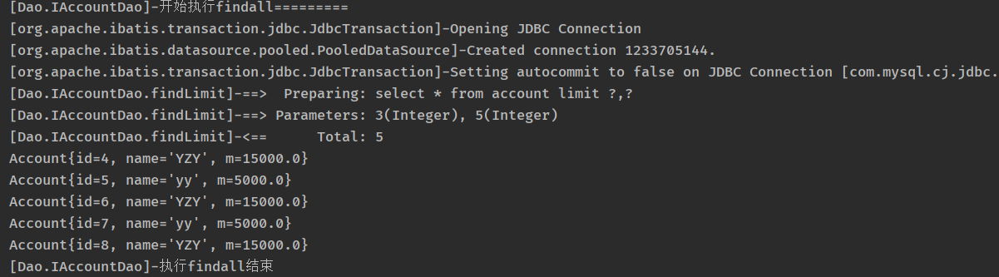
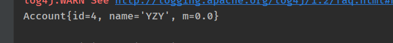
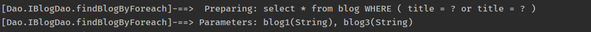
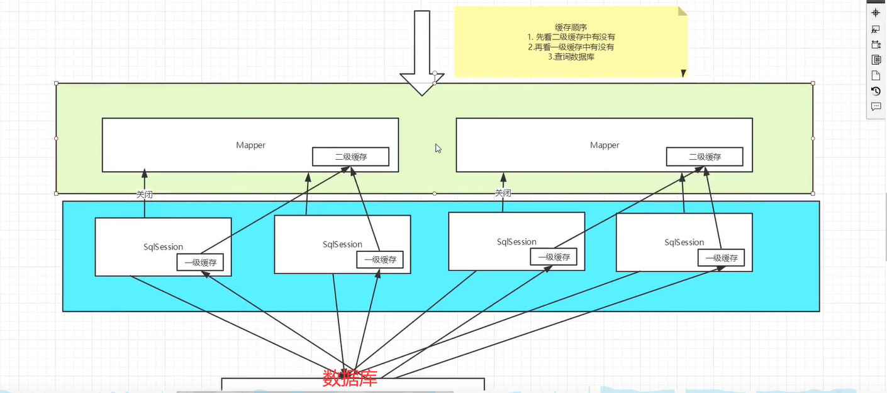

# Mybatic

官方文档 https://mybatis.org/mybatis-3/zh/index.html 

对应项目：

day1：熟悉流程 1，2，3，4

day2:   配置解析 5

day3:	resultMap 6

day4:	日志，分页 7，8

day5:	注解，lombok 9，10

day6:	多对一 11

day7:	一对多 12

day8: 	动态sql 13

day9：	缓存  14

### 介绍

- 一款优秀的==持久层框架==
- 支持定制化SQL，存储过程和高级映射
- 避免几乎所有JDBC代码和手动设置参数以及获取结果集
- 可以使用xml或注解来配置和映射
- ORM：Object Relational Mapping 的一个实现

### 优点

- 简单易学
- 灵活
- sql代码和程序分离，减少耦合，提高程序维护性
- 提供映射标签，支持对象与数据库的orm字段关系映射
- 提供对象关系映射标签
- 提供xml标签，支持编写动态sql
- 使用广泛 


## 1.构建简单的mybatis

### 1.1 maven

```xml
<dependencies>
    <dependency>
      <groupId>junit</groupId>
      <artifactId>junit</artifactId>
      <version>4.11</version>
      <scope>test</scope>
    </dependency>
    <!-- https://mvnrepository.com/artifact/org.mybatis/mybatis -->
    <dependency>
      <groupId>org.mybatis</groupId>
      <artifactId>mybatis</artifactId>
      <version>3.4.6</version>
    </dependency>
    <dependency>
      <groupId>mysql</groupId>
      <artifactId>mysql-connector-java</artifactId>
      <version>5.1.6</version>
    </dependency>
  </dependencies>
```

、

### 1.2 构建mybatil

#### 1.21 配置文件

==mybatis-cofig.xml== 

-  XML 配置文件中包含了对 MyBatis 系统的核心设置，包括获取数据库连接实例的数据源（DataSource）以及决定事务作用域和控制方式的事务管理器（TransactionManager） 

```xml
<?xml version="1.0" encoding="UTF-8" ?>
<!DOCTYPE configuration
        PUBLIC "-//mybatis.org//DTD Config 3.0//EN"
        "http://mybatis.org/dtd/mybatis-3-config.dtd">
<configuration>
    <environments default="development">
        <environment id="development">
            <transactionManager type="JDBC"/>
            <dataSource type="POOLED">
                <property name="driver" value="com.mysql.cj.jdbc.Driver"/>
                <property name="url" value="jdbc:mysql://localhost:3306/account?useSSL=true&amp;useUnicode=true&amp;characterEncoding=UTF-8&amp;autoReconnect=true&amp;failOverReadOnly=false"/>
                <property name="username" value="root"/>
                <property name="password" value="yzy665128"/>
            </dataSource>
        </environment>
    </environments>
<!--    给每一个Mapper.xml文件在Mybatis配置中心注册，如果Mapper.xml文件在Resources文件夹内则不用配置-->
    <mappers>
        <mapper resource="Dao/accountMapper.xml"/>
    </mappers>
</configuration>
```

#### 1.22 工具类

XML ->  SqlSessionFactoryBuilder  ->   SqlSessionFactory -> sqlSession

 每个基于 MyBatis 的应用都是以一个==SqlSessionFactory==的实例为核心的。SqlSessionFactory 的实例可以通过 SqlSessionFactoryBuilder 获得 

 ==mybatisUtil==：

- 用于构建sqlSessionFacory， 然后获得 SqlSession 的实例。
- ==SqlSession== 提供了在数据库执行 SQL 命令所需的所有方法。你可以通过 SqlSession 实例来直接执行已映射的 SQL 语句 

```java
public class mybatisUtil {
    private static SqlSessionFactory sqlSessionFactory = null;
    //    第一步：获取sqlSessionFactory对象
    static {
        String resource = "mybatis-config.xml";
        InputStream inputStream = null;
        try {
            inputStream = Resources.getResourceAsStream(resource);
            sqlSessionFactory = new SqlSessionFactoryBuilder().build(inputStream);
        } catch (IOException e) {
            e.printStackTrace();
        }
    }
    //        第二步：通过sqlSessionFactory获取sqlSession，包含了我们需要的所有sql命令的方法
    public static SqlSession getSqlSession(){
        return sqlSessionFactory.openSession();
    }
}
```


### 1.3 编写代码

#### 1.31 接口类

==Dao.IAccountDao.class==

```java
public interface IAccountDao {
    String findNameById(int id);
    List<Account> findById(int id);
}
```

#### 1.32 接口实现类

==Dao.accountMapper.xml==

- 以前都是创建类，现在用配置文件替代

```xml
<?xml version="1.0" encoding="UTF-8" ?>
	<!DOCTYPE mapper        
	PUBLIC "-//mybatis.org//DTD Mapper 3.0//EN"        		   "http://mybatis.org/dtd/mybatis-3-mapper.dtd">
<!--命名空间，绑定一个对应的Dao类,用于成为它的实现类-->
	<mapper namespace="Dao.IAccountDao">
        <!--    这下面写的都是方法-->
        <!--    select 查询方法，ID为方法名,resultType 为返回的类型，一般是全限定名-->    		          <select id="findNameById" resultType="String" >
        /*这句话相当于public Account findById(){}*/   
        select name from account where id = #{id}  
        </select>
        <!--    resultType为单个返回值的类型，如果为自己定义的类型，需要全限定类名，如果返回list的话会自动帮你封装-->    
        <select id="findById" resultType="entity.Account">       
            select * from account where id = #{id}   
        </select></mapper>
```

#### 1.33 实体类

==entity.Account==

```java
public class Account {
    private String name;
    private int id;
    private float money;

    public Account() {
    }
    public Account(String name, int id, float money) {
        this.name = name;
        this.id = id;
        this.money = money;
    }
    public String getName() {
        return name;
    }
    public void setName(String name) {
        this.name = name;
    }
    public int getId() {
        return id;
    }
    public void setId(int id) {
        this.id = id;
    }
    public float getMoney() {
        return money;
    }
    public void setMoney(float money) {
        this.money = money;
    }
    @Override
    public String toString() {
        return "Account{" +
                "name='" + name + '\'' +
                ", id=" + id +
                ", money=" + money +
                '}';
    }
}
```

#### 1.34 测试类

==AccountDaoTest==

```java
public class AccountDaoTest
{
@Test
public void test(){
//        获取sqlSession对象
        SqlSession sqlSession = mybatisUtil.getSqlSession();
//        使用sqlSession的sql调用语句
        IAccountDao iAccountDao = sqlSession.getMapper(IAccountDao.class);
        String name = iAccountDao.findNameById(8);
        System.out.println(name);
        List<Account> list = iAccountDao.findById(8);
        for(Object l : list){
            System.out.println(l);
        }
//        别忘了关闭session
       sqlSession.close();
    }
}
```


### 1.4.常出错的几个点

- 配置文件没有注册

  - <mappers>        
        <mapper resource="Dao/accountMapper.xml"/>    
    </mappers>

- 绑定返回类型不对

  - ```xml
    <select id="findById" resultType="entity.Account">   如果返回类型是自己定义的需要全限定名
    ```

- maven导出资源错误
  
- 资源过滤
  
- 接口绑定

  - 

  - ```xml
    <!--命名空间，绑定一个对应的Dao接口,用于成为它的实现类-->
    <mapper namespace="Dao.IAccountDao">
    ```


### 1.5遇到的问题

#### 1. 51 绑定异常

org.apache.ibatis.binding.BindingException: Type interface Dao.IAccountDao is not known to the MapperRegistry.


- 解决方法

  代表你没有在mybatis配置文件中注册mappre.xml文件

```xml
<!--给每一个Mapper.xml文件在Mybatis配置中心注册，如果Mapper.xml文件在Resources文件夹内则不用配置-->    
<mappers>        
    <mapper resource="Dao/accountMapper.xml"/>    
</mappers>
```


#### 1.52 数据库连接失败

Cause: com.mysql.jdbc.exceptions.jdbc4.MySQLNonTransientConnectionException: Could not create connection to database server. Attempted reconnect 3 times. Giving up.


- 解决方法

由于我的mysql版本是8.0，而使用的jar包是5.1，所有吧mysql的包换成8.0.19，并把驱动写成com.mysql.cj.jdbc.Driver

```xml
<dependency>  
    <groupId>mysql</groupId>  
    <artifactId>mysql-connector-java</artifactId>  
    <version>8.0.19</version>
</dependency>
```


## 2.CURD

### 2.1 namespace

<!--命名空间，绑定一个对应的Dao接口,用于成为它的实现类-->
<mapper namespace="Dao.IAccountDao">

namespace要和对应的接口名一致

### 2.2 mapper.xml

- id：对应namespace里的方法名

- resultType：sql语句的返回值，如果返回的是集合，那应该设置为集合包含的类型，而不是集合本身的类型。 

- parameterType ：传入参数的类的全限定名，如果只有一个参数可以省略，多个参数可以使用map和object

- ```java
  #{id}就相当于创建了preparestatement
  String selectPerson = "SELECT * FROM PERSON WHERE ID=?";
  PreparedStatement ps = conn.prepareStatement(selectPerson);
  ps.setInt(1,id);
  ```

-  如果类型为entity类，MyBatis 会在幕后自动创建一个 `ResultMap`，再根据属性名来映射列到 JavaBean 的属性上 ，前提是属性名和字段名一致

### 2.3 select

```xml
<select id="findById" resultType="entity.Account">
        select * from account where id = #{id}
</select>
```

```java
public void findbyid(){

        List<Account> list = iAccountDao.findById(8);
        for(Object l : list){
            System.out.println(l);
        }
    }
```

### 2.4 update

```xml
<update id="updateAccount" parameterType="entity.Account">
        update account set name=#{name},money=#{money} where id=#{id}
    </update>
```

```java
public void updateaccount(){
        Account account = new Account(3,"YY",10000);
         result = iAccountDao.updateAccount(account);
        System.out.println(result);
        sqlSession.commit();
    }
```

### 2.5 insert

```xml
<insert id="addAccount" parameterType="entity.Account" >
        insert into account values(#{id},#{name},#{money})
    </insert>

```

```java
public void addaccount(){
        Account account = new Account(113,"UU",3000);
         result = iAccountDao.addAccount(account);
        System.out.println(result);
//        提交事务
        sqlSession.commit();
    }
```

### 2.6 delete

```
<delete id="deleteAccount" parameterType="int">
        delete from account where id=#{id}
    </delete>
```

```java
public void deleteaccount(){
         result = iAccountDao.deleteAccount(113);
        System.out.println(result);
        sqlSession.commit();
    }
```

### 注意点

除了查询语句，其他语句在执行中都要增加==事务提交==语句

```java
sqlSession.commit();
```

也可以设置自动提交事务

```java
sqlSessionFactory.openSession(true);
```


## 3.Map（传入数据）

可以自定义想要输入的内容，如果字段参数过多也可以使用

```xml
<insert id="addAccounts" parameterType="Map">
        insert into account(name,money) values(#{name},#{money})
    </insert>
```

```java
public void adaccounts(){
        Map<String, Object> map = new HashMap<String, Object>();
        /*map.put("name","cc");
        map.put("money",30000);*/
//        只会生效后面一个
        map.put("name","dd");
        map.put("money",400000);
         result = iAccountDao.addAccounts(map);
        System.out.println(result);
        sqlSession.commit();
    }
```

多个参数时，xml里的属性名回合map里的属性名一一对应，就不用开考虑传入参数的属性。


## 4.模糊查询

```xml
<select id="findByNameLike" resultType="entity.Account">
        select * from account where name like #{name}
    </select>
```

```java
public void findbynamelike(){
//        模糊查找记得加上%%
       List<Account> byNameLike = iAccountDao.findByNameLike("%Y%");
       for(Object accoount : byNameLike){
           System.out.println(accoount);
       }
   }
```

### 注意点

模糊查找提供参数的时候要加上%%


## 5.配置解析

### mybatisconfig.xml

xml文件中严格遵循标签顺序

  

### 5.1 环境变量

 **尽管可以配置多个环境，但每个 SqlSessionFactory 实例只能选择一种环境。**

```xml
<!--   default： 默认使用哪一个环境-->
    <environments default="development">
        <environment id="development">
<!--            拥有两种type：JDBC，MANAGED(没什么用)-->
            <transactionManager type="JDBC"/>
<!--            数据源三种类型：UNPOOLED:数据源的实现会每次请求时打开和关闭连接。速度慢，简单好用。 性能表现则依赖于使用的数据库
                              POOLED：数据池，避免了创建新的连接实例时所必需的初始化和认证时间。 这种处理方式很流行，能使并发 Web 应用快速响应请求。
                              JNDI：这个数据源实现是为了能在如 EJB 或应用服务器这类容器中使用，容器可以集中或在外部配置数据源，然后放置一个 JNDI 上下文的数据源引用
                              -->
```

### 5.2 属性

可以通过properties属性来实现引用配置文件

这些属性都是可以动态替换的

==datesource.properties==

```properties
driver=com.mysql.cj.jdbc.Driver
url=jdbc:mysql://localhost:3306/account?useSSL=true&auseUnicode=true&acharacterEncoding=UTF-8&aautoReconnect=true&afailOverReadOnly=false
username=root
password=yzy665128
```

==配置数据库==

- 可以使用<properties>引入外部配置文件(优先级高)

  ```xml
  <!--有顺序要求，这个标签需要放到最前面
          引入外部配置文件-->
      <properties resource="datesource.properties">
  </properties>
  <!--datesorce里的属性值需要写成#{}格式-->
  <property name="driver" value="${driver}"/>
                  <property name="url" value="${url}"/>
                  <property name="username" value="${username}"/>
                  <property name="password" value="${password}"/>
  ```

  

- 可以在<properties>下使用属性填写

  ```xml
    <properties resource="datesource.properties">
  <!--        也可以在这个标签下填写信息，但是外部配置文件的优先级高-->
          <property name="username" value="root"/>
          <property name="password" value="yzy665128"/>
      </properties>
  ```

  

- 可以再<environment>标签中使用<dateSource>直接填写值

```xml
<environments>
      <environment>
<dataSource type="POOLED">
                <property name="driver" value="${driver}"/>
                <property name="url" value="${url}"/>
                <property name="username" value="${username}"/>
                <property name="password" value="${password}"/>
            </dataSource>
        </environment>
    </environments>
```

### 5.3 类型别名

- 为java类创建一个别名，减少类完全限定名的冗余

```xml
<typeAliases>
        <typeAlias type="entity.Account" alias="Account"/>
    </typeAliases>
```

- 也可以指定包名

```xml
 <typeAliases>
<!--        指定包名，会在包名下搜索javabean，首字母小写的非限定类名来作为别名-->
        <package name="entity"/>
    </typeAliases>
```

- 注解

  ```java
  @Alias("account")
  ```

  

如果实体类少使用第一种，并且可以DIY

如果实体类多，使用第二种

### 5.4 设置

 这是 MyBatis 中极为重要的调整设置，它们会改变 MyBatis 的运行时行为  

| 设置名                   | 描述                                                         | 有效值                                                       | 默认值 |
| ------------------------ | ------------------------------------------------------------ | ------------------------------------------------------------ | ------ |
| useGeneratedKeys         | 允许 JDBC 支持自动生成主键，需要数据库驱动支持。如果设置为 true，将强制使用自动生成主键。尽管一些数据库驱动不支持此特性，但仍可正常工作（如 Derby）。 | true \| false                                                | False  |
| cacheEnabled             | 全局性地开启或关闭所有映射器配置文件中已配置的任何缓存。     | true \| false                                                | true   |
| logImpl                  | 指定 MyBatis 所用日志的具体实现，未指定时将自动查找。        | SLF4J \| LOG4J \| LOG4J2 \| JDK_LOGGING \| COMMONS_LOGGING \| STDOUT_LOGGING \| NO_LOGGING | 未设置 |
| lazyLoadingEnabled       | 延迟加载的全局开关。当开启时，所有关联对象都会延迟加载。 特定关联关系中可通过设置 `fetchType` 属性来覆盖该项的开关状态。 | true \| false                                                | false  |
| mapUnderscoreToCamelCase | 是否开启驼峰命名自动映射，即从经典数据库列名 A_COLUMN 映射到经典 Java 属性名 aColumn。 | true \| false                                                | False  |

### 5.5 映射器（注册）

MapperRegister：注册绑定Mapper文件

#### 资源引用

```xml
<mappers>
        <mapper resource="Dao/accountMapper.xml"/>
    </mappers>
```


#### 使用class文件绑定注册

- 注意点：
  - 接口和他的Mapper文件==必须同名==！
  - 接口和他的Mapper文件必须在用==同一个包下==


```xml
<mappers>
 <mapper class="Dao.IAccountDao"></mapper>
</mappers>
```


#### 将指定包绑定注册

- 注意点：
  - 接口和他的Mapper文件必须同名！
  - 接口和他的Mapper文件必须在用同一个包下


  	

```xml
<mappers>
        <package name="Dao"/>
    </mappers>
```


### 5.6 生命周期和作用域

 作用域和生命周期类别是至关重要的，因为错误的使用会导致非常严重的并发问题 

SqlSessionFactoryBuilder  ->   SqlSessionFactory -> sqlSession

#### SqlSessionFactoryBuilder  

用于创建SqlSessionFactoryBuilder，创建完就没用了，所以适合于局部变量


#### SqlSessionFactory

可以理解成==数据库池==

-  一旦被创建，在应用的***运行期间一直存在 ***，使用 SqlSessionFactory 的最佳实践是在应用运行期间不要重复创建多次 
-  因此SqlSessionFactory 的最佳作用域是应用作用域 ， 使用==单例模式==或者静态单例模式 


#### sqlSession

可以理解成一个连接数据池的请求

-  SqlSession 的实例不是线程安全的，因此是不能被共享的，所以它的最佳的作用域是请求或方法作用域 
-  关闭操作很重要 

## 6.6 ResultMap

 当数据库 money字段和java m字段不一致

```java
public class Account {
    private int id;
    private String name;
    private float m;
}
```

数据库：


#### 

执行语句，发现m值为空


解决方法：

1. 别名（数据少时简单粗暴）

```xml
<select id="findByName" resultType="Account" parameterType="String">
        select id,name,money as m from account where name = #{name}
    </select>
```

### 简单使用resultMap

- `resultMap` 元素是 MyBatis 中==最重要最强大==的元素 
-  ResultMap 的==设计思想==是，对简单的语句做到零配置，对于复杂一点的语句，只需要描述语句之间的关系就行了。 

使用resultMap返回类型，然后自定义resultMap

```xml
<select id="findByName" resultMap="AccountMap" >
        select * from account where name = #{name}
    </select>

    <!--    结果集映射 ，id：结果集名称   type：想要变成的类型-->
    <resultMap id="AccountMap" type="Account">
        <!--        结果一一对应,如果一致就不需要写出来-->
        <!--<result column="id" property="id"></result>
        <result column="name" property="name"></result>-->
        <result column="money" property="m"></result>
    </resultMap>
```


### 高级映射




## 7.日志

如果数据库出现异常需要排错，日志是个好帮手

以前的记载方法：sout，debug

现在：==日志工厂==

| 设置名  | 描述                                                  | 有效值                                                       | 默认值 |
| ------- | ----------------------------------------------------- | ------------------------------------------------------------ | ------ |
| logImpl | 指定 MyBatis 所用日志的具体实现，未指定时将自动查找。 | SLF4J \| LOG4J \| LOG4J2 \| JDK_LOGGING \| COMMONS_LOGGING \| STDOUT_LOGGING \| NO_LOGGING | 未设置 |

需要掌握的：

###  STDOUT_LOGGING

```xml
<settings>
        <setting name="logImpl" value="STDOUT_LOGGING"/>
    </settings>
```


###  LOG4J

什么是log4j

-  我们可以控制日志信息输送的==目的地==
-  我们也可以控制每一条日志的==输出格式==
-  控制日志的==生成过程==
-  最令人感兴趣的就是，这些可以通过一个==配置文件==来灵活地进行配置，而不需要修改应用的代码 

#### 步骤

- 导包

  ```xml
  <!-- https://mvnrepository.com/artifact/log4j/log4j -->
  <dependency>
      <groupId>log4j</groupId>
      <artifactId>log4j</artifactId>
      <version>1.2.17</version>
  </dependency>
  ```

- 配置log4j.properties

  ```properties
  #将等级为DEBUG的日志信息输出到console和file这两个目的地，console和file的定义在下面的代码
  log4j.rootLogger=DEBUG,console,file
  
  #控制台输出的相关设置
  log4j.appender.console = org.apache.log4j.ConsoleAppender
  log4j.appender.console.Target = System.out
  log4j.appender.console.Threshold=DEBUG
  log4j.appender.console.layout = org.apache.log4j.PatternLayout
  log4j.appender.console.layout.ConversionPattern=[%c]-%m%n
  
  #文件输出的相关设置
  log4j.appender.file = org.apache.log4j.RollingFileAppender
  log4j.appender.file.File=./log/kuang.log
  log4j.appender.file.MaxFileSize=10mb
  log4j.appender.file.Threshold=DEBUG
  log4j.appender.file.layout=org.apache.log4j.PatternLayout
  log4j.appender.file.layout.ConversionPattern=[%p][%d{yy-MM-dd}][%c]%m%n
  
  #日志输出级别
  log4j.logger.org.mybatis=DEBUG
  log4j.logger.java.sql=DEBUG
  log4j.logger.java.sql.Statement=DEBUG
  log4j.logger.java.sql.ResultSet=DEBUG
  log4j.logger.java.sql.PreparedStatement=DEBUG
  
  ```
  
-  配置xml

  ```xml
  <settings>
          <setting name="logImpl" value="LOG4J"/>
      </settings>
  ```

- 执行后的结果

  


#### 简单使用

1. test类下导包import org.apache.log4j.Logger;

2. 执行语句

   1. 日志对象，参数为当前类

      ```java
      Logger logger = Logger.getLogger(IAccountDao.class);
      ```

   2. 选择日志级别（这些语句可以在其他业务下使用）

      1. info
      2. debug
      3. error

   ```java
   @Test
       public void findById(){
            logger = Logger.getLogger(IAccountDao.class);
            logger.info("info--");
            logger.debug("debug--");
            logger.error("error--");
           System.out.println(iAccountDao.findNameById(8));
       }
   ```

3. 结果

   


发现在控制台和日志文件中都输出了


## 8.分页

优点：减少数据处理量


### 8.1 使用limit语句

select 查询一个结果可以再最后加一个limit 1，效率更高

```xml
select * from account limit startIndex,pagesize;
<!-- 从第四个开始执行，显示5个-->
select * from account limit 3,5
<!-- 如果只有一个参数，则这个参数为显示个数，默认第一个开始-->
select * from account limit 8
```


#### 简单使用

- 接口：

```java
List<Account> findLimit(Map<String,Object> map);
```

- 实现类：

```xml
<select id="findLimit" resultMap="AccountMap" parameterType="map">
        select * from account limit #{startIndex},#{pageSize}
    </select>

<resultMap id="AccountMap" type="Account">
        <result property="m" column="money"></result>
    </resultMap>
```

- 执行语句

```java
@Test
    public void findLimit(){
        logger = Logger.getLogger(IAccountDao.class);
        logger.info("开始执行findall=========");
        Map<String,Object> map = new HashMap<String,Object>();
            map.put("startIndex",3);
            map.put("pageSize",5);
        List<Account> all = iAccountDao.findLimit(map);
        for(Object o : all){
            System.out.println(o);
        }
        logger.info("执行findall结束");
    }
```

- 结果：




### 8.2 RowBounds（开发不建议使用）

- 接口：

```java
 List<Account> findRowBounds(Map<String,Object> map);
```

- 实现类：

```xml
<select id="findRowBounds" resultMap="AccountMap" >
        select * from account
    </select>
    <resultMap id="AccountMap" type="Account">
        <result property="m" column="money"></result>
    </resultMap>
```

- 执行语句：

```java
 @Test
    //        从java代码方式实现分页
    public void findrowbounds(){
//                          创建rowbounds，startIndex，pageSize
        RowBounds rowBounds = new RowBounds(1, 5);

        List<Object> objects = sqlSession.selectList("Dao.IAccountDao.findRowBounds",null,rowBounds);
        for(Object o : objects){
            System.out.println(o);
        }
    }
```

- 结果：


## 9.注解开发

### 面向接口开发

**深层次理解：定义与实现的分离**

**根本原因：==解耦==，提高复用上层不管具体实现**


**注解不需要实现类**

- 接口：

```java
@Select("select * from account where id = #{id}")
//    有多个参数，所有参数前面需要增加@Param,一个参数不用加
    Account findNameById(@Param("id") int id);
```

- 配置文件：

```xml
<mappers>
        <mapper class="Dao.IAccountDao"></mapper>
    </mappers>
```

- 执行类：

```java
@Test
    public void findall(){
        List<Account> accounts = iAccountDao.findAll();
        for(Account account: accounts){
            System.out.println(account);
        }
    }
```

- 结果：



**本质：反射**

**底层：动态代理** 


## 10 lombok

1. idea安装lombok插件

   ```
   @Getter and @Setter
   @ToString
   @AllArgsConstructor, @RequiredArgsConstructor and @NoArgsConstructor
   @Log, @Log4j, @Log4j2, @Slf4j, @XSlf4j, @CommonsLog, @JBossLog, @Flogger, @CustomLog
   @Data
   ```

1. maven

   ```xml
   <!-- https://mvnrepository.com/artifact/org.projectlombok/lombok -->
   <dependency>
       <groupId>org.projectlombok</groupId>
       <artifactId>lombok</artifactId>
       <version>1.18.10</version>
       <scope>provided</scope>
   </dependency>
   ```

2. 在实体类使用

   ```java
   //get，set，toString，hashcode
   @Data
   //有参构造
   @AllArgsConstructor
   //无参构造
   @NoArgsConstructor
   ```

   

   优点：

   - 降低代码冗余，快速开发
   - 属性改变，getset方发也改变，维护性强

   缺点：

   - 不支持多种参数构造

   - 阅读性降低


## 11.多对一association


### 环境搭建

1. 建表

   ```mysql
   CREATE TABLE `student` (
     `id` int NOT NULL,
     `name` varchar(30) DEFAULT NULL,
     `tid` int DEFAULT NULL,
     PRIMARY KEY (`id`),
     KEY `fktid` (`tid`),
     CONSTRAINT `fktid` FOREIGN KEY (`tid`) REFERENCES `teacher` (`id`)
   ) ENGINE=InnoDB DEFAULT CHARSET=utf8
   ```

   ```mysql
   CREATE TABLE `teacher` (
     `id` int NOT NULL,
     `name` varchar(30) DEFAULT NULL,
     PRIMARY KEY (`id`)
   ) ENGINE=InnoDB DEFAULT CHARSET=utf8
   ```

   

2. mybatis配置文件

   ```xml
   <?xml version="1.0" encoding="UTF-8" ?>
   <!DOCTYPE configuration
           PUBLIC "-//mybatis.org//DTD Config 3.0//EN"
           "http://mybatis.org/dtd/mybatis-3-config.dtd">
   <configuration>
   
   
   
       <properties resource="datesource.properties">
   
           <property name="username" value="root"/>
           <property name="password" value="yzy665128"/>
       </properties>
   
   
       <typeAliases>
           <typeAlias type="entity.Teacher" alias="Teacher"/>
           <typeAlias type="entity.Student" alias="Student"></typeAlias>
       </typeAliases>
   
   
   
       <environments default="development">
           <environment id="development">
   
               <transactionManager type="JDBC"/>
   
               <dataSource type="POOLED">
                   <property name="driver" value="${driver}"/>
                   <property name="url" value="${url}"/>
                   <property name="username" value="${username}"/>
                   <property name="password" value="${password}"/>
               </dataSource>
           </environment>
       </environments>
   
       <mappers>
           <mapper class="Dao.IStudentDao"></mapper>
           <mapper class="Dao.ITeacherDao"></mapper>
       </mappers>
   </configuration>
   ```

   

3. 新建实体类Student，Teacher

   ```java
   //如果lombok失效就手动添加getter，setter,toString,有参构造和无参构造
   @Data
   public class Student {
   
       private int id;
       private String name;
   //    学生需要关联一个老师
       private Teacher teacher;
      
   }
   ```

   ```java
   @Data
   public class Teacher {
       private int id;
       private String name;
   
   }
   ```

   

4. 建立接口

   ```java
   public interface IStudentDao {
   
       List<Student> getStudent();
       Student getStudentById(int id);
       List<Teacher> getTeacher();
   }
   ```

5. 实现类

   **IStudentDao.xml**:

```xml
<?xml version="1.0" encoding="UTF-8" ?>
<!DOCTYPE mapper
        PUBLIC "-//mybatis.org//DTD Config 3.0//EN"
        "http://mybatis.org/dtd/mybatis-3-mapper.dtd">
<mapper namespace="Dao.IStudentDao">
    <select id="getStudent" resultMap="Student-Teacher">
        select * from student
    </select>

    <resultMap id="Student-Teacher" type="Student">
<!--        复杂的属性需要单独处理-->
       <association property="teacher" column="tid" javaType="Teacher" select="getTeacher"></association>
    </resultMap>

    <select id="getTeacher" resultType="Teacher">
        select * from teacher where id = #{id}
    </select>
</mapper>
```

​	


5. 测试类

   ```java
   public class AccountDaoTest {
   
       private SqlSession sqlSession;
       private ITeacherDao iTeacherDao;
       private IStudentDao iStudentDao;
       private int result;
       @Before
       public void before(){
            sqlSession = mybatisUtil.getSqlSession();
            iTeacherDao = sqlSession.getMapper(ITeacherDao.class);
            iStudentDao = sqlSession.getMapper(IStudentDao.class);
       }
      
       @Test
       public void getStudent(){
           List<Student> students = iStudentDao.getStudent();
           for(Student student : students){
               System.out.println(student);
           }
       }
       
       @After
       public void close(){
   
           sqlSession.close();
       }
   }
   
   ```

### 多对一查询方式

#### 查询嵌套处理（子查询）

```xml
<select id="getStudent" resultMap="Student-Teacher">
        select * from student
    </select>

    <resultMap id="Student-Teacher" type="Student">
<!--        复杂的属性需要单独处理-->
       <association property="teacher" column="tid" javaType="Teacher" select="getTeacher"></association>
    </resultMap>

    <select id="getTeacher" resultType="Teacher">
        select * from teacher where id = #{id}
    </select>
```


#### 结果嵌套处理（联表查询）

```xml
<!--按照结果查询-->
    <select id="getStudent2" resultMap="Student-Teacher2">
        select s.id sid,s.name sname,s.tid stid,t.name tname
        from student s,teacher t
        where s.tid = t.id
    </select>

    <resultMap id="Student-Teacher2" type="Student">
        <result column="sid" property="id"/>
        <result column="sname" property="name"/>

        <association property="teacher" javaType="Teacher">
            <result column="stid" property="id"></result>
            <result column="tname" property="name"/>
        </association>
    </resultMap>
```


## 12.一对多collection

### 环境搭建

1. mybatis配置文件

   同上

   

2. 新建实体类Student，Teacher

   ```java
   //如果lombok失效就手动添加getter，setter,toString,有参构造和无参构造
   @Data
   public class Student {
   
       private int id;
       private String name;
     
   }
   ```

   ```java
   //如果lombok失效就手动添加getter，setter,toString,有参构造和无参构造
   @Data
   public class Teacher {
       private int id;
       private String name;
   	private List<Student> students;
   }
   ```

   

3. 建立接口

   ```java
   public interface ITeacherDao {
   
           List<Teacher> getTeacher();
   //        获取指定老师下的所有学生
           Teacher getStudentByTeacher(int id);
   
   }
   ```

4. 实现类

   **IStudentDao.xml**:

```xml
<?xml version="1.0" encoding="UTF-8" ?>
<!DOCTYPE mapper
        PUBLIC "-//mybatis.org//DTD Config 3.0//EN"
        "http://mybatis.org/dtd/mybatis-3-mapper.dtd">
<mapper namespace="Dao.ITeacherDao">
    
    <select id="getStudentByTeacher" resultMap="Teacher-Student">
        select t.id tid,t.name tname,s.id sid,s.name sname
        from teacher t,student s
        where s.tid=t.id and t.id =#{id}
    </select>
    <resultMap id="Teacher-Student" type="Teacher">
        <result column="tid" property="id"/>
        <result column="tname" property="name"/>
<!--        collection:集合
        javaType:属性的类型
        集合中的泛型信息用ofType-->
        <collection property="students" ofType="Student">
            <result column="sid" property="id"/>
            <result column="sname" property="name"/>
        </collection>
    </resultMap>
</mapper>
```

 5. 结果

    

### 知识点：

- 关联 association 用于多对一
- 集合 collection 用于一对多
- JavaType & ofType
  - javaType 用来指定实体类属性的类型
  - ofType用来指定list或集合中的类型，泛型中的约束类型

### 注意点

当主键赋值时，可以用id而不是result标签，可以==提高性能==， **尤其是应用到缓存和内嵌的结果映射** 

sql面试必考：

- mysql引擎
- innoDB底层原理
- 索引
- 索引优化


## 13.动态SQL

什么是动态SQL：根据不同条件生成动态语句

### 步骤

1. 实体类

```java
public class Blog {
    private String id;
    private String title;
    private String author;
    //属性名和字段名不一致，可以开启自动驼峰命名规则mapUnderscoreToCamelCase,在mybatis配置中心setter标签开启
    private Date creatTime;
    private int views;
   //剩余的省略
}
```

2. 接口类

```java
public interface IBlogDao {
    int addBlog(Blog blog);
}
```

3. 实现类

```xml
<?xml version="1.0" encoding="UTF-8" ?>
<!DOCTYPE mapper
        PUBLIC "-//mybatis.org//DTD Config 3.0//EN"
        "http://mybatis.org/dtd/mybatis-3-mapper.dtd">
<mapper namespace="Dao.IBlogDao">

<insert id="addBlog" parameterType="Blog">
    insert into blog(id, title, author, creat_time, views)
    VALUES(#{id},#{title},#{author},#{creatTime},#{views})
</insert>

</mapper>

```

4. 执行语句

```java
//自动生成随机id
public static String getId(){
        return UUID.randomUUID().toString().replaceAll("-","");
    }
    
    @Test
    public void addblog(){
        Blog blog2 = new Blog(getId(),"blog3","Y",new Date(),999);
        System.out.println(iBlogDao.addBlog(blog2));
//        提交事务别忘了!!
        sqlSession.commit();
    }
```

5. 结果


### if

if判断的事==传进来的值==，而不是数据库里的值

```xml
<select id="findBlog1" resultType="Blog" parameterType="map">
        select * from blog where 1=1
        <if test="author != null">
            and author = #{author}
        </if>
        <if test="views != null">
            and views >= #{views}
        </if>
    </select>
```


```java
@Test
    public void findBlog1(){

        HashMap<String, Object> map = new HashMap<>();
        map.put("author","YY");
        map.put("views",7000);
        List<Blog> blog1 = iBlogDao.findBlog1(map);
        for(Blog blog: blog1){
            System.out.println(blog);
        }
    }
```


### choose，when，otherwish

- 我们不想使用所有的条件，而只是想从多个条件中选择一个使用 , MyBatis 提供了 choose 元素，它有点像 Java 中的 ==switch 语句==

- 传入了 “title” 就按 “title” 查找，传入了 “author” 就按 “author” 查找的情形。若两者都没有传入，就返回标记为 featured 的 BLOG 
- ==从上往下选择，如果有一个满足就直接执行，如果都没有就执行otherwish==

```
<!--    从上往下选择，如果有一个满足就直接执行，如果都没有就执行otherwish-->
    <select id="findBlog2" resultType="Blog" parameterType="map">
        select * from blog
        <where>
        <choose>
            <when test="author != null">
                and author = #{author}
            </when>
            <when test="title != null">
                and title = #{title}
            </when>
            <otherwise>
                and views > 6000
            </otherwise>

        </choose>
        </where>
    </select>
```


```
 @Test
    public void findBlog2(){

        HashMap<String, Object> map = new HashMap<>();
        map.put("author","YY");
        map.put("views",7000);
        map.put("title","blog3");
//
        List<Blog> blog2 = iBlogDao.findBlog2(map);
        for(Blog blog: blog2){
            System.out.println(blog);
        }
    }
```

虽然三个参数都有，但是还是只执行了第一个


### trim（where，set）

```xml
<!--prefix：前缀,prefixOverrides：前缀移除
		prefixOverrides 属性会忽略通过管道符分隔的文本序列，（注意此例中的空格是必要的）-->
<trim prefix="WHERE" prefixOverrides="AND |OR ">
  ...
</trim>

<!-- suffixOverrides:后缀移除-->
<trim prefix="SET" suffixOverrides=",">
  ...
</trim>
```


- where（用于select）

可以使用where标签改进where 1=1，如果触发and语句，就会自动舍弃第一个and

```xml
<select id="findBlog1" resultType="Blog" parameterType="map">
        select * from blog
        <where>
        <if test="author != null">
            and author = #{author}
        </if>
        <if test="views != null">
            and views >= #{views}
        </if>
        </where>
    </select>
```


- set(用于update)

  ```xml
  <update id="updateBlog1" parameterType="map">
          update blog
              <set>
              <if test="author != null">
                  author = #{author},
              </if>
              <if test="views != null">
                  views = #{views}
              </if>
              </set>
              where title = #{title}
      </update>
  ```

  ```java
  @Test
      public void updateblog1(){
          HashMap<String, Object> map = new HashMap<>();
          map.put("views",1);
          map.put("title","blog1");
          map.put("author","UU");
          int updateBlog1 = iBlogDao.updateBlog1(map);
          System.out.println(updateBlog1);
          sqlSession.commit();
      }
  ```

  

### SQL片段

用sql标签抽取公共部分，然后用include标签调用

```xml
<select id="findBlog1" resultType="Blog" parameterType="map">
        select * from blog
        <where>
        <include refid="if-title-author"></include>
        </where>
    </select>

<sql id="if-title-author">
        <if test="author != null">
            author = #{author}
        </if>
        <if test="views != null">
            views = #{views}
        </if>
    </sql>
```

**注意点**：

- 不要太复杂，比如联表查询
- 不要存在where标签


### foreach

 你可以将任何可迭代对象（如 List、Set 等）、Map 对象或者数组对象作为集合参数传递给 *foreach* 

 当使用 Map 对象时，index 是键，item 是值 

```xml
<select id="findBlogByForeach" parameterType="map" resultType="Blog">
        select * from blog
<!--         collection为读取集合的名称，item 是本次迭代获取到的元素，index 是当前迭代的序号
        当使用 Map 对象（或者 Map.Entry 对象的集合）时，index 是键，item 是值
         open为拼接开头语句，close拼接结尾语句，separator为品鉴元素之间的字符-->
        <where>
        <foreach collection="titles" item="title" open="and (" close=")" separator="or">
                title = #{title}
        </foreach>
        </where>
    </select>
```

执行语句

```java
@Test
    public void findblogbyforeach(){
        HashMap map = new HashMap();
        ArrayList<String> titles = new ArrayList<String>();
        map.put("titles",titles);
        titles.add("blog1");
//        titles.add("blog2");
        titles.add("blog3");
        List<Blog> blog1 = iBlogDao.findBlogByForeach(map);
        for(Blog blog: blog1){
            System.out.println(blog);
        }
    }
```

拼接出来的效果和传入的参数



结果


## 14.缓存

- 查询需要连接数据库，比较**耗资源**，所以查询的结果可以暂存到**内存**中，但下次再查询时就直接走缓存，解决**高并发问题**。

- 什么样的数据使用缓存：经常查询且不改变的数据


### 	14.1一级缓存介绍


- 一级缓存：默认开启，**SqlSession**级别的缓存（一次数据库回话有效），也称本地缓存
  -  开启一个数据库会话时，会创建一个新的**SqlSession**对象，**SqlSession**中会有一个新的**Executor 执行器 **对象， 负责完成对数据库的各种操作。。**Executor**对象中持有一个新的 Cache接口的实现类 **PerpetualCache**对象；
- 二级缓存需要手动开启和配置，基于namespace级别的缓存，项目有效
- 为了提高扩展性，Mybatis定义了缓存接口Cache。可以通过Cache接口来定义二级缓存。

​	

#### 测试步骤

- 开启日志

```xml
<settings>
        <setting name="logImpl" value="STDOUT_LOGGING"/>
    </settings>
```

- 测试在一个sqlsession中查询两次相同的记录

  结果为true

  

#### **一级缓存的实现过程**

1.  **Cache**最核心的实现其实就是一个**Map** 

2. 通过**statementId,params,rowBounds**构建一个**key**值，在**Cache**中查找是否有该**key**值，有就取出来，没有就去数据库查询

3. 如何判断是否为**同一次**查询（key值相同）：

   1.  传入的 **statementId** 相同， 它代表着你将执行什么样的 sql；
   2.  分页功能是通过**RowBounds**来过滤查询出来的结果集。
   3.  传入给**JDBC**的**SQL**语句完全一致 
   4.  传入的参数也完全一致 

4. 数据库查询：

   ​    4.1 去数据库中查询数据，得到查询结果；

   ​    4.2 将key和查询到的结果分别作为**key**,**value**对存储到***Cache**中；

   ​    4.3. 将查询结果返回；

   

#### 一级缓存失效：

- 当会话结束时，**SqlSession**对象及其内部的**Executor**对象还有**PerpetualCache**对象也一并释放掉。 
-  调用**SqlSession.clearCache()**，会**清空****PerpetualCache**对象中的数据
- 调用了**SqlSession.colse**（）方法后，会**释放** **PerpetualCache**对象 
-  **SqlSession**中执行了任何一个==增删改==操作 ，会**清空** **PerpetualCache** 对象的数据，改变数据势必会影响查询结果

 

### 14.2 二级缓存介绍

- 二级缓存是Mapper（namespace）级别的缓存。多个SqlSession去操作同一个Mapper的sql语句，多个SqlSession可以共用二级缓存 
- 不同的Mapper文件会放在自己对应的缓存（map）中

- 开启二级缓存后，会使用 CachingExecutor 装饰 Executor 

  

#### 测试步骤

- | 设置名       | 描述                                                     | 有效值        | 默认值 |
  | :----------- | :------------------------------------------------------- | :------------ | :----- |
  | cacheEnabled | 全局性地开启或关闭所有映射器配置文件中已配置的任何缓存。 | true \| false | true   |

  1. 在配置中心<settings>标签中

  ```xml
  <settings>
  <!--        显式的开启缓存-->
          <setting name="cacheEnabled" value="true"/>
      </settings>
  ```

  2. 在映射文件开启

     ```xml
     <cache/>
     ```

     也可以自定义参数

     ```xml
      <!--    eviction使用策略
             flushInterval:刷新时间,毫秒
             size:缓存存放多少个元素
             readOnly:开启只读模式-->
         <cache eviction="FIFO"
                 flushInterval="60000"
                 size="512"
                 readOnly="true"/>
     ```

     - `LRU` – 最近最少使用：移除最长时间不被使用的对象。
     - `FIFO` – 先进先出：按对象进入缓存的顺序来移除它们。
     - `SOFT` – 软引用：基于垃圾回收器状态和软引用规则移除对象。
     - `WEAK` – 弱引用：更积极地基于垃圾收集器状态和弱引用规则移除对象。

     默认的清除策略是 LRU。

3. 测试语句

   1.   POJO必须是可序列化  

      ```java
      public class Account implements Serializable
      ```

      2. 测试二级缓存需要开启多个sqlsession对象，

   ```java
   @Before
       public void before(){
           //        获取sqlSession对象
            sqlSession = mybatisUtil.getSqlSession();
   //         开启两个sqlsession
            sqlSession2 = mybatisUtil.getSqlSession();
            iAccountDao = sqlSession.getMapper(IAccountDao.class);
            iAccountDao2 = sqlSession2.getMapper(IAccountDao.class);
       }
   ```

   3. 一级缓存关闭后会将保存的数据放到二级缓存

   ```
   @Test
       public void findbyid(){
           Account account = iAccountDao.findById(2);
           System.out.println(account);
   //        二级缓存会在一级缓存关闭后开启
           sqlSession.close();
           Account account2 = iAccountDao2.findById(2);
           System.out.println(account2);
           System.out.println(account==account2);
       }
   ```

   4. 结果

      

#### 二级缓存实现过程




#### 二级缓存失效

-  第一次**SqlSession** 未提交:sqlsession==未关闭==，不会将一级缓存中的数据存入二级缓存

- 与一级缓存一样， **SqlSession**中执行了任何一个==增删改==操作，都会清空缓存数据

-  <insert>,<select>,<update>,<delete>的flushCache属性(true)来确定是否==手动清空缓存==
- **想要取消某个语句的二级缓存**，在<select>标签中设置==useCache==属性为false

```xml
<select id="findAll" resultMap="MAP" useCache="false">
```


## 完整版配置文件

**mybatis-cofig.xml**:

```xml
<?xml version="1.0" encoding="UTF-8" ?>
<!DOCTYPE configuration
        PUBLIC "-//mybatis.org//DTD Config 3.0//EN"
        "http://mybatis.org/dtd/mybatis-3-config.dtd">
<configuration>


<!--有顺序要求，这个标签需要放到最前面
        引入外部配置文件-->
    <properties resource="datesource.properties">
<!--        也可以在这个标签下填写信息，但是外部配置文件的优先级高-->
        <property name="username" value="root"/>
        <property name="password" value="yzy665128"/>
    </properties>

    
    <!--导入日志log4j-->
    <settings>
<!--        <setting name="logImpl" value="STDOUT_LOGGING"/>-->
        <setting name="logImpl" value="LOG4J"/>
<!-- 是否开启驼峰命名自动映射，即从经典数据库列名 A_COLUMN 映射到经典 Java 属性名 aColumn。-->
        <setting name="mapUnderscoreToCamelCase" value="true"/>
    </settings>
    
    
    
<!--    类型别名-->
    <typeAliases>
<!--        指定包名，会在包名下搜索javabean，首字母小写的非限定类名来作为别名-->
<!--        <package name="entity"/>-->

<!--        自定义别名-->
        <typeAlias type="entity.Account" alias="Account"/>
    </typeAliases>


<!--   default： 默认使用哪一个环境-->
    <environments default="development">
        <environment id="development">
            <!--            拥有两种type：JDBC，MANAGED(没什么用)-->
            <transactionManager type="JDBC"/>
            <!--            数据源三种类型：UNPOOLED:数据源的实现会每次请求时打开和关闭连接。速度慢，简单好用。 性能表现则依赖于使用的数据库
                                          POOLED：数据池，避免了创建新的连接实例时所必需的初始化和认证时间。 这种处理方式很流行，能使并发 Web 应用快速响应请求。
                                          JNDI：这个数据源实现是为了能在如 EJB 或应用服务器这类容器中使用，容器可以集中或在外部配置数据源，然后放置一个 JNDI 上下文的数据源引用
                                          -->
            <dataSource type="POOLED">
                <property name="driver" value="${driver}"/>
                <property name="url" value="${url}"/>
                <property name="username" value="${username}"/>
                <property name="password" value="${password}"/>
            </dataSource>
        </environment>
    </environments>
    
    
<!--	给每一个Mapper.xml文件在Mybatis配置中心注册，
		如果Mapper.xml文件在Resources文件夹内则不用配置-->
    <mappers>
<!--        <mapper resource="Dao/IAccountDao.xml"/>-->
        <mapper class="Dao.IAccountDao"></mapper>
    </mappers>
</configuration>

```


**log4j.properties**:

```properties
#将等级为DEBUG的日志信息输出到console和file这两个目的地，console和file的定义在下面的代码
log4j.rootLogger=DEBUG,console,file

#控制台输出的相关设置
log4j.appender.console = org.apache.log4j.ConsoleAppender
log4j.appender.console.Target = System.out
log4j.appender.console.Threshold=DEBUG
log4j.appender.console.layout = org.apache.log4j.PatternLayout
log4j.appender.console.layout.ConversionPattern=[%c]-%m%n

#文件输出的相关设置
log4j.appender.file = org.apache.log4j.RollingFileAppender
log4j.appender.file.File=./log/kuang.log
log4j.appender.file.MaxFileSize=10mb
log4j.appender.file.Threshold=DEBUG
log4j.appender.file.layout=org.apache.log4j.PatternLayout
log4j.appender.file.layout.ConversionPattern=[%p][%d{yy-MM-dd}][%c]%m%n

#日志输出级别
log4j.logger.org.mybatis=DEBUG
log4j.logger.java.sql=DEBUG
log4j.logger.java.sql.Statement=DEBUG
log4j.logger.java.sql.ResultSet=DEBUG
log4j.logger.java.sql.PreparedStatement=DEBUG

```


**datesource.properties**:

```properties
driver=com.mysql.cj.jdbc.Driver
url=jdbc:mysql://localhost:3306/account?useSSL=true&auseUnicode=true&acharacterEncoding=UTF-8&aautoReconnect=true&afailOverReadOnly=false
username=root
password=yzy665128
```

