- 基于mybatis，**启动即会注入基本的CRUD**。
- 内置通用的mapper，简单的CRUD不用自己编写
- 内置代码生成器
- 内置分页插件  
- 内置拦截插件

# 快速入门

## 导入依赖

```xml
<dependency>
        <groupId>com.baomidou</groupId>
        <artifactId>mybatis-plus-boot-starter</artifactId>
        <version>3.4.0</version>
    </dependency>
```

## 环境配置
1.配置数据库
```properties
spring.datasource.driver-class-name=com.mysql.jdbc.Driver
spring.datasource.username=root
spring.datasource.password=665128
spring.datasource.url=jdbc:mysql://localhost:3306/mybatisplus?useUnicode=true&characterEncoding=utf8&autoReconnect=true&zeroDateTimeBehavior=convertToNull&transformedBitIsBoolean=true
```

2.启动项开启注解扫描
@MapperScan(mapper所在的包 )

## dao
这里是dao层，所以要**加@component注解**
继承自带简单CURD
```java
@Component
public interface UserMapper extends BaseMapper< User > {
```

## 测试
```java
@Autowired
    public UserMapper mapper;

    @Test
    public void test1(){
        //参数为wapper,当不需要时,写null
        //查询所有用户
        List< User > users = mapper.selectList(null);
        for (User user : users){
            System.out.println(user);
        }
    }
```

## 配置日志

由于我们的sql语句都隐藏了，所以需要通过日志来查看操作，在application配置文件中添加
```properties
#配置日志
mybatis-plus.configuration.log-impl=org.apache.ibatis.logging.stdout.StdOutImpl
```

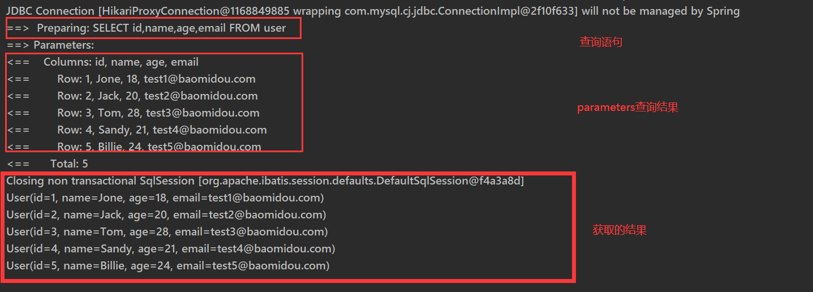


# CRUD

## insert

```java
@Test
    public void inset1(){
        
        int insert = mapper.insert(user);
        
        System.out.println(insert == 1?"yes":"no");
    }

```

mybatisPlus会帮我们自动生成id

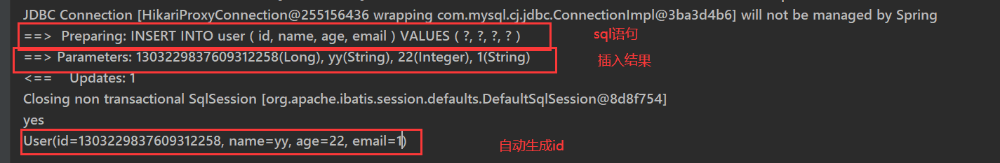

## update

```java
int insert = mapper.updateById(user);
```

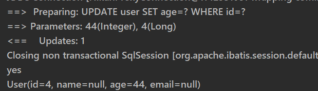

**自动拼接动态sql**，当有字段为空时，不改变该字段


## select

### 1.单个查询id

```java
		//通过id查询数据
        User user = mapper.selectById(1L);
        System.out.println(user);
```

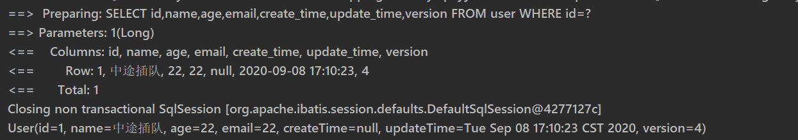


### 2.批量查询id

```java
List< User > users = mapper.selectBatchIds(Arrays.asList(1, 2, 3));
        for (User user : users){
            System.out.println(user);
        }
```


### 3.条件查询

```
HashMap< String, Object > objectObjectHashMap = new HashMap<>();
        //自定义查询条件   字段名,值
        objectObjectHashMap.put("name","yy");
        objectObjectHashMap.put("age",21);
        
        mapper.selectByMap(objectObjectHashMap);
```

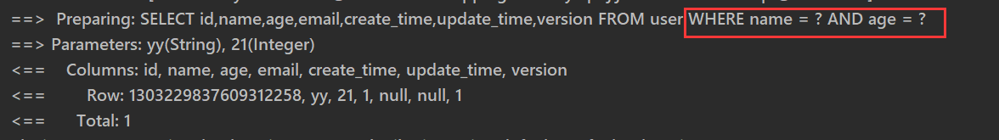

## delete

### 根据id删除单个

```
int i = mapper.deleteById("2");
```

### 根据id删除多个

```
int i = mapper.deleteBatchIds(Arrays.asList(3, 4));
```

### 条件删除

```java
HashMap< String, Object > objectObjectHashMap = new HashMap<>();
        objectObjectHashMap.put("name","yy");
        objectObjectHashMap.put("age",22);

        int i = mapper.deleteByMap(objectObjectHashMap);
        System.out.println(i==1?"删除成功":"删除失败");
```


# 扩展


## 主键生成策略@TableId

放置在实体类主键上方

`TableId(type = ?)`

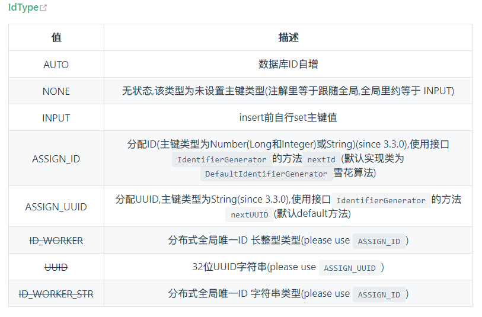

**注意**，如果是**AUTO**，数据库字段需要打开主键自增，否则会报错

​			如果是**INPUT**，那么创建实体类实例就需要自己加上id   `user.setId();`


## 自动填装时间

**1.数据库表方式**

设计中设置数据库自动更新

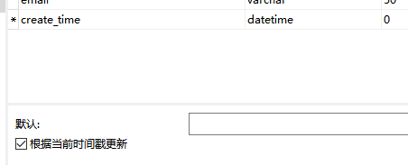

别忘记在实体类上加上时间字段

**2.代码方式**

数据库自动更新需要关闭

直接在实体类的字段中增加注解

```java
	@TableField(fill = FieldFill.INSERT)
    private Date createTime;
    @TableField(fill = FieldFill.UPDATE)
    private Date updateTime;
```

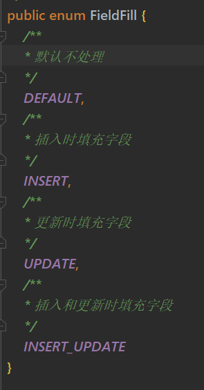

### 自动填充的实现策略

创建自定义类Handler，**继承MetaObjectHandler**

**实体类字段上的注解就会调用这里的方法**

```java
@Slf4j
@Component
//设置自动填充的实现方法
public class MetaObjectHandler implements com.baomidou.mybatisplus.core.handlers.MetaObjectHandler {
    //当实体类中有对应的填充方法,就会调用这边的方法,将数据填充的指定的字段中
    @Override
    public void insertFill(MetaObject metaObject) {
            log.info("开始插入填充");
            //设置自动填充字段的值  (想要填充的字段,插入的数据,metaObject)
            this.setFieldValByName("createTime", new Date(),metaObject);
            this.setFieldValByName("updateTime",new Date(), metaObject);
            log.info("插入填充完成");
    }

    @Override
    public void updateFill(MetaObject metaObject) {
            log.info("开始更新填充");
            this.setFieldValByName("updateTime", new Date(), metaObject);
            log.info("更新填充完成");
    }
}
```

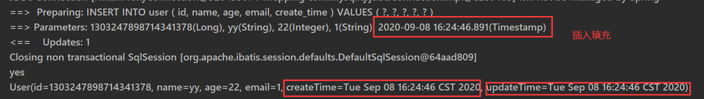


## 乐观锁

当更新一条记录时，**先获取他的version**，在更改时**检查**当前version和之前获取的version**是否相同**，即检查该记录是否被修改过，如果不同，就报错。

**1.数据库添加version字段**

**2.实体类字段**

```java
//该注解代表这是一个乐观锁
    @Version
    private int version;
```

**3.注册乐观锁插件**

在mybatisConfig配置文件中注册

```java
@Configuration
public class myatisPlusConfig {

    //注册乐观锁插件
    @Bean
    public OptimisticLockerInterceptor optimisticLockerInterceptor() {
        return new OptimisticLockerInterceptor();
    }

}
```

**4.乐观锁成功**

```java
@Test
    public void testOptimsitic(){
         //将version保存在user中,当更新时会比较user中的version,即查询时就开启了乐观锁
        User user = mapper.selectById(1L);
        user.setName("wani");
        //获取的version:2
        System.out.println(user.getVersion());

        //更新时,version会自动+1
        int i = mapper.updateById(user);
        //此时的version变成了3
        System.out.println(user.getVersion());
    }
```

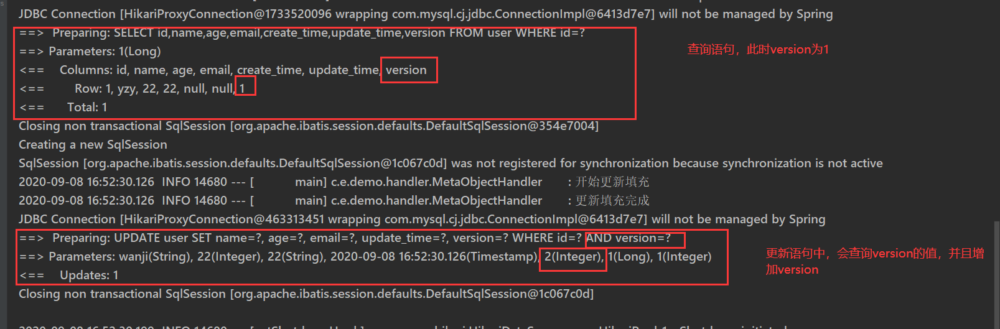

先查询要更新数据的version，查询到值为1，当更新时，先检查当前的version是否为1`where version = 1`，然后更新时，version+1，变成2

**5.乐观锁失败**

```java
		User user = mapper.selectById(1L);
        user.setName("原先排队");

        //在乐观锁1更新途中插入另一个事务2.
        User user1 = mapper.selectById(1L);
        user1.setName("中途插队");
        mapper.updateById(user1);

        //在另一个事务2更新完之后执行该事务1
        int i = mapper.updateById(user);
```


查看结果，**中途插队**的事务2**更新成功**之后，**事务1**由于version发生变化导致**失败**


## 分页

**1.在配置文件中注册分页插件**

```java
@Bean
    public PaginationInterceptor paginationInterceptor() {
        //这些是具体配置,可以省略,直接返回一个最简单的
        /*PaginationInterceptor paginationInterceptor = new PaginationInterceptor();
        // 设置请求的页面大于最大页后操作， true调回到首页，false 继续请求  默认false
        // paginationInterceptor.setOverflow(false);
        // 设置最大单页限制数量，默认 500 条，-1 不受限制
        // paginationInterceptor.setLimit(500);
        // 开启 count 的 join 优化,只针对部分 left join
        paginationInterceptor.setCountSqlParser(new JsqlParserCountOptimize(true));
        return paginationInterceptor;*/
        return new PaginationInterceptor();
    }
```

**2.使用Page对象就可以使用了**

```java
//查询第一页五个数据
        Page< User > userPage = new Page<>(1,5);
        Page< User > userPage1 = mapper.selectPage(userPage, null);

        //获取数据的集合
        List< User > records = userPage.getRecords();

        for (User user:records){
            System.out.println(user);
        }
```

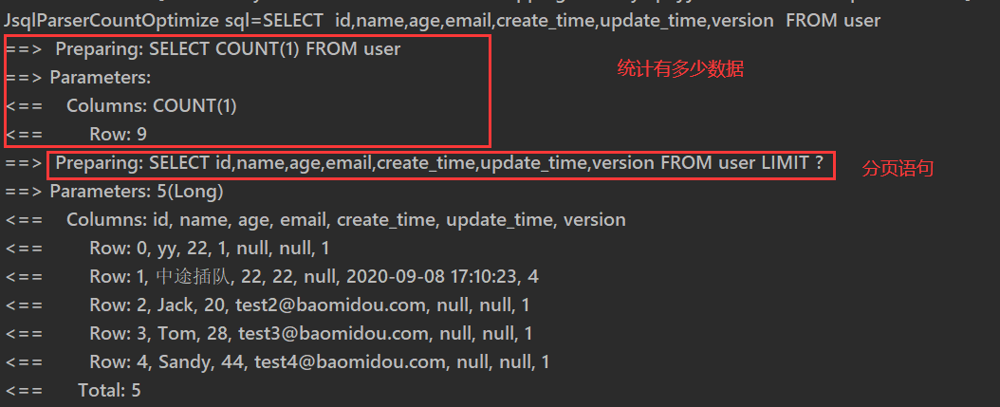

在分页之前会进行统计一共有多少数据的操作，然后再分页


## 逻辑删除

例如：管理员能够查询被删除的几率，防止数据丢失，类似于回收站

**1.数据库设置deleted字段**

**2.实体类添加字段**

```java
//逻辑删除
    @TableLogic
    private int deleted;
```

**3.配置**

在springboot配置文件中添加

```properties
#设置删除的字段
mybatis-plus.global-config.db-config.logic-delete-field=deleted
#删除设置的值
mybatis-plus.global-config.db-config.logic-delete-value=1
#未删除设置的值
mybatis-plus.global-config.db-config.logic-not-delete-value=0
```

**4.测试**

删除用户

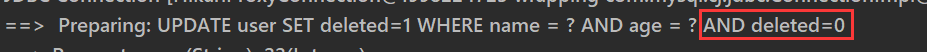

当有deleted这个逻辑删除字段后，**所有更新删除字段都会凭借上一个deleted=0的条件**


## 条件构造器

### QueryWrapper

**条件查询**　

- eq    等于
  - not null  不等于
  - ge　大于等于
  - gt   大于
  - ne    不等于
  - lt    小于
  - le    小于等于

- between    两个值之间

  - not between

- like    模糊查询

  - likeLeft  
    - `likeLeft("name", "王")`--->`name like '%王'`
  - likeRight   
    - `likeRight("name", "王")`--->`name like '王%'`
  - notLike

- isNull
  
  - isNotNull
- insql   子查询sql     
  - `insql("id","select id from user where age = 22")`--->`and id in (select id from user where age = 22)`
  - notInsql
- orderBy
  - `orderBy(boolean condition, boolean isAsc, R... columns)`
  - orderByAsc
  - orderByDesc

```java
        QueryWrapper< User > userQueryWrapper = new QueryWrapper<>();
//Wrapper中有很多方法可以用来使用，比如notnull不为空，可以使用链式
        userQueryWrapper.isNotNull("name")
                                        .isNotNull("email")
                                        //ge大于
                                        .ge("age",22);
//类似于map的用法，创建一个容器用于装各种条件然后作为参数
        List< User > users = mapper.selectList(userQueryWrapper);
```

sql语句

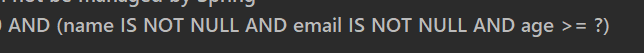


