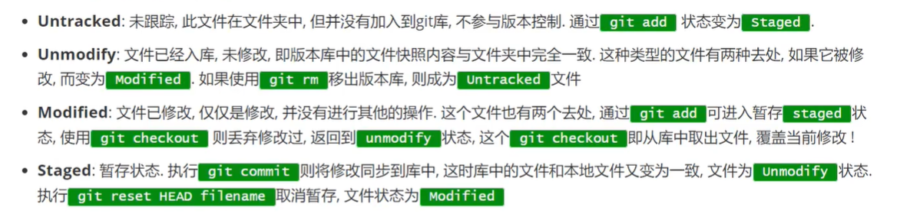

 

# SVN和Git的区别

SVN：**是集中式版本控制系统**，版本存放在中央服务器。工作时，从中央服务器取得最新版本，完成工作上交最近版本。必须联网，只在服务器备份，个人电脑上没有版本；

GIT：**分布式版本控制系统**，没有中央仓库，每个人的电脑都是一个完整的版本库，工作时不需要联网，因为版本都在自己电脑上。**协同的方法**：自己的电脑上修改了文件，其他人也修改了该文件，那么只需要互相传给对方就可以知道所有人的修改信息。

sss

# linux命令

- cd： 进入文件夹
- cd ..： 返回上一级
- ls ：列出文件夹下所有文件，ls（II）列出的内容更详细，蓝色是目录，绿色是程序，白色是文件


- touch 文件名  ：创建文件

- rm  : 移除文件

- mkdir ： 创建一个目录

- rm -r ：移除一个目录

  

- rm -rf / 切勿尝试，清楚根目录的所有文件

- mv A B:把A移到B里

- clear ：清屏

- reset ： 重新加载终端

- history ： 查看历史命令

- exit ： 退出


# git配置

```bash
#本地账户的所有配置
git config -l  
```


```bash
#查看系统config
git config --system --list

#查看自己的配置，用户名和邮箱是必须配置的
git config --global --list  
```


## Git相关配置文件：

1. **Git安装目录下的gitconfig  --system 系统级**

   C:\Program Files (x86)\Git\etc\gitconfig  

   

2. **当前登录用户的配置**(==设置用户名和游戏，必要==)：

   C:\Users\Barcelona\ .gitconfig  

   

   - **可以直接在里面写信息**

   - 也可以在git Bash里设置

     ```bash
     git config --global user.name "顽疾"  #名称
     git config --global user.email 1061603811@qq.com     #邮箱
     ```

     

## 生成公钥

**SSH公钥存放处**

C:\Users\Barcelona\.ssh

```
$ ssh-keygen -t rsa
```

一路回车，会生成文件，将pub文件复制到公钥处即可


# Git基本理论（核心）


- Woekspace: 工作区，平时存放代码的地方，IDEA项目
- Index/Stage:暂存区，临时存放改动。事实上他是一个文件，保存即将提交到文件列表信息
- Repository:本地仓库，安全存放代码的地方，这里面有所有版本信息。其中HEAD指向最新版本
- Remote:远程仓库，托管代码的服务器


## 创建本地仓库

1. 创建全新仓库，需要用Git管理的根目录下执行

   ```bash
   在当前目录新建一个Git代码库
   $ git init
   ```

   

   然后多出了一个.git目录，


2. 克隆远程仓库，将远程仓库镜像一份到本地

   ```bash
   # 克隆一个项目和整个版本信息
   $ git clone [url] #clone的网址在github仓库中有
   ```

   


## ==文件操作==



### 1.创建仓库后**查看仓库文件信息**

```bash
# 查看指定文件状态
$ git status [filename]

#查看所有文件状态
$ git status
```

发现都是红的，都没有被放进暂存区


### 2.将目录下所有文件**放入暂存区**

```bash
$ git add .
# 再查看文件情况
$ git status
```

绿色代表在暂存区，但是还没有被**提交**


### 3.**提交**暂存区的文件到**本地仓库**

```bash
#注意，commit -m一定要加上信息，只写git commit 会跳出一个蓝窗，提示你写信息
# 这时候ins插入，写完信息之后esc推出，再：wq就行了

$ git commit -m  #后面跟的是提交信息
```


```bash
#这时候再查看文件信息
$ git status
```

发现绿色的已经提交了，所以不见了（红色是由于我现在一直在编写文档，不停的修改）


### 4.连接远程仓库

```bash
#连接远程仓库
$ git remote add github https://github.com/18258026861/javaNote.git
#删除远程仓库
$ git remote rm origin
#查看连接的远程仓库
# 如果连接不上可以克隆远程仓库（根目录需要是需要空文件）一个然后文件复制进去再上传
$ git remote -v
```


### 5.提交远程仓库

```bash
# origin是别名，有多个远程仓库可以选择别名上传
git push origin master  #origin 

# push中出现问题refusing to merge unrelated histories

#这是因为远程仓库已经存在代码记录了，并且那部分代码没有和本地仓库进行关联，我们可以使用如下操作允许pull未关联的远程仓库旧代码：

git pull origin master --allow-unrelated-histories

#强制推送
git push -u origin master -f 
```


### 6.撤销修改

修改文件之后，将文件状态**返回到最近一次add或commit的状态**

```
$ git checkout -- filename
$ git checkout -- git.md
```


### 7.删除

```
//删除磁盘中的文件
$ rm filename
$ rm 

//删除git工作区中的文件
$ git rm filename
$ git rm delete.md
```

1.误操作，撤销删除


2.确定删除工作区中的文件


### 8.回退版本

查看log显示提交历史

```
$ git log
```


选择回退的版本，当前提交的版本是HEAD，即de

如果向回退到上一个版本，就是update版本，就选择HEAD^

如果会对到上上个版本，就是inti版本，就选择HEAD^^，以此类推

我选择回到io版本,使用==git reset==命令

```
$ git reset --hard HEAD^
```

这时再打开文件，就回到指定回退版本，而且在状态中无法找到未来版本的任何信息，如何**重新回到未来版本**？

当前命令窗没有关掉，还可以找到未来版本的commit id

```
$ git reset --hard fc43
```


该it


# Git 分支

```bash
# 列出所有本地分支
git branch

# 列出所有远程分支
git branch -r

# 新建一个分支，但依然停留在当前分支
git branch [branch-name]

# 新建一个分支，并切换到该分支
git checkout -b [branch]

# 合并指定分支到当前分支
$ git merge [branch]

# 删除分支
$ git branch -d [branch-name]

# 删除远程分支
$ git push origin --delete [branch-name]
$ git branch -dr [remote/branch]
```

截止到目前，只有一条时间线，在Git里，这个分支叫主分支，即`master`分支。`HEAD`严格来说不是指向提交，而是指向`master`，`master`才是指向提交的，所以，`HEAD`指向的就是当前分支。

一开始的时候，`master`分支是一条线，Git用`master`指向最新的提交，再用`HEAD`指向`master`，就能确定当前分支，以及当前分支的提交点：


## 1.创建分支

当我们**创建新的分支**，例如`dev`时，Git新建了一个指针叫`dev`，指向`master`相同的提交，再把`HEAD`指向`dev`，就表示当前分支在`dev`上：

除了将HEAD指向分支dev，没有修改复制任何内容


```bash
//创建分支
$ git branch 分支名
$ git branch dev

//创建并切换到该分支
//git checkout命令加上-b参数表示创建并切换
$ git checkout -b dev

//创建并切换到新的分支
$ git switch -c 分支名
```

蓝色括号的代表现在的分支


不过，从现在开始，对工作区的修改和提交就是针对`dev`分支了，比如新提交一次后，`dev`指针往前移动一步，而`master`指针不变：


如果要在远程仓库创建新分支们可以在本地创建一个分支，然后再在远程创建同名分支。

## 2.显示所有分支

```
$ git branch
```

× 代表目前所在的分支


## 3.切换分支

切换到新的分支，文件的内容不会分享，而是**只显示切换到的分支提交保存的内容**，每个分支独享自己的仓库

```
$ git checkout 分支名
$ git checkout dev


//切换分支
$ git switch 分支名
```


## 4.合并分支

假如我们在`dev`上的工作完成了，就可以把`dev`合并到`master`上。Git怎么合并呢？最简单的方法，就是直接把`master`指向`dev`的当前提交，就完成了合并：

将HEAD指向master


```
//将制定闻之合并到当前分支，将dev中的内容同步到当前分支
$ git merge 分支名
$ git merge dev


```


## 5.删除分支

```//
$ git branch -d 分支名
$ git branch -d dev
```


## 6.分支冲突


如果多个分支并行执行，就会导致代码冲突，存在多个版本。例如

user和admin两个分支，

A编写user

B编写admin

A编写时需要用到admin.add文件，那么拿过来用的时候**修改**了这个文件，那么user分支里的admin.add文件就修改了。B可以选择是否将这个修改的文件**合并**到admin分支.


已修复bug


## 7.Bug分支

**1.暂存工作场景**

当发生bug时,工作还没完成,不能提交,此时还无法创建bug分支,就可以使用暂存工作场景,内容恢复到上次commit的内容**,将其他内容存放到暂存工作场景中

```
$ git stash 
```


**2.创建bug分支**

```
$ git checkout -b  issue-101
```


**3.修复bug之后add,commit**

```
$ git add .
$ git commit -m"..."
```

**4.将bug分支合并到master**

通常，合并分支时，如果可能，Git会用`Fast forward`模式，但这种模式下，删除分支后，会丢掉分支信息。

如果要强制禁用`Fast forward`模式，Git就会在merge时生成一个新的commit，这样，在合并的分支就会出现分支信息

```bash
//`--no-ff`参数，表示禁用`Fast forward`：
$ git merge --no-ff -m"fixed bug" issue-101
```


**5.恢复工作场景**

1.使用`git stash list` 查看工作区

```
$ git stash list
```


2.1.使用`git stash apply` 恢复,但不删除,需要使用`git stash drop` 删除	


2.2.使用`git stash pop` 恢复并且删除


## master主分支

master主分支应该非常稳定，用来发布新版本，一般情况下不允许在上面工作，工作一般情况下在新建的dev分支上工作，工作完后，比如上要发布，或者说dev分支代码稳定后可以合并到主分支master上来。


# 关于idea提交git的步骤

## 忽略文件

有些时候我们不想把某些文件纳入版本控制中，比如数据库文件，临时文件，设计文件等

在主目录下建立".gitignore"文件，此文件有如下规则：

1. 忽略文件中的空行或以井号（#）开始的行将会被忽略。
2. 可以使用Linux通配符。例如：星号（*）代表任意多个字符，问号（？）代表一个字符，方括号（[abc]）代表可选字符范围，大括号（{string1,string2,...}）代表可选的字符串等。
3. 如果名称的最前面有一个感叹号（!），表示例外规则，将不被忽略。
4. 如果名称的最前面是一个路径分隔符（/），表示要忽略的文件在此目录下，而子目录中的文件不忽略。
5. 如果名称的最后面是一个路径分隔符（/），表示要忽略的是此目录下该名称的子目录，而非文件（默认文件或目录都忽略）。

```
#为注释
*.txt        #忽略所有 .txt结尾的文件,这样的话上传就不会被选中！
!lib.txt     #但lib.txt除外
/temp        #仅忽略项目根目录下的TODO文件,不包括其它目录temp
build/       #忽略build/目录下的所有文件
doc/*.txt    #会忽略 doc/notes.txt 但不包括 doc/server/arch.txt
```

```
#idea参忽略文件
# Project exclude paths
*.class
*.log
*.lock
*.jar
*.war
*.ear

/out/
target/
tep/
#idea
.idea/
*.impl
```


## 1.连接github

file -> setting -> GitHub


登录github账号

## 2.创建远程仓库

可以使用分享项目到仓库


## 3.更新项目

### 1.pull远程仓库

先将github上的项目pull下来（如果对比远程仓库有文件缺失需要这一步）


### 2.commit到本地仓库


### 3.push


打开之后里面的记录即为本地仓库commit的信息


选择一个push就完成了！


### 也可以用IDEA的命令行(比较方便)

```bash
$ git add .
$ git commit -m ""
$ git push
```

