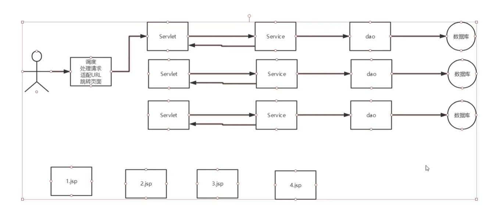
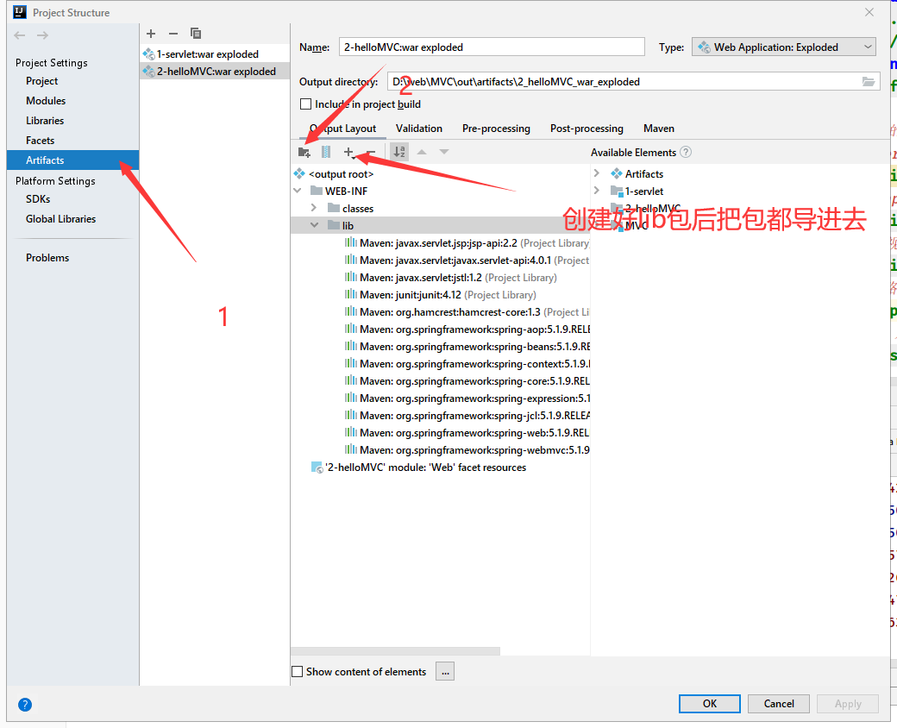
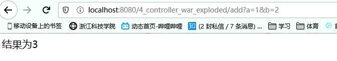
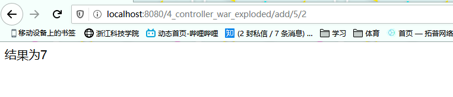
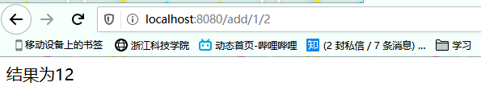
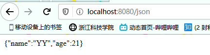
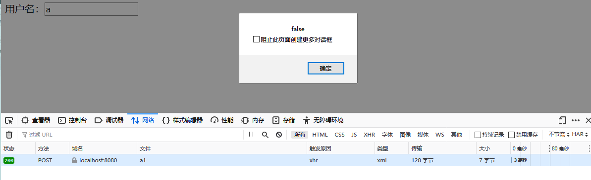
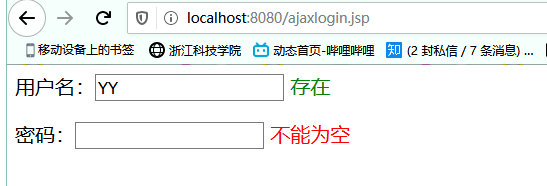
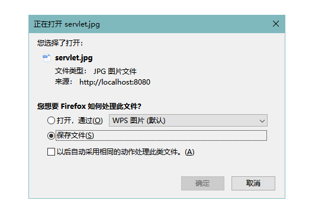

SpringMVC

## 1.**MVC三层架构**

 MVC不是一种设计模式，**MVC是一种架构模式** 

**作用**：降低试图和业务逻辑的**耦合**

 **结构**：

- **Model **      :Dao,service（干苦力）
- **View**          :jsp（展示劳动成果）
- **Controller**:Servlet（指挥干活）

**Model（模型）：**数据模型，==提供要展示的数据==，因此包含数据和行为，可以认为是领域模型或JavaBean组件（包含数据和行为），不过现在一般都分离开来：Value Object（数据Dao） 和 服务层（行为Service）。也就是模型==提供了模型数据查询和模型数据的状态更新==等功能，包括数据和业务。

**View（视图）：**负责进行模型的==展示==，一般就是我们见到的用户界面，客户想看到的东西。

**Controller（控制器）：==接收用户请求==，==委托==给模型进行处理（状态改变），处理完毕后把返回的模型数据==返回==给视图，由视图负责展示。也就是说控制器做了个==调度员==的工作。

**最典型的MVC就是JSP + servlet + javabean的模式。**


###  **SpringMVC重点**：

SpringMVC的执行流程

SSM的框架整合

### **优点**

- SpringMVC与spring无缝结合，我们可以将里面的bean全部注入到spring容器

- 轻量级，简单易学

- 约定大于配置

- 功能强大：RESTful，数据验证

- 使用的人多

  

springMVCDispatcherServlet设计，**将servlet的作用发挥到了极致**，相当于一个**调度中心**将请求分配给各个servlet




# 2.SpringMVC初体验

## 步骤

1. 创建maven，右键**add frameworkSupport** ,选择**web**，增加web框架

2. 在**web.xml**中增加spring提供的**DispatcherServlet**

   ```xml
   <!--    注册DispathcerServlet-->
       <servlet>
           <servlet-name>springmvc</servlet-name>
           <servlet-class>org.springframework.web.servlet.DispatcherServlet</servlet-class>
   <!--        关联一个springmvc配置文件,相当于把指挥权交出去了-->
           <init-param>
   
               <param-name>contextConfigLocation</param-name>
               <param-value>classpath:springmvc-servlet.xml</param-value>
           </init-param>
           
           <!--        启动级别为1，和服务器一起启动-->
           <load-on-startup>1</load-on-startup>
       </servlet>
   
       <!--/ 匹配所有的请求；（不包括.jsp）-->
       <!--/* 匹配所有的请求；（包括.jsp）-->
       <servlet-mapping>
           <servlet-name>springmvc</servlet-name>
           <url-pattern>/</url-pattern>
       </servlet-mapping>
   ```

   

3. 创建springmvc**配置文件**，在**Resources**文件下。

   **springmvc-servlet.xml**：

   ```xml
   <?xml version="1.0" encoding="UTF-8"?>
   <beans xmlns="http://www.springframework.org/schema/beans"
          xmlns:xsi="http://www.w3.org/2001/XMLSchema-instance"
          xsi:schemaLocation="http://www.springframework.org/schema/beans
          http://www.springframework.org/schema/beans/spring-beans.xsd">
   
       <!--添加springmvc提供的,三个是固定的-->
   <!--  处理映射器，handler：处理器，mapping：映射器-->
       <bean class="org.springframework.web.servlet.handler.BeanNameUrlHandlerMapping">
   <!--        作用：通过url查找handler返回给DispatcherServlet-->
       </bean>
   <!-- 处理器适配器   Adapter：适配器-->
       <bean class="org.springframework.web.servlet.mvc.SimpleControllerHandlerAdapter">
   <!--        作用：找到对应的Controller去执行Handler，接收Controller返回的结果-->
       </bean>
   
   <!-- 视图解析器  View:视图 Resolver：解析器-->
   <!--    作用：获得Controller返回的结果
                  解析ModelandView的view名字
                   通过前缀和后缀拼接视图的路径，找到该视图
                     把数据渲染到该视图-->
       <bean class="org.springframework.web.servlet.view.InternalResourceViewResolver">
           <!-- 前缀，默认的路径是web文件夹下，我们的文件夹在web-inf里面，java代码里就可以省略这部分了-->
           <property name="prefix" value="/WEB-INF/jsp/"/>
           <!-- 后缀去掉jsp，只要写文件名-->
           <property name="suffix" value=".jsp"/>
       </bean>
   
       <bean id="/hello" class="y.controller.Controllers"></bean>
       
   </beans>
   ```

4. 编写操作业务Controller，实现的两种形式：**继承Controller接口**和**注解**，**相当于servlet的功能**

   ```java
   //  实现（继承是对于抽象类而言，别说岔了）Controller接口
   public class Controllers implements Controller {
       @Override
       public ModelAndView handleRequest(HttpServletRequest httpServletRequest, HttpServletResponse httpServletResponse) throws Exception {
   //      模型和视图
           ModelAndView mv = new ModelAndView();
   
    //        调用业务层
           
   //        在web中这部分相当于session.setAttribute,用来存储信息
           mv.addObject("msg","YY");
   
   //        跳转页面,相当于重定向和转发，
   //      /WEB-INF/jsp/hello.jsp,在配置文件过滤前缀和后缀了
           mv.setViewName("hello");
           return mv;
       }
   }
   
   ```

   

5.  在spring容器创建bean （由spring来调度）（**经常忘记！**）

   **springmvc-servlet.xml**：下创建bean

```xml
<bean id="/hello" class="yzy.controller.Controllers"></bean>
```

6. 启动tomcat

   把上个maven去掉，增加这个maven的


7. 地址栏输入hello

   成功输出

   

## **遇到问题**

1.


**原因：**用add frameworkSupport增加的web框架没有lib依赖

**解决方法**：需要自己手动创建lib，并导包



2.**404**

**原因1**：忘记在最后加/

```xml
<property name="prefix" value="/WEB-INF/jsp/"/>
```

**原因2**：忘记创建bean

```xml
<bean id="/hello" class="yzy.controller.Controllers"></bean>
```


## 结论：

  一系列的操作下来，发现我们的操作并**没有配置web.xml**（，而是放到了**spring容器**里，由spring容器管理。

由**HandlerMapping和HandlerAdapet**来**匹配**我们的操作：

​	比如我刚才那个在地址栏输入hello的操作（当然这个操作简化了，本来应该由servlet来输入hello操作）**HandlerMapping和HandlerAdapet**匹配到了与之对应**controller**去处理（这步本来应该在web.xml里servlet匹配），摆脱了servlet（明面上摆脱，实际上DispatcherServlet就是基于servlet的封装）


### 执行流程

- jsp的所有请求**全部交给了DispatcherServlet，因为匹配了所有请求**，
- DispatcherServlet委托给了处理器**HandlerMapping和HandlerAdapet
- **HandlerMapping(通过rul查询到Handler)和HandlerAdapet（分配Handler给Controller）**匹配对应的**controller**
- 执行，返回**model（装数据）andview（跳转）**


### SpringMVC执行原理


图为SpringMVC的一个较完整的流程图，实线表示SpringMVC框架提供的技术，不需要开发者实现，==虚线==表示需要开发者实现。

**简要分析执行流程**

1. **DispatcherServlet**表示**前置控制器**，是整个SpringMVC的**控制中心**。用户发出请求，DispatcherServlet接收请求并拦截请求。

   我们假设请求的url为 : http://localhost:8080/SpringMVC/hello

   

   **如上url拆分成三部分：**

   http://localhost:8080服务器域名

   SpringMVC部署在服务器上的web站点

   hello表示控制器

   通过分析，如上url表示为：请求位于服务器localhost:8080上的SpringMVC站点的hello控制器。

2. **HandlerMapping**为处理器映射。DispatcherServlet调用HandlerMapping,**HandlerMapping根据请求url==查找Handler==**。

3. **HandlerExecution**表示具体的Handler,其主要**作用**是==根据url查找控制器==，如上url被查找控制器为：hello。

4. **HandlerExecution**将解析后的信息**传递**给**DispatcherServlet**,如解析控制器映射等。

5. **HandlerAdapter**表示处理器适配器，其按照特定的规则去==执行Handler==。

6. **Handler**让具体的**Controller**执行。

7. **Controller**将具体的执行信息返回给**HandlerAdapter**,如ModelAndView。

8. **HandlerAdapter**将**视图逻辑名或模型**传递给**DispatcherServlet**。

9. **DispatcherServlet**调用视图解析器(ViewResolver)来**解析**HandlerAdapter传递的逻辑视图名。

10. 视图解析器将解析的**逻辑视图名**传给DispatcherServlet。

11. **DispatcherServlet**根据视图解析器解析的视图结果，**调用**具体的视图。

12. 最终视图呈现给用户。


**自己的总结：**

1. D（DispatcherServlet）作为前端控制器接收所有请求，
2. D调用**HandlerMapping** 根据请求url==查询==到Handler，
3. D调用**HandlerApdater**把Handler==分配==给对应的Controller。
4. D调用**ViewResolver**得到ModelandView执行的结果：ModelandView，==解析==视图名和渲染数据并==渲染==到视图上，
5. D展示给用户


## 注解步骤


1. 创建maven，右键**add frameworkSupport** ,选择**web**，增加web框架

2. 在**web.xml**中增加spring提供的**DispatcherServlet**

   ```xml
   <!--    注册DispathcerServlet-->
       <servlet>
           <servlet-name>springmvc</servlet-name>
           <servlet-class>org.springframework.web.servlet.DispatcherServlet</servlet-class>
   <!--        关联一个springmvc配置文件,相当于把指挥权交出去了-->
           <init-param>
   
               <param-name>contextConfigLocation</param-name>
               <param-value>classpath:springmvc-servlet.xml</param-value>
           </init-param>
           
           <!--        启动级别为1，和服务器一起启动-->
           <load-on-startup>1</load-on-startup>
       </servlet>
   
       <!--/ 匹配所有的请求；（不包括.jsp）-->
       <!--/* 匹配所有的请求；（包括.jsp）-->
       <servlet-mapping>
           <servlet-name>springmvc</servlet-name>
           <url-pattern>/</url-pattern>
       </servlet-mapping>
   ```

   

3. 创建springmvc**配置文件**，在**Resources**文件下。

   ```xml
   <?xml version="1.0" encoding="UTF-8"?>
   <beans xmlns="http://www.springframework.org/schema/beans"
          xmlns:xsi="http://www.w3.org/2001/XMLSchema-instance"
          xmlns:context="http://www.springframework.org/schema/context"
          xmlns:mvc="http://www.springframework.org/schema/mvc"
          xsi:schemaLocation="http://www.springframework.org/schema/beans
          http://www.springframework.org/schema/beans/spring-beans.xsd
          http://www.springframework.org/schema/context
          https://www.springframework.org/schema/context/spring-context.xsd
          http://www.springframework.org/schema/mvc
          https://www.springframework.org/schema/mvc/spring-mvc.xsd">
   
   <!--    自动扫描包-->
       <context:component-scan base-package="controllers"/>
   
   <!--会在Spring MVC上下文中定义一个DefaultServletHttpRequestHandler
       如果发现URL是静态资源的请求，就将该请求转由Web应用服务器默认的Servlet处理，
       如果不是静态资源的请求，才由DispatcherServlet继续处理。-->
       <mvc:default-servlet-handler/>
   <!--    自动开启HandlerMapping,HandlerApdater-->
       <mvc:annotation-driven/>
   
       <bean class="org.springframework.web.servlet.view.InternalResourceViewResolver">
           <property name="prefix" value="/WEB-INF/JSP/"/>
           <property name="suffix" value=".jsp"/>
       </bean>
   
   </beans>
   ```

   

   4. 编写操作业务Controller，实现的形式**注解**

   ```java
   @org.springframework.stereotype.Controller
   
   //@RequestMapping可以装在类上和方法上，
   // 如果装在类上，那么方法上的访问地址就加前缀,例如下面的方法地址变成了/hello/hi
   //@RequestMapping("/hello")
   public class Controller  {
   
   //  请求的访问地址，即地址栏输入的内容，用于触发该业务
       @RequestMapping("/h")
       public String view(Model model){
   //        业务
   
   //        装载数据
           model.addAttribute("msg","YZY");
   
   //        视图名，会被视图解析器处理，左边的叶子点一下就能看到被解析的视图页面
           return "hi";
       }
   }
   ```


5. 启动tomcat
6. 地址栏输入hello


# 3.Controller

## 注解：

```java
package controller;

import org.springframework.ui.Model;
import org.springframework.web.bind.annotation.RequestMapping;

/**
 * @author YZY
 * @date 2020/4/14 - 12:15
 */
@org.springframework.stereotype.Controller
public class Controller {

    @RequestMapping("/h1")
    public String view(Model model){
        model.addAttribute("msg","YZY");
        return "hi";
    }
    @RequestMapping("/h2")
    public String view2(Model model){
        model.addAttribute("msg","YY");
        return "hi";
    }
}
```

使用注解发现一个页面可以==复用==


## 实现接口：

```java
//  实现（继承是对于抽象类而言，别说岔了）Controller接口
public class Controllers implements Controller {
    @Override
    public ModelAndView handleRequest(HttpServletRequest httpServletRequest, HttpServletResponse httpServletResponse) throws Exception {
//      模型和视图
        ModelAndView mv = new ModelAndView();

 //        调用业务层
        
//        在web中这部分相当于session.setAttribute,用来存储信息
        mv.addObject("msg","YY");

//        跳转页面,相当于重定向和转发，
//      /WEB-INF/jsp/hello.jsp,在配置文件过滤前缀和后缀了
        mv.setViewName("hello");
        return mv;
    }
}
```

```xml
<bean id="/hello" class="y.controller.Controllers"></bean>
```


- - 

## **对比**

- 一般使用**注解**开发，配置十分方便
-  **实现接口**一个控制器中只有一个方法，多个方法则需要定义多个Controller 


# Resultful 风格

**介绍**：

 Restfule风格是一种**软件架构风格**，而不是标准 

**特点**：

- **简洁**：显示的风格很简单 ，/分割资源

- **高效**：支持缓存

- **安全**：不会通过地址透露信息


**原本的写法**：

```java
@RequestMapping("/add")
    public String view(int a, int b, Model model){
        int result = a+b;
        model.addAttribute("msg","结果为"+result);
        return "hi";
    }
```



**现在的写法**：

```java
//    加上@PathVariable，相当于 "/add/{a}/{b}"
@RequestMapping("/add/{a}/{b}")
    public String view2(@PathVariable int a, @PathVariable int b, Model model){
        int result = a+b;
        model.addAttribute("msg","结果为"+result);
        return "hi";
    }
```



两个地址虽然一样，但是由于**提交方式的不同**（GET,POST），**展示的结果也不一样**

```java
@GetMapping("/add/{a}/{b}")
    public String view2(@PathVariable int a, @PathVariable int b, Model model){
        int result = a+b;
        model.addAttribute("msg","结果为"+result);
        return "hi";
    }

    @PostMapping("/add/{a}/{b}")
    public String view3(@PathVariable String a, @PathVariable String b, Model model){
        String result = a+b;
        model.addAttribute("msg","结果为"+result);
        return "hi";
    }
```

在jasp提交会触发第二段业务

```jsp
<form action="/add/1/2" method="post">
     <input type="submit"/>
 </form>
```




# 跳转方式

1. 使用视图解析器**viewResolver**

2. 使用**原生态的重定向和转发**可以不用viewResolver。

```java
@RequestMapping("/zf")
    public String view(HttpServletRequest request, HttpServletResponse response){

        HttpSession session = request.getSession();
        session.setAttribute("msg","转发");
//          默认转发
//          解析器默认转发，所以开了解析器只要return 视图名就行了，相当于解析器只支持转发
        return "/WEB-INF/JSP/hi.jsp";
    }


    @RequestMapping("/cdx")
    public String view2(HttpServletRequest request, HttpServletResponse response){

        request.getSession().setAttribute("msg","重定向");
//      重定向好像不能访问WEB-INF下的路径，只有内部转发才能访问该文件
//        在解析器开启的情况下，重定向写法不变
        return "redirect:/index.jsp";
    }
```


# 请求参数

### 普通参数，可以使用别名

```java
 @RequestMapping("/h1")
//          @RequstrParam:别名,只要需要传参最好写上比较显眼
    public String view(@RequestParam("username")String name, Model model){
        model.addAttribute("msg",name);
        return "hi";
    }
```


### **多个参数**

可以定义一个**对象类**用于对应多个参数，多个参数的名称会**自动匹配**对象的属性

```java
public class Person {

    private String name;
    private int age;
   }
```

```java
//    前端传过来的是个对象，参数填对象，名称会自动匹配
//    http://localhost:8080/person?name=yzy&age=22
    @RequestMapping("/person")
    public String view1(Person person, Model model){
        
        model.addAttribute("msg",person);
        return "hi";
    }
```


# 乱码问题

- 在提交页面传入中文参数


- 在视图发现乱码了


- 在控制台显示的也是乱码


## 解决方法

- servlet的编码设置：

  ```
  request.setCharacterEncoding("utf-8");
  ```

  发现并没有什么卵用，说明在进入后端之前就乱码了

- 使用过滤器

  ```java
  public class EncodeFilter implements Filter {
      @Override
      public void init(FilterConfig filterConfig) throws ServletException {}
      @Override
      public void doFilter(ServletRequest servletRequest, ServletResponse servletResponse, FilterChain filterChain) throws IOException, ServletException {
          servletRequest.setCharacterEncoding("utf-8");
  //      继续往下走，不要中断
          filterChain.doFilter(servletRequest,servletResponse);
      }
      @Override
      public void destroy() {}
  }
  ```

  配置web.xml（这里犯了个低级错误，filter标签写成了servlet标签）

  ```xml
  <filter>
          <filter-name>encode</filter-name>
          <filter-class>filter.EncodeFilter</filter-class>
      </filter>
      <filter-mapping>
          <filter-name>encode</filter-name>
          <url-pattern>/*</url-pattern>
      </filter-mapping>
  ```

  解决问题！

- 使用spring提供的过滤器

  ```xml
  <filter>
          <filter-name>encoding</filter-name>
          <filter-class>org.springframework.web.filter.CharacterEncodingFilter</filter-class>
          <init-param>
              <param-name>encoding</param-name>
              <param-value>utf-8</param-value>
          </init-param>
      </filter>
      <filter-mapping>
          <filter-name>encoding</filter-name>
          <url-pattern>/*</url-pattern>
      </filter-mapping>
  ```

  也能解决，但是极端情况下get方法不生效


# Json

## 介绍Json

**背景**：前后端分离

后端：提供接口，提供数据

​			**中间用Json来沟通**

前端：独立部署，调用接口，获取数据并渲染


 **什么是JSON？** 

-  JSON(JavaScript Object Notation, JS 对象标记) 是一种轻量级的数据交换格式，目前使用特别广泛。 

- 采用完全独立于编程语言的**文本格式**来存储和表示数据。
- **简洁和清晰的层次结构**使得 JSON 成为理想的数据交换语言。
- 易于人阅读和编写，同时也易于机器解析和生成，并有效地提升网络传输效率。


**JS对象转换成JSON对象**

```js
let json = JSON.stringify(user);
```


JSON对象转化成JS对象

```js
let parse = JSON.parse(json);
```


## 步骤

使用**前后端分离**，后端只需要把数据转换成**json**格式然后return就行了，

意味着我们不用return 视图了，就**不用经过视图解析器**了

1. 导包

```xml
<!-- https://mvnrepository.com/artifact/com.fasterxml.jackson.core/jackson-databind -->
<dependency>
    <groupId>com.fasterxml.jackson.core</groupId>
    <artifactId>jackson-databind</artifactId>
    <version>2.10.2</version>
</dependency>
```

2. 构造环境

3. Controller ：

   **不需要使用视图解析器**

   1.类前面为@Controller，在方法面前加@ResponseBody

   ```java
   @Controller
   public class Controller {
       
   @RequestMapping("/json")
   //    不会走视图解析器，直接返回一个字符串
       @ResponseBody
       public String view(Model model) throws JsonProcessingException {
           User user = new User("YY",21);
   
           ObjectMapper mapper = new ObjectMapper();
           String s = mapper.writeValueAsString(user);
           return user.toString();
       }
   }
   ```

   2.类前面为@RestController

   ```java
   @RestController
   public class Controller {
   ```

   结果：普通的对象


4. 使用json

   ```java
   @RequestMapping("/json")
   //    不会走视图解析器，直接返回一个字符串
       @ResponseBody
       public String view(Model model) throws JsonProcessingException {
           User user = new User("YY",21);
   
           ObjectMapper mapper = new ObjectMapper();
           String s = mapper.writeValueAsString(user);
           return s;
       }
   ```

   

   结果： **JSON 键值对** 

   

   **json语法格式：**

- 对象表示为键值对，数据由逗号分隔
- 花括号保存对象
- 方括号保存数组


**输入中文发现乱码**

1. 在方法前面：

```java
@RequestMapping(value = "/json",produces = "application/json;charset=utf-8")
```


2. 在springmvc.xml中配置

   ```xml
   <mvc:annotation-driven>
      <mvc:message-converters register-defaults="true">
          <bean class="org.springframework.http.converter.StringHttpMessageConverter">
              <constructor-arg value="UTF-8"/>
          </bean>
          <bean class="org.springframework.http.converter.json.MappingJackson2HttpMessageConverter">
              <property name="objectMapper">
                  <bean class="org.springframework.http.converter.json.Jackson2ObjectMapperFactoryBean">
                      <property name="failOnEmptyBeans" value="false"/>
                  </bean>
              </property>
          </bean>
      </mvc:message-converters>
   </mvc:annotation-driven>
   ```


# Ajax

**介绍**：

- AJAX = Asynchronous JavaScript and XML（==异步==的 JavaScript 和 XML）。 
-  是一种用于创建快速动态网页的技术 ， 通过在后台与服务器进行少量数据交换，AJAX 可以使网页实现异步更新 
-  意味着在**无需重新加载**整个网页的情况下，能够**更新部分网页** 


 **XMLHttpRequest 是 AJAX 的基础。**


### 流程：

1. 前端**失去焦点触发**方法中的ajax
2. ajax通过url向后端**请求参数**
3. 后端接收参数进行操作，并返回一个**data**
4. 前端通过**回调函数**接收data值对，弹窗提示


### 失去焦点 onblur

#### 弹窗显示

**前端**

```jsp
<%--
  Created by IntelliJ IDEA.
  User: Barcelona
  Date: 2020/4/18
  Time: 12:12
  To change this template use File | Settings | File Templates.
--%>
<%@ page contentType="text/html;charset=UTF-8" language="java" %>
<html>
  <head>
    <title>$Title$</title>
<%--    加载静态资源--%>
    <script src="${pageContext.request.contextPath}/static/jquery-3.4.1.js"></script>
  </head>
  <body>
  <script>
    function f(){
    $.post({
      url: "${pageContext.request.contextPath}/a1",
      //键值对
      data:{"name":$("#username").val()},
      success: function (date) {
        alert(date);
      }
    })
    }

  </script>
<%--        失去焦点是发起请求到后台--%>
  用户名：<input type="text" id="username" onblur="f()">
  </body>
</html>

```

 

**后端**：

```java
@RequestMapping("/a1")
    public void a1(String name, HttpServletResponse response) throws IOException {
        System.out.println(name);
        if("YY".equals(name)) {
            response.getWriter().println("true");
        }
        else
            response.getWriter().println("false");

    }
```


**结果**




#### span显示

**ajaxlogin.jsp**

```jsp
<%@ page contentType="text/html;charset=UTF-8" language="java" %>
<html>
<head>
    <title>login</title>
    <script src="${pageContext.request.contextPath}/static/jquery-3.4.1.js"></script>
    <script>
        function a() {
            $.ajax({
                url:"${pageContext.request.contextPath}/username",
                //  比如忘了.val
                data:{"username":$("#username").val()},
                success: function (data) {
                    console.log(data);
                    if(data.toString()==='存在'){
                        $("#usernameInfo").css("color","green");
                    }else{
                        $("#usernameInfo").css("color","red");
                    }
                    //   给span标签赋值
                    $("#usernameInfo").html(data);
                }
            })
        };
        function b() {
            $.ajax({
                url:"${pageContext.request.contextPath}/password",
                data:{"password":$("#password").val()},
                success: function (data) {
                    $("#passwordInfo").css("color","red");
                    $("#passwordInfo").html(data);
                }
            })
        }
    </script>
</head>
<body>
<p>
        用户名：<input type="text" id="username" onblur="a()">
        <span id="usernameInfo"></span>
</p>
<p>
        密码：<input type="password" id="password" onblur="b()">
        <span id="passwordInfo"></span>
</p>
</body>
</html>

```

**后端**

```java
@RequestMapping("/username")
    @ResponseBody
    public String username(String username){
        String info = "";
        if(username.length()!=0) {
            if ("YY".equals(username)) {
                info = "存在";
            } else {
                info = "无此账号";
            }

        }
        else{
            info = "不能为空";
        }
        return info;
    }

    @RequestMapping("/password")
    @ResponseBody
    public String password(String password){
        String info = "";
        if(password.length()==0) {
            info = "不能为空";
        }
        return info;
    }
```

##### 处理json乱码问题

springmvc.xml

```xml
<mvc:annotation-driven>
        <!--        处理JSON乱码-->
        <mvc:message-converters register-defaults="true">
            <bean class="org.springframework.http.converter.StringHttpMessageConverter">
                <constructor-arg value="UTF-8"/>
            </bean>
            <bean class="org.springframework.http.converter.json.MappingJackson2HttpMessageConverter">
                <property name="objectMapper">
                    <bean class="org.springframework.http.converter.json.Jackson2ObjectMapperFactoryBean">
                        <property name="failOnEmptyBeans" value="false"/>
                    </bean>
                </property>
            </bean>
        </mvc:message-converters>
    </mvc:annotation-driven>
```

**结果**




# 拦截器

 SpringMVC的处理器**拦截器**类似于Servlet开发中的**过滤器Filter**,用于对处理器进行**预处理和后处理**。 

 **过滤器与拦截器的区别：**拦截器是**AOP思想**的具体应用。 


**拦截器** 

- 拦截器是SpringMVC框架自己的，**只有使用了SpringMVC框架**的工程才能使用
- 拦截器**只会拦截访问的控制器方法**， 如果访问的是jsp/html/css/image/js是不会进行拦截的


在项目中的==作用==：

1. 项目中是**不能通过地址栏直接访问页面**的，而是要通过**跳转**，**拦截器**会拦截用户的**地址栏直接访请求**
2. 用户**没有访问页面的必要信息**时会被拦截器拦截


### 放行

Interceptor：

```java
public class Interceptor implements HandlerInterceptor {
    @Override
    public boolean preHandle(HttpServletRequest request, HttpServletResponse response, Object handler) throws Exception {
        System.out.println("==============before==================");
        //        放行，执行下一个拦截器
        return true;
//        不执行下一个拦截器
        //        return false;
    }

    @Override
    public void postHandle(HttpServletRequest request, HttpServletResponse response, Object handler, ModelAndView modelAndView) throws Exception {
        System.out.println("=============post============");

    }

    @Override
    public void afterCompletion(HttpServletRequest request, HttpServletResponse response, Object handler, Exception ex) throws Exception {
        System.out.println("=============after============");

    }
}
```

**配置拦截器**

```xml
<!--    配置拦截器-->
    <mvc:interceptors>
        <mvc:interceptor>
<!--            拦截/下所有请求-->
            <mvc:mapping path="/**"/>
            <bean class="interceptor.Interceptor"/>
        </mvc:interceptor>
    </mvc:interceptors>
```

**请求在postHandler之前，preHandle之后**：==只有preHandler有拦截作用==，后面两个是记录功能


### 不放行

```java
public class Interceptor implements HandlerInterceptor {
    @Override
    public boolean preHandle(HttpServletRequest request, HttpServletResponse response, Object handler) throws Exception {
        System.out.println("==============before==================");
        //        放行，执行下一个拦截器
//        return true;
//        不执行下一个拦截器
               return false;
    }

}
```

不放行之后就拦截了请求，请求不通过


### 登录拦截器例子：

描述：

有两个页面：一个**登录页面**，一个**用户页面**

游客**登录成功**之后进入**用户页面**，如果游客**没登录**想直接访问**用户页面**就会被**拦截器拦截。**

拦截的依据就是登录时创建的**session**，游客没有session即没有登录就无法访问**用户页面**


## 犯的错误

直接把请求路径写到了注解上，极其低级的错误

```java
@Controller(“/Login”)
```


## 遇到的问题

### 资源访问404

**问题**：由于在controller类上增加了@RequsetMapping（"/Loin"）类路径，在访问资源时变成了/Login/WEB-INF。

**原因**：而我在视图解析器的前缀上没有加上/，被视为绝对路径导致在跳转页面时WEB-INF前面加上了类路径，导致404。

**解决方法**：所以何时何地，在解析器前缀前面加上/

```xml
 <property name="prefix" value="/WEB-INF/JSP/"/>
```

**反思**：前面由于没有使用过类路径导致一直没有发现这个问题，后台代码没有问题却怎么也找不出来


### 拦截器不生效

**原因**：写了loginInterceptor，但是由于在参数里加了个HttpSession，就不能重写，从而导致拦截器没有生效

**解决方法**：session用**request.getSession**获得


# 返回路径：

- 当页面跳转路径加/时，表示是绝对路径（推荐）**(项目名后面直接加返回路径)**
              **我们使用了前缀/WEB-INF，所以是第一种方法！！！！**
          
          像SSM中返回请求路径如果是一个servlet，前面加个/，就**不执行视图解析器**了，而是直接在项目后面加上方法路径
          
- 当页面跳转路径不加/时，表示是相对路径（不推荐）
           请求该方法的路径：**当前页面路径+return返回的路径**


# controller 方法的返回值

- 视图名：返回结果为视图解析器拼接后的**页面**

  ```java
   return "User";
  ```

- **redirect**和**forward**：返回结果为请求路径

  - redirect:不携带请求参数，也可以是视图名

    ```java
    //  视图名，绝对路径（项目名之后）
    return "redirect:/index.jsp";
    //   请求路径，需要在前面加类路径
    return "redirect:/Login/toUser";
    ```

  - forward：可以携带请求参数

    ```java
    //   请求路径，需要在前面加类路径
    return "forward:/Login/toUser";
    ```

    


# 文件上传下载

### 介绍：

 **文件上传**是项目开发中**最常见的功能之一** ,springMVC 可以很好的支持文件上传，但是SpringMVC上下文中默认没有装配MultipartResolver，因此默认情况下其不能处理文件上传工作。如果想使用Spring的文件上传功能，则需要在**上下文中配置MultipartResolver**。 


 **前端表单要求**：为了能上传文件，必须将表单的**method设置为POST**，并将**enctype设置为multipart/form-data**。 


## 上传步骤

1. 导包

   ```xml
   <!--文件上传-->
   <dependency>
      <groupId>commons-fileupload</groupId>
      <artifactId>commons-fileupload</artifactId>
      <version>1.3.3</version>
   </dependency>
   ```

2. 文件配置

   ```xml
   <!--文件上传配置-->
   <bean id="multipartResolver"  class="org.springframework.web.multipart.commons.CommonsMultipartResolver">
      <!-- 请求的编码格式，必须和jSP的pageEncoding属性一致，以便正确读取表单的内容，默认为ISO-8859-1 -->
      <property name="defaultEncoding" value="utf-8"/>
      <!-- 上传文件大小上限，单位为字节（10485760=10M） -->
      <property name="maxUploadSize" value="10485760"/>
      <property name="maxInMemorySize" value="40960"/>
   </bean>
   ```

3. 前端

   ```jsp
   <form action="/upload" enctype="multipart/form-data" method="post">
       <input type="file" name="file"/>
       <input type="submit" value="upload">
   ```

4. 后端

   ```java
   //批量上传CommonsMultipartFile则为数组即可
       @RequestMapping("/upload")
     /*      @RequestParam介绍
             加与不加的区别：  加代表选择的参数必须传   required = false,可以不传
          @RequestParam("file")，@RequestParam(value = "file")指定参数名，上传的参数必须是这个名字
      defaultValue = "name":参数默认值*/
       public String upload(@RequestParam(value = "file") CommonsMultipartFile file, HttpServletRequest request) throws IOException {
           //获取文件名 : file.getOriginalFilename();
           String uploadName = file.getOriginalFilename();
   
   //        判断是否为空
           if(uploadName.length()==0){
               return "redirect:/index.jsp";
           }
           System.out.println("文件名为"+uploadName);
   
   //        上传路径
           String path = request.getServletContext().getRealPath("/upload");
   //      如果路径不存在，创建一个
           File realPath = new File(path);
           if (!realPath.exists()){
               realPath.mkdir();
           }
           System.out.println("上传文件保存地址："+realPath);
           InputStream is = file.getInputStream(); //文件输入流
           OutputStream os = new FileOutputStream(new File(realPath,uploadName)); //文件输出流
   
           //读取写出
           int len=0;
           byte[] buffer = new byte[1024];
           while ((len=is.read(buffer))!=-1){
               os.write(buffer,0,len);
               os.flush();
           }
           os.close();
           is.close();
           return "redirect:/index.jsp";
       }
   ```

**结果**：


**文件夹所在位置**


### 出现的问题

#### 没有更新lib的jar包


导入依赖没有在lib上更新

#### controller接收参数没有添加@RequestParam("file")

```java
//批量上传CommonsMultipartFile则为数组即可
    @RequestMapping("/upload")
    public String upload(@RequestParam("file") CommonsMultipartFile file, HttpServletRequest request) throws IOException {
```

**@RequestParam介绍**

- 加与不加的区别：  加代表选择的**参数必须传**   required = false,可以不传
-  @RequestParam("file")，@RequestParam(value = "file")**指定参数名**，上传的参数必须是这个名字

- defaultValue = "name":**参数默认值**


## 下载步骤

**后端**

```java
@RequestMapping(value="/download")
public String downloads(HttpServletResponse response ,HttpServletRequest request) throws Exception{
   //要下载的图片地址
   String  path = request.getServletContext().getRealPath("/upload");
   String  fileName = "基础语法.jpg";

   //1、设置response 响应头
   response.reset(); //设置页面不缓存,清空buffer
   response.setCharacterEncoding("UTF-8"); //字符编码
   response.setContentType("multipart/form-data"); //二进制传输数据
   //设置响应头
   response.setHeader("Content-Disposition",
           "attachment;fileName="+URLEncoder.encode(fileName, "UTF-8"));

   File file = new File(path,fileName);
   //2、 读取文件--输入流
   InputStream input=new FileInputStream(file);
   //3、 写出文件--输出流
   OutputStream out = response.getOutputStream();

   byte[] buff =new byte[1024];
   int index=0;
   //4、执行 写出操作
   while((index= input.read(buff))!= -1){
       out.write(buff, 0, index);
       out.flush();
  }
   out.close();
   input.close();
   return null;
}
```

**前端**

```jsp
<a href="/download">点击下载</a>
```

**结果**：

