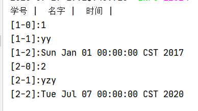
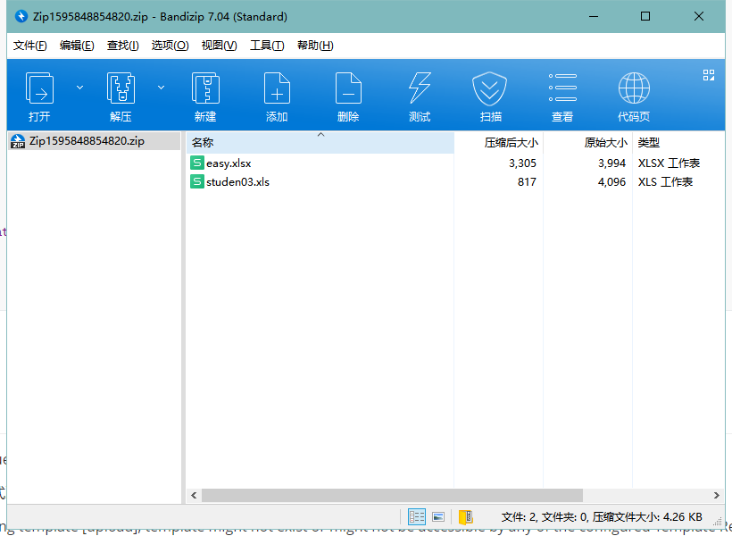

创建一个springboot框架

导入所需依赖

```
		<dependency>
            <groupId>com.alibaba</groupId>
            <artifactId>easyexcel</artifactId>
            <version>2.1.6</version>
        </dependency>
        <!-- https://mvnrepository.com/artifact/commons-fileupload/commons-fileupload -->
        <dependency>
            <groupId>commons-fileupload</groupId>
            <artifactId>commons-fileupload</artifactId>
            <version>1.3.3</version>
        </dependency>
```

# 上传导入excxel

创建上传excel页面

```html
<form action="/upload" enctype="multipart/form-data"  method="post">
    <input type="file" name="file">
    <input type="submit">
</form>
```

后台代码

```java
@RequestMapping("/upload")
    @ResponseBody
    public void upload(@RequestParam("file")MultipartFile file){
        String filePath = "";

            //获取文件原始名称
            String fileName = file.getOriginalFilename();
            //设置文件路径
            filePath = new StringBuilder(PATH).append(System.currentTimeMillis()).append(fileName).toString();
                try {
                    file.transferTo(new File(filePath));
                } catch (IOException e) {
                    e.printStackTrace();
                }
                try {
                    FileInputStream inputStream = new FileInputStream(filePath);
                    readAll(inputStream);
                    inputStream.close();
                }catch (Exception e){
                    e.printStackTrace();
                }
    }
    
    
    public void readAll(FileInputStream inputStream) throws Exception{
        //工作簿
        Workbook workbook = new XSSFWorkbook(inputStream);
        //工作表
        Sheet sheetAt = workbook.getSheetAt(0);

        //获取标题
        Row Title = sheetAt.getRow(0);
        //读取标题
        if(Title!=null){
            //获取一行中单位的个数
            for (Cell cell : Title){
                System.out.print(cell.getStringCellValue()+" |  ");
            }
        }
        System.out.println("");
        /*获取数据*/
        int rows = sheetAt.getPhysicalNumberOfRows();
        for (int i = 1; i <rows ; i++) {
            Row row = sheetAt.getRow(i);
            int cells = row.getPhysicalNumberOfCells();
            for (int j = 0; j < cells; j++) {
                System.out.print("["+(i)+"-"+(j)+"]:");
                Cell cell = row.getCell(j);
                //获取数据的类型
                int cellType = cell.getCellType();
                String value = "";
                switch (cellType){
                    case CELL_TYPE_STRING :
                        value =cell.getStringCellValue();
                        break;
                    //数字里还有日期也要区分
                    case CELL_TYPE_NUMERIC:
                        if(HSSFDateUtil.isCellDateFormatted(cell)){
                            Date date = cell.getDateCellValue();
                            value =date.toString();
                        }
                        else{
                            cell.setCellType(CELL_TYPE_STRING);
                            value = cell.getStringCellValue();
                        }
                        break;
                    case CELL_TYPE_BOOLEAN:
                        value = String.valueOf(cell.getBooleanCellValue()) ;
                        break;
                    case CELL_TYPE_BLANK:
                        break;
                    case CELL_TYPE_ERROR:
                        value = "error";
                        break;
                }
                System.out.println(value);
            }
        }
    }
```




# 写入数据和图片

excel的model

```java
public class excel {
    @ExcelProperty(value = {"主标题", "字符串标题"},index = 2)
    private String string;
    @ExcelProperty(value = {"主标题", "日期标题"},index = 1)
    @DateTimeFormat("yyyy-MM-dd")
    private Date date;
    @ExcelProperty(value = {"主标题", "数字标题"},index = 0)
    private int aDouble;

    /*图片的五种表示*/
    private File file;
    private InputStream inputStream;
    @ExcelProperty(converter = StringImageConverter.class)
    private String pic;
    private byte[] bytes;
    private URL url;
```

业务执行

```java
public void pic() throws Exception {
        //InputStream inputStream = null;
        ArrayList< excel > excels = new ArrayList<>();
        excel excel = new excel();
        //图片路径
        String picPath = PATH+"1.jpg";
     /*五种类型的图片*/
        excel.setBytes(FileUtils.readFileToByteArray(new File(picPath)));
        //excel.setFile(new File(picPath));
        //excel.setPic(picPath);
        //inputStream = FileUtils.openInputStream(new File(picPath));
        //excel.setUrl(new URL(""));

        excels.add(excel);
    //导出到指定位置
        EasyExcel.write(PATH+"pic.xlsx",excel.class).sheet().doWrite(excels);
        //inputStream.close();
    }
```


# 上传多个文件压缩并导出

html文件

```
<form action="/zip" enctype="multipart/form-data"  method="post">
    <input type="file" name="file"  multiple="multiple"><br>
    <input type="submit">
</form>
```

后端

```java
//压缩
    @RequestMapping("/zip")
    @ResponseBody
    public String zip(Model model, @RequestParam("file") MultipartFile[] file1) {
        if (file1.length > 0) {
            String filePath = "";
            //新建压缩包的名称
            String zipSrc = "C:\\Users\\Barcelona\\Desktop\\Zip" + System.currentTimeMillis()+".zip";
            zip(zipSrc,file1);
            return "上传成功";
        } else {
        return "没有上传文件";
        }
    }

 public void zip(String zipSrc,MultipartFile[] file1){
        FileOutputStream fileOutputStream = null;
        ZipOutputStream zipOutputStream = null ;
        FileInputStream fileInputStream = null;
        try {
            File zipFile = new File(zipSrc);
            //实例化
            fileOutputStream = new FileOutputStream(zipFile);
            zipOutputStream = new ZipOutputStream(fileOutputStream);
            ZipEntry zipEntry = null;
            // 将每个文件压缩进去
            for (int i = 0; i < file1.length; i++) {
                //将multipartFile转换成file
                File file = multipartFileToFile(file1[i]);
                // 当前文件读入 FileInputStream 流中
                fileInputStream = new FileInputStream(file);
                zipEntry = new ZipEntry(file.getName());
                zipOutputStream.putNextEntry(zipEntry);
                // 该变量记录每次真正读的字节个数
                int len;
                byte[] buffer = new byte[1024];
                while ((len = fileInputStream.read(buffer)) > 0) {
                    zipOutputStream.write(buffer, 0, len);
                }
            }
            //关闭流
            zipOutputStream.closeEntry();
            zipOutputStream.close();
            fileInputStream.close();
            fileOutputStream.close();
        }catch (Exception e){
            e.printStackTrace();
        }
    }
```




# 问题

1.Current request is not a multipart request

把表单提交方式改成post

2.Error resolving template [upload], template might not exist or might not be accessible by any of the configured Template Resolvers

方法上加上@ResponseBody

3.java.io.FileNotFoundException: C:\Users\Barcelona\Desktop\zip1595841621741 (拒绝访问。)

访问的是目录（文件名后面加了//），需要将//去掉


# md文件转换成doc

pandoc test.md -o test.docx

