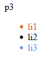

# 1.CSS

## 学习路径

- 什么是CSS
- CSS快速入门
- **CSS选择器（重点+难点）**
- 美化网页（文字，阴影，超链接，渐变）
- 盒子模型
- 浮动
- 定位


## CSS

Cascading Style Sheet 层叠样式表

发展史

- CSS1.0  

- CSS2.0   **div（块）+CSS，HTML和CSS结构分离的思想**，网页变得简单

- CSS2.1  浮动，定位

- CSS3.0  圆角，阴影，动画


# 2.快速入门

创建文件，尽量使CSS和HTML分离，CSS单独成一个文件夹


```html
!DOCTYPE html>
<html lang="en">
<head>
    <meta charset="UTF-8">
    <title>Title</title>

<!--    尽量在head上写
        <style>
        语法：
            选择器{
            声明1;
            声明2;
            声明3;
            }
            尽量使用CSS文件引用
        -->
    <link rel="stylesheet" href="css/css.css">
</head>
<body>
<h1>hello</h1>
</body>
</html>
```

CSS：不用写style标签，直接写内容

```css
h1{
    color: coral;
}
```


## CSS和分离的优势

1. 内容和表现分离，加载网页效率高
2. 网页结构清晰，可以实现复用
3. 样式十分丰富

4. 利于SEO，容易被搜索引擎收录

## 三种导入方式

三种方式

- 行内样式

  标签内的style属性

- 内部样式

  style标签

- 外部样式

  - link标签导入
  - style标签内@import
  - 两个导入方式第一种更好，和html文件一起加载

### 优先级：

三种方式**行内样式的优先级最高**，内部样式和外部样式取决于谁**最后生效**

```html
<head>
    <meta charset="UTF-8">
    <title>Title</title>

    <!--2.内部样式-->
    <style>
        h1{
            color: black;
        }
    </style>

    <!--3.外部样式-->
    <link rel="stylesheet" href="css/css.css">
    <style>
        @import "css/css.css";
    </style>

</head>
<body>
<h1>hello</h1>


<!--1.行内样式,在标签原书中编写一个style属性-->
<h1 style="color: cornflowerblue">blue</h1>
</body>
```


# 3.选择器

作用：选择页面上的某个或某一类元素


## 基本选择器

### 1.标签选择器

选择所有该标签

```html
<!--  标签选择器，选择所有h1标签
        -->
   <style>
        h1{
            color: cornsilk;
            background: lawngreen;
            border-radius: 24px;
        }
        p{
            color: red;
        }
    </style>
```


### 类选择器：

可以将多个不同标签归为同一个class，可以复用

```html
/*       类选择器的格式  .class的名称
        优点：可以将多个不同标签归为同一个class，可以复用*/
        .c1{
            color: green;
        }
        .c2{
            color:blue;
            font-size: 20px;
        }
        .p1{
            color:red;
        }
    </style>
</head>
<body>
<h1 class="c1">hello</h1>
<h1 class="c2">hello2</h1>
<p class="c1">hh</p>
```


### id选择器

id不能复用，全局唯一

```html
<style>
/*        id选择器的格式
            #id名称
            id不能复用，全局唯一*/
        /*id选择器*/
        #ih1{	
            color: cyan;
        }
    </style>
</head>
<body>

<h1 id="ih1">hello</h1>
```


### 优先级

**前提**：如果有重复属性

**id>class>标签**

```html
<style>
/*        id选择器的格式
            #id名称
            id不能复用，全局唯一*/
        /*id选择器*/
        #ih1{
            color: cyan;
        }

        /*class选择器*/
        .ch1{
            color: #40e37c;
            font-size: 20px;
        }

        /*h1标签选择器*/
        h1{
            color: #ff5bf3;
        }
    /*    事实证明：如果有重复属性，id选择器的优先级最高，class次之，标签最后*/
    </style>
</head>
<body>

<h1 id="ih1" class="ch1">hello</h1>
<h1 id="h2" class="ch1">hello2</h1>
<p class="ch1">hh</p>
```


## 2.层次选择器

优先级都是谁最后，谁生效

**结构图**：

```html
<body>
<p>p1</p>
<p>p2</p>
<p>p3</p>
<ul>
    <li>
        <p>p4</p>
    </li>
    <li>
        <p>p5</p>
    </li>
    <li>
        <p>p6</p>
    </li>
</ul>
</body>
```


### 后代选择器

某个元素所有子孙

```html
<style>
/*后代选择器,空格隔开，body下的所有p标签*/
        body p{
            color: cornflowerblue;
        }
    </style>
```


### 子选择器

只有子代有效果

```html
<style>
/*后代选择器,空格隔开，body下的所有p标签*/
        /*body p{
            color: cornflowerblue;
        }*/
        /*子代选择器，用>隔开，只有第一代有效果*/
        body>p{
            color: coral;
        }
    </style>
```


### 相邻兄弟选择器

同辈的下一个

```html
<style>
    /*相邻兄弟选择器 用 + 隔开，只有一个：下一个同代兄弟*/
        #po + p{
            color: darkcyan;
        }
    </style>

<p id="po">p0</p>
```


### 通用选择器

同辈的下面所有

```html
<style>
/*    通用选择器  ~,选择向下的所有兄弟*/
        #po~p{
            color: cornflowerblue;
        }
    </style>
```


## 3.结构伪类选择器

当前元素下的选择

```html
<style>
/*ul的第一个子元素*/
        ul li:first-child{
            color: chocolate;
        }
        /*ul的最后一个子元素*/
        ul li:last-child{
            color: cornflowerblue;
        }
</style>
```



回到父级元素下的选择

```html
<style>
/*选中p1：定位到父元素，选择第二个元素
         选择当前p(每个结构)元素的父级元素，选中父级元素下的第二个元素，并且这个元素必须是p元素，否则无效*/
        P:nth-child(3){
            color: darkred;
        }
    </style>
```


```html
<style>
/*选择父元素下第二个该类型的元素*/
        p:nth-of-type(2){
            background: lightcoral;
        }
    </style>
```


## 4.属性选择器（常用）

功能强大，支持正则表达式

id+class

```html
<style>
/*存在xx属性的元素     a[xx]
            a[id] a标签中存在id属性的元素*/
        a[id]{
            background: yellow;
        }
        /*a[id=]选中id= 的元素*/
        a[id=a2]{
            background: black;
        }
        /*选中class中含有t的元素*/
        a[class*="t"]{
            background: blue;
        }
        /*选中href中以id开头的元素*/
        a[href^=id]{
            background: white;
        }
        /*选中以html结尾的元素*/
        a[href$=ml]{
            background: red;
        }
    </style>
```

```
正则表达式通配符
=   绝对等于
*=	含有
^=	开头含有
$=	结尾含有
```


# 4.美化网页元素

## span标签：

重点要突出的字，用span套起来，约定俗成

```html
<style>
        #title{
            font-size: 100px;
        }
    </style>
</head>
<body>

欢迎访问
<span id="title">HTML</span>
```


## 字体样式

```html
<style>
        /*  font: 字体风格
            font-family 字体
           font-size 大小
           font-weight 粗细
           color 颜色*/
        body{
            font-family:"Ping Hei" ;
        }
        h1{
            font-size: 50px;
            color: red;
        }
        p{
            font-weight: 100;
        }
    </style>
```


## 文本样式

```html
<style>/*颜色 RGB   0-F
             #FFFFFF
               RGBA  透明度

          text-align:center 排版文字居中
          text-indent:2em  首行缩进
          line-height      行高和高度一样就会使文字上下居中
          text-decoration:underline   下划线
                          line-through 中划线
          */
        h1{
            color : rgba(0,255,255,0.8);
            text-align: center;
            text-decoration: line-through;
        }
        p{
            text-indent:2em;
            text-decoration: underline;
        }
    </style>
```


## 超链接伪类

```html
<style>
        body{
            font-family: "Ping Hei";
            font-weight: normal;
        }
        #title{
            text-decoration: none;
        }
        /*悬浮的样式*/
        #title:hover{
            color: red;
        }
        /*激活的状态*/
        #title:active{
            font-size: 100px;
            color: forestgreen;
        }
        /*阴影
            水平偏移，垂直偏移*/
        #money{
            text-shadow:#ff5bf3 5px 5px ;
        }

    </style>
```

```html
<body>

<p>
    
</p>
<a id="title" href="#">java核心卷1</a>
<p id="money">$30</p>

</body>
```


## 列表

类似与京东左边的列表

```html
/*将标题和列表放在一个div容器中*/
#nav{
    width: 300px;
    background: #e44ce3;
}
h1{
    font-size: medium;
    font-weight: bolder;
    text-indent: 2em;
    line-height: 60px;
    background: chocolate;
}
/*发现标题和列表中间有一条白色，就在div中也设置背景颜色，那么就可以去掉ul的背景颜色了*/
ul{
    /*background: #e44ce3;*/
}

ul li{
    margin-block: 20px;
    /*去掉列表前面的小圆点*/
    list-style: none;
}
a:hover{
    color: red;
}
a{
    text-decoration: none;
    color: black;
}
```

```html
<body>

<div id="nav">
    <h1>京东</h1>
    <ul>
        <li>
            <a href="//baby.jd.com">母婴</a>
            <a href="//toy.jd.com/">玩具乐器</a>
        </li>
        <li>
            <a href="//food.jd.com/">食品</a>
            <a href="//jiu.jd.com">酒类</a>
            <a href="//fresh.jd.com">生鲜</a>
            <a href="//china.jd.com">特产</a>
        </li>
        <li>
            <a href="//book.jd.com/">图书</a>
            <a href="//mvd.jd.com/">文娱</a>
            <a href="//education.jd.com">教育</a>
            <a href="//e.jd.com/ebook.html">电子书</a>
        </li>

    </ul>
</div>
</body>
```

