# HTML

## 介绍

- HTML:Hyper Text Markup Language   **超文本标记语言**

- **目前最新版本HTML5**：提供了新元素和新特性，使用页面实现动态渲染图像，图标，动画等，以及不需要安装任何插件直接播放视频（淘汰了flash）

- 所有浏览器支持HTML5，实现跨平台
- W3C：World Wide Web Consortium 万维网联盟，Web技术最具权威的中立性技术标准机构
- **W3C标准**包括
  - 结构化标准语言（HTML,XML）
  - 表现标准语言（CSS）
  - 行为标准（DOM,ECMAScript）


# 标签

```html
<!DOCTYPE html>
<html lang="en">
<head>
    <meta charset="UTF-8">
    <title>Title</title>
</head>
<body>

</body>
</html>

```

## 注释

```html
<!-- xxxx-->
```


## 规范

使用的规范（默认html5，可以不写）

```html
<!DOCTYPE html>
```


## html标签

​	所有html内容写在这个标签内，卸载标签之外的不展示


## head标签

网站的标题

 **一定需要包含<title>标签**

### title标签

用于设置页面的标题

```
<title> Title </title>
```


### meta标签

用来描述我们网站的一些信息

一般用来作SEO

```html
<meta charset="UTF-8">
    <meta name="name" content="YZY">
    <meta name="sex" content="man">
```


## body标签

代表网站的主体，想要编写的内容都在body里面，可以直接写内容


### h标签

h1最大，h6最小

```html
<h1>这是标题 1</h1>
<h2>这是标题 2</h2>
<h3>这是标题 3</h3>
<h4>这是标题 4</h4>
<h5>这是标题 5</h5>
<h6>这是标题 6</h6>
```

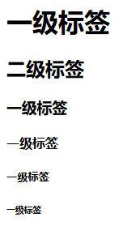

### p段落标签

内容里的是一段落

```html
<p>hhhh</p>
<p>h2h</p>
<p>h2h</p>
<p>h2h</p>
```

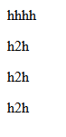

### br换行标签

即使换行**还是一个段落**，距离比p紧凑

```
<br/>
```

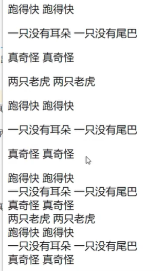

### hr水平线标签

```
<hr/>
```

### 字体标签

不要使用h标签来改变字体大小

```
<!--粗体斜体-->
<strong>粗体</strong>
    <em>斜体</em>
```

### 特殊符号

```html
<!--特殊符号-->
空             格：即使中间有很多个空格，还是只显示一个<br/>
空&nbsp;&nbsp;&nbsp;&nbsp;&nbsp;&nbsp;&nbsp;&nbsp;&nbsp;&nbsp;&nbsp;&nbsp;格
```

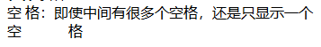

```
&gt;大于<br/>
    &lt;小于<br/>
```

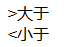

### 图像标签

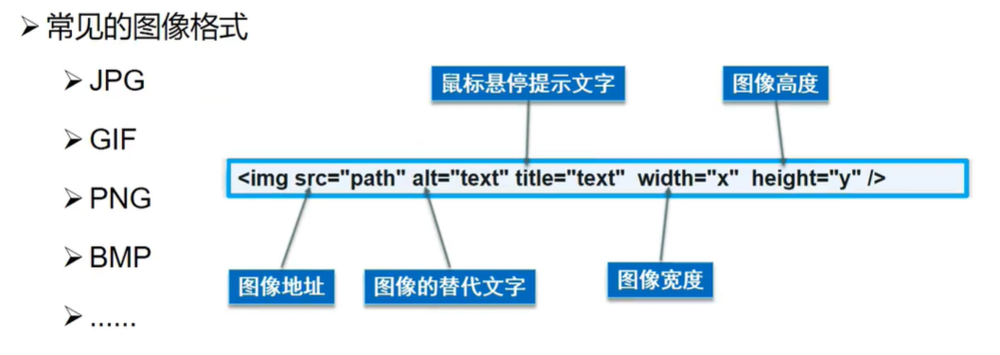

### a链接标签

```html
<a href="图像标签.html">图片</a>
<!--也可以使用图片点击  ，target="_blank" 新标签页打开-->
<a href="图像标签.html" target="_blank"></a>
```

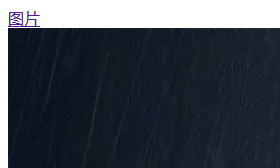

```html
<!--锚链接-
       1.需要一个锚标记
       使用name标记
       2.跳转到标记-->
<!---->
<a name="top">顶部</a>
<a href="#top">回到顶部</a>
```

### 列表标签

```html
<!--ol：olderlist有序列表 ul无序 ，dl自定列表-->
<ol>
    <li>1</li>
    <li>2</li>
    <li>3</li>
</ol>
    <ul>
        <li>1</li>
        <li>2</li>
        <li>3</li>
    </ul>
<dl>
    <dt>标题</dt>
    <dd>1</dd>
    <dd>1</dd>
    <dd>1</dd>
    <dd>1</dd>
</dl>
```

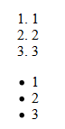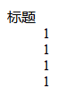


### 表格标签

```html
<!--表格
 行 tr
 列 td-->
<table border="1px">
    <tr>
<!--        clospan跨列-->
<!--        rowspan;跨行-->
        <td rowspan="2">1-1</td>
        <td>1-2</td>
        <td>1-3</td>
        <td>1-4</td>
        <td>1-5</td>
    </tr>
    <tr>
        <td>2-2</td>
        <td>2-3</td>
        <td>2-4</td>
        <td>2-5</td>
    </tr>
    <tr>
        <td colspan="5">3-1</td>
    </tr>
```

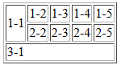

# 页面结构

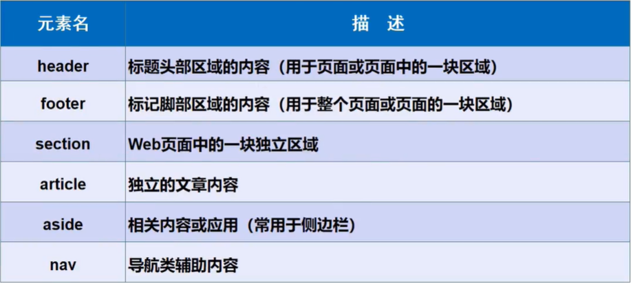

```html
<header><h2>网页头部</h2></header>

<nav>导航条</nav>

<section>
    <h2>网页主体</h2>
</section>

<footer>网页脚部</footer>
```

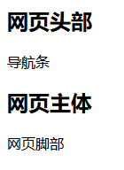

# iframe 内联框架

可以再页面内嵌套其他页面

```html
<!--iframe
    src 链接
    border：边框-->

<iframe src="https://www.w3school.com.cn/tags/html_ref_byfunc.asp"frameborder="0" width="1000px" height="1000px"/>

```

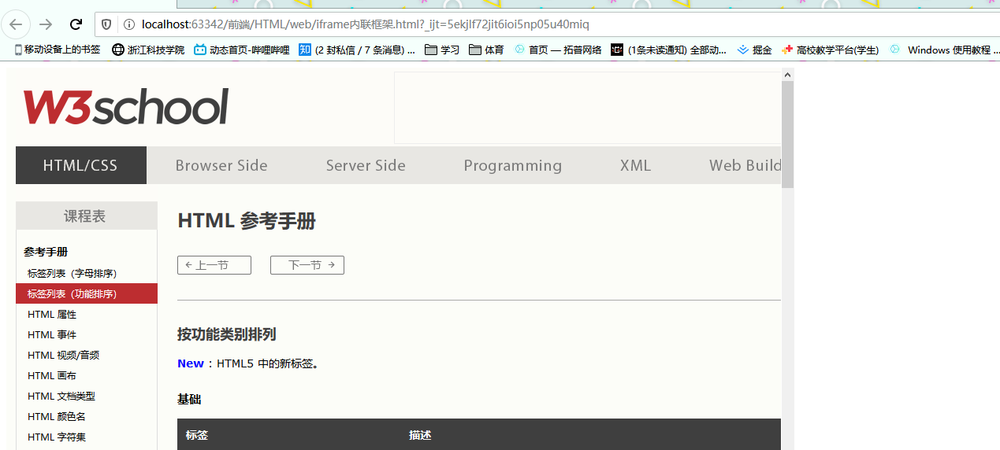


还可以通过点击来出现网页

```html
<iframe name="w3school" src="" frameborder="0" width="1000px" height="800px"></iframe>
<!--把href的目标地点放到ifram框架上，iframe会跳转到指定页面-->
<a href="https://www.w3school.com.cn/tags/html_ref_byfunc.asp" target="w3school">打开页面</a>
```

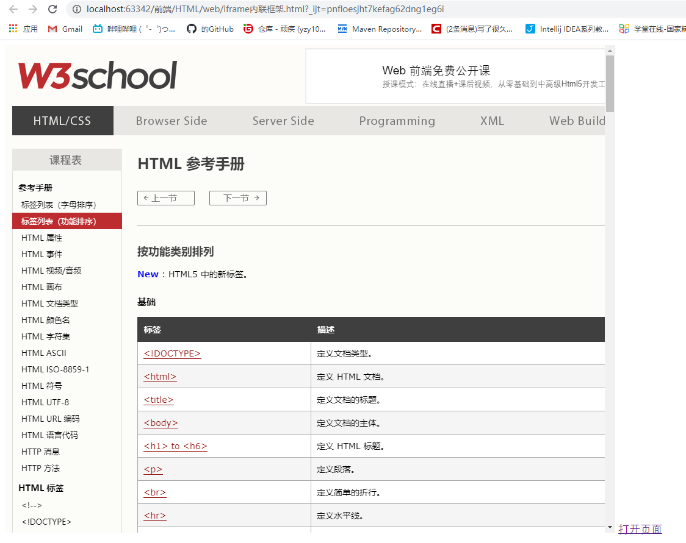

# 表单

```html
<!-- form表单
    action 表单提交到何处
    method：使用什么方式，GET POST
    Get是不安全的，数据被放在请求的URL中,但是效率高；Post的所有操作不可见。
    Get传送的数据量较小，因为受URL长度限制；Post传送的数据量较大，一般被默认为不受限制-->
<form action="iframe内联框架.html" method="post">
  <p> 用户名  <input type="text" name="un"></p>
  <p>密码<input type="password" name="psw"></p>
    <p><input type="submit" value="提交">
        <input type="reset"value="重置"> </p>
</form>
```

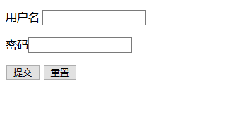

```html
<p>性别
        <input type="radio" value="man" name="sex" checked>男
        <input type="radio" value="woman" name="sex">女
    </p>

    <p>多选框
    <input type="checkbox" value="sleep" name="checkbox">睡觉
    <input type="checkbox" value="eat" name="checkbox">吃 </p>

    <p>按钮
<!--        button按钮需要使用js添加动作-->
        <input type="button" value="点击变长">
<!--        图片也可以成为按钮-->
        <input type="image" src="static/1.png">
    </p>
```

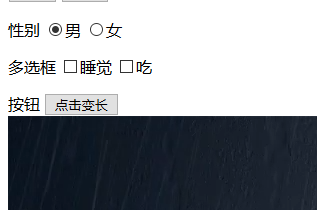

```html
<p> 下拉框
        <select name="listname">
            <option value="zg">zg</option>
            <option value="mg" selected>mg</option>
        </select>
    </p>
    <p>
        文本域
        <textarea name="text" cols="60" rows="10">texxt</textarea>
    </p>
    <p>
        文件域
        <input type="file" name="file">
        <input type="button" value="上传">
    </p>
```

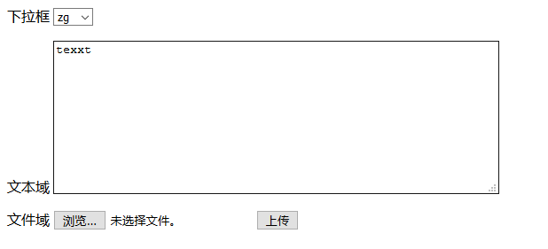

```html
<p>
        数字：
        <input type="number" name="num" min="2" max="20" step="1">
    </p>
    <p>
        滑块:
        <input type="range" name="voice" min="0" max="10">
    </p>
    <p>
        搜索框:
        <input type="search" name="search">
    </p>
```

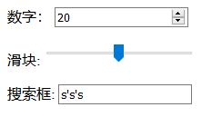

## 表单初级验证

- placeholder 提示信息
- required 非空
- patter 正则表达式