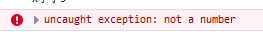

# JavaScript

## 什么是JavaScript

 JavaScript 的正式名称是 "[ECMAScript](https://baike.sogou.com/lemma/ShowInnerLink.htm?lemmaId=47277627&ss_c=ssc.citiao.link)" 

 JavaScript最初的确是受Java启发而开始设计的 ， 但是实际上，JavaScript的主要设计原则源自Self和Scheme，**它与Java本质上是不同的** 

# 快速入门

## 引入js

内部标签

```html
<!--内部标签-->
    <script>

    </script>
```


外部引入

```html
<!--外部引入-->
    <script src="引入.js"></script>
```


## 基本语法

定义所有变量都用var，比Java简单多了

```js
		var a = 1;
        var b = "aaa";
        var c = false;
        var d = {"name":"yzy"}
```

显示数据的方式

1.弹窗

第一个弹出，此时控制台还没有打印数据

```js
 /*弹窗*/
        alert(a);
```


2.控制台打印

```js
 /*在页面consolo打印变量*/
        console.log(a);
        console.log(b);
        console.log(c);
        console.log(d);
```


## 浏览器调试

**element**：参看html代码和css样式

**consolo**：打印信息和编写代码

**Source**：打断点debugger

**network**：查看网络请求

**application**：浏览器存储的信息


# 数据类型

## typeof查看数据类型

```js
console.log(typeof 100);
        var name = "尹振宇";
        console.log(typeof name);
```


## 常量

```js
 //常量需要使用const定义，不可改变,必须有初始值,命名最好是用大写和下划线
        const PI = 3.14;
        console.log(PI);

        // 常量和变量的区别：常量必须有初值，切不可被改变
        //                 变量可以没有初值且可以被改变
        //
        // 常量和字面量的区别：均不会被改变，常量为储存数值的容器，字面量为数值；
```

### 常量和变量的区别

- **常量必须有初值**，切**不可被改变**
- 变量可以没有初值且可以被改变
- 常量和字面量的区别：均不会被改变，常量为储存数值的容器，字面量为数值；

## number

包含

- 整数
- 浮点数
- 科学计数法
- 负数
- **NaN**：非法数值
- **Infinity**：无限大

```js
// number最大值Number.MAX_VALUE
        console.log(Number.MAX_VALUE);  //1.7976931348623157e+308
        //       最小值Number.MIN_VALUE
        console.log(Number.MIN_VALUE);  //5e-324
        //       无穷大 Infinity  Number.MAX_VALUE + Number.MIN_VALUE
        console.log(typeof Infinity);   //number
        //       无穷小 -Infinity
        console.log(typeof -Infinity);  //number

        //NaN非法数字Not A Number
        var num = NaN;
        console.log(typeof NaN);//number

        //浮点数运算可能失去精度
```


## 字符串

字符串可以使用是**单引**号或和**双引号**

```js
var name = 'yzy';
var name1 = "yzy";
```

相同引号不能嵌套，**不同引号可以嵌套**

```js
var name2 = "yzy's'";
```

可以使用``进行多行编写、

```js
var string = `name
        ss
        asfdaf
        asdasd`;
```

**模板字符串**，支持在字符串里EL表达式

```js
var mb = `name,${name}`;
        console.log(mb);  //name,yzy
```


字符串的==属性==：

- 字符串的**长度**，且它的值不会变

```
string.length
```

- 大小写转换，**这个是方法不是属性**

```
mb.toUpperCase();  //"NAME,YZY"
```

- 索引某个字母的下标indexof

```
mb.indexOf("m");    //2
```

- 截取

```
/*截取，包含前面不包含后面*/
        mb.substring(2,5);  //"me,"
```


## boolean

```js
		var bool1 = true;
        var bool2 = false;
```

- **数值**：任何非零数值都是true，只有0和NaN是false

```js
		var bool3 = Boolean(0);
        var bool4 = Boolean(Number.MAX_VALUE);
        console.log(bool5);     //true
        console.log(bool6);     //false
```

- **字符串**：任何非空字符串都是true，只有空字符串是false

```js
		var bool5 = Boolean('sdasdas');
        var bool6 = Boolean('');
        console.log(bool5);		
        console.log(bool6);
```

- **对象**：任何对象都是true，只有null和undefined是false

```js
        var bool7 = Boolean(null);
        var bool8 = Boolean(undefined);
        console.log(bool7);         //false
        console.log(bool8);         //false
```


## Undefine和null

- **Undefined**：表示变量未赋值，这种类型只有一种值就是undefined

  - **undefined**是Undefined类型的字面量，typeof对没有初始化和没有生命的变量都会返回undefined

  ```js
  		var ll;
          console.log(typeof ll);        //undefined
          var k = undefined;
          console.log(typeof k);          //undefined
  ```

  

- **null**：表示的是一个空的对象，所以**typeof会返回Object**

## 数组[]

一系列**对象**（可以不是同一类型）

Java必须是同一类型

```js
		var array = [1,2,45,"name"];
        console.log(array)     //Array(4) [ 1, 2, 45, "name" ]
		/*计数从0开始*/
        array[1];  //2
        
        
```

**数组的长度可以改变**

```js
 /*数组的长度可以改变，给length赋值*/
        //长度边长，多余的下标为empty，类型为undifined
        array.length = 10;
        console.log(array);   // Array(10) [ 1, 2, 45, "name", null, <5 empty slots> ]

    //    长度变短，会被截取，越界的类型也为undifined
        array.length = 2;
        console.log(array);   //Array [ 1, 2 ]
```

**indexof**,通过元素找到他的下标，有多个该元素时返回第一个

```js
array.indexOf(null);   //4
```

**slice()**，截取一部分返回型数组，类似String的substring

```js
array.slice(2,4);  //Array [ 45, "name" ]
```

**push,pop**：尾部操作

```js
		/*push 和 pop尾部压入和弹出*/
	array.push(1,1,1)   //Array(8) [ 1, 2, 45, "name", null, 1, 1, 1 ]
        array.pop()         //[ 1, 2, 45, "name", null, 1, 1 ]
```

**unshift，shift**：头部操作

```js
        /*unshift和shift 头部压入和弹出*/
array.unshift("a",4); //Array(11) [ "a", 4, 1, 2, 45, "name", null, 1, 1, 1, … ]
array.shift();           //Array(11) [  4, 1, 2, 45, "name", null, 1, 1, 1, … ]
```

**sort**：排序

```js
Array.sort();           //Array(10) [ 1, 1, 1, 1, 2, 2, 4, 45, "name", null ]
```

**reverse** ： 翻转

```js
 array.reverse();        //Array(10) [ null, "name", 45, 4, 2, 2, 1, 1, 1, 1 ]
```

**concat** 添加返回新数组，原数组保持不变

```js
array.concat(1,2); // Array(12) [ null, "name", 45, 4, 2, 2, 1, 1, 1, 1, 1 , 2 ]
console.log(array);;      //Array(10) [ null, "name", 45, 4, 2, 2, 1, 1, 1, 1 ]
```

join ： 打印拼接数组

```js
array.join("--");       //"--name--45--4--2--2--1--1--1--1"
```


如果**越界**，结果为undefined

```js
array[5];   //undefined
```

## 对象{}

相当于java的类，中间用**逗号隔开**，若干个键值对

```js
/*相当于java中的类，Person person = new Person("yzy",21,"man")*/
	var person = {
            name:"yzy",
            age:21,
            sex:"man"
        }
        console.log(person.name);
```

对象可以**赋值**

```js
person.age;      //21
        person.age = 22;    
        person.age;     //22
```

不存在的对象属性**不会报错**，显示undifined

**动态增删属性**

```js
 person.hh = "hh";
        person;         //Object { name: "yzy", age: 22, sex: "man", hh: "hh" }
        delete person.hh
        person          //Object { name: "yzy", age: 22, sex: "man" }
```

**判断是否有该属性**

```js
/*判断是否有该属性,属性名是字符串，要加上引号（单双都行）*/
        'age' in person;;       //true
/*这个对象没有，但是他父类__proto__有*/
        'toString' in person;       // true
```

判断对象本身是否有该属性

```js
person.hasOwnProperty('age');       //true
        person.hasOwnProperty('toString');  //false
```


## Map 和 Set

ES6的新特性

```js
/*本来多个书籍应该这么写*/
        var name = ["yzy","yy","hc"];
        var score = [10,12,5];
        /*用Map*/
        var map = new Map([["yzy",10],["yy",12],["hc",5]])
        var sc = map.get('yzy');
        console.log(sc);   //10

/*      动态新增数据*/
        map.set('ss',100);      //  Map(4) { yzy → 10, yy → 12, hc → 5, ss → 100 }
		/*删除数据*/
        map.delete("ss");       // Map(3) { yzy → 10, yy → 12, hc → 5 }
```

**set**:**无序不重复**的集合

```js
/*set*/
        var set = new Set([3,1,2,5,3,2,1])
        /*发现多余的数值都不显示*/
        console.log(set);       //Set(4) [ 3, 1, 2, 5 ]

		set.add(7);              //Set(5) [ 3, 1, 2, 5, 7 ]
        /*判断是否有该元素*/
        set.has(1);         //true
```

**遍历集合** for()of map)

```js
/*      遍历集合中的键值对*/
        for(var x of map){
            console.log(x)      //Array [ "yzy", 10 ]       Array [ "yy", 12 ]      Array [ "hc", 5 ]
        }
/*遍历Set集合中的元素*/
        for(var y of set){
            console.log(y);             //3,1,2,5,7
        }
```


# 运算符

## 逻辑运算

- && 两个都为真，结果为真，否则为假
- ||一个及以上为真，结果为证
- ！结果相反


## 比较运算符

- =  赋值

```js
var a = 10
```

- ==  等于（类型不一样，值一样，也是true）

```js
/*数值*/
        var a = 10
        /*字符串*/
        var b = "10"
        console.log(a==b)   //  true
```

- === 绝对等于（类型一样值一样）

```js
	/*数值*/
        var a = 10
        /*字符串*/
        var b = "10"
        console.log(a === b);   //false
```

### 注意点

JS的一个缺陷，所以要**使用===**

- NaN 不等于自己

```js
NaN === NaN    // false
/*要判断是否为NaN，使用方法isNaN()*/
        isNaN(NaN)      //true
```

- **会有精度损失**

```js
(1/3 === 1-2/3)     //false
```

尽量避免浮点数运算

## 严格模式

前提，支持es6语法

会扫描全局变量，如果没有改变量就会报错

```
'use strict'	
```


# 流程控制

和java没区别

## if

```js
var tt = 10;
    if(tt>1){
        console.log(1);             //1
    }
```

## while循环

```js
 while(tt<15){
        tt++;
        console.log(tt);      //11,12,13,14,15
    }
```

## for循环

```js
for(var i = 0;i < 5; i++){
       console.log(i);      //0,1,2,3,4
   }
```

## foreach数组循环

```js
var array = [1,2,3,4,2,3];
    //第一种方法，写函数
    array.forEach(function (value) {
        console.log(value);
    })
//    第二种方法,遍历下标
    for (var number in array){
        console.log(array[number]);
    }
```


# 函数

## 定义函数

```js
 /*定义函数方式1*/
    function f1(x) {
        if(x>=5){
            console.log("x大于等于5");
        }else
            console.log("x小于5");
    }
    f1(6);       //x大于等于5

    /*定义函数方式2*/
    var f2 = function(x){
        if(x>=5){
            console.log("x大于等于5");
        }else
            console.log("x小于5");
    }
    f2(4);          //x小于5
```


在函数里可以判断并且抛出异常

```js
 var f2 = function(x){
        /*可以手动抛出异常*/
        if(typeof x!=="number"){
            throw "not a number";
        }
        }
```



