# 一.计算机网络组成

> 内容

- 主机

- 因特网网络提供商ISP

  一个由多段通信链路和多台交换机组成的网络

  - 通信链路
  - 分组交换机
  - 运行IP协议


主机之间相当于仓库,主机间相互传送数据相当于送货物,一个货物分成多辆卡车,分组类似卡车,通信链路类似高速路,分组交换机类似于交叉口


> 路径

一个分组经历一系列的通信链路和分组交换机


## 因特网边缘


###　主机(端系统)

> 含义

与因特网相连的所有设备,处于网络边缘


> 主机之间怎么连接

通过**通信链路和分组交换机**连接到一起,即接入网


>  分成两种类型

- 客户
- 服务器:数据中心


###　接入网

指端系统物理连接到其边缘路由器的网络

>  边缘路由器

连接到其他远程端系统**路径**上的接触到的第一台路由器

- 家庭接入

  ​    	**主流**:

  - 数字用户线

    - 从本地电话公司获得**DSL因特网**接入,与电话线共用
    - 距离短:5-10英里

  - 电缆

    - 从有线电视公司获得**电缆因特网**接入,与电视线共用
    - 共享广播媒体,使用的人多时速率大大降低

    **高速**:

  - 光纤FTTH

    从本地中心局到每户设置一根光纤(其实是许多家庭共享),接近家庭时分出一根光纤分支到家庭

    - 有源光纤网络AON
    - 无源光纤网络PON

- 企业(和家庭)接入:

  使用**局域网LAN**连接边缘路由器

  - 以太网接入

    - 距离近:5-10米

    - 用户通过一个接入点发送接受分组,这个接入点与企业网连接(有线以太网),企业网与有限因特网连接.

- 广域无线接入:3G,4G,5G

  - 应用了和蜂窝移动电话相同的**无线基础设施**
  - 距离远:距离基站万米


###　通信链路

> 组成

由不同的物理媒体组成

不同的链路**传输速率**不同(单位bit/s,或bps)

#### 物理媒介

- 导引型媒体

  安装实际成本相当小

  - 光缆

    - 支持极高的比特速率,不受电磁干扰,用于长度导引型传输媒体

  - 双绞铜线

    - 电话机到本地电话交换机几乎全部使用该类型,两根绝缘的铜线螺旋排列

    - 无屏蔽双绞线

      用于建筑物内的计算机网络中,即局域网,**传输速率**取决于线的粗细以及两方之间的距离

  - 同轴电缆

    - 连接电缆电视和电缆调制解调器
    - 用作导引型共享媒体
      - 多个端系统能直接和该电缆连接,每个端系统都能接受其他端系统发送的内容

- 非导引型媒体

  - 无线局域网,数字卫星


## 网络核心

分组交换机和链路构成的网状网络

> 移动数据的两个基本方法

- 分组交换
  - 对转发的资源**不会预留缓存**,所以会**发生排队时延现象**
- 电路交换
  - 沿路预留资源给端系统发送的数据


###　分组交换机

**分组**：端系统发送数据时，将**数据分段**，并为每段加上**首部字节**．由此形成的信息包成为分组

将分组发送到目的地再装配成数据

**流程**：从**入通信链路**接受分组，从**出通信链路**转发分组，相当于一个中转站


一个分组交换机拥有多条繁忙的链路,因为它的作用就是将入分组送到出链路


#### 存储转发传输

**介绍**:多数分组交换机在链路的输入端使用存储转发传输

在交换机输出接受到的分组之前,必须接**收到完整的所有的该分组信息**,即先存储再转发


#### 输出缓存(输出队列)

**介绍**:**相对于每条链路**,分组交换机都具有输出缓存,用于**存储**路由器**准备发出的分组**

这在分组交换中起着==重要的作用==:如果那条链路正**繁忙**,必须在输出缓存中等待,产生**排队时延**

**排队时延**:取决于**网络的堵塞程度**,缓存大小有限,就会出现**丢包情况**


> 类型

- 路由器
  - 用于 网络核心中
- 链路层交换机
  - 用于接入网中


> 路由器怎么知道该往哪条路转发?

每一个端系统都拥有一个IP地址,,当源主机要发送分组时,**会在首部包含目标的IP地址**.

IP地址:类似于所在地址的分级制度.192.168.1.1.2  浙江省,杭州市,西湖区,留下街道,浙江科技学院

每个**路由器都有一张转发表**,将目标地址转化成输出链路.

**例子**

比如一个司机想从深圳到科技学院,司机会问加油站的一个员工,员工掏出转发表,对司机说上XX高速到杭州收费站,再去问那边的人

司机去了XX高速到了杭州收费站,问工作人员,工作人员看转发表,说走XX国道到西湖区,在那边问其他人.

司机到了西湖区,问路人看了看转发表,路人说走XX大道到留下街道

.....

最后到了科技学院


####　时延

==流程==:A路由器接受到上游节点传来的分组,**分析首部**决定它的出链路,并将其**导向对应的出链路**.如果该出链路**没有其他分组传输和排队**,就传输该分组,否则就**加入排队**

##### 在节点的时延类型

- 节点处理时延
  - 检查分组首部和决定将该分组导向对应出链路的时间
  - 其他因素:检查比特级别的差错
- 排队时延
  - 在出链路上等待传输的时间
  - 时间长短取决于等待的排队长度,链路的**传输速率**
- 传输时延
  - 以先到先服务的方式传输,仅当所有已经到达的分组被传输后,才能和传输刚到达的分组,即将所有分组传输所需要的时间
- 传播时延
  - **一个比特**从该链路起点到路由器B传播所需要的时间
  - **传播速率**取决于物理媒介,略小于光速
  - 时延:A-B路由器的距离除以传播速率
- 节点总时延
  - 上面所有时延的累加


#####　传输时延和传播时延的**区别**

- 传输时延是路由器推出分组所需要的时间,**取决于分组长度和传输速率**,与**两台路由器距离无关**,相当于车辆在高速收费站排队通过的时间
- 传播速率是比特从A到B路由器的时间:**取决与两台路由器的距离**,与**分组长度和传输速率无关**,相当于从一个收费站到另一个收费站行驶的时间

当传播速率比传输速率快(**传输时延大于传播时延**)时,就会发生堵塞(传输时延增加)


##### 排队时延

取决于**流量到达该队列的速率**,链路的**传输速率**和到达**流量的性质**

a是**分组到达队列**的平均速率(pkt/s,分组每秒),R是**传输速率**(bps,b/s),假设所有分组都是**L比特**

则**比特到达队列**的平均速率L* a bps,==流量强度==为 L*a /R

> 流量强度

**他在排队时延中起着重要作用**

- 当该强度大于1(比特到达的速率超过了传输出去速率,即越排人越多)
  - 排队时延就会无限增大.

- 当该强度小于等于1
  - 分组周期性到达,每个分组会到达空队列.不会有排队时延
  - 分组突发形式到达,可能会有很大的平均排队时延
  - 强度接近于0,平均排队时延接近于0

所以设计时流量强度不能大于1.


> 丢包

**排队容量是有限的**,流量强度接近于1,排队时延变大.当**时延等于排队容量**时,**队列就会满载**.新的分组到达时,该**分组就会被丢弃**

分组丢失的比例随着**流量强度增加而增加**.


##### 端对端时延

源主机到目的主机中间有N-1台路由器

d = N(d处理时延+d传播时延+d传输时延)


###　电路交换机

在端系统通信会话期间,会预留出通信所需要的资源。即在发送和接受之间必须留出资源形成一个两者之间的连接，这也是前提

**前提**：发送前，发送方和接收方会建立一条连接，沿途的交换机会持续维护该连接，预留恒定的传输速率，占用部分资源


>  复用

#### 频分复用FDM

为每条连接设置一个专用的频段，该**频段的宽度**即**带宽**


#### 时分复用

将时间划分为固定的帧，每一帧划分为固定数量的时隙。为连接指定一个时隙，这个时隙内用于传输数据


### 电路和分组的对比

- 分组交换
  - 提供更好的带宽共享，提高传输利用率
  - 简单有效，不需要建立连接，成本低
  - 网络不稳定，可能会产生延迟
- 电路交换
  - 每个连接的带宽固定，闲置可能会造成资源浪费
  - 需要预先建立端与端之间的连接，较为复杂
  - 网络稳定

分组交换的**性能优于**电路交换的性能,电路交换不考虑需求,预先分配传输链路的分配,分组交换按需分配

**趋势**:向着分组交换发展


### 吞吐量

> 检测计算机网络重要的性能测试

- 时延
- 丢包
- 端到端吞吐量

瞬时吞吐量：瞬时接收比特的速率

平均吞吐量：接受文件的所有比特除以所需时间


> 瓶颈链路

相当于木桶短板,取决于链路的传输速率.

端到端之间拥有多个链路,那么传输速率等于**最慢的那条链路的传输速率**

目前网络核心中的链路都具要超高速的传输链路,但是**受制于接入网**的低传输


### 网络结构

客户向提供商付费,提供商对客户提供服务

结构1:全球传输ISP(提供商),互联所有接入ISP(客户)

结构2:多个全球传输ISP互联(提供商们),互联所有接入ISP(客户)

结构3:多个全球传输ISP位于**顶层**,**中间**有很多个区域ISP(可能有多层区域ISP)**向下连接**接入ISP,**向上连接**多个全球传输ISP.**每一层的上下都是提供商-客户的关系**

结构4:在3的基础上增加了

- 存在点	PoP
  - 提供商网络中一个或多个路由器集群
- 多宿
  - 一个接入ISP可以和多个供应商ISP连接,拥有多个宿主,当一个供应商发生意外,也不会影响网络供应
- 对等
  - 两个统计之间的ISP可以直接了连在一起,,不通过上层的ISP作为中间层传输.不用付费
- 因特网交换点 IXP
  - 相当于对等的汇合点,多个同级ISP在这里一起对等

结构5:4的顶部增加**内容提供商网络**,例如谷歌.拥有多个数据中心,仅用于谷歌服务器的流量,可与第一层的接入ISP直接连接,或者是IXP

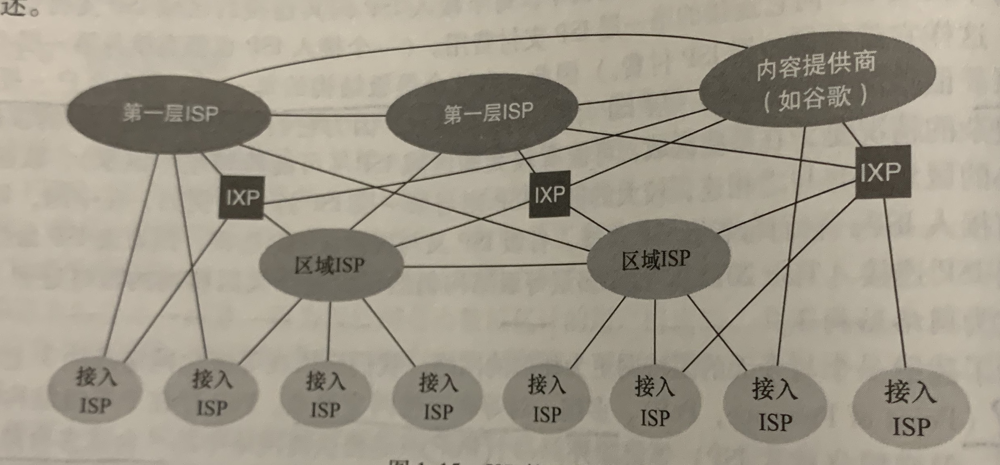

##　协议

> 什么是协议

定义了两个或多个通信实体之间交换的报文告示和顺序,以及报文发送和接收报文采取的动作


### 协议分层

分层的优势

- 简化系统提供模块话的服务
- 改变服务的实现而不影响系统的其他组件的分层
- 执行该分层的动作,使用直接下层的服务,向上层提供服务


以**分层**的方式组织协议.一个协议层能够用软件,硬件或两者结合来实现

> 协议栈:综合各层的所有协议

按自顶向下的顺序

- 应用层
  - **网络应用程序及他们的应用层协议**存留的地方
  - 包括**HTTP**(提供Web文档的请求和传送)
  - SMMP(提供电子有限报文的传输)
  - FTP(提供端系统之间的文件传送)
  - ==报文==:分布在多个端系统上,一个**端系统中的应用程序**使用协议与另一个交换的分组
- 运输层
  - 在**应用程序端点**之间**传送**应用层报文,**应用程序移动**
  - ==报文段==:运输层的分组
  - **TCP协议**
    - 提供**面向连接**的服务
    - 包括报文向目的地**确保传递**和**流量控制**(发送方和接收方的速率匹配)
    - 将长报文划分成**短报文**,并提供**拥塞控制机制**(但网络堵塞时,抑制传输速率)
  - **UDP协议**
    - 提供**无连接**的服务
    - 不提供不必要服务,没有可靠性,没有流量控制,没有堵塞控制
- 网络层(IP层)
  - 将**数据报**从一台主机移动到另一台主机,**主机间移动**
  - ==报文段==:网络层的分组
  - 运输层的TCP或者UDP协议向网络层递交**报文段和和目的地址**,就像寄信一样
  - **IP协议**
    - 定义了数据包中的各个字段,端系统和路由器怎么利用这些字段
    - 一个端只有一个IP,所有具有网络层的组件必须运行IP
  - 决定路由的路由协议
    - 根据路由将数据包传输到目的地
- 链路层
  - 将**帧**从一个节点移动到下一个节点,**节点间(主机或路由器)的移动**,**相当于网络层的交通工具**
  - ==帧==:链路层分组
  - 网络层将数据包**下传**到链路层,链路层**将数据包送到下一个节点**,再**上传**到网络层.(铁工具人!!!)
  - 数据包**从源到目的地**传送中通常需要**多条链路**,可能由**不同的链路层协议处理**
- 物理层
  - 将帧中的一个个比特从一个节点移动到另一个节点
  - 物理层协议:与实际媒介的运输协议,**不同的媒介移动比特的方式不同**


> 简版

- 应用层
  - 两个端系统的应用程序交换信息的分组为**报文**
- 运输层
  - 将**报文**划分成(短报文)报文段,**报文段**在应用程序端点之间传送,两者之间建立连接
- 网络层
  - 将**数据报(报文段+目的地址)**从一台主机移动到另一台主机,**依靠链路层移动**
- 链路层
  - 将**帧**从一个节点移动到另一个节点
- 物理层
  - 将**比特**一个个从节点移动到另一个节点


> 分组封装(首部字段+有效荷载字段)

**运输层报文段**封装了应用层报文(运输层首部信息)

- 允许运输层向上交付报文信息
- 判断报文是否途中改变信息

**网络层数据**报封装了运输层报文段(网络层首部信息)

- 源系统地址
- 目的地系统地址

**链路层帧**封装了网络层数据报(链路层首部信息)


> 交换机的协议层

链路交换机拥有链路层和物理层

路由器拥有网络层,链路层和物理层,能够使用IP协议


# 二.应用层


## 应用程序体系结构

1.**客户-服务器体系结构**

有一个总是打开的**主机**称为服务器,服务其他许多成为**客户**的请求,客户需以服务器为桥梁才能与其他客户通信

当请求过多时需要配备数据中心

两个==特征==

- **客户之间不直接通信**

- 服务器具有固定的,周知的地址

  

2.**P2P体系结构**

不需要数据中心,主机之间直接通信,称为对等方

目前流量密集型应用都是P2P结构,包括文件共享,协助下载,视频会议.

特征

- **自拓展性**
  - 每个对等方在分发文件时也为系统提供了服务能力,就不需要庞大的服务器.


## 进程通信

进行通信的实际上是进程而不是程序.

一个进程被认为是运行在端系统中的一个程序

- 在相同的端系统上
  - **多个进程之间可以互相通信**

- 在不同的端系统上
  - 跨越计算机网络**交换报文**实现通信
  - 发送进程生成并发送报文
  - 接受进程接受报文并回送进行响应


###　网络通信

网络应用程序由**成对的进程组成(分别在两个端系统上,一个发送和一个接收)**,这些进程通过网络相互发送报文.

在任一通信中,**成对的进程总有一个客户(发起通信)和服务器(等待联系)**

- *Web应用程序中*
  - 一个客户浏览器进程和一台服务器进程交换报文
  - 浏览器是**客户**,Web服务器是**服务器**

- *P2P中*
  - 文件从一个对等方的进程传输到另一个对等方的进程.
  - 文件下载的是**客户**,文件上传的是**服务器**


###　套接字

进程通过**套接字**的**软件接口**向网络发送和接受报文，相当于大门，报文需要通过大门进出应用程序

套接字是**应用层和运输层的接口**（送出门就被运输层接走了）

套接字是建立在网络应用程序的可编程接口，也称为**应用程序编程接口（ＡＰＩ）**


套接字**控制应用层**，但是几乎**无法影响运输层**(不是自己开车)

- 仅能选择运输层协议(出门选择什么交通工具)

- 设定几个运输层参数,路最大缓存和最大报文长度(大概相当于?有几个人?,有行李箱)

  


###　进程寻址

发送到指定进程，需要拥有**接受进程的地址**．

- 主机地址(IP地址)
- 主机中进程标识符(进程的套接字-端口号)

localhost:8080 主机地址(本机)+进程(端口号)


### 程序和进程的关系

进程是一个动态的实体,即一个活跃的程序,被放入系统调度队列中,有生命周期,**一个进程就是一个程序**

程序是一个静态的实体.**程序只有一个进程**


对用户来说,看似一个程序有多个进程,其实是很多个进程,进程都放在一个应用程序下,**多个进程合成一个整体成为应用程序**

当对于计算机来说,就是多个程序.


###　运输层服务


> 运输协议分类

- 可靠数据传输
  - 确保数据正确
  - 重要文件
- 吞吐量
  - 带宽敏感的应用
    - 特定速率确保提供可用吞吐量
    - 实时通讯
- 定时
  - 低时延
- 安全性
  - 加密
  - 数据完整
  - 端口鉴别


#### 因特网提供的运输服务TCP,UDP

1.**TCP**

- 面向连接服务
  - 报文交换之前进行**握手**，交换运输层控制信息
  - 握手后套接字之间**建立连接**，双全工，连接双方都可以发送接收
  - 结束交换报文需要**拆除连接**
- 可靠的数据传送服务
  - 无差错，按适当顺序
  - 按照发送方的相同字节流传输到接收方

**安全套接字SSL**是对TCP的加强,提供了**安全服务**


２.UDP

- 轻量级运输协议,提供最小服务
- 无连接,没有握手过程
- 不可靠
  - 不一定能到达,且乱序


## 应用层协议

定义了运行在不同端系统上的应用程序**如何相互传递报文**

- 交换的报文的**类型**,例如请求报文和响应报文
- 各种报文类型的**语法**,如报文各个字段的描述
- 字段的**语义**,即字段所包含的信息
- 确定**进程何时**及**如何发送报文**,对报文的响应


> Web

- **Web页面**:由对象组成,大部分含有一个HTML文件
- **对象**:一个文件,注入HTML文件,JPEG文件....,可通过URL寻址
- **URL**:由两部分组成,存放对象的**服务器主机名**和**对象路径名**
- **Web浏览器**:就是实现了HTTP的客户端
- **Web服务器**:就是实现了HTTP的服务端,用户存储Web对象


### HTTP

> 概念

Web的应用层协议是超文本传输协议(HyperText Transfer Protocol,HTTP)

使用**客户程序**和**服务器程序**在两个**不同的端系统**通过**交换报文**进行会话.

> 基本原理

**定义**了Web客户如何向Web服务端请求Web页面,Web服务端如何提供给客户Web页面,基本思想为客户请求一个Web页面,浏览器就向服务端发出了一个请求(得到所有该页面下的对象),服务端收到请求后响应


> 分层体系结构的优点

HTTP使用**TCP作为运输协议**.当客户和服务端建立连接之后,报文从套接字接口离开后**由TCP接管**,而TCP提供可靠的服务

==优点==:那么HTTP协议不担心数据丢失,也不关注TCP如何保证和故障恢复.


####　是无状态协议

服务器响应请求**不会存储该客户的状态信息**．即客户很短时间内再次发送相同的请求，服务器还是会响应该请求，所以称为**无状态协议**

**优点**:处理速度加快

**缺点**:无法获得之前的操作,影响交互性,后来的cookie和session用来弥补该缺点


#### 非持续性连接的HTTP

请求响应经**单独的TCP发送**,每个对象发送一个请求

> 流程:

请求一个Web网页,里面有10个JPG文件

1.建立TCP连接

2.客户发送HTTP请求

3.服务器接收请求,从存储器中检索出对象,在HTTP响应中封装对象,并发送给客户

4.服务端通知断开TCP断开连接(TCP确认客户收到响应才会断开)

5.客户收到相应,TCP链接关闭

6.重复上面前四个步骤9次


发现每个**TCP连接在服务端发送响应之后就断开**,只传输了一个请求报文和相应报文,因此建立10次TCP连接

> 往返时间

**往返时间RTT**:此歌端分组从客服端到服务端再返回客户端的时间

TCP三次握手:客服向服务端发送一个小TCP报文,服务器对这个做出确认和响应,这**两次握手占用了一个RTT的时间**,最后一次握手的同时发送HTTP请求,那么加上服务器响应也是一个**RTT时间**

即**非连续连接一**次发送和响应消耗**2个RTT时间加上服务器传输HTML的时间**

> 缺点

- 　每个请求都需要创建一个ＴＣＰ连接，负担严重，客户和服务器都要分配大量的ＴＣＰ缓冲区和保持ＴＣＰ连接
- 　两倍的ＲＴＴ时延


#### 持续性连接的HTTP

保持TCP连接打开

> 流程:

请求一个Web网页,里面有10个JPG

1.建立TCP连接

2.客户发送HTTP请求

3.服务器接收请求,从存储器中检索出对象,在HTTP响应中封装对象,并发送给客户

4.重复2,3操作9次

5.一段时间未使用,自动关闭连接


#### 报文格式

##### 请求报文

```
GET /somedir/page.html HTTP/1.1
Host: www.someschool.edu
Connection: close
User-agent: Mozilla/5.0
Accept-language: fr
```


第一行:**请求行**

- 方法字段
  - 请求方法,包括GET,POST,HEAD,PUT,DELETE
- URL字段
  - 
- HTTP版本字段
  - 1.1版本

2.4个**首部行**

- 2.Host: 指明主机
- 3.不要使用持续连接
- 4.用户代理,浏览器的类型,Mozilla/5.0 指firefox
- 5.用户想得到对象的发育版本(如果有),否则默认


3.最下面的**实体类**

- 是在**POST方法时才使用**
  - 如果是表单,**实体类里的就是表单字段中的输入值**
- 当GET时为空
  - 如果表单用的是**GET方法**,表单中的字段值加载了**URL**中


##### 响应报文

```
HTTP/1.1 200 OK
Connection: close
Date: Tue, 18 Aug 2015 15:44:44 GMT
Server: Apach/2.2.3 (centOS)
Last-Modified: Tue, 18 Aug 2015 15:11:03 GMT
Content-Length: 6821
Content-Tyoe: text/html

(data)
```


1.第一行**初始状态行**

- 协议版本字段
  - HTTP/1.1(一切正常,即已经找到并正在发送请求的对象)
- 状态码
  - 200 成功
  - 301 请求的对象被永久转移
  - 400 不能被服务器理解
  - 404 不存在
  - 505 服务器不支持该HTTP协议
- 相应的状态信息

2.6个首部行

- 2.**close**:发送完关闭该TCP连接
- 3.**Date**:服务器产生并**发送该报文**的日期和时间,
- 4.**Server**:发送报文的服务器的类型
- 5.**Last-Modified**:对象创建或最后修改的时间
- 6.Content-Length:被发送对象的字节数
- 7.Content-Type:对象的类型:HTML文本

3.实体类

- 报文的**主要部分**,包含了**请求对象本身**


#### cookie

HTTP是无状态的,那么一个Web网站希望识别用户,为此使用cookie.,它允许站点对用户进行跟踪

有四个组件

- HTTP响应报文中有一个cookie首部行
- HTTP请求报文中有一个cookie首部行
- 客户端系统汇总有一个cookie文件,由浏览器管理
- Web站点的后端数据库

> 流程

1.首次访问某网站,请求到达该网站后,会**生成一个唯一识别码**,存入数据库

2.网站发送**响应报文中首部行**包含了cookie:

```
set-cookie: 1678
```

3.用户接收到了响应报文,会添加到**浏览器管理的cookie文件中**(主机名和识别码)

4.当用户再次访问该网站,浏览器会**查询cookie文件抽取对应的识别码放入请求报文中的首部行**

```
cookie: 1678
```


#### Web缓存

也称代理服务器,能够代表初始Web'服务器来满足HTTP请求的**网络实体**,可以让HTTP请求首先指向缓存器

拥有自己的**磁盘空间**,用于**存储**最近请求的**对象的副本**


> 流程

1.与缓存器建立TCP连接,并向缓存器中的对象发送一个HTTP请求

2.缓存器检查是否有该对象的副本,**有就返回相应报文**

3.**没有**,缓存器就与该**对象的初始服务器**建立TCP连接并(缓存器)发送请求

4.缓存器接受响应报文并存储副本,向客户发送响应报文

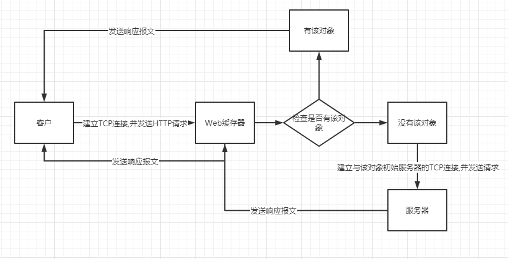


> 优点

1.高速,大大减少对客户请求的响应时间,特别是客户与服务器带宽远低于缓存器

2.减少服务器的接入链路,降低流量,改善性能

> 条件GET

缓存器中的副本可能已经**过时失效**了,HTTP有种机制允许缓存器验证对象是否为最新.条件GET

**满足条件**

- 使用GET 方法
  - 浏览器发送GET请求,缓存器会转发给服务器,服务器发送响应,缓存器缓存该对象及其最后修改的时间并转发给浏览器
- 请求报文中含有 首部行:"if-Modified-Since"
  - 该值为最后修改的日期
  - 告诉服务器该**对象在最后修改日期后被修改过**才**发送**对象
  - **否则只响应,**不发送对象,状态为304 Not Modified,表示缓存器可以使用存储的对象


### DNS

主机的**标识方法**

- 主机名(hostname):网址
  - 便于记忆
  - 提供的信息很少
- IP地址:
  - 长度固定
  - 有层次结构


> 介绍

DNS(域名系统)的作用就是**将主机名转化成IP地址**的目录服务

- 一个由分层的DNS服务器实现的**分布式数据库**
- 使得主机能够查询分布式数据库的**应用层协议**
  - 与其他协议一样是应用层协议的原因
    - 同样使用**C/S模式**
    - 端系统之间的通信通过**运输协议来传送DNS报文**
  - 区别
    - DNS不是直接与客户打交道,而是为了给其他应用程序提供转换的服务
    - 采用位于网络边缘的客户和服务器,实现关键名字到地址转换的功能

- 运行在**UDP**之上


> 简单流程

DNS通常是**由其他应用层协议使用**,用于将请求中的**服务器名转化成IP地址**

1.运行DNS应用的客户端

2.浏览器从URL中抽取出主机名,**传入DNS客户端**

3.DNS客户向DNS服务器**发送包含主机名的请求**

4.DNS客户**收到响应报文**含有主机的IP地址

5.浏览器接收到IP地址,向该地址80端口**发起一个TCP请求**


提供的服务

- 主机别名:主机别名比主机规范名更加容易记忆
- 邮箱服务器别名:
- 负载分配:DNS用于冗余的服务器
  - 一个主机名绑定一个IP地址集合(多个服务器有多个IP地址)
  - 对响应最快的IP地址发送HYYP请求


#### 服务器结构

需要服务的应用程序调用DNS,指明主机名发送到DNS服务器,DNS接收到响应报文转发到应用程序

1.DNS的一种简单设计是**集中式**,

缺点

- 单点故障:该服务器崩溃,因特网瘫痪
- 通信容量:处理所有DNS请求
- 远距离:严重时延
- 维护:存储大量数据


2.**分布式**

- 根DNS服务器
  - 客户最先和根服务器请求
  - 根服务器返回**顶级域服务器**的IP地址(响应报文)
- TLD顶级域DNS服务器
  - 客户第二次向顶级域请求
  - 顶级域(com,org,net,edu,gov,uk,fr.....)
  - 返回**权威服务器的IP地址**(响应)

- 权威DNS服务器
  - 客户第三次向权威服务器请求
  - 因特网上具有公共可访问主机的必须提供**DNS记录映射成IP地址**
  - 这个权威服务器可能属于**主机的机构**,也可能付费存储在**其他服务器**
- 本地DNS服务器(**不属于服务器层次结构**)
  - 每个ISP(居民区ISP或机构ISP)都有一个本地DNS服务器,与主机间隔不超过几台路由器
  - 作为代理,**主机**的请求**先发到本地服务器**,**转发**到**服务器层次结构**中
  - 每次接受响应报文都不转发给主机,而是**本地服务器继续操作**,**直到获得网站IP地址才转发到主机**
  - **拥有DNS缓存**:
    - **改善时延**性能和**减少**传输DNS报文**数量**
    - 接受DNS回答,会将其**存储在本地存储器**
      - 不是永久的,一段时间会丢弃
      - 该本地服务器下的其他主机短时间内查询直接返回结果

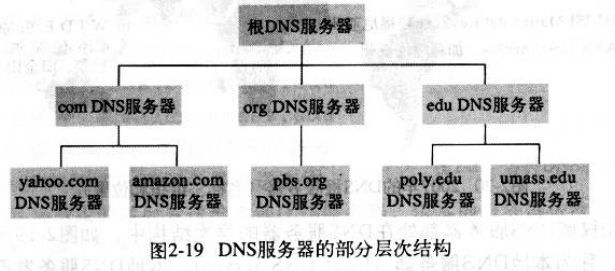


####　报文格式

1.首部区域:前12个字节

- 第一个字段:标识符:16比特的数
  - 用于标识该查询
  - 也会放到对应的回答报文
- 标志字段:若干标志
  - 报文类型:0/查询报文,1/回答报文
  - 是否为权威服务器(回答报文): "权威的"
  - 是否递归: "希望递归"/查询报文,"递归可用"/响应报文

2.问题区域:正在查询的信息

- 名字字段
  - 包含正在被查询的主机名
- 类型字段
  - 正在被询问的问题类型(类型A,类型NS)

3.回答区域

- 资源记录(RR)
  - 提供主机名到IP地址的映射,一个**回答报文包含至少一条**资源记录
  - (Name,Value,Type,TTL)(名称和值取决于类型,类型,记录生存时间 )
  - **Type**
    - Type=A,Name则为**主机名**,Value是**主机名对应的IP地址**
      - 类型为A,资源记录提供主机名到IP地址的映射
    - Type=NS,则Name为**域**,Value是该域下能够获得主机IP地址的**权威DNS主机名**
      - 类型为NS,用于沿着查询链路来路由DNS查询
    - Type=CNAME,Value是Name的**规范主机名**
      - 类型为CNAME,提供规范主机名
    - Type=MX,Value是Name的**邮件服务器的规范主机名**
    - 如果该服务器**是权威服务器,会包含一条该主机名的类型A记录**
    - 如果该服务器**不是权威服务器,那么包含一条NS记录,而且包含一条A记录**,value值为NS记录中value主机名的IP地址
      - 类型NS的值为权威服务器名
      - 类型A的值为对应的权威服务器的IP地址

- 包含其他权威服务器的记录

5.附加区域

- 其他有帮助的记录


#### 注册DNS

1.向注册登陆机构注册域名,提供基本和辅助权威服务器的名字和IP地址

2.对于这两个权威服务器的每一个,机构都需要将**类型NS和类型A的记录输入TLD顶级域服务器**,尤其是基本权威服务器,插入两条记录

```
(权威服务器名,基本主机名,NS)
(基本主机名,IP地址,A)
```

3.确保用于网站的类型A资源剧如和邮件的类型MX资源被输入到权威服务器中

4.其他人可以访问


> 详细流程

1.主机发送到**本地DNS服务器**

2.本地DNS服务器向TLD**发送查询**(如果没有缓存就从根目录开始查询)

3.TLD中包含了**类型NS和类型A的资源记录**,向本地发送**回答**

4.本地服务器接收到资源记录,通过类型A的资源记录向权威服务器IP请求

5.本地服务器得到相应转发给主机


> DNS的安全性

- 分布式拒绝服务DDoS
  - 向每个DNS根服务器发送大量分组,是大多合法DNS请求得不到回答
  - DNS根服务器拥有分组过滤器的保护,阻挡ICMPping报文,而且大多数用户的本地服务器拥有缓存,跳过了根服务器,使得影响不大
- 带宽洪泛攻击


# 三.运输层

> 介绍

运输层位于应用层和网络层之间，是分层的网络体系结构的重要部分．

为运行在不同主机上的应用程序之间提供**逻辑通信**

运输层**报文段**：

- 发送端
  - 将应用报文划**分成较小的块**，为每块加上**运输层首部**，然后将其**传递给网络层**，网络层只对网络层字段加工，不检查运输层字段
- 接收端
  - 网络层提取运输层报文段并上交给运输层，运输层接受报文段


##　运输层和网络层的关系

运输层位于网络层之上,网络层为主机间提供通信,运输层为应用程序之间提供通信.

> 例子

以搬家为例,老房子有a,b两个房间,需要搬到新家的A,B两个房间.叫来搬家公司,将所有东西搬到新家，再由我分别将东西放进房间

应用程序:房间

主机:房子

运输层协议：我，只在家里干活

网络层协议：搬家车，只在路上工作


我先将房间里的东西打包拿出来到门口（打包成报文段，运输层协议），放到搬家车上（交给网络层，网络层协议）．搬家车运到新家（网络层运输完成），将东西放到新家门口（网络层将报文段上交运输层），我再将东西放到对应的房间


网络层的协议是ＩＰ，服务模型是尽力而为交付，即不作任何保证（不确保交付，不确保按时，按序，完整交付）

**运输层的多路复用**与**多路分解**：运输层协议会将两个主机之间的服务**拓展**为主机上进程之间的服务．


## 多路复用和多路分解

>  怎样将报文段定向到对应的套接字(进程的标识)?

**多路复用**:发送端,从不同套接字收集数据块,并为之封装首部信息从而生成报文段

**多路分解**:接收端,报文段中具有几个**字段**,运输层检查这些字段,**标识出套接字**,进而正确**定向**套接字

 例子:

我从房间中整理出物品,打上标记(多路复用)

新家之后我将打上标记的物品分别放到对应的房间(多路分解)


> 实际工作

**多路复用**


要求

- 套接字有唯一标识
- 报文段有特殊字段来只是套接字
  - 源端口号字段
  - 目的端口号字段
  - 大小在0-65535,0-1023是周知端口号,受限制


UDP类似于上面的,而TCP更加复杂一点

TCP的套接字由**四元组**(源IP地址,源端口号,目的IP地址,目的端口号),需要使用全部四个值来定向,后续的报文段匹配这四个值就会到达该套接字,所以即使有两个不同的主机发送的**端口号一样**,也会分配到不同的套接字.


## UDP

运输协议做了最少的工作,分解复合和少量的差错检测外,几乎没有对IP增加其他东西

UDP的**报文段**很简单,用于复用/分解的源和目的端口号字段+2个其他小字段+数据

DNS通常使用UDP:

**优点**

- 不希望发送受到控制,不希望延迟发送,允许一些数据丢失
- 无需建立连接
  - 时延小
- 无连接状态
  - 不需要维护连接
- 首部开销小

**缺点**:

- 缺乏拥塞控制导致高丢包率,挤垮TCP会话
- 之恩能够检测差错,无法解决


### 报文段结构

1.首部只有四个字段,每个字段两个字节

- 源端口号
- 目的端口号
- 长度
  - 首部加数据的总字节数
- **检验和**
  - 提供差错检测功能,检验比特是否发生了变化
  - 端到端原则
    - 不能确保所有链路提供差错检测
    - 在端到端的基础上在运输层提供差错检测

2.数据


## 可靠数据传输原理rdt

将较低层直接视为不可靠的信道

> 函数

**rdt_send()**

上层可以调用发送方,将要发送的数据交付给接收方的较高层

表示

**rdt_rcv()**

分组从信道的接收端到达,调用该函数

**deliver_data()**

向较高层交付数据,调用


### 构造可靠数据传输协议

> rdt1.0

假设底层信道是完全可靠的

只考虑发送方发送数据,接收方接受数据

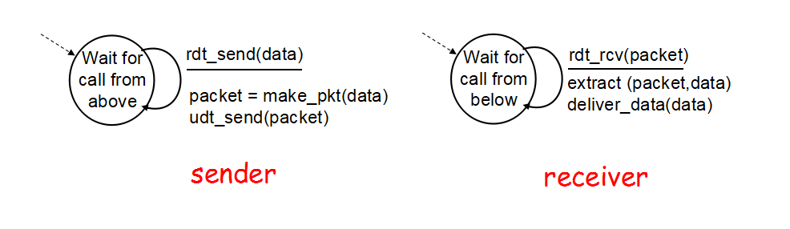

> rdt2.0

假设底层通信传输比特可能受损,解决比特翻转问题

**增加了三种机制**

- 差错检测
- 接收方反馈
  - 肯定确认ACK---1
  - 否定确认NAK---0
- 重传
  - 在接收端对数据进行校验,正确返回ACK,发送者发送下一条数据
  - 错误返回NAK,发送端重新传送这一条

**停等协议**:发送方等待接收方返回ACK或NAK的消息时,无法从上层获取数据继续发送


> rdt2.1

rdt2.0的致命缺点:没有考虑ACK和NAK翻转,即ACK和NAK互换

处理受损的三个将解决方法(都不行)

- 发送者接受到回答之后再次发送一次确认回答,让接受方再发送一次,但是发送者的再次确认也可能翻转,接收方的再次发送也可能翻转
- 增加足够的校验和比特用于**检测差错**和**回复差错**
- 当发送方收到含糊不清的回答,就重新发送一份当前数据.但是就需要在信道中引入**冗余分组**

**解决方法**:

增加一个分组的**序号**,加在分组上.即发送者发送一个带编号0/1的分组.接收方接收到正确的分组,就返回ACK,如果翻转,发送方收到NAK,就会再次发送,这时接收端会拒接,避免重复


> rdt2.2

实现一个无NAK的可靠数据传输协议

和rdt2.1的细微区别:去掉了NAK,有且只有**包含序号的ACK**,发送方必须**检查**接收到的ACK报文中被确认的**分组序号**

当**比特受损时**,接收端接收到不同编号的分组.然后返回这个编号的ACK,但是发送者发现接收到的ACK和自己发送的分组编号不同,那么就会重新发送


> rdt3.0

假设底层信道急除了比特受损外,还会丢包

关注的问题:怎么检测丢包,怎么修复

解决措施:

1.让发送方负责检测和恢复丢包工作

- 当**分组丢失**或者**ACK丢失**,发送方**得不到响应**,在**一定时间**后确认分组丢失,重新发送
  - 等待多久?
    - 至少是发送方到接收方的一个**往返时延**(包括路由器的缓冲时延)加上**接收方处理一个分组所需的时间**
    - 这段时间即使分组或者ACK没有丢失,也会重新发送,这时产生**冗余数据分组**
- 重传
  - 基于时间的重传机制,需要一个**倒计时定时器**
    - 一段时间后可中断发送方
    - 每发送一个分组(包括第一次分组和重传),开启定时器
    - 采取适当操作,定时器中断
    - 终止计时器


a.没有丢包

b.分组丢失

c.ACK丢失

d.过早超时

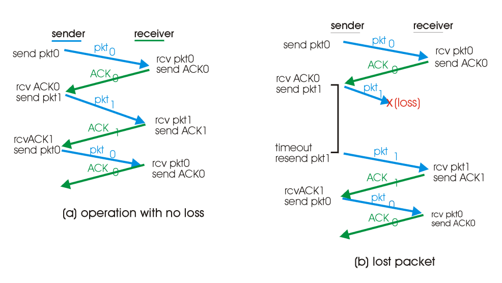

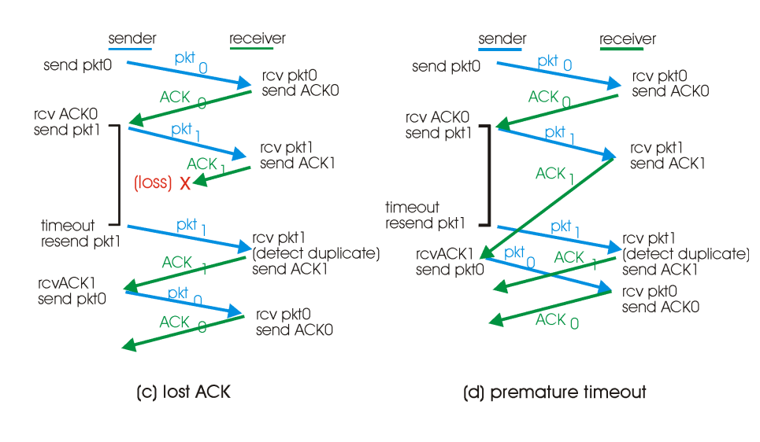


###  要点

一个可靠的数据协议包含的点

- 检验和
- 序号
- 定时器
- ACK


### 流水线可靠数据传输协议

rdt3.0足够**可靠**,但是由于**停等协议**,他的**性能**不够

如果两个主机相距较远,那么利用率就会很低,信道利用率很低,大部分都是闲置时间

**解决方法**:

允许发送方**发送多个分组**而**无需等待确认**

由此带来的问题:

- 增加序号范围,,每个分组必须有唯一的序号
- 发送方和接收方需要缓存多个分组
- 上面两点取决于协议如何**处理**丢失,缓存及延迟过大的分组
  - 回退N步GBN
  - 选择重传SR


#### 回退N步GBN

> 序号: 

base:最小的以发送未确认的分组的序号

nextseqnum:最小的未使用(将要发送)序号

- 以发送并确认的分组 [0,base-1]
- 以发送未确认的分组[base,nextseqnum-1]
- 将要发送的分组[nextseqnum,base+N]
- 不可使用的 [base+N,  ]

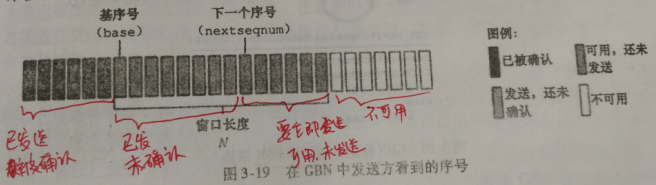

随着协议进行,分组被一个个发送,N也在随着向右滑动,因此GBN也被称为滑动窗口协议.

当接收到1个ACK(序号为base-1),base+1,发送分组(序号nextseqnum),


>  发送方

- 上层的调用
  - 窗口不满时调用rdt_send(),发送分组

- 收到ACK
  - 对序号n的分组确认采用**累计确认**,表明接收方已正确接受n及n以前的所有分组
- 超时事件
  - 出现超时,发送方重传所有**已发送但未确认**的分组


>  **接收方**:

- 正确接收
  - 如果一个序号为n的分组被**正确接受**,则将分组**上传到上层**,并**发送**一个分组n的**ACK**

- 其他情况
  - **丢弃**失序分组,并为**最近按序接收的序号n分组**发送ACK,所有n之前的分组已交付,符合**累计确认**方式


> 流程

１.发送方一次发送４（０－３）分组

２.当等待并接收到１个ＡＣＫ(序号0)时，**窗口向前滑动**，发送下一个分组(序号4)

３.如果等待一段时间没有ＡＣＫ（序号２）时，**没有确认收到**的分组（２－５）被全部**丢弃**，就**重传**该分组和后面的４个分组（２－５）


> 优缺点

**优点**:避免停等协议导致的信道利用率低下

**缺点**:由图得，当出现丢失时，该分组及后面的几个分组需要重传

当窗口长度和带宽时延都很大时,问题更加严重,单个分组会导致大量分组被重传

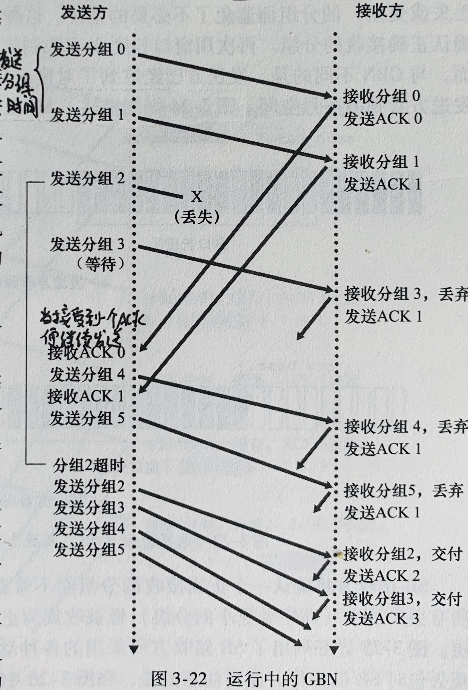


#### 选择重传SR

让发送者仅重传一些他怀疑出错的分组


SR会**确认**正确接收的分组**即使失序**,失序将被**缓存**到**丢失分组**(序号比该分组小)正确**接收**为止,然后这一批分组再**按序上交**上层


> 发送方

- 上层调用
  - 从上层接收到数据，发送方检查窗口是否已满
    - 未满：发送分组
    - 满：数据缓存或返回上层
- **收到ＡＣＫ**
  - 如果该分组在窗口内，就将将该分组**标记为已经确认**
  - 如果**等于send_base**,**窗口**向右**滑动**,base+1

- 超时
  - 防止分组丢失


> 接收方

- 收到分组在窗口内发送ACK
  - 如果分组没有收到过,就将其**缓存**
  - 如果该分组**等于基序号**,就将**其及之后(如果之有缓存)连续的分组一起交付**,窗口滑动

- **窗口之前**的分组被收到,必须产生一个**ACK**,即使之前已经确认
  - 这一步很重要,接收方重新确认小于基序号的分组,如果不发送ACK,发送者窗口不会滑动
  - 发送者窗口和接收方的窗口时不一致的

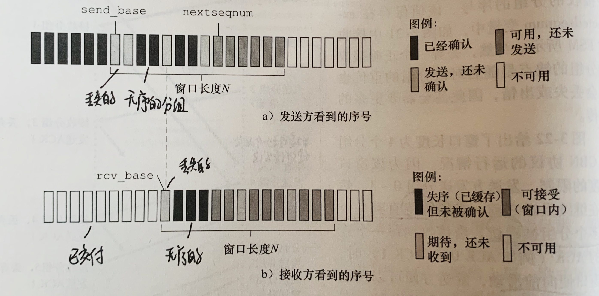

> 流程

1.发送4个分组(序号0-3)

2.发送方接收到传来的ACK(序号0),发送下一个分组(序号4)

3.发送方等待一段时间后没有收到ACK(序号2),就**重传**该分组(序号2)

4.接收方接收到无序(序号3,4)的分组就**缓存**起来直到接收到丢失(序号2)的分组,交付上层


## TCP

> 简介

- **面向连接**
  - 发送数据之前必须建立连接
  - 路由器对练级视而不见,他们只关注数据传输
- **双全工服务**
  - 应用层数据双向流通
- **点对点**
  - 只有一个发送方和接收方


### TCP如何传输数据

1.经过三次握手建立起一条TCP连接,两个应用程序就可以相互发送数据了.

2.客户进程通过**套接字**传递数据流,数据接下来就**被TCP控制**了.

3.TCP将这些数据引导到TCP连接的**发送缓存**中,发送缓存是三次握手设置的缓存之一

4.TCP会时不时从**发送缓存中取出**一块数据(报文段),将其传输到**网络层**.

- 放入报文段的**数据数量**取决于**最大报文段长度**(MSS)
  - MSS根据本地发送主机的最大链路层帧长度**大传输单元**(MTU)设置
  - 设置MSS保证TCP报文段加上TCP/IP首部长度(通常40字节)适合单个链路层帧

- TCP为每块客户数据配上TCP首部,形成多个TCP报文段

5.网络层将报文段封装在IP数据包汇总,被发送到网络.

6.TCP接收端收到报文段后,报文段中的数据被存放到TCP接收缓存中

7.应用程序从中读取数据流


### 报文段结构

> 首部字段

- **源端口号和目的端口号**
  - 用于多路复用/分解
- **检验和字段**
- **序号字段**(32比特),确认号字段(32比特)
  - 被发送方和接收方用来实现可靠数据传输
- **接收窗口字段**(16比特)
  - 用于流量控制,只是接收方愿意接受的字节数量
- **首部长度字段**(4比特)
  - 指示TCP首部长度
- **选项字段**(可变)
  -  用于接收方和发送方协商最大报文段长度(MSS)
- **标志字段**
  - **ACK**比特:对一个已被成功接收报文段的确认
  - RST比特:用于终止异常连接
  - **SYN**比特:用于建立连接,
  - **FIN**比特:用于拆除连接


**最重要**的**序号字段**和**确认号字段**　　　

- 　　**序号**建立在传送的字节流上，序号是该报文段首字节的**字节流编号**
    - 　　数据流被ＴＣＰ通过ＭＳＳ分成一个个编号的分组
        - 　　ＴＣＰ隐式对５０００００字节的文件按ＭＳＳ（１０００字节）分组，首字节编号为０，分成５００个报文段
- 　　**确认号**：主机Ａ期望从主机Ｂ获取的**下一字节**的**序号**
    - 　　当Ｂ向Ａ发送数据流０－１００字节时，Ａ也可以向Ｂ发送数据**期望得到字节**１０１及以后的字节，那么可以发送**确认号**１０１给Ｂ

- **累计确认**:TCP只确认数据流至第一个丢失字节位置的字节


>  数据字段

- 包括引用数据
- MSS限制了数据字段的最大长度,但发送大文件,会划分成长度为MSS的若干块.

### TCP连接

**客户进程**发起连接,通知客户TCP,想与服务器进程TCP建立连接

#### 第一次握手

客服端TCP向服务端TCP发送一个特殊的**TCP报文段**

该报文段会被**随机封装在一个IP数据报中**,并发送给服务器,为了避免某些安全性攻击

>  SYN报文段

- 不**包含**应用层数据
- 报文段首部中一个**标识位SYN比特**设置为1
- **动态生成**一**初始客户序号**(client_isn),将其放入**序号字段中**


#### 第二次握手

当SYN报文段所在的IP数据报到达服务端,服务器**抽取SYN报文段**,为TCP连接**分配TCP缓存和变量**

并向客户TCP**发送允许连接的报文段**

> SYNACK报文段

- 该报文段**不包含**应用层数据
- SYN比特设置为1
- **客户序号**(client_isn)+1
- 设置**初始服务器序号**(server_isn)

该报文段表名了自己的意图:我收到了你发起建立的SYN分组,他的初始序号为client_sin,我同意建立连接,我的初始序号为server_isn


#### 第三次握手

客户收到SYNACK报文段后,也需要为TCP连接**分配缓存和变量.**

客户再次向服务器发送报文段,这是对服务器ACK报文的确认

> 报文段

- **初始服务器序号**(server_isn)+1
- 连接已经确立,**SYN设置为0**
- **可以携带数据**


####　三次握手的总结

经过三次握手,客户和服务器可以**互相发送数据**.

第一次和第二次握手是最基本的，**经过两次握手才能建立连接**

**第一次握手**：**客户主动发起连接**，客户告诉服务器我想和你建立连接，**确认客户端发送信息能力正常**

**第二次握手**：**服务器被动开启连接**，服务器收到消息，同意连接．**确认服务器的发送能力，接收能力正常**

​						但是客户不知道服务器同没同意，需要服务器发响应

> 为什么要第三次握手

１.服务器无法获悉客户是否收到了第二次握手，**确认客户端的接收能力**，客户没有再次发送，服务器只能一直开着那个端口，浪费资源

　　**优点**：如果有第三次握手，当客户没有第三次握手后，服务器便会在一段时间后关闭该端口，**防止浪费**


２.防止第一次请求超时，再次传到服务器

​	客户端发送的第一次连接请求某些原因滞后，在服务器第二次握手之后才发送到服务器，这会导致两次第二次握手，客户肯定不会理会这第二次的ＡＣＫ，导致服务器只能一直等着这个响应，就会造成浪费，如果有第三次握手，服务器在一段时间就会关闭，减少浪费


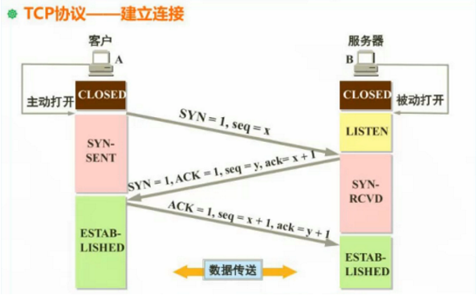


#### 四次挥手

客户和服务器都可以终止连接，结束后资源（缓存和变量）都被毁四方

１.**客户请求关闭**，**发送**一个特殊的ＴＣＰ报文段，**首部标志位ＦＩＮ设置成１**，客户处与FIN_WAIT1状态

２.服务器**接收**并发送**ＡＣＫ**，服务器处于CLOSE_WAIT状态, 客户端接收到，处于FIN_WAIT2状态

３.服务器**发送**特殊ＴＣＰ报文段，**首部标志位ＦＩＮ设置成１**,服务器处于LAST_ACK状态

４.客户**接收**到ＴＣＰ报文段，**发送**ＡＣＫ，客户端处于TIME_WAIT状态

５.服务器**接收**到，连接**中断**，处于CLOSE状态

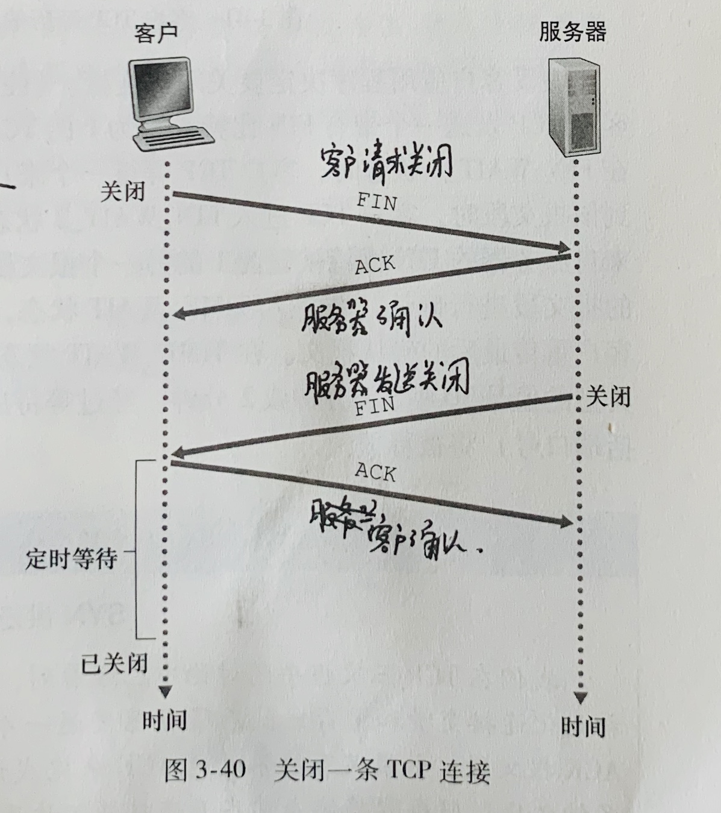

> 状态

- **FIN_WAIT1状态**
  - **主动方**在ESTABLISHED状态下想要中断连接，发送之后处于该状态
  - 当接收到ＡＣＫ之后又转变成WAIT2状态．
  - 这个状态其实很难存在，对方会很快发送ＡＣＫ报文，转变为FIN_WAIT2状态

- **FIN_WAIT2状态**
  
  - 当FIN_WAIT1状态下接收到ＡＣＫ后，变成该状态．
- **CLOSE_WAIT状态**
  - **被动方**接收到ＦＩＮ是，会立刻恢复ＡＣＫ，然后变成该状态
  - 该状态相当于一个**缓冲时间**．如果还有继续要发送的数据可以继续发送，如果没有数据准备关闭连接．
  - 发送ＦＩＮ之后变成LAST_ACK状态

- **LAST_ACK状态**
  - **被动方**发送ＦＩＮ之后变成该状态
  - 当接收到主动方的ＡＣＫ后进入CLOSE状态

- **TIME_WAIT状态**

  - **主动方**接到被动方发来的ＦＩＮ后发出ＡＣＫ，接下来过２ＭＳＬ进入CLOSE状态
  - 如果主动方在FIN_WAIT1状态下受到对方的FIN+ACK，就会直接进入CLOSE状态

  > 为什么要等待２MSL

  - 确保服务器已经收到ＡＣＫ，如果没有收到会再次发送ＦＩＮ．这是客户端就知道服务器没有收到了，会再次发送ＦＩＮ

- **CLOSE状态**

  - 连接中断


#### 安全性

服务器响应SYN,分配变量和缓存,发送ACK,等待客户的ACK报文.但是客户不完成第三次握手,服务器在一段时间后**终止该半开连接并回收资源**

这个为SYN洪泛攻击提供了环境

> SYN洪泛攻击

攻击者发送大量SYN报文段而不往层的三次握手,消耗服务器的资源,导致服务器资源耗尽

**防御机制**:SYN cookie

- 但服务器接收到SYN,不知道是正常用户还是攻击者
  - 此时**不会生成一个半开连接**.
  - 而是生成一个**初始TCP序号(cookie)**,该序号是SYN报文段的**源**和目的**IP地址与端口号**以及秘密数的**复杂函数**,并发送SYNACK
  - **服务器并不记忆该cookie或者SYN的其他信息**
- 客户端接收ACK
  - 合法:返回ACK报文,当服务器收到ACK,验证该ACK与SYN的信息是否相同(借助cookie里的信息),生成一个具有套接字的全开连接
  - 没有返回ACK,就不分配资源


### 拥塞控制

