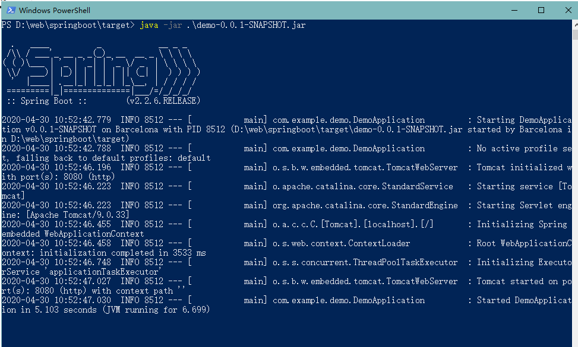
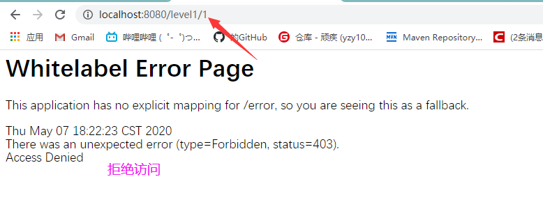

# SpringBoot

>  学习流程


> 什么事SpringBoot

SpringBoot基于Spring开发，并不是替代Spring，而是和Spring紧密结合用于提升Spring体验。

SpringBoot **约定大于配置**，默认进行了很多配置，只需要很少的配置就可以开发。

> 优点

- Spring开发更加入门
- 开箱即用，简化配置
- 内嵌容器简化Web项目
- 没有XML配置和冗余代码


## 微服务

> 什么是微服务

 微服务是一种**架构风格**。 是一种将一个单一应用程序开发为一组小型服务的方法，每个服务运行在自己的进程中，服务间通信采用轻量级通信机制(通常用HTTP资源API)。 

业务拆分成一个一个的服务，彻底去掉耦合，每一个微服务提供单个业务功能，一个服务只做一件事。 小服务之间用http或RPC方式互通

> 单体应用框架

就是SSM，全部放在一个服务器上，打包为一个war包。

**好处**：

- 易于开发和测试，部署十分方便。需要拓展时，可以复制多个war包到多个服务器，做个负载均衡

**坏处**：

- 我要修改一个小小的地方也要停掉所有服务，重新打包成一个war包

> 微服务架构

把功能独立出来，业务由一个或多个功能组成。主要多个业务就赋值多个功能而不是war包

**好处**：

- 节省了资源，减少代码冗余
- 每个功能都是独立的，便于维护

但是，这种庞大的系统架构给部署和运维带来了很大难度。，Spring给了一套完整的微服务：

- 构建独立功能用**SpringBoot** 快速构建
- 大型**分布式网路服务**的调用使用**Spring cloud** 来实现分布式
- **中间件**有**spring cloud data flow**
- 

  http://blog.cuicc.com/blog/2015/07/22/microservices/#   

## 第一个springboot项目


**选择web**


**完成！**


> 建包要在主程序的同级目录下


> controller

```java
@RestController
public class Contreoller {

    @RequestMapping("/YY")
    public String data(){

        return "YY";
    }
}
```

> 运行效果


> 更改项目端口号


> banner

资源目录下创建banner.txt


## 打包

> package


> 位置

在target目录下


> powershell

在jar的目录下，**按住shift和右键**，打开powershell窗口

输入java -jar .\项目名



服务启动了,关闭idea的tomcat，再次打开 http://localhost:8080/YY ，还是能访问！

关闭powershell窗口后就无法访问了

> 微服务

这就是微服务，把服务变成一个个块，不依赖idea也能打开，内置了tomcat


# 

# 1.自动装配

## 依赖

#### pom.xml

pom.xml的**父类** spring-boot-starter-parent


> 启动器
>
> > spring-boot-starter-XXX:从dependencies中自动导入环境依赖

**例如**-web：**自动导入web环境的所有依赖**

点击去就能发现**很多依赖包**：spring-web，spring-webmvc，tomcat，json

```xml
 <dependency>
<!--          启动器，web这个依赖包含了SpringMvc,自动装配，使用tomcat为默认容器-->
            <groupId>org.springframework.boot</groupId>
            <artifactId>spring-boot-starter-web</artifactId>
        </dependency>
```


####  spring-boot-starter-parent

>  资源过滤,maven插件

```
<resources>
      <resource>
        <filtering>true</filtering>
        <directory>${basedir}/src/main/resources</directory>
        <includes>
          <include>**/application*.yml</include>
          <include>**/application*.yaml</include>
          <include>**/application*.properties</include>
        </includes>
      </resource>
      <resource>
        <directory>${basedir}/src/main/resources</directory>
        <excludes>
          <exclude>**/application*.yml</exclude>
          <exclude>**/application*.yaml</exclude>
          <exclude>**/application*.properties</exclude>
        </excludes>
      </resource>
    </resources>
```

#### dependenices

>所有功能场景变成启动器

spring-boot-dependencies 包下，已经指定好了那个版本，依赖时就不需要指定了


这些就是**启动器**

如果你想用哪个环境，就启用对应的启动器就行了

> 自带依赖


pom.xml的web包就是从dependencies中取出来


## 主程序

```java
//这个类就是一个Component
@SpringBootApplication
//@SpringBootApplication标志这个类是一个springboot的应用
public class DemoApplication {

    public static void main(String[] args) {
        SpringApplication.run(DemoApplication.class, args);
    }

}
```


### 注解


#### @主配置类：springBootApplication：

==作用==：将该包及其所有子包纳入spring容器,**这就是为什么要将业务放到主程序同级目录下的原因**

```java
//元注解，用来修饰当前注解，就像public类的修饰词，无实际功能
@Target(ElementType.TYPE)
@Retention(RetentionPolicy.RUNTIME)
@Documented
@Inherited
// springboot的配置，说明这是一个配置文件类，它会被@ComponentScan扫描到
@SpringBootConfiguration
// 开启自动装配
@EnableAutoConfiguration
//扫描包（filters过滤一些东西）
@ComponentScan(excludeFilters = { @Filter(type = FilterType.CUSTOM, classes = TypeExcludeFilter.class),
		@Filter(type = FilterType.CUSTOM, classes = AutoConfigurationExcludeFilter.class) })
public @interface SpringBootApplication {
```


##### @SpringBootConfiguration：主程序为配置类

```
@Target(ElementType.TYPE)
@Retention(RetentionPolicy.RUNTIME)
@Documented
// 配置类
@Configuration
public @interface SpringBootConfiguration {
```


#### @EnableAutoConfiguration

==作用==：自动注册包和引入需要的第三方jar包

```java
@Target(ElementType.TYPE)
@Retention(RetentionPolicy.RUNTIME)
@Documented
@Inherited
//获取所在包进行注册
@AutoConfigurationPackage
// 将第三方jar引入
@Import(AutoConfigurationImportSelector.class)
public @interface EnableAutoConfiguration {
```


##### @AutoConfigurationPackage：所在包注册

```java
@Target(ElementType.TYPE)
@Retention(RetentionPolicy.RUNTIME)
@Documented
@Inherited
// 对源数据所在包下组件进行注册
@Import(AutoConfigurationPackages.Registrar.class)
public @interface AutoConfigurationPackage {
```


###### @AutoConfigurationPackages.Registrar

==作用==：打包源数据获取包名调用register注册

**register**方法： 注册包

```java
static class Registrar implements ImportBeanDefinitionRegistrar, DeterminableImports {

		@Override
		public void registerBeanDefinitions(AnnotationMetadata metadata, BeanDefinitionRegistry registry) {
            // 	new PackageImport(metadata).getPackageName())将源数据打包，并获得其包名
			register(registry, new PackageImport(metadata).getPackageName());
		}

		@Override
		public Set<Object> determineImports(AnnotationMetadata metadata) {
			return Collections.singleton(new PackageImport(metadata));
		}

	}
```

**包名**就是这个，主程序所在的包


##### @Import：三方jar包

List<String> configurations = getCandidateConfigurations(annotationMetadata, attributes);

进入getCandidateConfigurations

> getCandidateConfigurations:

```java
protected List<String> getCandidateConfigurations(AnnotationMetadata metadata, AnnotationAttributes attributes) {
    //  这边获取所有配置  getSpringFactoriesLoaderFactoryClass()方法就在下面
		List<String> configurations = SpringFactoriesLoader.loadFactoryNames(getSpringFactoriesLoaderFactoryClass(),
				getBeanClassLoader());
    //  如果为空，输出语句，META-INF/spring.factories
		Assert.notEmpty(configurations, "No auto configuration classes found in META-INF/spring.factories. If you "
				+ "are using a custom packaging, make sure that file is correct.");
		return configurations;
	}

//   EnableAutoConfiguration返回的就是主程序的包，所以获取的是springboot的所有配置
	protected Class<?> getSpringFactoriesLoaderFactoryClass() {
		return EnableAutoConfiguration.class;
	}

```

###### loadFactoryNames


> spring.factories

所在地址：


里面储存的都是配置类的路径，当你需要用时，就会通过路径调用配置类（比如视图解析器）

> 

#### 导图


---


### 主启动程序

#### springApplication

**这个类主要做了以下四件事情：**

1、推断应用的类型是普通的项目还是Web项目

2、查找并加载所有可用初始化器 ， 设置到initializers属性中

3、找出所有的应用程序监听器，设置到listeners属性中

4、推断并设置main方法的定义类，找到运行的主类

查看构造器：

```java
public SpringApplication(ResourceLoader resourceLoader, Class<?>... primarySources) {
    
    //	 加载资源
		this.resourceLoader = resourceLoader;
    //  primarySource不能为空
		Assert.notNull(primarySources, "PrimarySources must not be null");
    //  遍历primartSource
		this.primarySources = new LinkedHashSet<>(Arrays.asList(primarySources));
    //   推测web应用类型，并赋值到属性webApplicationType
		this.webApplicationType = WebApplicationType.deduceFromClasspath();
    //   监听初始化
		setInitializers((Collection) getSpringFactoriesInstances(ApplicationContextInitializer.class));
		setListeners((Collection) getSpringFactoriesInstances(ApplicationListener.class));
		this.mainApplicationClass = deduceMainApplicationClass();
	}
```

---


#### run 流程


==图片对应的代码==

```java
public ConfigurableApplicationContext run(String... args) {
       // 计时器
        StopWatch stopWatch = new StopWatch();
        //  计时器启动
        stopWatch.start();
//        初始化上下文，异常报告集合
        ConfigurableApplicationContext context = null;
        Collection<SpringBootExceptionReporter> exceptionReporters = new ArrayList<>();
//        strep1 系统属性设置
        configureHeadlessProperty();
        //  step2 创建所有spring监听器，底层采用factoriesInstances，通过类加载器获取spring.factories文件，进而反射得到class对象
        SpringApplicationRunListeners listeners = getRunListeners(args);
//        启动所有监听器
        listeners.starting();
        try {
//            step4  装配环境参数（如service.port=8082）
            ApplicationArguments applicationArguments = new DefaultApplicationArguments(args);
//             用监听器和环境参数创建配置环境
            ConfigurableEnvironment environment = prepareEnvironment(listeners, applicationArguments);
            configureIgnoreBeanInfo(environment);
//            step5 打印banner和环境
            Banner printedBanner = printBanner(environment);
//            step 6创建应用上下文
            context = createApplicationContext();
//            异常报告
            exceptionReporters = getSpringFactoriesInstances(SpringBootExceptionReporter.class,
                    new Class[] { ConfigurableApplicationContext.class }, context);
//            应用上下文准备完毕
            prepareContext(context, environment, listeners, applicationArguments, printedBanner);
//            step9 上下文刷新：bean工厂加载，通过工厂生产Bean，刷新生命周期
            refreshContext(context);
//              上下文后置结束处理（上下文和环境参数）
            afterRefresh(context, applicationArguments);
//            计时器结束
            stopWatch.stop();
            if (this.logStartupInfo) {
                new StartupInfoLogger(this.mainApplicationClass).logStarted(getApplicationLog(), stopWatch);
            }
//            上下文的监听完成
            listeners.started(context);
//             step12 执行所有runner运行器
            callRunners(context, applicationArguments);
        }catch (Throwable ex) {
            handleRunFailure(context, ex, exceptionReporters, listeners);
            throw new IllegalStateException(ex);
        }

        try {
//          step13 发布应用上下文
            listeners.running(context);
        }
        catch (Throwable ex) {
            handleRunFailure(context, ex, exceptionReporters, null);
            throw new IllegalStateException(ex);
        }
//        step13 就绪并返回
        return context;
    }
```


# 2.配置文件

springBoot的配置文件有两种


## properties

语法结构   key = value

```properties
service.port = 8081
```

如果使用properties和类绑定

```java
// 加载指定配置文件
@PropertySource(value = "classpath:student.properties")
public class Student {

//    使用properties文件设置属性
    @Value("${student.name}")
     private String name;
```


## yaml

>  语法结构  : key : 空格 value

空格的要求非常严格，**垂直对齐**，属性需要**缩进**

```yml
service:
   port: 8081
```

>  对象

```yaml
student:
  name: YY
  age: 22
  
#行内写法
student1: {name: YY,age: 22}
```

> 数组

```
#数组
pets:
  - cat
  - dog
  - pig

pets1: [cat,dog,pig]
```

### 属性赋值

 pojo

```java
//前提，这个类是组件
@Component
//将配置文件的每一个属性映射到这个组件中，将本类的所有属性和配置文件中的相关配置（student下的所有属性）对应绑定
@ConfigurationProperties(prefix = "student")
public class Student {
    private String name;
    private int age;
```

test

```java
@SpringBootTest
class DemoApplicationTests {
    @Autowired
    Student student;

    @Test
    void contextLoads() {
        System.out.println(student.getAge());
    }

}
```


### 松散绑定

数据库字段名last-name  可以和 驼峰命名法lastName 自动绑定

```
private String LastName;
```


### JSR303数据校验

**需要先开启@validate数据校验**


```
//数据校验
@Validated
public class Student {

    @Email(message = "📪error")
    private String name;
```


## 多环境配

### 优先级


### 指定环境

> 多文件


```properties
#springboot的多环境配置，可以选择激活哪一个
spring.profiles.active=work
```

> 单文件

```yaml
#springboot的多环境配置，可以选择激活哪一个
spring:
  profiles:
    active: test
#使用---分割
---
server:
  port: 8083
spring:
  profiles: test

---
server:
  port: 8082
spring:
  profiles: work
---
server:
  port: 8084
spring:
  profiles: up

```


## 错误

1. 把server 写成service 导致端口修改没有生效
2. 单文件配置多环境时，文件名必须是


## 配置类

**自动配置类**为XXXAutoConfiguration

**配置类名**为XXProperties

> EnableConfigurationProperties

==作用==：**自动配置类**会将**配置类**所在的包注册，并设默认值


> ConfigurationProperties

**配置类**和配置文件绑定


> 引入配置类的条件

当所有条件成立，**自动配置类**才会**生效**，才能将配置类**注册**进IOC容器


> 手动配置参数


prefix对应的就是配置类名，然后设置它的属性

```properties
#设置配置类的属性,配置类的Configuration和配置文件绑定，那么prefix对应的就是类名，就可以设置类名的属性
spring.data.web.page = 10
```


### 查看生效的配置类

```yaml
debug: true
```

positive match：显示生效的配置类

nagative match：显示未生效的配置类


# 3.Web开发

需要解决的问题

- 导入静态资源
- 首页
- jsp，模板引擎thymeleaf
- 装配扩展springMVC
- 业务
- 拦截器
- 国际化


## 导入静态资源

>  WebMVCConfiguration.class

找到addResourceHandler方法

```java
@Override
		public void addResourceHandlers(ResourceHandlerRegistry registry) {
            //判断静态资源是否已自动配置
			if (!this.resourceProperties.isAddMappings()) {
				logger.debug("Default resource handling disabled");
				return;
			}
			Duration cachePeriod = this.resourceProperties.getCache().getPeriod();
			CacheControl cacheControl = this.resourceProperties.getCache().getCachecontrol().toHttpCacheControl();
            // 判断资源是否配置到一下路径，如果没有，设置到该路径
			if (!registry.hasMappingForPattern("/webjars/**")) {
		customizeResourceHandlerRegistration(registry.addResourceHandler("/webjars/**")
						.addResourceLocations("classpath:/META-INF/resources/webjars/")
						.setCachePeriod(getSeconds(cachePeriod)).setCacheControl(cacheControl));
			}
            //  获取静态资源的路径 
			String staticPathPattern = this.mvcProperties.getStaticPathPattern();
			if (!registry.hasMappingForPattern(staticPathPattern)) {
				customizeResourceHandlerRegistration(registry.addResourceHandler(staticPathPattern)
						.addResourceLocations(getResourceLocations(this.resourceProperties.getStaticLocations()))
						.setCachePeriod(getSeconds(cachePeriod)).setCacheControl(cacheControl));
			}
		}
```

1. 访问webjar目录，通过maven引入的jar包都是这种方式

```java
/webjars/就是下面的缩写
classpath:/META-INF/resources/webjars/
```


2. 获取项目**静态资源路径** 

   **this.mvcProperties.getStaticPathPattern();**

```java

String staticPathPattern = this.mvcProperties.getStaticPathPattern();
//这句话在点进getStaticPathPattern();方法后
// /** 当前目录下的所有文件都识别，即资源目录
private String staticPathPattern = "/**";
// 被识别的目录，第一个就是上面那个jar报的
private static final String[] CLASSPATH_RESOURCE_LOCATIONS = { 
  "classpath:/META-INF/resources/"  , "classpath:/resources/", 
    "classpath:/static/",   "classpath:/public/" };
```

剩下三个：对应资源目录下的三个文件夹（可手动创建）


> 总结

通过源码，我们知道4种方式处理静态资源

- webjar 第三发jar包			访问路径：localhost:8080/webjar/文件名
- public,static,resources  三个目录下的文件    访问路径：lovalhost:8080/文件名

优先级：resource > static(默认) > public 


## 模板引擎

> 什么是模板引擎

 是为了使用户界面与业务数据（内容）分离而产生的，它可以生成特定格式的文档，用于网站的模板引擎就会生成一个标准的[HTML](https://baike.baidu.com/item/HTML/97049)文档 ，比如JSP就是一个模板引擎。

**有时候经常需要根据后端返回的json数据，然后来生成html，再渲染页面。**，模板引擎就是写一个页面模板，将一些动态的值也能通过表达式填充到指定位置


> 导入依赖

```xml
<dependency>
            <groupId>org.springframework.boot</groupId>
            <artifactId>spring-boot-starter-thymeleaf</artifactId>
        </dependency>
```


> 源码

ThymeleafProperties.class

相当于**视图解析器**，为资源加上前缀后缀

```java
@ConfigurationProperties(prefix = "spring.thymeleaf")
public class ThymeleafProperties {

	private static final Charset DEFAULT_ENCODING = StandardCharsets.UTF_8;

    //指定的路径为templates，前缀即为路径
	public static final String DEFAULT_PREFIX = "classpath:/templates/";

    //文件后缀为html
	public static final String DEFAULT_SUFFIX = ".html";
```

> 资源位置 tempates

通过controller跳转资源，需要把资源放到**templates目录下**

而且**templates的资源只允许controller访问**


> controller

**视图名**：classpath:/templates/文件名.html

```java
//   templates目录下的所有资源，只有controller才能访问
//   因为没有视图解析器，所以需要模板引擎的支持 thymeleaf
@Controller
public class IndexController {

    
//    设置首页
    @RequestMapping("/index")
    public String index(){
        return "index";
    }
    
   @RequestMapping("/test")
    public String test(Model model){
        model.addAttribute("message","YY");
        List<Object> lists = new ArrayList();
        lists.add("YZY");
        lists.add("YY");
//        模板引擎将视图名拼接成classpath:/templates/test.html
        return "test";
    }
}
```

> 获取参数

```
<h1>test</h1>
<!--直接输出可能不会显示-->
${message}
```


改良版

```html
<html lang="en" xmlns:th="http://www.thymeleaf.org">

<!--使用thymeleaf语法，类似vue
            th:属性-->
<p th:text="${message}"></p>
```


### 语法


```html
<!--遍历集合-->
<h2 th:each="list:${lists}" th:text="${list}"></h2>
<!--也可以写在内容中-->
<h2 th:each="list:${lists}" >[[ ${list} ]]</h2>
```

>  获取静态资源需要@{路径}

```js
th:href = "@{/css/**}"
```

> 复用代码:

复用组件放在一个公用文件内，并用th：fragment标记

```html
<nav class="navbar navbar-dark sticky-top bg-dark flex-md-nowrap p-0" th:fragment="navBar">

```

调用common文件夹的common文件中的sideBar组件

```html
th:insert = '@{common/common::sideBar}'
```

> 判断

```html
	<td th:text="${employee.getGender()==0?'女':'男'}"></td>
```


## 设置首页

>  源码webMVCConfiguration

WelcomePageHandlerMapping：欢迎界面（首页）映射

```java
public WelcomePageHandlerMapping welcomePageHandlerMapping(ApplicationContext applicationContext,
				FormattingConversionService mvcConversionService, ResourceUrlProvider mvcResourceUrlProvider) {
			WelcomePageHandlerMapping welcomePageHandlerMapping = new WelcomePageHandlerMapping(
					new TemplateAvailabilityProviders(applicationContext), applicationContext, getWelcomePage(),
					this.mvcProperties.getStaticPathPattern());
			welcomePageHandlerMapping.setInterceptors(getInterceptors(mvcConversionService, mvcResourceUrlProvider));
			return welcomePageHandlerMapping;
		}


		private Optional<Resource> getWelcomePage() {
            // 获取资源目录
			String[] locations = getResourceLocations(this.resourceProperties.getStaticLocations());
			return Arrays.stream(locations).map(this::getIndexHtml).filter(this::isReadable).findFirst();
		}

//     获取静态资源目录下的index.html
		private Resource getIndexHtml(String location) {
			return this.resourceLoader.getResource(location + "index.html");
		}
```

可以吧首页放在资源目录的三个**静态资源文件夹**内


**映射成功**


## 扩展MVC

扩展MVC功能可以传建一个MVC配置类，可以**接管**自动配置类里的**某些功能**，不可全面接管@EnableWebMVC


> 源码

```java
public View resolveViewName(String viewName, Locale locale) throws Exception {
		RequestAttributes attrs = RequestContextHolder.getRequestAttributes();
		Assert.state(attrs instanceof ServletRequestAttributes, "No current ServletRequestAttributes");
		List<MediaType> requestedMediaTypes = getMediaTypes(((ServletRequestAttributes) attrs).getRequest());
		if (requestedMediaTypes != null) {
            //   获取springboot中的所有解析器
			List<View> candidateViews = getCandidateViews(viewName, locale, requestedMediaTypes);
            //  选择出最好的视图解析器
			View bestView = getBestView(candidateViews, requestedMediaTypes, attrs);
			if (bestView != null) {
				return bestView;
			}
		}
```


> 自己写一个视图解析器

```java
//如果加上这个注解，webMVC自动配置类就会失效
@EnableWebMvc
public class webMVCConfig implements WebMvcConfigurer {

//    会把自己写的视图解析器也装配到环境的视图解析器里
    @Bean
    public ViewResolver view(){
        return new MyViewResolver();
    }

    @Override
    public void addViewControllers(ViewControllerRegistry registry) {
        registry.addViewController("/springboot").setViewName("test");
    }
}
//定义一个自己写的视图解析器
class MyViewResolver implements ViewResolver{
//
    @Override
    public View resolveViewName(String s, Locale locale) throws Exception {
        return null;
    }


}
```

> 不可以加上@EnableWebMVC

webMVCConfiguration文件里有这样一句话：

```java
//当不存在这个WebMvcConfigurationSupport.class时条件成立
@ConditionalOnMissingBean(WebMvcConfigurationSupport.class)
```

如果加上，点入注解

```java
// 点入配置类
@Import(DelegatingWebMvcConfiguration.class)
public @interface EnableWebMvc {
}

```

点入配置类，发现这个类**继承WebMvcConfigurationSupport**

```java
public class DelegatingWebMvcConfiguration extends WebMvcConfigurationSupport {
```

这就和前面的自动配置类冲突，导致自动配置类配置类失效


## 业务

模拟数据库

> 表

```java
//部门表
public class Department {

    private Integer id;
    private String departmentName;
```

```java
//员工表
public class Employee {

    private Integer id;
    private String lastName;
    private String email;
//    性别 女：0 男：1
    private Integer gender;
    private Department department;
    private Date birth;
```

> 业务层

```java
@Repository
public class DepartmentDao {

//    模拟数据
    private static Map<Integer, Department> departmentMap = null;
    static{
        departmentMap = new HashMap<>();
        departmentMap.put(1,new Department(101,"开发"));
        departmentMap.put(2,new Department(102,"运维"));
        departmentMap.put(3,new Department(103,"测试"));
    }

//    业务
//    获取所有部门信息
    public Collection<Department> findAllDepartment(){
        return departmentMap.values();
    }

//    通过id获取部门信息
    public Department findDepartMentByID(Integer id){
        return departmentMap.get(id);
    }

}
```

```java
@Repository
public class EmployeeDap {

    private static Map<Integer , Employee> employeeMap= null;
//    员工所属的部门
    @Autowired
    private DepartmentDao departmentDao;

    static{
        employeeMap = new HashMap<>();
        employeeMap.put(1,new Employee(1,"YZY","email1",1,new Department(1,"开发")));
        employeeMap.put(2,new Employee(2,"YY","email2",0,new Department(2,"运维")));
        employeeMap.put(3,new Employee(3,"JJ","email3",0,new Department(1,"开发")));
        employeeMap.put(4,new Employee(4,"HC","email4",1,new Department(3,"测试")));
    }

//    业务\
//    主键自增
    private static Integer initid = 5;
//    增加一个员工
    public void addEmployee(Employee employee){
        employeeMap.put(initid++,employee);
    }
//    删除一个员工
    public void deleteEmployee(Integer id){
        employeeMap.remove(id);
    }
//    修改员工
    public void updateEmployee(Employee employee){
        employeeMap.replace(employee.getId(),employee);
    }
//    查询所有员工
    public Collection<Employee> findAllEmloyee(){
       return employeeMap.values();
    }
//    通过id查找员工
    public Employee findEmloyeeById(Integer id){
        return employeeMap.get(id);
    }

}
```


如果直接把主页跳转放在controller层，**页面的样式不会加载**


## 国际化

登录界面可以切换中文和英文


想要切换，就需要一个配置类：

> MyLocaleResolver配置类

```java
@Configuration
public class MyLocaleResolver implements LocaleResolver {

    @Override
    public Locale resolveLocale(HttpServletRequest request) {
//        获得语言切换的参数请求
        String language = request.getParameter("language");
//        默认
        Locale locale = Locale.getDefault();
//        如果携带了参数，就赋值返回
        if(!StringUtils.isEmpty(language))
        {
//            _分割：语言，国家
            String[] split = language.split("_");
            locale = new Locale(split[0],split[1]);
        }
        return locale;
    }

    @Override
    public void setLocale(HttpServletRequest request, HttpServletResponse response, Locale locale) {

    }
}
```

> MyWebMVCConfig

```java
@Configuration
public class MyMVCConfig implements WebMvcConfigurer {
    @Override
    public void addViewControllers(ViewControllerRegistry registry) {
        registry.addViewController("/").setViewName("index");
        registry.addViewController("/index.html").setViewName("index");
    }

//    自定义的国际化组件生效
    @Bean
    public LocaleResolver localeResolver(){
        return new MyLocaleResolver();
    }
}
```

> application.yaml

```yaml
#标注国际化文件位置
spring:
  messages:
    basename: i18n.login
```


## 拦截器

> 创建一个拦截器的类

```java
public class LoginInterceptor implements HandlerInterceptor {

    @Override
    public boolean preHandle(HttpServletRequest request, HttpServletResponse response, Object handler) throws Exception {
        String loginname = (String) request.getSession().getAttribute("loginname");
        if (loginname.length() != 0) {
            request.setAttribute("message","还未登陆，无法访问");
            request.getRequestDispatcher("/index.html").forward(request,response);
            return true;
        } else {
            return false;
        }
    }
}
```

> 在webMVCConfiguration配置拦截器

```java
//添加自定义的拦截器
    @Override
    public void addInterceptors(InterceptorRegistry registry) {
//                               拦截全部请求，除了主页和登录请求,还有静态资源
        registry.addInterceptor(new LoginInterceptor()).addPathPatterns("/**")
           .excludePathPatterns("/index.html","/","/login","/css/**","/img/**","/js/**");
    }
```


## 页面功能（仅纯java代码）

不具备持久性，即重启服务重置数据

### 前端流程

- 创建需要的网页

- 调用公共元素和编写其他元素

- 将网页放入webMVCConfig内管理

  ```java
  //    管理跳转链接，因为itemplates不允许外部访问
      @Override
      public void addViewControllers(ViewControllerRegistry registry) {
          registry.addViewController("/").setViewName("index");
          registry.addViewController("/index.html").setViewName("index");
          registry.addViewController("/main.html").setViewName("dashboard");
          registry.addViewController("/list.html").setViewName("list");
          registry.addViewController("/addE.html").setViewName("addE");
          registry.addViewController("/updateE.html").setViewName("updateE");
      }
  ```

- 与业务连接


### 提取公共元素（侧边栏和导航栏）

1.提取到一个公共文件**common/common.html**

```html
<!--头部导航栏-->
<nav class="navbar navbar-dark sticky-top bg-dark flex-md-nowrap p-0" th:fragment="navBar">
    <a class="navbar-brand col-sm-3 col-md-2 mr-0" href="http://getbootstrap.com/docs/4.0/examples/dashboard/#">欢迎用户：[[${session.loginname}]]</a>
    <input class="form-control form-control-dark w-100" type="text" placeholder="Search" aria-label="Search">
    <ul class="navbar-nav px-3">
        <li class="nav-item text-nowrap">
            <a class="nav-link" href="http://getbootstrap.com/docs/4.0/examples/dashboard/#">注销</a>
        </li>
    </ul>
</nav>


<!--侧边导航栏-->
<nav class="col-md-2 d-none d-md-block bg-light sidebar" th:fragment="sideBar">
    
    
    <!--公共元素中接收参数并判断-->
    					<a th:class="${active=='list.html'?'nav-link active':'nav-link'}"></a>

```

2.其他页面**调用**（可带参数），会在common页面判断

```html
<!--	头部导航栏-->
<div th:replace="~{common/common::navBar}"></div>
<!--				侧边栏,带参数-->
			<div th:replace="~{common/common::sideBar(active='main.html')}"></div>
```


### 登录

1.登录页面填写账户密码，**国际化功能**可以支持中英文

2.调用登录业务，**成功跳转首页**，不成功**返回登录页面**并返回信息

```java
@RequestMapping("/login")
    public String login(String username, String password, Model model, HttpSession session) {
        if (username.length() != 0 && "1".equals(password)) {
            session.setAttribute("loginname",username);
            return "redirect:/main.html";
        }else{
            model.addAttribute("message","登录失败");
            return "index";
        }
    }
```


### 显示所有职员信息

1.**复用侧边栏**跳转**执行显示所有职员信息的业务**并返回**员工信息页面**

```java
@RequestMapping("/getAllEmployees")
    public String getAllEmployees(Model model){
        Collection<Employee> allEmloyees = employeeDao.findAllEmloyee();
        model.addAttribute("allEmloyees",allEmloyees);
        return "list";
    }
```


2.员工信息页面，**获取业务参数并遍历显示**

```html
<tbody>
	<!--		th:each="遍历出来的个体:${获取的遍历数据}"					-->
					<tr th:each="employee:${allEmloyees}">
					<td th:text="${employee.getId()}"></td>
					<td th:text="${employee.getLastName()}"></td>
					<td th:text="${employee.getEmail()}"></td>
					<td th:text="${employee.getGender()==0?'女':'男'}"></td>
				<td th:text="${employee.getDepartment().getDepartmentName()}"></td>
				<td th:text="${#dates.format(employee.getBirth(),'yyyy-MM-dd HH:mm:ss')}"></td>
				<td>
					<button class="btn btn-sm btn-primary">修改</button>
					<button class="btn btn-sm btn-danger">删除</button>
									</td>
								</tr>
							</tbody>
```


3.提供**通过员工id**进行**修改**和**删除**


### 添加职员

1.从首页通过**复用的侧边**跳转（**跳转时执行查询部门业务**）到添加职员界面

```java
@RequestMapping("/toaddE")
    public String addE(Model model){
        Collection<Department> allDepartment = departmentDao.findAllDepartment();
        model.addAttribute("allDepartment",allDepartment);
        return "addE";
    }
```


2.添加职员界面有一个填写信息的表单（显示填写的信息）

```html
<main role="main" class="col-md-9 ml-sm-auto col-lg-10 pt-3 px-4">
            <h2>添加员工信息</h2>
            <form th:action="@{/addEmployee}">
                <div class="form-group">
                    <label>LastName</label>
                    <input type="text" name="lastName" class="form-control" placeholder="顽疾">
                </div>
                <div class="form-group">
                    <label>Email</label>
                    <input type="email" name="email" class="form-control" placeholder="1061603811@qq.com">
                </div>
                <div class="form-group">
                    <label>Gender</label><br>
                    <div class="form-check form-check-inline">
                        <input class="form-check-input" type="radio" name="gender" value="1">
                        <label class="form-check-label">男</label>
                    </div>
                    <div class="form-check form-check-inline">
                        <input class="form-check-input" type="radio" name="gender" value="0">
                        <label class="form-check-label">女</label>
                    </div>
                </div>
                <div class="form-group">
                    <label>department</label>
                    <select name="department.id" class="form-control" >
                        <option th:each="Department:${allDepartment}" th:text="${Department.getDepartmentName()}" th:value="${Department.getId()}"></option>
                    </select>
                </div>
                <div class="form-group">
                    <label>birth</label>
                        <input type="text" name="birth" class="form-control" placeholder="1998/12/12">
                </div>
                <button type="submit" class="btn btn-primary">添加</button>
            </form>
        </main>
```


3.表单中的**选择部门**接收跳转参数，遍历参数并赋值部门id给每个下拉框

```html
 <select name="department.id" class="form-control" >
                        <option th:each="Department:${allDepartment}" th:text="${Department.getDepartmentName()}" th:value="${Department.getId()}"></option>
                    </select>
```


4.提交之后**调用addEmployee业务**，添加职员信息之后在**跳转显示所有职员信息**

```java
@RequestMapping("/addEmployee")
    public String addEmployee(Employee employee){
//        添加员工信息
        employeeDao.addEmployee(employee);
        return "redirect:/getAllEmployees";
    }
```


> 问题

1.birth格式

​		birth在MVC**默认中的格式**是yyyy/MM/dd,可以在application.yaml中设置成-的格式

```yaml
#时间日期的格式
spring: 
  mvc:
    date-format: yyyy-MM-dd
```

​      在显示员工中用到过类似的语句，但是是java转换

```html
<td th:text="${#dates.format(employee.getBirth(),'yyyy-MM-dd HH:mm:ss')}"></td>
```

2.提交表单时部门提交的参数应该是department.id

​		如果提交的是department就会报错，因为我们赋给下拉框的值是id的值，所以提交的值也应该是id


### 修改员工信息

1.修改按钮操作在显示员工新的右侧

```html
<a class="btn btn-sm btn-primary" th:href="@{/toupdateE(id=${employee.getId()})}">修改</a>
```

2.点击携带该员工id参数执行修改修改业务

```java
//  跳转修改页面
    @RequestMapping("/toupdateE")
    public String toupdateE(Integer id,Model model){
        Employee emloyeeById = employeeDao.findEmloyeeById(id);
        Collection<Department> allDepartment = departmentDao.findAllDepartment();
        model.addAttribute("emloyeeById",emloyeeById);
        model.addAttribute("allDepartment",allDepartment);
        return "updateE";
    }
```

3.修改页面默认提供员工的原本信息（id隐藏）

```html
<main role="main" class="col-md-9 ml-sm-auto col-lg-10 pt-3 px-4">
    <h2>修改员工信息</h2>
    <form th:action="@{/updateEmployee}">
        <input type="hidden" name="id"  th:value="${emloyeeById.getId()}">
        <div class="form-group">
            <label>LastName</label>
            <input type="text" name="lastName" class="form-control" th:value="${emloyeeById.getLastName()}">
        </div>
        <div class="form-group">
            <label>Email</label>
            <input type="email" name="email" class="form-control" th:value="${emloyeeById.getEmail()}">
        </div>
        <div class="form-group">
            <label>Gender</label><br>
            <div  class="form-check form-check-inline">
                <input class="form-check-input" type="radio" name="gender" value="1">
                <label class="form-check-label">男</label>
            </div>
            <div  class="form-check form-check-inline">
                <input class="form-check-input" type="radio" name="gender" value="0">
                <label class="form-check-label">女</label>
            </div>
        </div>
        <div class="form-group">
            <label>department</label>
            <select name="department.id" class="form-control" >
                <option th:selected="${Department.getId()==emloyeeById.getDepartment().getId()}" th:each="Department:${allDepartment}" th:text="${Department.getDepartmentName()}" th:value="${Department.getId()}"></option>
            </select>
        </div>
        <div class="form-group">
            <label>birth</label>
            <input type="text" name="birth" class="form-control" th:placeholder="${emloyeeById.getBirth()}">
        </div>
        <button type="submit" class="btn btn-primary">修改</button>
    </form>
</main>
```

4.修改提交返回员工页面

```java
@RequestMapping("/updateEmployee")
    public String updateEmployee(Employee employee){
        employeeDao.updateEmployee(employee);
        return "redirect:/getAllEmployees";
    }
```


> 遇到的问题

1.修改完成返回员工界面时，跳转出现Whitelabel Error Page

​		return 返回的页面需要加上重定向  redirect：/


2.修改之后department栏显示空

​		

3.button标签无法跳转

​		使用a标签，button无法使用href动作


### 删除员工

1.修改按钮操作在显示员工新的右侧

```html
<a class="btn btn-sm btn-danger"  th:href="@{/todeleteE(id=${employee.getId()})}">删除</a>
```

2.跳转调用删除业务并返回员工页面

```java
//    删除
    @RequestMapping("/todeleteE")
    public String delete(Integer id){
        employeeDao.deleteEmployee(id);
        return "redirect:/getAllEmployees";
    }
```


### 404


# 4.spring Date

springboot 拥有自带的jdbc ： spring Date

## 创建

1.创建项目选择sql里的JDBC API 和MySQL Driver


2.查看依赖

```xml
<!--        jdbc-->
        <dependency>
            <groupId>org.springframework.boot</groupId>
            <artifactId>spring-boot-starter-jdbc</artifactId>
        </dependency>

<!--        mysql driver-->
        <dependency>
            <groupId>mysql</groupId>
            <artifactId>mysql-connector-java</artifactId>
            <scope>runtime</scope>
        </dependency>
```

3.创建数据库配置文件，名称必须为 application.yaml

```yaml
spring:
  datasource:
    url: jdbc:mysql://localhost:3306/springboot?useUnicode=true&characterEncoding=utf-8
    username: root
    password: yzy665128
    driver-class-name: com.mysql.cj.jdbc.Driver
```

4.测试

```java
@SpringBootTest
class SpringbootDateApplicationTests {

    @Autowired
    DataSource dataSource;

    @Test
    void contextLoads() {
//        查看使用的数据库驱动          class com.zaxxer.hikari.HikariDataSource
        System.out.println(dataSource.getClass());
    }

}
```

5.点击配置文件的属性可以进入源代码查看datesource属性

6.查看**jdbc模板**：可以通过引入包的AutoConfig->org->jdbc->jdbcTemplateConfiguration

7.使用Jdbctemplate

```java
@RestController
public class JDBCController {

    @Autowired
    JdbcTemplate jdbcTemplate;

    @RequestMapping("/s")
    public List<Map<String,Object>> s(){
        String sql = "select * from account";
        List<Map<String, Object>> list = jdbcTemplate.queryForList(sql);
        return list;
    }
//    resultful传参
    @RequestMapping("/u/{id}")
    public int u(@PathVariable("id") int id){
        Object[] o  =new Object[2];
        o[0] = "Y";
        o[1] = 1;
        String sql = "update account set name=? ,money = ? where id = "+id;
//        占位符传参
        int update = jdbcTemplate.update(sql,o);
        return update;
    }
    @RequestMapping("/a")
    public int a(){
        Object[] o = new Object[3];
        o[0] = 17;
        o[1] = "JJ";
        o[2] = 17;
        String sql = "insert into account values(?,?,?)";
        int insert = jdbcTemplate.update(sql,o);
        return insert;
    }
    @RequestMapping("/d")
    public int d(){
        String sql = "delete from account where id = 17";
        int delete = jdbcTemplate.update(sql);
        return delete;
    }
}
```

8.结果


## druid

1.导入

```xml
<!-- https://mvnrepository.com/artifact/com.alibaba/druid -->
<dependency>
    <groupId>com.alibaba</groupId>
    <artifactId>druid</artifactId>
    <version>1.1.21</version>
</dependency>
```

2.使用：在配置文件中指定

```yaml
spring:
  datasource:
   
    # 指定数据池
    type: com.alibaba.druid.pool.DruidDataSource
```

3.测试


4.创建druid配置类，并设置前缀与配置文件的属性相连

```java
@Configuration
public class DruidConfig {

    @Bean
    @ConfigurationProperties(prefix = "spring.datasource")
    public DataSource druidDataSource(){
        return new DruidDataSource();
    }
}
```

5.配置类里配置管理员

```java
//    后台监控
    @Bean
//    因为springboot内置了tomcat，所以没有web.xml， 用ServletRegistrationBean替代了这个功能
    public ServletRegistrationBean statViewServlet(){
        ServletRegistrationBean<StatViewServlet> bean = new ServletRegistrationBean<>(new StatViewServlet(), "/druid/*");

//        后台需要有人登陆
        HashMap<String, String> hashMap = new HashMap<>();
//          添加账号和密码  key的值固定不能变
        hashMap.put("loginUsername","admin");
        hashMap.put("loginPassword","123456");
//        允许谁可以访问
        hashMap.put("allow","");


        bean.setInitParameters(hashMap);
        return bean;
    }
```

6.测试


7.登录，当执行一条搜索语句时，会显示记录


## 遇到的问题

创建yaml文件，但是图标不是小绿叶


# 5.mybatis

1.创建项目，和springDate一样

2.导入mybatis整合springboot依赖

```xml
<!-- https://mvnrepository.com/artifact/org.mybatis.spring.boot/mybatis-spring-boot-starter -->
        <dependency>
            <groupId>org.mybatis.spring.boot</groupId>
            <artifactId>mybatis-spring-boot-starter</artifactId>
            <version>2.1.1</version>
        </dependency>
```

3.配置连接数据库，步骤同springDate

4.创建pojo类

```java
public class Account {
    private int id;
    private String name;
    private float money;

```

5.创建业务接口

​	dao.AccountDao

```java
// 代表这是一个mybatis的mapper类
@Mapper
public interface AccountDao {

    List<Account> queryAllAccount();

    int addAccount(Account account);

    int deleteAccount(int id);

    int updateAccount(Account account);
}

```

6.配置mybatis

 	application.yaml

```yaml

mybatis:
  #别名包
  type-aliases-package: com.examle.springbootmybatis.pojo
  #mapper所在位置
  mapper-locations: classpath:mybatis/mapper/*.xml
```

7.创建mybatis实现类

​		resource.mybatis.mapper.AccountMapper.xml

```xml
<?xml version="1.0" encoding="UTF-8" ?>
<!DOCTYPE mapper
        PUBLIC "-//mybatis.org//DTD Mapper 3.0//EN"        		   "http://mybatis.org/dtd/mybatis-3-mapper.dtd">
<!--命名空间，绑定一个对应的Dao类,用于成为它的实现类-->
<mapper namespace="com.example.springbootmybatis.dao">

    <select id="queryAllAccount" resultType="Account">
        select * from account
    </select>

    <insert id="addAccount" parameterMap="Account">
        insert into accout values(#{id},#{name},#{money})
    </insert>

    <delete id="deleteAccount">
        delete from account where id=#{id}
    </delete>

    <update id="updateAccount" parameterMap="Account">
        update account set name=#{name},money=#{money} where id=#{id}
    </update>

</mapper>
```


## 遇到的问题

1.未绑定

​		原因：xml命名空间指定的是包

​		解决：指定包的某个接口

​		解决2：在resources下创建一个mapper文件夹，并把xml文件放进mapper文件夹

2.访问数据库失败


尝试换一下配置文件，比如本来用的yaml，换成properties


# 6.安全

拦截器和过滤器：原生代码

AOP思想，横切进去，不用修改原来的代码

## springSecurity

> 介绍

Spring Security是一个功能强大且高度可定制的身份验证和访问控制框架。它实际上是保护基于spring的应用程序的标准。

Spring Security是一个框架，侧重于为Java应用程序提供身份验证和授权。与所有Spring项目一样，Spring安全性的真正强大之处在于它可以轻松地扩展以满足定制需求

> 功能

Spring Security 基于 Spring 框架，提供了一套 Web 应用安全性的完整解决方案。一般来说，Web 应用的安全性包括**用户认证（Authentication）**和**用户授权（Authorization）**两个部分。用户认证指的是验证某个用户是否为系统中的合法主体，也就是说**用户能否访问该系统**。用户认证一般要求用户提供用户名和密码。系统通过校验用户名和密码来完成认证过程。**用户授权指的是验证某个用户是否有权限执行某个操作**。在一个系统中，**不同用户所具有的权限是不同的**。比如对一个文件来说，有的用户只能进行读取，而有的用户可以进行修改。一般来说，系统会为不同的用户分配不同的角色，而每个角色则对应一系列的权限。

对于上面提到的两种应用情景，Spring Security 框架都有很好的支持。**在用户认证方面，Spring Security 框架支持主流的认证方式**，包括 HTTP 基本认证、HTTP 表单验证、HTTP 摘要认证、OpenID 和 LDAP 等。**在用户授权方面，Spring Security 提供了基于角色的访问控制和访问控制列表（Access Control List，ACL）**，可以对应用中的领域对象进行细粒度的控制。


### 前提

1.创建项目，选择web和sql API , MySQL Driver

2.导入themyleaf模板

3.创建静态资源

4.编写controller

```java
@org.springframework.stereotype.Controller
public class Controller {

    @RequestMapping({"/","/index"})
    public String index(){
        return "index";
    }

    @RequestMapping("/toLogin")
    public String tologin(){
        return "views/login";
    }

//    秒啊，根据id跳转对应的网页
    @RequestMapping("/level1/{id}")
    public String leavel1(@PathVariable("id") int id){
        return "views/level1/"+id;
    }

    @RequestMapping("/level2/{id}")
    public String leavel2(@PathVariable("id") int id){
        return "views/level2/"+id;
    }

    @RequestMapping("/level3/{id}")
    public String leavel3(@PathVariable("id") int id){
        return "views/level3/"+id;
    }
}
```

5.运行


那么，怎么实现用户权限？使用AOP

### 开始配置

引入spring-boot-starter-security模块

>  配置类

- WebSecurityConfigurerAdapter      自定义Security策略
- AuthenticationManagerBuilder       自定义认证策略
- @EnableWebSercurity      开启WebSecurity模式


1.导包

```xml
<dependency>
            <groupId>org.springframework.boot</groupId>
            <artifactId>spring-boot-starter-security</artifactId>
        </dependency>
```

2.创建配置类，继承WebSecurityConfigurerAdapter,添加@EnableWebSercurity注解

​		**设置访问内容需要的权限**

```java
@EnableWebSecurity
public class SecurityConfig extends WebSecurityConfigurerAdapter {

    @Override
    protected void configure(HttpSecurity http) throws Exception {
//              首页所有人都可以访问，功能页只有对应的权限得人才能访问
        http.authorizeRequests()
                .antMatchers("/").permitAll()
                .antMatchers("/level1/**").hasRole("vip1")
                .antMatchers("/level2/**").hasRole("vip2")
                .antMatchers("/level3/**").hasRole("vip3");
        
        //        没有权限显示拒绝访问很难看，所以跳转到登录页
        http.formLogin();
    }
}
```

3.再次访问



4.加入语句http.formLogin();**没有权限就跳转到登录页**

**formLogin源码分析**


可以将security创建的登录页替换为自己编写的登录页

```java
//              定制登录页 loginPage
        http.formLogin().loginPage("/toLogin");
```

5.用户认证权限

​	**创建几个用户并给予权限**

```java
//    认证    springboot版本2.1.x以上可以能会报错 提示密码编码为null
//    添加密码编码.passwordEncoder
    @Override
    protected void configure(AuthenticationManagerBuilder auth) throws Exception {
//        这些数据可以从数据库中读，也可以从内存中读，速度较快
        auth.inMemoryAuthentication().passwordEncoder(new BCryptPasswordEncoder())
         		.withUser("YY").password(new BCryptPasswordEncoder().encode("123456")).roles("vip1")
                .and().withUser("YZY").password(new BCryptPasswordEncoder().encode("123456")).roles("vip2");
    }
}
```

6.登录“YY”账号（权限VIP1），选择vip2的网页，forbidden被禁止的


7.**注销**账号

注销**源码**


在formLogin后面加  http.logout();


8.想让拥有指定权限的用户不能看见其他**权限的内容**

 首页

```html
 <!--如果未登录，显示登录按钮
                           认可：“没有登录” ，然后显示登录按钮-->
                <div sec:authorize="!isAuthenticated()">
                    <a class="item" th:href="@{/toLogin}">
                        <i class="address card icon"></i> 登录
                    </a>
                </div>
<!--                如果已登录，显示注销按钮和用户权限对应的n内容-->
                <div sec:authorize="isAuthenticated()">

                    <a class="item">
                        用户名： <div sec:authentication="name"></div>
                         权限 ：<div sec:authentication="authorities"></div>
                    </a>
                    <a class="item" th:href="@{/logout}">
                        <i class="address card icon"></i> 注销
                    </a>
                </div>

<!--        信息根据权限显示-->
    <div sec:authorize="hasRole('vip2')" class="column"></div>
		<div class="ui raised segment">
                    <div class="ui">
                        <div class="content">
                            <h5 class="content">Level 2</h5>
                            <hr>
                            <div><a th:href="@{/level2/1}"><i class="bullhorn icon"></i> Level-2-1</a></div>
                            <div><a th:href="@{/level2/2}"><i class="bullhorn icon"></i> Level-2-2</a></div>
                            <div><a th:href="@{/level2/3}"><i class="bullhorn icon"></i> Level-2-3</a></div>
                        </div>
                    </div>
                </div>
            </div>
    <div sec:authorize="hasRole('vip3')" class="column"></div>
```


登录后


## shiro

> 什么是shiro

apach shiro是一个Java的安全框架

可以完成认证，授权，加密，会话管理，Web集成，缓存


> 功能

**Authentication**：身份认证/登录，验证用户是不是拥有相应的身份；
**Authorization**：授权，即权限验证，验证某个已认证的用户是否拥有某个权限；即判断用
		户是否能做事情，常见的如：验证某个用户是否拥有某个角色。或者细粒度的验证某个用
		户对某个资源是否具有某个权限；
**Session Manager**：会话管理，即用户登录后就是一次会话，在没有退出之前，它的所有信
		息都在会话中；会话可以是普通 JavaSE 环境的，也可以是如 Web 环境的；
**Cryptography**：加密，保护数据的安全性，如密码加密存储到数据库，而不是明文存储；
**Web Support**：Web 支持，可以非常容易的集成到 Web 环境；
**Caching**：缓存，比如用户登录后，其用户信息、拥有的角色/权限不必每次去查，这样可以提高效率；
**Concurrency**：shiro 支持多线程应用的并发验证，即如在一个线程中开启另一个线程，能
		把权限自动传播过去；
**Testing**：提供测试支持；
**Run As**：允许一个用户假装为另一个用户（如果他们允许）的身份进行访问；
**Remember Me**：记住我，这个是非常常见的功能，即一次登录后，下次再来的话不用登录
		记住一点，Shiro 不会去维护用户、维护权限；这些需要我们自己去设计/提供；然后通过
		相应的接口注入给 Shiro 即可 


> 核心

  

**三个核心组件**：Subject, SecurityManager 和 Realms.

**Subject代表了当前用户的安全操作，SecurityManager则管理所有用户的安全操作。**

**SecurityManager管理所有Subject**


- **Subject**：

  ​	即“当前操作用户”。但是，在Shiro中，Subject这一概念并不仅仅指人，也可以是第三方进程、后台帐户（Daemon Account）或其他类似事物。它仅仅意味着“当前跟软件交互的东西”。

- **SecurityManager**：

  ​	它是Shiro框架的==核心==，典型的Facade模式，Shiro通过SecurityManager来**管理内部组件实例，并通过它来提供安全管理的各种服务**。

- **Realm**：

   	Realm充当了**Shiro与应用安全数据间的“桥梁”或者“连接器”**。也就是说，当对用户执行认证（登录）和授权（访问控制）验证时，Shiro会从应用配置的Realm中查找用户及其权限信息。　　

  

　>  架构


**Subject**：主体，可以看到主体可以是任何可以与应用交互的“用户”；
**SecurityManager** ： 相 当 于 SpringMVC 中 的 DispatcherServlet ,是 Shiro 的心脏；所有具体的交互都通过 		SecurityManager 进行控制；它管理着所有 Subject、且负责进行认证和授权、及会话、缓存的管理。
**Authenticator**：认证器，负责主体认证的，这是一个扩展点，如果用户觉得 Shiro 默认的不好，可以自定义实		现；其需要认证策略（Authentication Strategy），即什么情况下算用户认证通过了；
**Authrizer**：授权器，或者访问控制器，用来决定主体是否有权限进行相应的操作；即控制着用户能访问应用中的	哪些功能；
**Realm**：可以有 1 个或多个 Realm，可以认为是安全实体数据源，即用于获取安全实体的；可以是 JDBC 实现，		也可以是 LDAP 实现，或者内存实现等等；由用户提供；注意：Shiro不知道你的用户/权限存储在哪及以何种		格式存储；所以我们一般在应用中都需要实现自己的 Realm；
**SessionManager**：管理session的生命周期.而 Shiro 并不仅仅可以用在 Web 环境，也可以用在如普通的 JavaSE 环境、EJB 等环境；所有呢，Shiro 就抽象了一个自己的 Session来管理主体与应用之间交互的数据；这样的话，比如我们在 Web 环境用，刚开始是一台Web 服务器；接着又上了台 EJB 服务器；这时想把两台服务器的会话数据放到一个地方，
		这个时候就可以实现自己的分布式会话（如把数据放到 Memcached 服务器）；
**SessionDAO**：DAO 大家都用过，数据访问对象，用于会话的 CRUD，比如我们想把 Session保存到数据库，那		么可以实现自己的 SessionDAO，通过如 JDBC 写到数据库；比如想把Session 放到 Memcached 中，可以实		现自己的 Memcached SessionDAO；另外 SessionDAO中可以使用 Cache 进行缓存，以提高性能；
**CacheManager**：缓存控制器，来管理如用户、角色、权限等的缓存的；因为这些数据基本
		上很少去改变，放到缓存中后可以提高访问的性能
**Cryptography**：密码模块，Shiro 提高了一些常见的加密组件用于如密码加密 


### 步骤

1.导入依赖

```xml
<!-- https://mvnrepository.com/artifact/org.apache.shiro/shiro-core -->
        <dependency>
            <groupId>org.apache.shiro</groupId>
            <artifactId>shiro-core</artifactId>
            <version>1.5.3</version>
        </dependency>
        <!-- https://mvnrepository.com/artifact/org.slf4j/slf4j-log4j12 -->
        <dependency>
            <groupId>org.slf4j</groupId>
            <artifactId>slf4j-log4j12</artifactId>
            <version>1.7.30</version>
            <scope>test</scope>
        </dependency>
        <!-- https://mvnrepository.com/artifact/org.slf4j/jcl-over-slf4j -->
        <dependency>
            <groupId>org.slf4j</groupId>
            <artifactId>jcl-over-slf4j</artifactId>
            <version>1.7.30</version>
        </dependency>
```

2.编写配置文件

​	shiro.ini

```ini
[users]
# user 'root' with password 'secret' and the 'admin' role
root = secret, admin
# user 'guest' with the password 'guest' and the 'guest' role
guest = guest, guest
# user 'presidentskroob' with password '12345' ("That's the same combination on
# my luggage!!!" ;)), and role 'president'
presidentskroob = 12345, president
# user 'darkhelmet' with password 'ludicrousspeed' and roles 'darklord' and 'schwartz'
darkhelmet = ludicrousspeed, darklord, schwartz
# user 'lonestarr' with password 'vespa' and roles 'goodguy' and 'schwartz'
lonestarr = vespa, goodguy, schwartz

# -----------------------------------------------------------------------------
# Roles with assigned permissions
# -----------------------------------------------------------------------------
[roles]
# 'admin' role has all permissions, indicated by the wildcard '*'
admin = *
# The 'schwartz' role can do anything (*) with any lightsaber:
schwartz = lightsaber:*
# The 'goodguy' role is allowed to 'drive' (action) the winnebago (type) with
# license plate 'eagle5' (instance specific id)
goodguy = winnebago:drive:eagle5
```

3.运行文件

```java
public class Quickstart {
    private static final transient Logger log = LoggerFactory.getLogger(Quickstart.class);
    public static void main(String[] args) {
        //      通过读取ini配置文件读取realms, users, roles and permissions         通过读取类路径根目录下的ini创建一个工厂
        Factory<SecurityManager> factory = new IniSecurityManagerFactory("classpath:shiro.ini");
        SecurityManager securityManager = factory.getInstance();
        // 对于这个简单的快速入门示例，使用SecurityManager可作为JVM单例访问。但大多数应用程序不会这样做而依赖于它们的容器配置或web.xml或webapps
        SecurityUtils.setSecurityManager(securityManager);
         /*这时，环境已经建立好了，上的都是模板，固定的*/


        /*下面的是核心代码*/
        // 获取当前执行的用户
        Subject currentUser = SecurityUtils.getSubject();
        // 通过用户获取session（这个session不是web的，而是shiro自身的，不需要wb）
        Session session = currentUser.getSession();
        session.setAttribute("someKey", "aValue");
        String value = (String) session.getAttribute("someKey");
        if (value.equals("aValue")) {
            log.info("subject.session---------------------------------------- [" + value + "]");
        }

        // 判断当前用户是否被认证     Authenticated认证
        if (!currentUser.isAuthenticated()) {
//            Token令牌     生成一个账号密码令牌
            UsernamePasswordToken token = new UsernamePasswordToken("lonestarr", "vespa");
            token.setRememberMe(true);
            try {
                currentUser.login(token);     // 执行登录流程
            } catch (UnknownAccountException uae) {
                log.info("There is no user with username of " + token.getPrincipal());
            } catch (IncorrectCredentialsException ice) {
                log.info("Password for account " + token.getPrincipal() + " was incorrect!");
            } catch (LockedAccountException lae) {
                log.info("The account for username " + token.getPrincipal() + " is locked.  " +
                        "Please contact your administrator to unlock it.");
            }
            // ... catch more exceptions here (maybe custom ones specific to your application?
            catch (AuthenticationException ae) {
                //unexpected condition?  error?
            }
        }

        //say who they are:
        //print their identifying principal (in this case, a username):
        log.info("User [" + currentUser.getPrincipal() + "] logged in successfully.");

        //测试当前用户是否有该权限
        if (currentUser.hasRole("schwartz")) {
            log.info("May the Schwartz be with you!");
        } else {
            log.info("Hello, mere mortal.");
        }

        //粗化的权限
        if (currentUser.isPermitted("lightsaber:wield")) {
            log.info("You may use a lightsaber ring.  Use it wisely.");
        } else {
            log.info("Sorry, lightsaber rings are for schwartz masters only.");
        }

        //细化（实例化）的权限:
        if (currentUser.isPermitted("winnebago:drive:eagle5")) {
            log.info("You are permitted to 'drive' the winnebago with license plate (id) 'eagle5'.  " +
                    "Here are the keys - have fun!");
        } else {
            log.info("Sorry, you aren't allowed to drive the 'eagle5' winnebago!");
        }

        //注销
        currentUser.logout();

        System.exit(0);
    }
}

```


### 整合springboot

#### 前提

创建页面用于区分用户权限（A用户只能去add，不能去update）

1.创建新项目，导入web和thymeleaf 

2.编写首页html，**放在templates目录下！**

3.编写add,update页面，放在templates/user目录下

4.编写controller跳转到首页，add，update


#### 正式

1.导入shiro-spring整合包

```xml
<!-- https://mvnrepository.com/artifact/org.apache.shiro/shiro-spring -->
<dependency>
    <groupId>org.apache.shiro</groupId>
    <artifactId>shiro-spring</artifactId>
    <version>1.5.3</version>
</dependency>

```

2.编写配置类（基本框架），

  先编写**realm**的类（需要自定义）

```java
public class realm extends AuthorizingRealm {

//    授权
    @Override
    protected AuthorizationInfo doGetAuthorizationInfo(PrincipalCollection principals) {
        System.out.println("realm认证----------------------AuthorizationInfo");
        return null;
    }

//    认证
    @Override
    protected AuthenticationInfo doGetAuthenticationInfo(AuthenticationToken token) throws AuthenticationException {
        System.out.println("realm授权----------------------AuthenticationInfo");
        return null;
    }
}
```

​	**shiroConfig**： ==顺序==是先realm，再manager，再factorybean

```java
@Configuration
public class shiroConfig  {

//   shiroFilterFactoryBan                        这是第三部，需要manage管理
    @Bean
    public ShiroFilterFactoryBean bean(@Qualifier("manager") DefaultWebSecurityManager defaultWebSecurityManager){
        ShiroFilterFactoryBean bean = new ShiroFilterFactoryBean();
//        设置安全管理器
        bean.setSecurityManager(defaultWebSecurityManager);
        return bean;
    }

//      DefaultWebSecurityManager               这是第二部，因为manager需要realm
    @Bean(name="manager")
    public DefaultWebSecurityManager defaultWebSecurityManager(@Qualifier("realm") realm realm){
        DefaultWebSecurityManager defaultWebSecurityManager = new DefaultWebSecurityManager();
//          关联realm   ,这里的参数不能直接realm（），因为realm是spring管理的，所以在方法的参数上用spring容器的bean对象
        defaultWebSecurityManager.setRealm(realm);

        return defaultWebSecurityManager;
    }

//    realm  对象，需要自定义（创建一个realm类）   这是第一步第一步
    @Bean
    public realm realm(){
        return new realm();
    }
}
```

3.具体实现用户权限

​	**bean**方法内

```java
HashMap<String,String> map = new HashMap<>();
//        这里的资源写的是路径（controller里的），不是页面
        map.put("/toadd","authc");
        map.put("/toupdate","authc");
//          设置过滤器的内容（哪些路径要被过滤及其访问权限）
        bean.setFilterChainDefinitionMap(map);

//        设置跳转登录页面，当被拦截时跳转到登录页面
        bean.setLoginUrl("/tologin");
```

4.编写**controller登录操作**

```java
@RequestMapping("/login")
    public String login(String username,String password,Model model){
        //        获取当前用户
        Subject subject = SecurityUtils.getSubject();
//        封装用户的登录数据
        UsernamePasswordToken token = new UsernamePasswordToken(username, password);
        try{
//      执行登录流程（所有验证的步骤shiro都帮我们做了）,如果错误就会报异常
            subject.login(token);
            return "index";
        }catch (UnknownAccountException e){
            model.addAttribute("msg","用户不存在");
            return "/user/login";
        }catch (IncorrectCredentialsException e){
            model.addAttribute("msg","密码错误");
            return "/user/login";
        }
    }
```

登录：


然后查看控制台：发现**执行了realm的方法**


两者之间我们并没有做什么联系，但是shiro就帮我们自动连接起来了，那么就可以**在realm中添加登录数据**

5.realm编写数据获取和认证

```java
//    认证
    @Override
    protected AuthenticationInfo doGetAuthenticationInfo(AuthenticationToken token) throws AuthenticationException {
        System.out.println("realm认证----------------------AuthenticationInfo");

//      可以从数据库获取数据  ，这里手动设置数据
        String username="YY";
        String pasword = "1";

        UsernamePasswordToken usertoken =  (UsernamePasswordToken)token;
//        账号认证  ，认证参数里的token是全局存在的，登陆那边封装好了，这边就可以用
        if(!usertoken.getUsername().equals(username)){
//            return null 即抛出异常，由于是判断username的，异常就是用户名不存在
            return null;
        }
//        我们不做密码认证，有可能泄漏    。shiro暗地里做密码认证，
        return new SimpleAuthenticationInfo("",pasword,"");
    }
```

登录时会智能判断异常情况

6.设置未授权页面

```java
//        设置未授权请求的页面
        bean.setUnauthorizedUrl("/tounauthorized");
```


#### 整合mybatis

前几部操作和springboot整合mybatis一样（可以多一步service层）

1.在**realm的认证**中添加==数据库操作==

```java
//      从数据库获取数据
        User user = userService.findUserByUsername(usertoken.getUsername());
//        账号认证  ，认证参数里的token是全局存在的，登陆那边封装好了，这边就可以用
        if(user==null){
            return null;
        }
//        我们不做密码认证，有可能泄漏    。shiro暗地里做密码认证，
        return new SimpleAuthenticationInfo("",user.getPassword(),"");
    }
```

2.为当前用户添加==权限==

ralme的授权方法（两种）

- 为所有用户授予该权限
- 通过认证中数据库操作获取user对象的权限并给予当前用户

```java
//    授权，用于授权账号
    @Override
    protected AuthorizationInfo doGetAuthorizationInfo(PrincipalCollection principals) {
//      只要经过这里就会授权
        SimpleAuthorizationInfo info = new SimpleAuthorizationInfo();
//        为每个用户授予该权限
//        info.addStringPermission("user:add");

//        获取当前登录的用户
        Subject subject = SecurityUtils.getSubject();
//        从下面的密码认证第一个 user拿到  user对象
        User user = (User)subject.getPrincipal();
//        为subject设置数据库user对象里的权限
        info.addStringPermission(user.getPerms());

        return info;
    }
```

**用户登录情况**：


```java
		map.put("/toadd","perms[user:add]");
        map.put("/toupdate","perms[user:update]");
```

那么当YY登录时，只能访问update页面

​       当yzy登录时，不能访问任何网页

​		当y登录时，能访问add网页


#### 整合thymeleaf

1.导包

```xml
<!--thymeleaf中使用shiro-->
        <dependency>
            <groupId>com.github.theborakompanioni</groupId>
            <artifactId>thymeleaf-extras-shiro</artifactId>
            <version>2.0.0</version>
        </dependency>
```

2.配置类Config，注册shiroDialect

```java
@Bean(name = "shiroDialect")
    public ShiroDialect shiroDialect(){
        return new ShiroDialect();
    }
```

3.html

```html
<!-- 验证当前用户是否为“访客”，即未认证（包含未记住）的用户。 -->
<p shiro:guest="">访客

<!-- 认证通过或已记住的用户。 -->
<p shiro:user="y">
    认证通过活着已记住用户
</p>

<!-- 已认证通过的用户。不包含已记住的用户，这是与user标签的区别所在。 -->
<p shiro:authenticated="user">
    Hello, <span shiro:principal=""></span>, 已通过用户的信息
</p>

<!-- 输出当前用户信息，通常为登录帐号信息。 -->
<p> 输出当前用户信息 <shiro:principal/></p>

<!-- 未认证通过用户，与authenticated标签相对应。与guest标签的区别是，该标签包含已记住用户。 -->
<p shiro:notAuthenticated="">
    未认证通过用户
</p>

<!-- 验证当前用户是否属于该角色。 -->
<a shiro:hasRole="YY" >你是否属于YY</a><!-- 拥有该角色 -->

<!-- 与hasRole标签逻辑相反，当用户不属于该角色时验证通过。 -->
<p shiro:lacksRole="developer"><!-- 没有该角色 -->
    你不是YY
</p>

<!-- 验证当前用户是否属于以下所有角色。 -->
<p shiro:hasAllRoles="developer, 2"><!-- 角色与判断 -->
    You are a developer and a admin.
</p>

<!-- 验证当前用户是否属于以下任意一个角色。 -->
<p shiro:hasAnyRoles="admin, vip, developer,1"><!-- 角色或判断 -->
    You are a admin, vip, or developer.
</p>

<!--验证当前用户是否拥有指定权限。 -->
<a shiro:hasPermission="user:update" >你拥有update权限</a><!-- 拥有权限 -->

<!-- 与hasPermission标签逻辑相反，当前用户没有制定权限时，验证通过。 -->
<p shiro:lacksPermission="user:add"><!-- 没有权限 -->
    你没有add权限，但是看得到我
</p>

<!-- 验证当前用户是否拥有以下所有角色。 -->
<p shiro:hasAllPermissions="user:add, user:update"><!-- 权限与判断 -->
    你是update，add权限人员
</p>

<!-- 验证当前用户是否拥有以下任意一个权限。 -->
<p shiro:hasAnyPermissions="user:add, user:update"><!-- 权限或判断 -->
    你是update或add权限人员
</p>
```


#### 总结

shiro的执行流程：

1.通过**controller**请求时，会触发**realm的认证方法AuthenticationInfo**

​			**具体操作**：realm的AuthenticationInfo用于**验证数据是否正确**和**读取数据库数据**

​				    如果通过认证，此时数据库的user就会变成subject


2.**realm的授权方法AuthorizationInfo**会对当前用户**Subject**进行**授权**

​			**具体操作**：realmd的AuthorizationInfo会从读取的数据为**当前用户授权（addStringPermission）**

​					将数据库的user的权限赋给subject


3.**DefaultWebSecurityManager**会**关联realm**和**ShiroFilterFactoryBean**

​			**具体操作**：setRealm(realm) ：获取realm的数据


4.**ShiroFilterFactoryBean**设置资源**权限**，设置登录和未授权**跳转页面**

​			**具体操作**：1.setSecurityManager(defaultWebSecurityManager);   通过manager获取realm的数据

​								2.map.put("/toadd","perms[user:add]");     设置资源的权限，并将map放入过滤器

​								3. setXXXurl("")    											 设置跳转页面

​					将资源设置和获取的数据进行对比，成功就访问，不成功跳转未授权页面

5.controller根据shiro返回对应的信息


# 7.Swagger

> 背景

**大后端**：前端只管理静态页面htmk，css，后端使用模板引擎

**前后端分离**：

- **后端**：后端控制器，服务层，数据访问层
- **前端**：前端控制层，视图层
  - 前端可以通过伪造后端数据，不依靠后端也能跑起来（前端工程化）
- 前后端如何**交互**：通过接口，传递json数据
- 前后端相对**独立**，松耦合，可以部署在不同的服务器上


产生的问题：

- 前后端沟通困难，改变业务麻烦

解决问题

- 指定完善的schema，实时更新API，降低集成风险
- 前端测试后端接口：postman
- 后端提供接口，需要实时更新最新更改


## 优点

更快捷更方便进行接口API的开发

- 最流行的API框架
- 是Resultful风格的API ，文档自动生成：**API文档与API定义同步更新**
- 可以直接运行，在线测试API接口
- 支持多种语言


## 集合成springboot

### 入门

1.创建项目，选择web，然后导包

```xml
 <!-- https://mvnrepository.com/artifact/io.springfox/springfox-swagger2 -->
        <dependency>
            <groupId>io.springfox</groupId>
            <artifactId>springfox-swagger2</artifactId>
            <version>2.9.2</version>
        </dependency>


        <!-- https://mvnrepository.com/artifact/io.springfox/springfox-swagger-ui -->
        <dependency>
            <groupId>io.springfox</groupId>
            <artifactId>springfox-swagger-ui</artifactId>
            <version>2.9.2</version>
        </dependency>
```

2.配置Swagger

  SwaggerConfig:什么都没写就是默认设置

```java
@Configuration
@EnableSwagger2
public class SwaggerConfig {

        
}
```

3.编写controller和测试

```java
@RestController
public class Controller {

    @RequestMapping("/hi")
    public String show(){
        return "hi";
    }
}
```

访问网页 http://localhost:8080/swagger-ui.html 


### 配置Swagger

Swagger的bean实例Docket

```JAVA
@Configuration
@EnableSwagger2
public class SwaggerConfig {

    @Bean
    public Docket docket(@Qualifier("apiInfo") ApiInfo apiInfo){
        return new Docket(DocumentationType.SWAGGER_2)
                .apiInfo(apiInfo);
    }

//    设置一个Swagger apiInfo  ,覆盖了默认apiInfo
    @Bean
    public ApiInfo apiInfo(){
//      作者信息
        Contact contact = new Contact("YZY","http://localhost:8080/swagger-ui.html#/","1061603811@qq.com");

        return new ApiInfo("YZY的API文档",
                "文档描述",
                "1.1",
                "http://localhost:8080/swagger-ui.html#/", contact,
                "Apache 2.0",
                "http://www.apache.org/licenses/LICENSE-2.0",
                new ArrayList());
    }

}
```

测试

