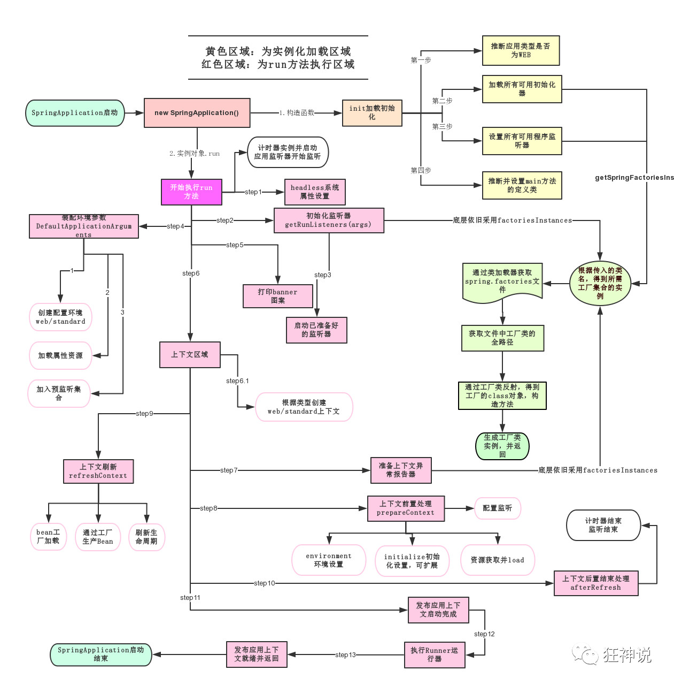

# SpringBoot

>  学习流程


> 什么事SpringBoot

SpringBoot基于Spring开发，并不是替代Spring，而是和Spring紧密结合用于提升Spring体验。

SpringBoot **约定大于配置**，默认进行了很多配置，只需要很少的配置就可以开发。

> 优点

- Spring开发更加入门
- 开箱即用，简化配置
- 内嵌容器简化Web项目
- 没有XML配置和冗余代码


## 微服务

> 什么是微服务

 微服务是一种**架构风格**。 是一种将一个单一应用程序开发为一组小型服务的方法，每个服务运行在自己的进程中，服务间通信采用轻量级通信机制(通常用HTTP资源API)。 

业务拆分成一个一个的服务，彻底去掉耦合，每一个微服务提供单个业务功能，一个服务只做一件事。 小服务之间用http或RPC方式互通

> 单体应用框架

就是SSM，全部放在一个服务器上，打包为一个war包。

**好处**：

- 易于开发和测试，部署十分方便。需要拓展时，可以复制多个war包到多个服务器，做个负载均衡

**坏处**：

- 我要修改一个小小的地方也要停掉所有服务，重新打包成一个war包

> 微服务架构

把功能独立出来，业务由一个或多个功能组成。主要多个业务就赋值多个功能而不是war包

**好处**：

- 节省了资源，减少代码冗余
- 每个功能都是独立的，便于维护

但是，这种庞大的系统架构给部署和运维带来了很大难度。，Spring给了一套完整的微服务：

- 构建独立功能用**SpringBoot** 快速构建
- 大型**分布式网路服务**的调用使用**Spring cloud** 来实现分布式
- **中间件**有**spring cloud data flow**
- 

  http://blog.cuicc.com/blog/2015/07/22/microservices/#   

# 第一个springboot项目


**选择web**


**完成！**


> 建包要在主程序的同级目录下


> controller

```java
@RestController
public class Contreoller {

    @RequestMapping("/YY")
    public String data(){

        return "YY";
    }
}
```

> 运行效果


> 更改项目端口号


> banner

资源目录下创建banner.txt


## 打包

> package


> 位置

在target目录下


> powershell

在jar的目录下，**按住shift和右键**，打开powershell窗口

输入java -jar .\项目名


服务启动了,关闭idea的tomcat，再次打开 http://localhost:8080/YY ，还是能访问！

关闭powershell窗口后就无法访问了

> 微服务

这就是微服务，把服务变成一个个块，不依赖idea也能打开，内置了tomcat


# 

# 1.自动装配

## 依赖

#### pom.xml

pom.xml的**父类** spring-boot-starter-parent


> 启动器
>
> > spring-boot-starter-XXX:从dependencies中自动导入环境依赖

**例如**-web：**自动导入web环境的所有依赖**

点击去就能发现**很多依赖包**：spring-web，spring-webmvc，tomcat，json

```xml
 <dependency>
<!--          启动器，web这个依赖包含了SpringMvc,自动装配，使用tomcat为默认容器-->
            <groupId>org.springframework.boot</groupId>
            <artifactId>spring-boot-starter-web</artifactId>
        </dependency>
```


####  spring-boot-starter-parent

>  资源过滤,maven插件

```
<resources>
      <resource>
        <filtering>true</filtering>
        <directory>${basedir}/src/main/resources</directory>
        <includes>
          <include>**/application*.yml</include>
          <include>**/application*.yaml</include>
          <include>**/application*.properties</include>
        </includes>
      </resource>
      <resource>
        <directory>${basedir}/src/main/resources</directory>
        <excludes>
          <exclude>**/application*.yml</exclude>
          <exclude>**/application*.yaml</exclude>
          <exclude>**/application*.properties</exclude>
        </excludes>
      </resource>
    </resources>
```

#### dependenices

>所有功能场景变成启动器

spring-boot-dependencies 包下，已经指定好了那个版本，依赖时就不需要指定了


这些就是**启动器**

如果你想用哪个环境，就启用对应的启动器就行了

> 自带依赖


pom.xml的web包就是从dependencies中取出来


## 主程序

```java
//这个类就是一个Component
@SpringBootApplication
//@SpringBootApplication标志这个类是一个springboot的应用
public class DemoApplication {

    public static void main(String[] args) {
        SpringApplication.run(DemoApplication.class, args);
    }

}
```


### 注解


#### @主配置类：springBootApplication：

==作用==：将该包及其所有子包纳入spring容器,**这就是为什么要将业务放到主程序同级目录下的原因**

```java
//元注解，用来修饰当前注解，就像public类的修饰词，无实际功能
@Target(ElementType.TYPE)
@Retention(RetentionPolicy.RUNTIME)
@Documented
@Inherited
// springboot的配置，说明这是一个配置文件类，它会被@ComponentScan扫描到
@SpringBootConfiguration
// 开启自动装配
@EnableAutoConfiguration
//扫描包（filters过滤一些东西）
@ComponentScan(excludeFilters = { @Filter(type = FilterType.CUSTOM, classes = TypeExcludeFilter.class),
		@Filter(type = FilterType.CUSTOM, classes = AutoConfigurationExcludeFilter.class) })
public @interface SpringBootApplication {
```


##### @SpringBootConfiguration：主程序为配置类

```
@Target(ElementType.TYPE)
@Retention(RetentionPolicy.RUNTIME)
@Documented
// 配置类
@Configuration
public @interface SpringBootConfiguration {
```


#### @EnableAutoConfiguration

==作用==：自动注册包和引入需要的第三方jar包

```java
@Target(ElementType.TYPE)
@Retention(RetentionPolicy.RUNTIME)
@Documented
@Inherited
//获取所在包进行注册
@AutoConfigurationPackage
// 将第三方jar引入
@Import(AutoConfigurationImportSelector.class)
public @interface EnableAutoConfiguration {
```


##### @AutoConfigurationPackage：所在包注册

```java
@Target(ElementType.TYPE)
@Retention(RetentionPolicy.RUNTIME)
@Documented
@Inherited
// 对源数据所在包下组件进行注册
@Import(AutoConfigurationPackages.Registrar.class)
public @interface AutoConfigurationPackage {
```


###### @AutoConfigurationPackages.Registrar

==作用==：打包源数据获取包名调用register注册

**register**方法： 注册包

```java
static class Registrar implements ImportBeanDefinitionRegistrar, DeterminableImports {

		@Override
		public void registerBeanDefinitions(AnnotationMetadata metadata, BeanDefinitionRegistry registry) {
            // 	new PackageImport(metadata).getPackageName())将源数据打包，并获得其包名
			register(registry, new PackageImport(metadata).getPackageName());
		}

		@Override
		public Set<Object> determineImports(AnnotationMetadata metadata) {
			return Collections.singleton(new PackageImport(metadata));
		}

	}
```

**包名**就是这个，主程序所在的包


##### @Import：三方jar包

List<String> configurations = getCandidateConfigurations(annotationMetadata, attributes);

进入getCandidateConfigurations

> getCandidateConfigurations:

```java
protected List<String> getCandidateConfigurations(AnnotationMetadata metadata, AnnotationAttributes attributes) {
    //  这边获取所有配置  getSpringFactoriesLoaderFactoryClass()方法就在下面
		List<String> configurations = SpringFactoriesLoader.loadFactoryNames(getSpringFactoriesLoaderFactoryClass(),
				getBeanClassLoader());
    //  如果为空，输出语句，META-INF/spring.factories
		Assert.notEmpty(configurations, "No auto configuration classes found in META-INF/spring.factories. If you "
				+ "are using a custom packaging, make sure that file is correct.");
		return configurations;
	}

//   EnableAutoConfiguration返回的就是主程序的包，所以获取的是springboot的所有配置
	protected Class<?> getSpringFactoriesLoaderFactoryClass() {
		return EnableAutoConfiguration.class;
	}

```

###### loadFactoryNames


> spring.factories

所在地址：


里面储存的都是配置类的路径，当你需要用时，就会通过路径调用配置类（比如视图解析器）

> 

#### 导图


---


### 主启动程序

#### springApplication

**这个类主要做了以下四件事情：**

1、推断应用的类型是普通的项目还是Web项目

2、查找并加载所有可用初始化器 ， 设置到initializers属性中

3、找出所有的应用程序监听器，设置到listeners属性中

4、推断并设置main方法的定义类，找到运行的主类

查看构造器：

```java
public SpringApplication(ResourceLoader resourceLoader, Class<?>... primarySources) {
    
    //	 加载资源
		this.resourceLoader = resourceLoader;
    //  primarySource不能为空
		Assert.notNull(primarySources, "PrimarySources must not be null");
    //  遍历primartSource
		this.primarySources = new LinkedHashSet<>(Arrays.asList(primarySources));
    //   推测web应用类型，并赋值到属性webApplicationType
		this.webApplicationType = WebApplicationType.deduceFromClasspath();
    //   监听初始化
		setInitializers((Collection) getSpringFactoriesInstances(ApplicationContextInitializer.class));
		setListeners((Collection) getSpringFactoriesInstances(ApplicationListener.class));
		this.mainApplicationClass = deduceMainApplicationClass();
	}
```

---


#### run 流程



==图片对应的代码==

```java
public ConfigurableApplicationContext run(String... args) {
       // 计时器
        StopWatch stopWatch = new StopWatch();
        //  计时器启动
        stopWatch.start();
//        初始化上下文，异常报告集合
        ConfigurableApplicationContext context = null;
        Collection<SpringBootExceptionReporter> exceptionReporters = new ArrayList<>();
//        strep1 系统属性设置
        configureHeadlessProperty();
        //  step2 创建所有spring监听器，底层采用factoriesInstances，通过类加载器获取spring.factories文件，进而反射得到class对象
        SpringApplicationRunListeners listeners = getRunListeners(args);
//        启动所有监听器
        listeners.starting();
        try {
//            step4  装配环境参数（如service.port=8082）
            ApplicationArguments applicationArguments = new DefaultApplicationArguments(args);
//             用监听器和环境参数创建配置环境
            ConfigurableEnvironment environment = prepareEnvironment(listeners, applicationArguments);
            configureIgnoreBeanInfo(environment);
//            step5 打印banner和环境
            Banner printedBanner = printBanner(environment);
//            step 6创建应用上下文
            context = createApplicationContext();
//            异常报告
            exceptionReporters = getSpringFactoriesInstances(SpringBootExceptionReporter.class,
                    new Class[] { ConfigurableApplicationContext.class }, context);
//            应用上下文准备完毕
            prepareContext(context, environment, listeners, applicationArguments, printedBanner);
//            step9 上下文刷新：bean工厂加载，通过工厂生产Bean，刷新生命周期
            refreshContext(context);
//              上下文后置结束处理（上下文和环境参数）
            afterRefresh(context, applicationArguments);
//            计时器结束
            stopWatch.stop();
            if (this.logStartupInfo) {
                new StartupInfoLogger(this.mainApplicationClass).logStarted(getApplicationLog(), stopWatch);
            }
//            上下文的监听完成
            listeners.started(context);
//             step12 执行所有runner运行器
            callRunners(context, applicationArguments);
        }catch (Throwable ex) {
            handleRunFailure(context, ex, exceptionReporters, listeners);
            throw new IllegalStateException(ex);
        }

        try {
//          step13 发布应用上下文
            listeners.running(context);
        }
        catch (Throwable ex) {
            handleRunFailure(context, ex, exceptionReporters, null);
            throw new IllegalStateException(ex);
        }
//        step13 就绪并返回
        return context;
    }
```


# 2.配置文件

springBoot的配置文件有两种


## properties

语法结构   key = value

```properties
service.port = 8081
```

如果使用properties和类绑定

```java
// 加载指定配置文件
@PropertySource(value = "classpath:student.properties")
public class Student {

//    使用properties文件设置属性
    @Value("${student.name}")
     private String name;
```


## yaml

>  语法结构  : key : 空格 value

空格的要求非常严格，**垂直对齐**，属性需要**缩进**

```yml
service:
   port: 8081
```

>  对象

```yaml
student:
  name: YY
  age: 22
  
#行内写法
student1: {name: YY,age: 22}
```

> 数组

```
#数组
pets:
  - cat
  - dog
  - pig

pets1: [cat,dog,pig]
```

### 属性赋值

 pojo

```java
//前提，这个类是组件
@Component
//将配置文件的每一个属性映射到这个组件中，将本类的所有属性和配置文件中的相关配置（student下的所有属性）对应绑定
@ConfigurationProperties(prefix = "student")
public class Student {
    private String name;
    private int age;
```

test

```java
@SpringBootTest
class DemoApplicationTests {
    @Autowired
    Student student;

    @Test
    void contextLoads() {
        System.out.println(student.getAge());
    }

}
```


### 松散绑定

数据库字段名last-name  可以和 驼峰命名法lastName 自动绑定

```
private String LastName;
```


### JSR303数据校验

**需要先开启@validate数据校验**


```
//数据校验
@Validated
public class Student {

    @Email(message = "📪error")
    private String name;
```


## 多环境配

### 优先级


### 指定环境

> 多文件


```properties
#springboot的多环境配置，可以选择激活哪一个
spring.profiles.active=work
```

> 单文件

```yaml
#springboot的多环境配置，可以选择激活哪一个
spring:
  profiles:
    active: test
#使用---分割
---
server:
  port: 8083
spring:
  profiles: test

---
server:
  port: 8082
spring:
  profiles: work
---
server:
  port: 8084
spring:
  profiles: up

```


## 错误

1. 把server 写成service 导致端口修改没有生效
2. 单文件配置多环境时，文件名必须是


## 配置类

**自动配置类**为XXXAutoConfiguration

**配置类名**为XXProperties

> EnableConfigurationProperties

==作用==：**自动配置类**会将**配置类**所在的包注册，并设默认值


> ConfigurationProperties

**配置类**和配置文件绑定


> 引入配置类的条件

当所有条件成立，**自动配置类**才会**生效**，才能将配置类**注册**进IOC容器


> 手动配置参数


prefix对应的就是配置类名，然后设置它的属性

```properties
#设置配置类的属性,配置类的Configuration和配置文件绑定，那么prefix对应的就是类名，就可以设置类名的属性
spring.data.web.page = 10
```


### 查看生效的配置类

```yaml
debug: true
```

positive match：显示生效的配置类

nagative match：显示未生效的配置类


# 3.Web开发

需要解决的问题

- 导入静态资源
- 首页
- jsp，模板引擎thymeleaf
- 装配扩展springMVC
- 业务
- 拦截器
- 国际化


## 导入静态资源

>  WebMVCConfiguration.class

找到addResourceHandler方法

```java
@Override
		public void addResourceHandlers(ResourceHandlerRegistry registry) {
            //判断静态资源是否已自动配置
			if (!this.resourceProperties.isAddMappings()) {
				logger.debug("Default resource handling disabled");
				return;
			}
			Duration cachePeriod = this.resourceProperties.getCache().getPeriod();
			CacheControl cacheControl = this.resourceProperties.getCache().getCachecontrol().toHttpCacheControl();
            // 判断资源是否配置到一下路径，如果没有，设置到该路径
			if (!registry.hasMappingForPattern("/webjars/**")) {
		customizeResourceHandlerRegistration(registry.addResourceHandler("/webjars/**")
						.addResourceLocations("classpath:/META-INF/resources/webjars/")
						.setCachePeriod(getSeconds(cachePeriod)).setCacheControl(cacheControl));
			}
            //  获取静态资源的路径 
			String staticPathPattern = this.mvcProperties.getStaticPathPattern();
			if (!registry.hasMappingForPattern(staticPathPattern)) {
				customizeResourceHandlerRegistration(registry.addResourceHandler(staticPathPattern)
						.addResourceLocations(getResourceLocations(this.resourceProperties.getStaticLocations()))
						.setCachePeriod(getSeconds(cachePeriod)).setCacheControl(cacheControl));
			}
		}
```

1. 访问webjar目录，通过maven引入的jar包都是这种方式

```java
/webjars/就是下面的缩写
classpath:/META-INF/resources/webjars/
```


2. 获取项目**静态资源路径** 

   **this.mvcProperties.getStaticPathPattern();**

```java

String staticPathPattern = this.mvcProperties.getStaticPathPattern();
//这句话在点进getStaticPathPattern();方法后
// /** 当前目录下的所有文件都识别，即资源目录
private String staticPathPattern = "/**";
// 被识别的目录，第一个就是上面那个jar报的
private static final String[] CLASSPATH_RESOURCE_LOCATIONS = { 
  "classpath:/META-INF/resources/"  , "classpath:/resources/", 
    "classpath:/static/",   "classpath:/public/" };
```

剩下三个：对应资源目录下的三个文件夹（可手动创建）


### 总结

通过源码，我们知道4种方式处理静态资源

- webjar 第三发jar包			访问路径：localhost:8080/webjar/文件名
- public,static,resources  三个目录下的文件    访问路径：lovalhost:8080/文件名

优先级：resource > static(默认) > public 


## 模板引擎

> 什么是模板引擎

 是为了使用户界面与业务数据（内容）分离而产生的，它可以生成特定格式的文档，用于网站的模板引擎就会生成一个标准的[HTML](https://baike.baidu.com/item/HTML/97049)文档 ，比如JSP就是一个模板引擎。

**有时候经常需要根据后端返回的json数据，然后来生成html，再渲染页面。**，模板引擎就是写一个页面模板，将一些动态的值也能通过表达式填充到指定位置


> 导入依赖

```xml
<dependency>
            <groupId>org.springframework.boot</groupId>
            <artifactId>spring-boot-starter-thymeleaf</artifactId>
        </dependency>
```


> 源码

ThymeleafProperties.class

相当于**视图解析器**，为资源加上前缀后缀

```java
@ConfigurationProperties(prefix = "spring.thymeleaf")
public class ThymeleafProperties {

	private static final Charset DEFAULT_ENCODING = StandardCharsets.UTF_8;

    //指定的路径为templates，前缀即为路径
	public static final String DEFAULT_PREFIX = "classpath:/templates/";

    //文件后缀为html
	public static final String DEFAULT_SUFFIX = ".html";
```

### 资源位置 tempates

通过controller跳转资源，需要把资源放到**templates目录下**

而且**templates的资源只允许controller访问**


> controller.class：

**视图名**：classpath:/templates/文件名.html

```java
//   templates目录下的所有资源，只有controller才能访问
//   因为没有视图解析器，所以需要模板引擎的支持 thymeleaf
@Controller
public class IndexController {

    
//    设置首页
    @RequestMapping("/index")
    public String index(){
        return "index";
    }
    
   @RequestMapping("/test")
    public String test(Model model){
        model.addAttribute("message","YY");
        List<Object> lists = new ArrayList();
        lists.add("YZY");
        lists.add("YY");
//        模板引擎将视图名拼接成classpath:/templates/test.html
        return "test";
    }
}
```

> test.html

```
<h1>test</h1>
<!--直接输出可能不会显示-->
${message}
```


改良版

```
<html lang="en" xmlns:th="http://www.thymeleaf.org">

<!--使用thymeleaf语法，类似vue
            th:属性-->
<p th:text="${message}"></p>
```


### 语法


```html
<!--遍历集合-->
<h2 th:each="list:${lists}" th:text="${list}"></h2>
<!--也可以写在内容中-->
<h2 th:each="list:${lists}" >[[ ${list} ]]</h2>
```

>  获取静态资源需要@{路径}

```js
th:href = "@{/css/**}"
```

> 复用代码:

复用组件放在一个公用文件内，并用th：fragment标记

```html
<nav class="navbar navbar-dark sticky-top bg-dark flex-md-nowrap p-0" th:fragment="navBar">

```

调用common文件夹的common文件中的sideBar组件

```html
th:insert = '@{common/common::sideBar}'
```

> 判断

```html
	<td th:text="${employee.getGender()==0?'女':'男'}"></td>
```


## 设置首页

>  源码webMVCConfiguration

WelcomePageHandlerMapping：欢迎界面（首页）映射

```java
public WelcomePageHandlerMapping welcomePageHandlerMapping(ApplicationContext applicationContext,
				FormattingConversionService mvcConversionService, ResourceUrlProvider mvcResourceUrlProvider) {
			WelcomePageHandlerMapping welcomePageHandlerMapping = new WelcomePageHandlerMapping(
					new TemplateAvailabilityProviders(applicationContext), applicationContext, getWelcomePage(),
					this.mvcProperties.getStaticPathPattern());
			welcomePageHandlerMapping.setInterceptors(getInterceptors(mvcConversionService, mvcResourceUrlProvider));
			return welcomePageHandlerMapping;
		}


		private Optional<Resource> getWelcomePage() {
            // 获取资源目录
			String[] locations = getResourceLocations(this.resourceProperties.getStaticLocations());
			return Arrays.stream(locations).map(this::getIndexHtml).filter(this::isReadable).findFirst();
		}

//     获取静态资源目录下的index.html
		private Resource getIndexHtml(String location) {
			return this.resourceLoader.getResource(location + "index.html");
		}
```

可以吧首页放在资源目录的三个**静态资源文件夹**内


**映射成功**


## 扩展MVC

扩展MVC功能可以传建一个MVC配置类，可以**接管**自动配置类里的**某些功能**，不可全面接管@EnableWebMVC


> 源码

```java
public View resolveViewName(String viewName, Locale locale) throws Exception {
		RequestAttributes attrs = RequestContextHolder.getRequestAttributes();
		Assert.state(attrs instanceof ServletRequestAttributes, "No current ServletRequestAttributes");
		List<MediaType> requestedMediaTypes = getMediaTypes(((ServletRequestAttributes) attrs).getRequest());
		if (requestedMediaTypes != null) {
            //   获取springboot中的所有解析器
			List<View> candidateViews = getCandidateViews(viewName, locale, requestedMediaTypes);
            //  选择出最好的视图解析器
			View bestView = getBestView(candidateViews, requestedMediaTypes, attrs);
			if (bestView != null) {
				return bestView;
			}
		}
```


> 自己写一个视图解析器

```java
//如果加上这个注解，webMVC自动配置类就会失效
@EnableWebMvc
public class webMVCConfig implements WebMvcConfigurer {

//    会把自己写的视图解析器也装配到环境的视图解析器里
    @Bean
    public ViewResolver view(){
        return new MyViewResolver();
    }

    @Override
    public void addViewControllers(ViewControllerRegistry registry) {
        registry.addViewController("/springboot").setViewName("test");
    }
}
//定义一个自己写的视图解析器
class MyViewResolver implements ViewResolver{
//
    @Override
    public View resolveViewName(String s, Locale locale) throws Exception {
        return null;
    }


}
```

> 不可以加上@EnableWebMVC

webMVCConfiguration文件里有这样一句话：

```java
//当不存在这个WebMvcConfigurationSupport.class时条件成立
@ConditionalOnMissingBean(WebMvcConfigurationSupport.class)
```

如果加上，点入注解

```java
// 点入配置类
@Import(DelegatingWebMvcConfiguration.class)
public @interface EnableWebMvc {
}

```

点入配置类，发现这个类**继承WebMvcConfigurationSupport**

```java
public class DelegatingWebMvcConfiguration extends WebMvcConfigurationSupport {
```

这就和前面的自动配置类冲突，导致自动配置类配置类失效


## 业务

模拟数据库

> 表

```java
//部门表
public class Department {

    private Integer id;
    private String departmentName;
```

```java
//员工表
public class Employee {

    private Integer id;
    private String lastName;
    private String email;
//    性别 女：0 男：1
    private Integer gender;
    private Department department;
    private Date birth;
```

> 业务层

```java
@Repository
public class DepartmentDao {

//    模拟数据
    private static Map<Integer, Department> departmentMap = null;
    static{
        departmentMap = new HashMap<>();
        departmentMap.put(1,new Department(101,"开发"));
        departmentMap.put(2,new Department(102,"运维"));
        departmentMap.put(3,new Department(103,"测试"));
    }

//    业务
//    获取所有部门信息
    public Collection<Department> findAllDepartment(){
        return departmentMap.values();
    }

//    通过id获取部门信息
    public Department findDepartMentByID(Integer id){
        return departmentMap.get(id);
    }

}
```

```java
@Repository
public class EmployeeDap {

    private static Map<Integer , Employee> employeeMap= null;
//    员工所属的部门
    @Autowired
    private DepartmentDao departmentDao;

    static{
        employeeMap = new HashMap<>();
        employeeMap.put(1,new Employee(1,"YZY","email1",1,new Department(1,"开发")));
        employeeMap.put(2,new Employee(2,"YY","email2",0,new Department(2,"运维")));
        employeeMap.put(3,new Employee(3,"JJ","email3",0,new Department(1,"开发")));
        employeeMap.put(4,new Employee(4,"HC","email4",1,new Department(3,"测试")));
    }

//    业务\
//    主键自增
    private static Integer initid = 5;
//    增加一个员工
    public void addEmployee(Employee employee){
        employeeMap.put(initid++,employee);
    }
//    删除一个员工
    public void deleteEmployee(Integer id){
        employeeMap.remove(id);
    }
//    修改员工
    public void updateEmployee(Employee employee){
        employeeMap.replace(employee.getId(),employee);
    }
//    查询所有员工
    public Collection<Employee> findAllEmloyee(){
       return employeeMap.values();
    }
//    通过id查找员工
    public Employee findEmloyeeById(Integer id){
        return employeeMap.get(id);
    }

}
```


如果直接把主页跳转放在controller层，**页面的样式不会加载**


## 国际化

登录界面可以切换中文和英文


想要切换，就需要一个配置类：

> MyLocaleResolver配置类

```java
@Configuration
public class MyLocaleResolver implements LocaleResolver {

    @Override
    public Locale resolveLocale(HttpServletRequest request) {
//        获得语言切换的参数请求
        String language = request.getParameter("language");
//        默认
        Locale locale = Locale.getDefault();
//        如果携带了参数，就赋值返回
        if(!StringUtils.isEmpty(language))
        {
//            _分割：语言，国家
            String[] split = language.split("_");
            locale = new Locale(split[0],split[1]);
        }
        return locale;
    }

    @Override
    public void setLocale(HttpServletRequest request, HttpServletResponse response, Locale locale) {

    }
}
```

> MyWebMVCConfig

```java
@Configuration
public class MyMVCConfig implements WebMvcConfigurer {
    @Override
    public void addViewControllers(ViewControllerRegistry registry) {
        registry.addViewController("/").setViewName("index");
        registry.addViewController("/index.html").setViewName("index");
    }

//    自定义的国际化组件生效
    @Bean
    public LocaleResolver localeResolver(){
        return new MyLocaleResolver();
    }
}
```


## 拦截器

> 创建一个拦截器的类

```java
public class LoginInterceptor implements HandlerInterceptor {

    @Override
    public boolean preHandle(HttpServletRequest request, HttpServletResponse response, Object handler) throws Exception {
        String loginname = (String) request.getSession().getAttribute("loginname");
        if (loginname.length() != 0) {
            request.setAttribute("message","还未登陆，无法访问");
            request.getRequestDispatcher("/index.html").forward(request,response);
            return true;
        } else {
            return false;
        }
    }
}
```

> 在webMVCConfiguration配置拦截器

```java
//添加自定义的拦截器
    @Override
    public void addInterceptors(InterceptorRegistry registry) {
//                                                          拦截全部请求，除了主页和登录请求,还有静态资源
        registry.addInterceptor(new LoginInterceptor()).addPathPatterns("/**")
                .excludePathPatterns("/index.html","/","/login","/css/**","/img/**","/js/**");
    }
```


## 页面

### 提取公共元素

提取到一个公共文件**common/common.html**

```html
<!--头部导航栏-->
<nav class="navbar navbar-dark sticky-top bg-dark flex-md-nowrap p-0" th:fragment="navBar">
    <a class="navbar-brand col-sm-3 col-md-2 mr-0" href="http://getbootstrap.com/docs/4.0/examples/dashboard/#">欢迎用户：[[${session.loginname}]]</a>
    <input class="form-control form-control-dark w-100" type="text" placeholder="Search" aria-label="Search">
    <ul class="navbar-nav px-3">
        <li class="nav-item text-nowrap">
            <a class="nav-link" href="http://getbootstrap.com/docs/4.0/examples/dashboard/#">注销</a>
        </li>
    </ul>
</nav>


<!--侧边导航栏-->
<nav class="col-md-2 d-none d-md-block bg-light sidebar" th:fragment="sideBar">
    
    
    <!--公共元素中接收参数并判断-->
    					<a th:class="${active=='list.html'?'nav-link active':'nav-link'}"></a>

```

其他页面**调用**（可带参数）

```html
<!--	头部导航栏-->
<div th:replace="~{common/common::navBar}"></div>
<!--				侧边栏,带参数-->
			<div th:replace="~{common/common::sideBar(active='main.html')}"></div>
```


### 前端流程

- 创建需要的网页
- 调用公共元素和编写其他元素
- 将网页放入webMVCConfig内管理
- 与业务连接