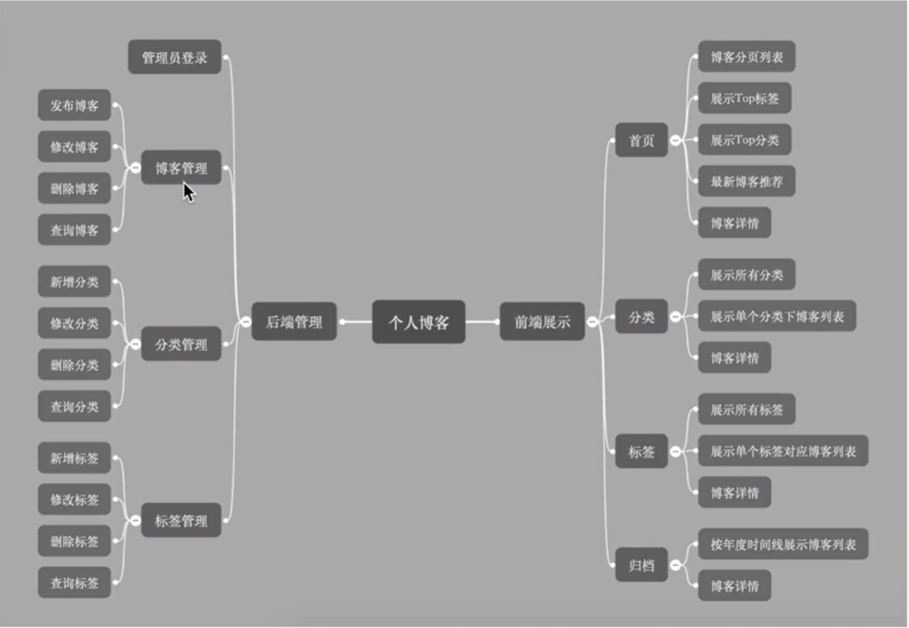
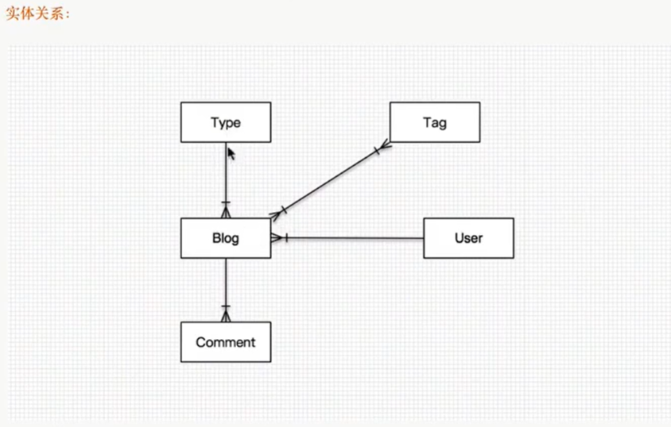
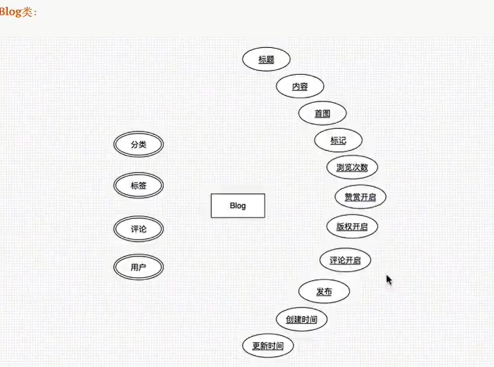
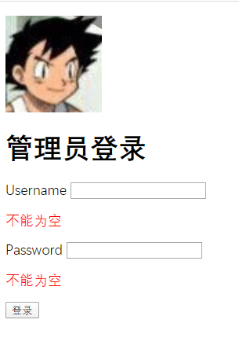
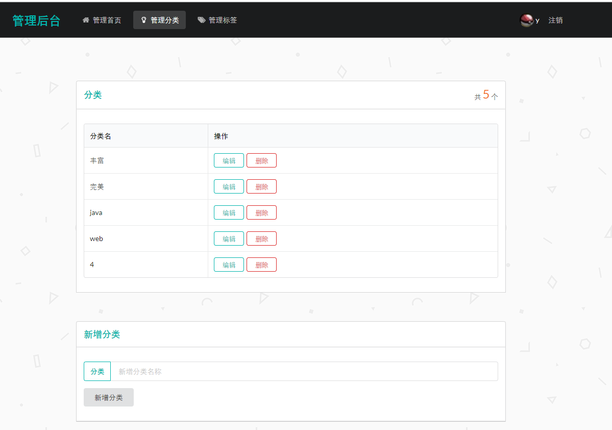
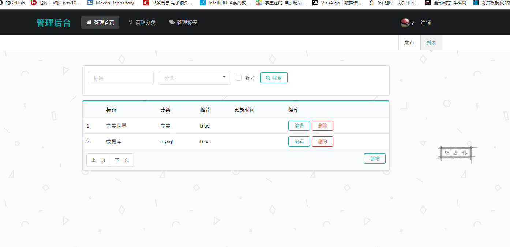
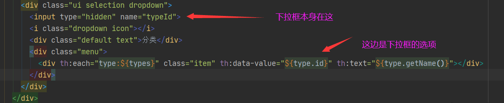

# Blog


## 需求分析

### 用户

- 在**主页**查看**热门博客**
- 查看所有博客
- 通过**分类**查看分类下的博客
- 通过**标签**查看拥有该标签的博客
- 通过**关键字搜索**博客
- **评论**
- 通过**顺序**（时间，热门量，评论数）排列博客


### 管理员

- **登录**后台管理
- 管理博客
  - 增删改查
  - 添加标签
  - 设置分类
  - 删除评论
  - 回复评论
- **标签**
  - 查看标签
  - 添加标签
  - 删除标签
  - 修改标签
- 分类
  - 查看分类
  - 增加分类
  - 修改分类
  - 删除分类


### 功能




## 设计

使用Axure


### 前端展示

- 导航栏（用户）

  - 首页
  - 分类
  - 标签
  - 搜索
  - 关于作者

  

  

  

- 底部栏

  - 联系我

  

- 首页

  - 显示热门博客和top的标签和分类

  

- 博客内容

  - 标题
  - 内容
  - 时间
  - 评论
  - 推荐（同分类下）

  

- 分类页

  - 显示所有分类
  - 分类里显示分类博客

  

- 标签页

  - 显示所有标签
  - 标签里显示标签博客


### 后端管理

- 导航栏（管理员）

  - 博客管理
  - 分类管理
  - 标签管理

  

- 登录页

- 博客管理页

  - 增删改查

- 标签管理页

  - 管理标签下的博客

- 分类管理页

  - 管理分类下的博客


# 开发

## 管理员

### 实体类

blog 与其他实体类的关系

- 与Type多对一
- 与Tag  多对一
- 与comment一对多



- blog包含的内容




### 登录

> 流程

- 访问登录页面
  - 地址栏输入admin/tologin 
  - 访问admin下的资源路径shiro触发登录
- 输入账号和密码
  - 如果为空，ajax失焦提示
  - 如果不正确，返回tologin页面并且显示错误原因
- 登陆之后默认进入blogs管理界面，导航栏显示用户信息




> 代码

1.在admin下创建login页面用于登录操作

```java
@RequestMapping("/login")
    public String login(String username,String password,Model model,HttpSession session){
        //        获取当前用户
        Subject subject = SecurityUtils.getSubject();
//          封装前端传来的信息
        UsernamePasswordToken token = new UsernamePasswordToken(username,password);
        try {
            //        为当前用户登录该账号密码，这个方法会在realm中验证是否正确然后异常
            subject.login(token);
            session.setAttribute("admin",username);
            return "admin/blogs";
        }catch (UnknownAccountException e){
            model.addAttribute("msg","此账号不存在");
            return "admin/login";
        }catch (IncorrectCredentialsException e){
            model.addAttribute("msg","密码错误");
            return "admin/login";
        }

    }
```

2.使用**shiro**管理登录安全，拦截所有admin下的请求

```java
@Bean
    public ShiroFilterFactoryBean bean(DefaultWebSecurityManager manager){
        ShiroFilterFactoryBean bean = new ShiroFilterFactoryBean();

        HashMap<String,String> map = new HashMap<>();
//        这边的拦截路径不能设置/admim/*，会拦截掉登录请求
        map.put("/admin/blogs","authc");
        map.put("/admin/input","authc");
        map.put("/admin/info","authc");
        map.put("/admin/types","authc");
        map.put("/admin/tags","authc");
//      设置过滤路径
        bean.setFilterChainDefinitionMap(map);
//        将当前用户纳入安全管理
        bean.setSecurityManager(manager);
//      设置登录页面路径
        bean.setLoginUrl("/admin/tologin");
//        bean.setSuccessUrl("/admin/");
        return bean;
    }
```

3.ajax失焦验证

```html
function a() {
            $.ajax({
                url : "/admin/username",
                //data用于给controller传递值
                data : {"username" :$("#username").val()},
                success :function (data) {
                    $("#usernameInfo").css("color", "red");
                    $("#usernameInfo").html(data)
                }
            })
        };
```

```java
 /*验证模块*/
    @RequestMapping("/username")
    @ResponseBody
    public String username(String username){
        String info = "";
        if(username.length()==0){
            info="不能为空";
        }
        return info;
    }
```


### 分类管理

> 功能

- 查询所有分类
  - 分类页面，显示所有分类
- 添加分类
  - 分类页面可以添加分类
  - ajax失焦判断是否存在该分类
- 删除分类
  - 分类页面分类表的操作栏可以删除
- 修改分类
  - 分类页面的分类表的操作栏可以修改
  - 通过获取id，跳转修改页面：查询显示对应的分类并修改



> 代码

1.查询

```java
@RequestMapping("/types")
    public String types(Model model){
        List<Type> types = typeService.queryTypes();
        model.addAttribute("types",types);
        return "admin/types";
    }
```

2.添加

```java
@RequestMapping("/add")
    public String add(String type,HttpSession session){
        Type type1 = typeService.queryTypeByName(type);
        if(type1==null){
            typeService.addType(type);
            session.setAttribute("info","添加成功");
        }
        return "redirect:/admin/types";
    }
```

3.删除

```java
@RequestMapping("/delete")
    public String delete(String name,HttpSession session){
        int i = typeService.deleteType(name);
        if(i>0){
            session.setAttribute("info","删除成功");
        }else
            session.setAttribute("info","删除失败");
        return "redirect:/admin/types";
    }
```

4.修改

```java
@RequestMapping("/update")
    public String update(Type type,HttpSession session){
        int i = typeService.updateType(type);
        if (i>0){
            session.setAttribute("info","修改成功");
        }else{
            session.setAttribute("info","修改失败");
        }
        return "redirect:/admin/types";
    }
```


### 标签管理


### 博客管理

- 显示所有博客
  - 登录首页显示所有博客
  - 显示博客的部分信息：id，标题，类型，推荐，更新时间
- 查询博客
  - 博客页面上方有搜索栏，提供标题模糊查询和类型查询
- 博客修改
  - 博客右方有修改按钮，点击跳转携带博客id前往修改页面显示具体博客信息
- 博客删除
  - 博客右方有删除按钮，点击通过id删除对应博客

- 增加博客
  - 首页新增按钮跳转编写博客页面
  - 点击创建写入数据库



1.博客首页

```java
 /*跳转模块*/
    @RequestMapping("/blogs")
    public String adminblogs(Model model){
        model.addAttribute("blogs",blogService.queryBlogs());
        model.addAttribute("types",typeService.queryTypes());
        return "admin/blogs";
    }
```

2.标题和分类模糊查询

```java
@RequestMapping("/query")
//                      required可以为空
    public String query(@RequestParam(value = "title",required = false)String title,@RequestParam(value = "typeId",required = false)Long typeId, Model model){
        SearchBlog blog = new SearchBlog(title,typeId);
        model.addAttribute("types",typeService.queryTypes());
        model.addAttribute("blogs",blogService.queryBlogByName(blog));
        return "admin/blogs";
    }
```

mybatis**模糊查询**

```xml
<select id="queryBlogByName" parameterType="SearchBlog" resultMap="blog">
        select b.id bid,b.title,t.name tname,b.create_time,b.type_id btid,t.id tid,t.name tname, b.recommend from t_blog b,t_type t
        <where>
            b.type_id = t.id
            <if test="title!=null">
                and b.title like CONCAT(CONCAT('%',#{title}),'%')
             </if>
             <if test="typeId !=null ">
                and t.id = #{typeId}
             </if>
        </where>
    </select>

<resultMap id="blog" type="Blog">
        <id property="id" column="bid"/>
        <result property="title" column="title"/>
        <result property="updateTime" column="update_time"/>
        <result property="typeId" column="type_id"/>
        <result property="recommend" column="recommend"/>
        <association property="type" javaType="Type">
            <id property="id" column="tid"/>
            <result property="name" column="tname"/>
        </association>
    </resultMap>
```

3.


### 评论管理


### 前端一些小细节

#### 复用代码+高亮

复用代码设置

```html
<nav class="ui inverted attached segment m-padded-tb-mini " th:fragment="nav">
    <div class="ui container">
        <div class="ui inverted secondary stackable menu">
            <!--  logo-->
            <h2 class="ui teal header item">管理后台</h2>
            <a th:href="@{/admin/blogs}" th:class="${active=='blogs'?'m-item item m-mobile-hide active':'m-item item m-mobile-hide'}"><i class="home icon"></i>管理首页</a>
            <a th:href="@{/admin/types}" th:class="${active=='types'?'item active':'item'}"><i class="idea icon"></i>管理分类</a>
            <a th:href="@{/admin/tags}" th:class="${active=='tags'?'item active':'item'}"><i class="tags icon"></i>管理标签</a>
            <div class="right menu">
                <div class="ui dropdown item">
                <!--      头像图-->
                    
                    <span th:text="${session.admin}"></span>
                    <a th:href="@{/admin/logout}" class="item">注销</a>
                </div>
            </div>
        </div>
    </div>
</nav>
```

引用

```xhtml
<div th:replace="~{/common/admin-common::nav(active='types')}"></div>
```


#### ajax失焦校验

失焦触发

```html
<input type="text" id="typename" name="type" placeholder="新增分类名称" onblur="a()">

<script>
    function a() {
      $.ajax({
        url : "/type/typeExist",
        //data用于给controller传递值
        data : {"type" :$("#typename").val()},
        success :function (data) {
          $("#typeInfo").css("color", "red");
          $("#typeInfo").html(data)
        }
      })
    };
</script>
```

controller

```java
@RequestMapping("/typeExist")
    @ResponseBody
    public String username(String type){
        String info = "";
        Type type1 = typeService.queryTypeByName(type);
        if(type1 != null){
            info="该分类已存在";
        }
        return info;
    }
```

#### 提示框

```html
<div class="ui success message" th:unless="${#strings.isEmpty(session.info)}" id="info">
          <!-- 点击隐藏info提示栏-->
        <i class="close icon" onclick="document.getElementById('info').style.display='none'"></i>
        <div class="header">提示: </div>
        <p th:text="${session.info}"></p>
      </div>
```


#### 下拉框的th：each要放在下拉框的里面

```html
<div class="menu" >
                <div th:each="type:${types}" class="item" th:data-value="${type.id}" th:text="${type.getName()}"></div>
              </div>
```


# 问题

1.资源替换不生效

  删除target，重启


2.使用shiro无法登录

  登录controller中token的参数要填username，password

```
        UsernamePasswordToken token = new UsernamePasswordToken(username,password);
```


3.shiro登录无限跳转登录页面

 shiro拦截掉所有的admin下的请求包括登录，所以不能拦截登录请求


4.controller跳转失败，路径乱码

html页面跳转忘记加th： 模板


5.新增添加分类返回分类页显示500，但是能够添加成功

​	测试了一下，如果不执行添加分类业务就能直接跳转，但是执行业务就会无法解析thymeleaf

​    添加thymeleaf的依赖，解决了模板引擎的问题，但是报错No setter found for the keyProperty 'id' in 'java.lang.String'.

​	设置id的setget方法，将mybatis的insert插入语句

```xml
<insert id="addType" parameterType="java.lang.String" useGeneratedKeys="true" keyProperty="id" >
        insert into t_type(name) values (#{name})
    </insert>
```

  然后出现另一个问题SelectKey returned no data； 将 useGeneratedKeys="true" 删除。这个是返回id


6.ajax 无法返回数据：

 路径写错，将type写成types


7.ajax后端接受的参数为null

   form提交的方式为post，在iajax 中指明type ："post"，或者form中删除post


8.博客查询没有显示

​	1.debug发现controller传参typeid为0，而不是null

​	name=“typeId”放在了下拉框的选项上，应该放到下拉框本身



   2.改变之后不选择分类或者标题会报错，不能为空，那么接受参数不能使用BlogSearch，而是分开接受，使用@RequestParam并且可以为空

```java
@RequestMapping("/query")
//                      required可以为空
    public String query(@RequestParam(value = "title",required = false)String title,@RequestParam(value = "typeId",required = false)Long typeId, Model model){
        SearchBlog blog = new SearchBlog(title,typeId);
        model.addAttribute("types",typeService.queryTypes());
        model.addAttribute("blogs",blogService.queryBlogByName(blog));
        return "admin/blogs";
    }
```

