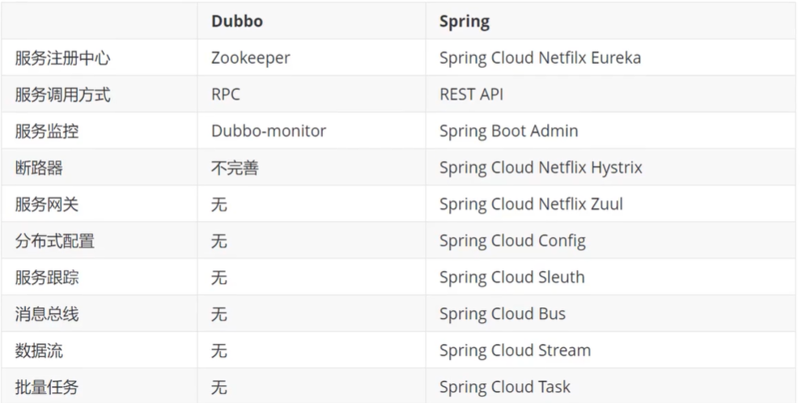

# SpringCloud

## 常见面试题

1.什么是微服务


2.微服务之间是如何独立通讯的


3.springcloud 和 dubbo 的区别


4.springboot 和springcloud ，请谈谈对他们的理解

- springboot是专注于快速开发单个微服务

- springcloud是基于springboot的全局的微服务整治协调框架。用于为微服务提供多种集成服务，如服务注册与发现，服务熔断，配置管理，分布式会话，断路器，路由器。

  

5.什么是服务熔断，什么是服务降级


6.微服务的优缺点分别是什么？


7.你所知道的微服务技术栈


8.eureka和zookeeper的区别


## 介绍微服务

> 优点

- 职责分开，单个服务值用于负责一个具体的功能需求
- 每个服务足够小，足够内聚，松耦合
- 开发简单，效率高，便于维护和拓展
- 能用不同语言开发
- 易于集成第三方，部署灵活


> 缺点

- 复杂性提高
- 运维难度真大
- 系统部署依赖
- 服务之间的通信
- 数据一致性 


## Spring Cloud 和Spring Boot的关系

1.Spring Cloud基于Spring Boot提供一套微服务解决方案，包括**服务注册与发现，配置中心，全链路监控，服务网管，负载均衡，熔断器**。


2.Spring Boot 专注于快速开发单个个体微服务   -jar包

  Spring Cloud 关注全局的微服务协调治理框架，它将Spring Boot开发的个体微服务**整合并管理**起来，为**各个微服务**提供：配置管理，服务发现，断路器，路由器，微代理，事件总线，全局锁，决策竞选，分布式回话等**集成服务**


## Dubbo 和Spring Boot对比



**最大区别**：Dubbo使用RPC通信，cloud使用REST方式

- RPC 基于HTCP/UDP或HTTP，性能更好，但是客户端和服务端存在耦合，服务端提供好方法给客户端调用，客服端需要知道服务端的类和方法。
- REST 基于HTTP，接口规范，HTTP本身功能过多，传输数据大，性能较低。客服端只获取数据

​     

其他区别：

- spring cloud 功能更加强大，范围更广，更加稳定
- dubo是很多功能组装起来，各个环节自由度很高，需要对其他组件有足够理解，兼容性较差


**总结**：Dubbo的定位是一款RPC框架，Spring Cloud是微服务一站式解决方案


# 搭建

和dubbo类似，先创建公共接口用于提供生产者和消费者的实体类

1.创建一个maven项目

2.父依赖导包

```xml
 <!--打包方式-->
    <packaging>pom</packaging>


    <properties>
        <!--依赖的版本管理-->
        <junit.version>4.12</junit.version>
    </properties>
    
<dependencyManagement>
        <dependencies>
            <!-- https://mvnrepository.com/artifact/org.springframework.cloud/spring-cloud-dependencies -->
            <dependency>
                <groupId>org.springframework.cloud</groupId>
                <artifactId>spring-cloud-dependencies</artifactId>
                <version>Greenwich.SR3</version>
                <type>pom</type>
                <scope>import</scope>
            </dependency>

            <!-- https://mvnrepository.com/artifact/org.springframework.boot/spring-boot-dependencies -->
            <dependency>
                <groupId>org.springframework.boot</groupId>
                <artifactId>spring-boot-dependencies</artifactId>
                <version>2.2.6.RELEASE</version>
                <type>pom</type>
                <scope>import</scope>
            </dependency>
            <!--数据库-->
            <dependency>
                <groupId>mysql</groupId>
                <artifactId>mysql-connector-java</artifactId>
                <version>5.1.47</version>
            </dependency>
            <!--springboot启动器-->
            <dependency>
                <groupId>org.mybatis.spring.boot</groupId>
                <artifactId>mybatis-springboot-starter</artifactId>
                <version>1.3.2</version>
            </dependency>
            <!--数据池-->
            <dependency>
                <groupId>com.alibaba</groupId>
                <artifactId>druid</artifactId>
                <version>1.1.10</version>
            </dependency>
            <!--单元测试-->
            <dependency>
                <groupId>junit</groupId>
                <artifactId>jut</artifactId>
                <version>${junit.version}</version>
            </dependency>
            <!--log4j-->
            <dependency>
                <groupId>log4j</groupId>
                <artifactId>log4j</artifactId>
                <version>1.2.17</version>
            </dependency>
        </dependencies>
    </dependencyManagement>
```

3.创建**公共接口**子项目springcloud-api

创建实体类

4.创建**提供者**子项目springcloud-provider-dept-8081

引用父依赖

5.创建mybatis配置文件和application.yaml

```yaml
server:
  port: 8081

mybatis:
  type-aliases-package: entity
  mapper-locations: classpath:mybatis/mapper/*.xml

spring:
  application:
    name: springcloud-provider-dept
  datasource:
    type: com.alibaba.druid.pool.DruidDataSource
    url: jdbc:mysql://localhost:3306/springboot?useUnicode=true&characterEncoding=utf-8
    username: root
    password: yzy665128
    driver-class-name: com.mysql.jdbc.Driver
```

mapper

```xml
<?xml version="1.0" encoding="UTF-8" ?>
<!DOCTYPE mapper
        PUBLIC "-//mybatis.org//DTD Config 3.0//EN"
        "http://mybatis.org/dtd/mybatis-3-mapper.dtd">
<mapper namespace="com.yzy.dao.DeptMapper">

    <select id="query" resultType="Dept">
        select * from dept
    </select>

    <select id="queryById" resultType="Dept">
        select * from dept where id = ${id}
    </select>

    <insert id="add" parameterType="Dept" keyProperty="id">
        insert into dept values(#{deptname},DATABASE())
    </insert>

</mapper>
```

controller

```java
@RestController
public class DeptController {

   @Autowired
   private DeptMapper deptMapper;

    @RequestMapping("/query")
    private List<Dept> query(){
        return deptMapper.query();
    }

    @RequestMapping("/add")
    private int query(Dept dept){
        return deptMapper.add(dept);
    }

    @RequestMapping("/id/{id}")
    private Dept id(Long id){
        return deptMapper.queryById(id);
    }
}
```

可以通过接口获取数据

