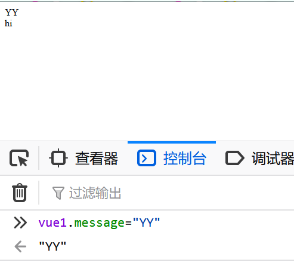
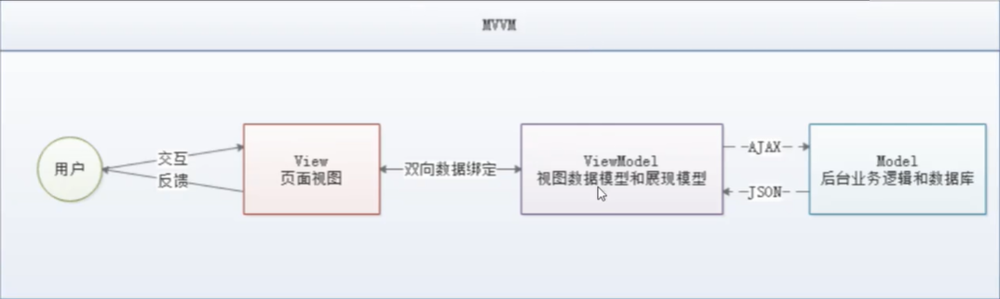
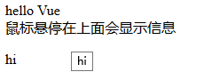
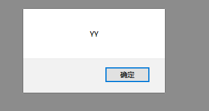
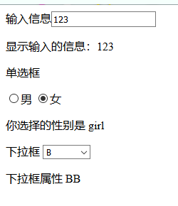
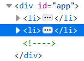
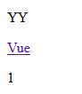
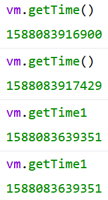
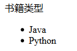

# Vue


## 前端三要素：

1.结构层：HTML  


2.表现层：CSS

1. CSS层叠样式表是一门**标记语言**，并不是编程语言，不可以之定义变量，不具备语法支持，有了以下缺陷

   - 语法不够强大
   - 没有变量和样式复用机制，重复输出，维护困难

2. 所以需要使用==CSS预处理器==

   定义了一种新的语言，为CSS增加一些编程的特性

   常用的CSS预处理器

   - SASS 基于Ruby，上手难度大
   - **LESS** 基于NodeJS，使用简单

   - 

3. **行为层：JavaScript**

   >  JS框架

   - **jQuery**：简化DOM操作，缺点是DOM操作繁琐，但是影响前端性能
   - **Angular**：Google搜狗，有一群Java程序员开发。将MVC模式照搬到前端并增加了==模块化开发==的理念，对后端程序员友好
   - **React**：FackBook，一款高性能的JS前端框架：特点是提出新概念：==虚拟DOM==**，用于减少真实DOM 操作，在内存中模拟DOM 操作，**有效提升前端渲染效率**，缺点是使用复杂，需要学习JSX语言
   - **Vue**：一款渐进式JS框架，**特点是综合Angular（模块化）和React（虚拟DOM）的优点**
   - **Axios**：**前端通信框架**；因为Vue的边界很明确，为了DOM 操作，**不具备通信功能**，所以需要额外使用通信框架和服务器交互。也可以使用jQuery的Ajax

   > UI框架

   - Ant-Design : 阿里巴巴出品，基于React 的UI框架

   - ElementUI，iview,ice，饿了么出品，基于Vue的UI 框架，iview移动端，

     其中**ElementUI桌面端，组件齐全，四个质量较高的Vue UI 框架**

   - Bootstrap：Twitter出品，用于前端开发的开源工具包

   - AmazeUI：HTML5跨屏前端框架

   > JavaScript构建工具

   - Babel：JS编译工具，主要用于浏览器不支持的ES特性
   - WebPack：模块打包器，主要作用是打包，压缩，合并及按序加载

   > 前端的后端工具

   为了使前端人员方便开发后台应用，创建出NodeJS，但是架构不好，过于笨重，已在开发全新框架Deno

   - Express：NodeJS框架
   - Koa：Express 简化版
   - npm：项目综合管理工具，类似Maven
   - yarn：NPM的替代方案，类似于Maven和Gradle的关系


## 概念介绍

- Vue是渐进式js框架，那么什么是==渐进式==：**主张最少**（对使用者的要求，必须使用的）

  通俗的话：“ 给你一个空屋，至于你需要什么自己一件件添，而不是那种家居家电全齐，自己不喜欢再一件件的扔了，甚至required 必须用且耗费空间的！ ”  vue可以作为一个**模板**，也可以作为一个**组件**加入

- Vue 被设计为可以==自底向上逐层应用==。Vue 的核心库==只关注视图层==，不仅易于上手，还便于与第三方库或既有项目整合。 
- soc 关注点分离：
  - 也就是说系统中的一个部分发生了变化，不会影响其他部分 
  -  即使需要改变，也能够清晰地识别出那些部分需要改变 
  -  如果需要扩展架构，将影响最小化，已经可以工作的每个部分都将继续工作。 


## MVVM模式

> 什么是MVVM模式

- Model:模型层，表示javaScript对象
- view   ：视图层，这里表示DOM
- ViewModel ：连接视图和模型的中间件。Vue.js就是实现者
  - 能观测到数据的变化，并对视图进行实时更新
  - 能够监听视图层的变化，通知模型层进行改变

> Vue作为VM的优点

- 轻量级
- 易上手
- 吸取了Angular（模块化）和React（虚拟DOM）的优点
- 开源，热门

> 前后端分离

由下面的入门得到的结论：view层得到的是ViewModel的数据而不是Model的，由ViewModel负责和Model沟通。这完全解耦了View和Model。这是前后端分离至关重要的一步

# 入门

> 安装插件和导包

```js
<script src="https://cdn.staticfile.org/vue/2.2.2/vue.min.js"></script>
```

> view层

```html
<!--这个就是视图层，显示数据，这个数据从Model层经过ViewModel来到View，ViewModel是至关重要的一步-->
<div id="app">
    <!--    这里显示的就是model中给的数据，实时更新，
        这就是虚拟DOM：不操作DOM，运行和编译同时进行，直接更新数据，不需要刷新页面-->
    {{message}}
</div>
<div id="app2">
    {{hello}}
</div>
```

> model层

```js
/*vue就是模型层，提供数据*/
    var vue = new Vue({
        //绑定元素
        el: "#app",
        //数据交给前端控制
        data:{
            message:"hello Vue"
        }
    })

    var vue = new Vue({
        el:"#app2",
        data:{
            hello:"hi"
        }
    })
```

> ViewModel层：双向绑定

model层改变数据，视图层立马改变





> 虚拟DOM 的实现

View显示数据不用通过操作DOM，而是来自ViewModel的执行和编译同步，实时更新Model传来的数据


## 指令绑定v-bind

```html
<div id="app2">
<!--    绑定在元素上-->
    <span v-bind:title="hello">鼠标悬停在上面会显示信息</span>
     <p>{{hello}}</p>
</div>
```



## v-if

```html
<div id="app">
<!--    vue的判断-->
    <h1 v-if="message">yes</h1>
    <h1 v-else>no</h1>
</div>
```

```js
var vue = new Vue({
        el:'#app',
        data:{
            ok:true
        }
    })
```

结果：

​	yes

## v-for

```html
<div id="app">
    parents:
{{name}}:
<!--类似于foreach-->
    <li v-for="list in lists">
        children:
        {{list.message}}
        {{list.message1}}-
    </li>
</div>
<script>
```

```js
var vue = new Vue({
        el:'#app',
        data:{
            name:'yzy',
            //数组中有多个键值对
            lists:[
                {message:"YY"},
                {message1:"YZY"}
                ]
        }
    });
```

结果：

​		parents: yzy: 

​        children:        YY        -    

​        children:                YZY-    


## 绑定事件

```html
<div id="app">

<!--    Vue的触发时间v-on-->
    <button v-on:click="aa"></button>
</div>
```

```js
var vue = new Vue({
        el:'#app',
        data:{
            message:"YY"
        },
        //methods 注意，不是method，里面可以写很多个方法
        methods:{
        //    时间需要写在method里
            aa:function () {
                alert(this.message)
            }
        }
    })
```



## 双向绑定

前面的例子中已经展示了model更新，View实时更新，那么现在需要View更新，Model也更新

> v-model

> > 注意点

v-model 会忽略表单中的value checked selected等元素，将Vue实例的数据（data）作为数据来源，可以再data中声明初始值。

```html
<div id="w">
<!--  双向绑定，View层发生变化，Model层也要改变，使用v-model使数据发生改变-->
<!--    value如果不写就读取内容-->
    输入信息<input type="text" v-model="message">
<p>显示输入的信息：{{message}}</p>

    单选框
<!--    因为单选框只有选项，不能读取内容，所以需要手动value选项-->
    <p><input type="radio" value="boy" name="sexx" v-model="sex">男
        <input type="radio" value="girl" name="sexx" v-model="sex">女
    </p>
<!--    单选框绑定的信息是value-->
    <p>你选择的性别是 {{sex}}</p>


    <p>下拉框
        <select v-model="e">
<!--            默认的话要加value-->
            <option value="" disabled>请选择</option>
            <option value="A" >A</option>
            <option value="BB" >B</option>
            <option>C</option>
        </select></p>
    <p>下拉框属性 {{e}}</p>
</div>
```

```js
var vm = new Vue({
        el:'#w',
        data:{
            message:'',
            sex:'',
            e:''
        }
    })
```



# Vue 组件

 组件是可复用的 Vue 实例，且带有一个名字 ，这个名字就是HTML中自定义的标签名。当你使用了该标签名，就会**自动调用**该组件

> JS中定义一个Vue组件

组件名字叫cc**,好像只能小写**，这个组件的**标签名**就叫**cc**。

```html
<div id="app">
    <cc></cc>
    <cc></cc>
</div>
```

**上面的cc标签就会由下面的模板代替**

```js
/*定义一个Vue组件,名字叫cc,好像只能小写
    *       这个组件的标签名就叫cc，那么这个组件就会被模板代替*/


Vue.component("cc",{
        //模板，里面写的就是组件的HTML代码
        template:'<li>{{item.name}}</li>'
    });
```

**替代后的HTML**



> Model层绑定组件

**model层**

```js
var vm = new Vue({
        el:'#app',
        data:{
           items: [{name :'YY'},{name:'YZY'}]
        }
    });
```

**组件绑定Model层**

```html
<div id="app">
<!--            组件和Vue绑定是同级的，所以需要v-bind中间商绑定两者，动态传递prop-->
    <!--    v-bind:属性=“参数”-->
    <cc v-for="item in items" v-bind:item="item"></cc>
    <cc></cc>
</div>
```

组件绑定**传参**

```js
Vue.component("cc",{
        //Prop 是自定义 attribute，接收参数，当传值过来后，这个item就变成了组件的属性
        props:['item'],
        //模板，里面写的就是组件的HTML代码
        template:'<li>{{item.name}}</li>'
    });
```


**结果**：

- YY

- YZY


# 通信

> Axios

由于Vue严格遵守SOC，所以不具备通信功能，需要使用**Axios或者jQuery。**

但是jQuery操作DOM太频繁，不建议使用


## Axios写法

**和ajax的写法差不多**

```js
var vm = new  Vue({
mounted(){
            //和ajax差不多 get(获取的接口)    ，then（参数）获得响应，并进行操作（输出响应的数据）
            axios.get('data.json').then(function (response) {
                console.log(response.data);
               
            });
    
            //   lambda表达式简写
            axios.get("data.json").then(Response=>(consolo.log(Response.data));
            }
        //    输出结果   Object { name: "YY", url: "www", page: 1 }

    })
```


## 渲染数据

先定义属性，再赋值 

```js
<body>
<div id="app">
    <p>{{info.name}}</p>
    <a v-bind:href="info.url">Vue</a>
    <p>{{info.page}}</p>
</div>
</body>

var vm = new  Vue({
        el:'#app',
        data:{
                info:{
                    name: null,
                    url: null,
                    page: null
                }
        },
        mounted(){ 
            axios.get("data.json").then(Response=>(this.info = Response.data));
            }
    })
```



# 计算属性

**在内存中运行**：虚拟DOM，将计算出来的结果保存到属性中

```html
<div id="app">
<!--    通过方法-->
    <p>it's method: {{getTime()}}</p>
<!--    通过属性-->
    <p>it's attrabute: {{getTime1}}</p>
</div>
```

>  方法

```js
var vm = new Vue({
        el:'#app',
        methods:{
            getTime:function () {
                //获取当前时间戳
                return Date.now();
            }
        },
```

> 属性

```js
//计算属性，把方法当成属性，就不需要加()
        computed:{
            getTime1:function () {
                return Date.now();
            }
        }
    })
```

> 区别

- 方法**调用**需要加（）执行，属性不用加（）
- 方法调用每时每刻都会变

- **计算属性并不会改变**，因为计算结果放在了**内存中**。但**数据被刷新了**才会**重新计算**，相当于Mybatis的



> 优点

调用方法每次都要重新计算，影响效率。计算属性在不产生改变时会从内存中读取，减少系统开支，提高效率


# slot

在模板中使用，可以模板插模板，相当于一个**占位符**，其他模板可以**在这个位置插入**。

要把**book-title** 和 **book-item** 插入到**book**的插槽**slot**当中，就要**指明slot对应的组件**

```js
Vue.component('book',{
        template: '<div>' +
            //    需要将插槽和组件连接到一起,用name属性指定组件
            '<slot name="book-title"></slot>' +
            '<ul>' +
            '<slot name="book-item"></slot>' +
            '</ul>' +
            '</div>'
    });

    Vue.component('book-title',{
        //别忘了属性加‘’
        props: ['title'],
        template: '<lt>{{title}}</lt>'
    });
    Vue.component('book-item',{
        props: ['item'],
        template: '<li>{{item}}</li>\n'
    });
```

不仅组件中要指定，在HTML中的**组件标签**也要**指明插槽**，互相对应才能成功

```html
<div id="app">
        <p>列表书籍</p>
    <ul>
        <lt>书籍</lt>
        <li>java</li>
        <li>python</li>
        <li>php</li>
   </ul>

<!--上面的效果等同于下面的，可复用-->
    <book>
<!--       这边的插槽也要指定组件 绑定要在后面加上    ：绑定的属性-->
        <book-title slot="book-title" v-bind:title1="title"></book-title>
        <book-item slot="book-item" v-for="item in items" v-bind:item1="item"></book-item>
    </book>
</div>
```

**model层数据**

```js
var vm = new Vue({
        el:'#app',
        data:{
            items:['Java','Python'],
            title:'书籍类型'
        }
    })
```

**结果**：




# Vue生命周期

 