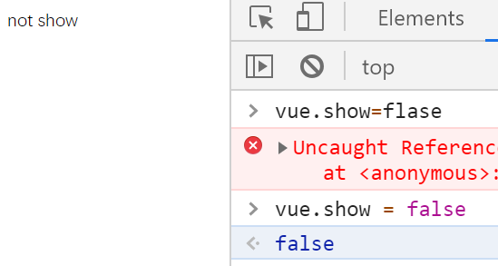
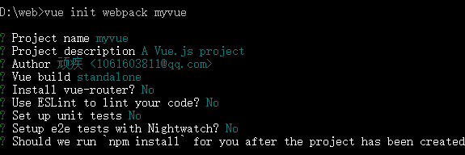

# 前端介绍

## 前端三要素：

1.结构层：HTML  


2.表现层：CSS

1. CSS层叠样式表是一门**标记语言**，并不是编程语言，不可以之定义变量，不具备语法支持，有了以下缺陷

   - 语法不够强大
   - 没有变量和样式复用机制，重复输出，维护困难

2. 所以需要使用==CSS预处理器==

   定义了一种新的语言，为CSS增加一些编程的特性

   常用的CSS预处理器

   - SASS 基于Ruby，上手难度大
   - **LESS** 基于NodeJS，使用简单

   - 

3. **行为层：JavaScript**

   >  JS框架

   - **jQuery**：简化DOM操作，缺点是DOM操作繁琐，但是影响前端性能
   - **Angular**：Google搜狗，有一群Java程序员开发。将MVC模式照搬到前端并增加了==模块化开发==的理念，对后端程序员友好
   - **React**：FackBook，一款高性能的JS前端框架：特点是提出新概念：==虚拟DOM==**，用于减少真实DOM 操作，在内存中模拟DOM 操作，**有效提升前端渲染效率**，缺点是使用复杂，需要学习JSX语言
   - **Vue**：一款渐进式JS框架，**特点是综合Angular（模块化）和React（虚拟DOM）的优点**
   - **Axios**：**前端通信框架**；因为Vue的边界很明确，为了DOM 操作，**不具备通信功能**，所以需要额外使用通信框架和服务器交互。也可以使用jQuery的Ajax

   > UI框架

   - Ant-Design : 阿里巴巴出品，基于React 的UI框架

   - ElementUI，iview,ice，饿了么出品，基于Vue的UI 框架，iview移动端，

     其中**ElementUI桌面端，组件齐全，四个质量较高的Vue UI 框架**

   - Bootstrap：Twitter出品，用于前端开发的开源工具包

   - AmazeUI：HTML5跨屏前端框架

   > JavaScript构建工具

   - Babel：JS编译工具，主要用于浏览器不支持的ES特性
   - WebPack：模块打包器，主要作用是打包，压缩，合并及按序加载

   > 前端的后端工具

   为了使前端人员方便开发后台应用，创建出NodeJS，但是架构不好，过于笨重，已在开发全新框架Deno

   - Express：NodeJS框架
   - Koa：Express 简化版
   - npm：项目综合管理工具，类似Maven
   - yarn：NPM的替代方案，类似于Maven和Gradle的关系


## 概念介绍

- Vue是渐进式js框架，那么什么是==渐进式==：**主张最少**（对使用者的要求，必须使用的）

  通俗的话：“ 给你一个空屋，至于你需要什么自己一件件添，而不是那种家居家电全齐，自己不喜欢再一件件的扔了，甚至required 必须用且耗费空间的！ ”  vue可以作为一个**模板**，也可以作为一个**组件**加入

- Vue 被设计为可以==自底向上逐层应用==。Vue 的核心库==只关注视图层==，不仅易于上手，还便于与第三方库或既有项目整合。 
- soc 关注点分离：
  - 也就是说系统中的一个部分发生了变化，不会影响其他部分 
  -  即使需要改变，也能够清晰地识别出那些部分需要改变 
  -  如果需要扩展架构，将影响最小化，已经可以工作的每个部分都将继续工作。 


## MVVM模式

> 什么是MVVM模式

- Model:模型层，表示javaScript对象
- view   ：视图层，这里表示DOM
- ViewModel ：连接视图和模型的中间件。Vue.js就是实现者
  - 能观测到数据的变化，并对视图进行实时更新
  - 能够监听视图层的变化，通知模型层进行改变

> Vue作为VM的优点

- 轻量级 
- 易上手
- 吸取了Angular（模块化）和React（虚拟DOM）的优点
- 开源，热门

> 前后端分离

由下面的入门得到的结论：view层得到的是ViewModel的数据而不是Model的，由ViewModel负责和Model沟通。这完全解耦了View和Model。这是前后端分离至关重要的一步

# 入门

## 插值

> 安装插件和导包

在html的页面导入vue

```js
<script src="https://cdn.staticfile.org/vue/2.2.2/vue.min.js"></script>
```

### 文本

> view层

**简洁显示数据模板**``{{message}}``

div可以绑定vue，通过{{message}}来显示message对应的值

```html
<!--这个就是视图层，显示数据，这个数据从Model层经过ViewModel来到View，ViewModel是至关重要的一步-->
<div id="app">
    <!--    这里显示的就是model中给的数据，实时更新，
        这就是虚拟DOM：不操作DOM，运行和编译同时进行，直接更新数据，不需要刷新页面-->
    {{message}}
</div>
<div id="app2">
    {{hello}}
</div>
```

> model层

在script中创建vue实例，在里面编写vue的具体数据

el：#app  代表与div中的id=app绑定，那么vue中的data就能显示到div中

```js
/*vue就是模型层，提供数据*/
    var vue = new Vue({
        //绑定元素
        el: "#app",
        //数据交给前端控制
        data:{
            message:"hello Vue"
        }
    })

    var vue = new Vue({
        el:"#app2",
        data:{
            hello:"hi"
        }
    })
```

> 数据与DOM绑定

在控制台，将message的值改成YY，那么view中的值也会随之改变

model层改变数据，视图层立马改变


> 虚拟DOM 的实现

View显示数据不用通过操作DOM，而是来自ViewModel的执行和编译同步，实时更新Model传来的数据


### v-show

true时显示，false隐藏

```js
<div id="app4">
    <span v-show="age>18">只有18岁及以上才能观看</span>
    <span v-show="sex==1">只有男性才能进入</span>
</div>

var vue4 = new Vue({
        el: "#app4",
        data: {
            age: 22,
            sex: 1,
        }
    })
```


当修改后不满足条件时，隐藏


### v-once

使用v-once也会一次性插入值，但是数值改变时，这个值并不会改变

```html
    <p v-once>v-once的值不会改变： {{message}}</p>
```


### v-html

如果值为html语句，使用{{}}就只会显示普通文本，无法应用html语句

这个p会被替代成html的代码，直接解析html中的内容，那么**p中的数据绑定就会无效**

```html
	值为html语句是，只会显示普通文本{{html}}
    <p v-html="html"></p>
```


### js表达式

**注意**：{{}}中的都是变量，如果想要显示字符串就需要加上双引号

```html
	<p>JS表达式</p>
    <p>{{number+1}}</p>
    <p>{{!message? number+1: "没有message"}}</p>
```


## 指令绑定v-bind

**v-bind可以省略**，例如v-bind:href = ：href

用于对HTML 的==属性==进行操作

`v-bind` attribute 被称为**指令**，指令带有前缀`v-` ,表示它们是 Vue 提供的特殊 attribute。

### v-bind-title

下面的意思是：将span这个元素节点的title 属性与vue的message保持一致，即将mesaage的值赋值给title属性

```html
<div id="app2">
<!--    绑定在元素上-->
    <span v-bind:title="hello">鼠标悬停在上面会显示信息</span>
     <p>{{hello}}</p>
</div>
```


### v-bind-href

将vue中的href替换a标签中的href

```js
<div id="app3">
    <p>
        vue.js教程：<a v-bind:href="url">vue.js</a>
    </p>
</div>
```

```js
var vue3 = new Vue({
        el: "#app3",
        data: {
            url : "https://cn.vuejs.org/v2/guide/"
        }
    })
```


### 动态参数

v-bind-后面的属性名也可以vue的数值替代


## 条件v-if/show

### v-if

有条件的渲染一块内容，当判断的表达式为true时才会被渲染出来

下面的意思：将对h1这个节点进行判断，当vue中的message的值为true，则渲染出h1中的内容yes，否则渲染v-else

==注意==，v-if和v-else只会判断对应的值是否满足，如果判断的值不同，则与他们无关，都不会渲染。 这里如果判断的是message1，那么message的值与if无关，yes和no都不会渲染

```html
<div id="app">
<!--    vue的判断-->
    <h1 v-if="message">yes</h1>
    <h1 v-else>no</h1>
</div>
```

```js
var vue = new Vue({
        el:'#app',
        data:{
            message:true
        }
    })
```

结果：

​	yes


### **v-else-if**

```
	<p v-if="message=== 'A' ">A</p>
    <p v-else-if="message=== 'B' ">B</p>
    <p v-else-if="message=== 'C' ">C</p>
    <p v-else>not A/B/C</p>
```


### v-show

另一个条件展示，语法与v-if类似，但是又有不同

不论条件是否满足，都会渲染出来，但是不满足条件的会设置不可见

```
<p v-show="show">show</p>
    <p v-show="!show">not show</p>
```



**show为false，show渲染出来，但是display设置成none**


### v-show和v-if的区别

1**.v-if是真正的条件渲染**，不符合条件的不会渲染拿出来

2.**v-show是条件展示**，搜有语句都会渲染，但是不满足条件的不会展示

3.**v-if的切换渲染开销更高**，**v-show的初始渲染开销更高**，如果需要频繁切换条件选择show，放置选择if


## 循环v-for

```html
<div id="app">
    parents:
{{name}}:
<!--类似于foreach-->
    <li v-for="list in lists">
        children:
        {{list.message}}
        {{list.message1}}-
    </li>
</div>
<script>
```

```js
var vue = new Vue({
        el:'#app',
        data:{
            name:'yzy',
            //数组中有多个键值对
            lists:[
                {message:"YY"},
                {message1:"YZY"}
                ]
        }
    });
```

结果：

​		parents: yzy: 

​        children:        YY        -    

​        children:                YZY-    


### 索引

可以添加第二个参数：索引

```html
<div id="app2">
    <ul>
        <li v-for="(item,index) in city">
            {{index}}-{{item}}
        </li>
    </ul>

    <ul>
        <li v-for="(item,index) in person">
            {{index}}
            <p>name:{{item.name}}</p>
            <p>age:{{item.age}}</p>
        </li>
    </ul>
```

```js
var vue2 = new Vue({
        el : "#app2",
        data: {
            city:["bj","sh","hz","nj","cq"],
            person:[{
                name: "yzy",
                age: 22,
            },
                {
                    name: "yy",
                    age: 21
                }]
        }
    })
```


### 遍历对象

只显示value，不显示key

```js
 <ul>
        toy's information
        <li v-for="value in toy">
            {{value}}
        </li>
    </ul>
 
 toy: {
                name: "mikey",
                age: 2,
                price: 22,
                sex: "boy"
            }
```


第二个参数可以显示key值，第三个为索引值

```html
		<li v-for="(value,name1,index1) in toy">
            {{index1}}--{{name1}}:{{value}}
        </li>
```


## 绑定事件v-on

可以简写成@

将Vue实例中的方法和view层操作绑定，**view执行操作触发方法**

```html
<div id="app">

<!--    Vue的触发事件v-on，可以简写成@click="aa"-->
    <button v-on:click="aa"></button>
</div>
```

```js
var vue = new Vue({
        el:'#app',
        data:{
            message:"YY"
        },
        //methods 注意，不是method，里面可以写很多个方法
        methods:{
        //    时间需要写在method里
            aa:function () {
                alert(this.message)
            }
        }
    })
```


### 计数器

```html
<div id="app3">
    <span>当前计数：{{counts}}
        <p><button @click="add">+</button>
        <button @click="subtract">-</button>
        </p>
    </span>
</div>
```

```js
/*计数器*/
var vue3 = new Vue({
    el: "#app3",
    data: {
        counts: 0
    },
    methods: {
        add: function () {
              this.counts++;
        },
        subtract : function () {
            if(this.counts>0){
                this.counts--;
            }
        }
    }
})
```


## 双向绑定v-model

前面的例子中已经展示了model更新，View实时更新，那么现在需要View更新，Model也更新

> v-model

> > 注意点

v-model 会忽略表单中的value checked selected等元素，将Vue实例的数据（data）作为数据来源，可以再data中声明初始值。

```html
<div id="w">
<!--  双向绑定，View层发生变化，Model层也要改变，使用v-model使数据发生改变-->
<!--    value如果不写就读取内容-->
    输入信息<input type="text" v-model="message">
<p>显示输入的信息：{{message}}</p>

    单选框
<!--    因为单选框只有选项，不能读取内容，所以需要手动value选项-->
    <p><input type="radio" value="boy" name="sexx" v-model="sex">男
        <input type="radio" value="girl" name="sexx" v-model="sex">女
    </p>
<!--    单选框绑定的信息是value-->
    <p>你选择的性别是 {{sex}}</p>


    <p>下拉框
        <select v-model="e">
<!--            默认的话要加value-->
            <option value="" disabled>请选择</option>
            <option value="A" >A</option>
            <option value="BB" >B</option>
            <option>C</option>
        </select></p>
    <p>下拉框属性 {{e}}</p>
</div>
```

```js
var vm = new Vue({
        el:'#w',
        data:{
            message:'',
            sex:'',
            e:''
        }
    })
```


复习

```html
<div id="app3">
    <p><h2>名字文本框</h2></p>
    <input type="text" v-model="name" placeholder="edit your name">
    <p>你输入的名称:{{name}}</p>
    <p><h2>喜爱水果多选框</h2></p>
    <!--多选框value作为写入的数据,id作为标识符-->
    <input type="checkbox" id="c1" value="西瓜" v-model="shuiguo">
    <label for="c1">西瓜</label>
    <input type="checkbox" id="c2" value="樱桃" v-model="shuiguo">
    <label for="c2">樱桃</label>
    <input type="checkbox" id="c3" value="李子" v-model="shuiguo">
    <label for="c3">李子</label>
    <p>喜爱的水果:{{shuiguo}}</p>
    <p><h2>性别单选框</h2></p>
    <input type="radio" v-model="sex" id="s1" value="男">
    <label for="s1">男</label>
    <input type="radio" v-model="sex" id="s2" value="女">
    <label for="s2">女</label>
    <p>你的性别:{{sex}}</p>
    <h2>年龄段下拉框</h2>
    <select name="age" id="a1" v-model="age">
        <option value="10-20">10-20 </option>
        <option value="20-40">20-40</option>
        <option value="40-60">40-60</option>
        <option value=">60">>60</option>
    </select>
    <p>你的年龄:{{age}}</p>
</div>
```


### 循环+单/多选框

需要在**外面加一层span用于循环**，在选框中能够调用循环的变量。

**用到循环，那么赋值就不能用value，而是用v-bind-value**

存放数据的需要是数组

>  单选框

```html
<!---v-for循环数组+单选框-->
    <span v-for="item in person" >
        <!--要将model放在单选框中-->
        <input type="radio" :value="item.name" v-model="person1">
        <label>{{item.name}}</label>
    </span>
    <p>{{person1}}</p>
```


> 多选框

```html
<span v-for="item in person" >
        <input type="checkbox" :value="item" v-model="person1">
        <label>{{item.name}}</label>
    </span>
    <p>{{person1}}</p>
```


### 循环+下拉框单选

下拉框原本就有两层，所以不需要在外面加一层，在select中循环，在option中调用循环的变量

```html
	<p>你的年龄:{{age}}</p>
    <select v-model="city1">
        <option  v-for="item in city" :value="item">{{index}}--{item}}</option>
    </select>
    <p>你选择的城市:{{city1}}</p>
```


## 遇到的问题

1.实例化Vue写成了小写


2.v-if 条件判断既不显示true，也不显示false

条件判断的值需要在data中有，否则两者都不生效

3.使用计算属性无法改变data中的数值

需要使用侦听的set方法才能改变数值，其他计算属性无法改变数值


# Vue 组件

 组件是可复用的 Vue 实例，且带有一个名字 ，这个名字就是HTML中自定义的标签名。当你使用了该标签名，就会**自动调用**该组件

> JS中定义一个Vue组件

组件名字叫cc**,好像只能小写**，这个组件的**标签名**就叫**cc**。

```html
<div id="app">
    <cc></cc>
    <cc></cc>
</div>
```

**上面的cc标签就会由下面的模板代替**

```js
/*定义一个Vue组件,名字叫cc,好像只能小写
    *       这个组件的标签名就叫cc，那么这个组件就会被模板代替*/


Vue.component("cc",{
        //模板，里面写的就是组件的HTML代码
        template:'<li>{{item.name}}</li>'
    });
```

**替代后的HTML**


> Model层绑定组件

**model层**

```js
var vm = new Vue({
        el:'#app',
        data:{
           items: [{name :'YY'},{name:'YZY'}]
        }
    });
```

**组件绑定Model层**

```html
<div id="app">
<!--            组件和Vue绑定是同级的，所以需要v-bind中间商绑定两者，动态传递prop-->
    <!--    v-bind:属性=“参数”-->
    <cc v-for="item in items" v-bind:item="item"></cc>
    <cc></cc>
</div>
```

组件绑定**传参**

```js
Vue.component("cc",{
        //Prop 是自定义 attribute，接收参数，当传值过来后，这个item就变成了组件的属性
        props:['item'],
        //模板，里面写的就是组件的HTML代码
        template:'<li>{{item.name}}</li>'
    });
```


**结果**：

- YY

- YZY


# 通信

> Axios

由于Vue严格遵守SOC，所以不具备通信功能，需要使用**Axios或者jQuery。**

但是jQuery操作DOM太频繁，不建议使用


## Axios写法

**和ajax的写法差不多**

```js
var vm = new  Vue({
mounted(){
            //和ajax差不多 get(获取的接口)    ，then（参数）获得响应，并进行操作（输出响应的数据）
            axios.get('data.json').then(function (response) {
                console.log(response.data);
               
            });
    
            //   lambda表达式简写
            axios.get("data.json").then(Response=>(consolo.log(Response.data));
            }
        //    输出结果   Object { name: "YY", url: "www", page: 1 }

    })
```


## 渲染数据

先**定义变量**，才能赋值 

```html
<body>
<div id="app">
    <p>{{info.name}}</p>
    <a v-bind:href="info.url">Vue</a>
    <p>{{info.page}}</p>
</div>
</body>

var vm = new  Vue({
        el:'#app',
        data:{
                info:{
                    name: null,
                    url: null,
                    page: null
                }
        },
        mounted(){ 
            axios.get("data.json").then(Response=>(this.info = Response.data));
            }
    })
```


# 计算属性

## 方法和计算属性

**在内存中运行**：虚拟DOM，将计算出来的结果保存到属性中

```html
<div id="app">
<!--    通过方法-->
    <p>it's method: {{getTime()}}</p>
<!--    通过属性-->
    <p>it's attrabute: {{getTime1}}</p>
</div>
```

>  方法

```js
var vm = new Vue({
        el:'#app',
        methods:{
            getTime:function () {
                //获取当前时间戳
                return Date.now();
            }
        },
```

> 属性

```js
//计算属性，把方法当成属性，就不需要加()
        computed:{
            getTime1:function () {
                return Date.now();
            }
        }
    })
```

> 区别

- 方法**调用**需要加（）执行，属性不用加（）
- 方法调用每时每刻都会变
- 1.如果计算属性**基于响应式依赖就进行缓存，只有依赖发生变化时才会改变**，在例子2中，只有当nn的值发生改变时，计算属性才会改变
- 2.计算属性**不是响应式依赖，那么计算属性的值并不会改变**，因为计算结果放在了**内存中**。


> 优点

调用方法每次都要重新计算，影响效率。计算属性在不产生改变时会从内存中读取，减少系统开支，提高效率


## 使用属性例子2：

显示计算属性

```
        <p>使用计算属性翻转字符串:{{  reverseMessage  }}</p>
```

```vue
		computed: {
                reverseMessage:function () {
                        return this.nn.split('').reverse().join('');
                }
        }
```

由于属性是将nn值倒置，所以每当改变nn的值，倒置的值也随之改变


## 计算属性的侦听

```
computer: {
	侦听计算属性名: {
		get方法，
		set方法
	}
}
```


==注意==：侦听一个计算属性时，data中不能有同名，否则会覆盖。

文本插值显示这个计算属性，就会调用get方法，当改变该计算属性（比如控制台赋值），就会调用set方法

```html
<div id="app2">
    <span>{{ fullName }}</span>
</div>
```

```js
var vue2 = new Vue({
        el: "#app2",
        data: {
            firstName: "yin",
            lastName: "zhenyu",
            //fullName: ""
        },
        computed: {
            //需要侦听的计算属性在data中不能存在，data的数值会全程覆盖这个计算属性
            //这个计算属性拥有get和set方法，文本插值上写入这个计算属性名fullname，就会调用get方法
            fullName: {
            get: function () {
                return this.firstName+this.lastName;
            },
                //set方法用于监听对应值改变（fullName）的时候调用的回调函数
                //在控制台设置vue2.fullName就会调用set方法，view中的文本插值同步调动get方法
            set: function (newValue) {
                var names = newValue.split(' ');
                this.firstName = 1;
                this.lastName = 2
            }
            }
        }
    })
```


## 修改data值只能通过侦听的set方法

想要**修改计算属性和data的值，只能通过set方法**，其他方法属性无效

创建一个计算属性方法，用于改变data的值

```
 le: function (newValue) {
                var value = newValue;
                this.message = 1;
                return this.get()
            }
```

但是并没有改变


> 猜测原因

set方法用于侦测值的改变而回调函数，由于该方法没有设置一个计算属性变量（如上面的fullName），所有即使给le赋值也不会改变值，就无法调用。**想要改变值就需要计算属性的侦听。**

# 侦听器


# slot

在模板中使用，可以模板插模板，相当于一个**占位符**，其他模板可以**在这个位置插入**。


> 组件

要把**book-title** 和 **book-item** 插入到**book**的插槽**slot**当中，==大组件的插槽要指定对应的小组件==

```js
Vue.component('book',{
        template: '<div>' +
            //    需要将插槽和组件连接到一起,用name属性指定组件
            '<slot name="book-title"></slot>' +
            '<ul>' +
            '<slot name="book-item"></slot>' +
            '</ul>' +
            '</div>'
    });

    Vue.component('book-title',{
        //别忘了属性加‘’
        props: ['title'],
        template: '<lt>{{title}}</lt>'
    });
    Vue.component('book-item',{
        props: ['item'],
        template: '<li>{{item}}</li>\n'
    });
```

> view层

不仅组件中要指定，在HTML中的==**组件标签**也要**指明插槽**==，互相绑定才能成功

```html
<div id="app">
        <p>列表书籍</p>
    <ul>
        <lt>书籍</lt>
        <li>java</li>
        <li>python</li>
        <li>php</li>
   </ul>

<!--上面的效果等同于下面的，可复用-->
    <book>
<!--       这边的插槽也要指定组件 绑定要在后面加上    ：绑定的属性-->
        <book-title slot="book-title" v-bind:title1="title"></book-title>
        <book-item slot="book-item" v-for="item in items" v-bind:item1="item"></book-item>
    </book>
</div>
```

> Vue实例

```js
var vm = new Vue({
        el:'#app',
        data:{
            items:['Java','Python'],
            title:'书籍类型'
        }
    })
```

**结果**：


# 自定义事件

> 基于slot的删除流程

- **前方**：组件提供**事件触发**（点击删除按钮）
- **中转站**：在view层绑定  实例的**删除方法**和组件**事件触发**
- **后方**：Vue实例提供数据和删除方法


删除数据的操作只能由**数据的提供方**操作，即Vue实例。但是view层的操作Vue实例无法办到，需要**组件操作**。

组件无法直接调用Vue实例的方法，所以**通过中转站view层**，对两者的行方法进行**直接绑定**。**当组件的方法触发时，Vue实例绑定的方法也触发，进行数据操作**

> Vue实例

提供数据和**删除方法**

==Vue实例方法==

```js
var vm = new Vue({
        el:'#app',
        data:{
            items:['Java','Python'],
            title:'书籍类型'
        },
        methods : {
            removeItem : function (index) {
                //splice方法，指定索引删除1个元素
                this.items.splice(index,1);
                console.log(this.items[index]);
            }
        }
    })
```

> view层

作为中转站，让Vue实例和组件绑定   ==v-on:自定义事件='Vue实例的方法'==

```html
<book-item slot="book-item" v-for="(item,index) in items"
                   v-bind:item1="item" v-bind:index="index" v-on:remove="removeItem(index)"></book-item>
     <!-- 相当于一个中转站，通过view层，将组  件属性和Vue实例的数据、方法 绑定到一起-->
```


> component组件

view层的触发事件（点击删除）：

==this.$emit('自定义事件',参数);==

```js
Vue.component('book-item',{
        props: ['item1','index'],
        //  组件只能调到自己的方法，所以需要组件的方法和model层的方法绑定才能操作数据
        template: '<li>{{index}}-{{item1}} <button v-on:click="remove" >删除</button> </li>\n',
        methods:{
            remove:function (index) {
                //这个remove事件就是  组件标签中的绑定的方法名  v-on:remove
                this.$emit('remove',index);
            }
        }
    });
```


# Vue生命周期

 

# vue-cli

安装node和npm

可以选择国内镜像cnpm

>  创建一个vue-cli项目

在指定目录下cmd 输入vue init webpack myvue



**随后的指令**

cd myvue
npm install (or if using yarn: yarn)
npm run dev


