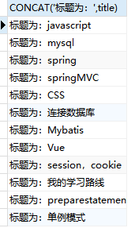

# 数据结构

##　数值

>  INTEGER

- **INTEGER**(INT)
  - 大整数型，4字节
- BIGINT
  - 极大整数型，8字节
- MEDIUMINT
  - 大整数型，3字节
- SMALLINT
  - 大整数型，2字节	
- TINYINT
  - 小整数型，1字节


- DECIMAL(DEC)

  - 字符串形式的浮点数，用于金融运算（）

  

> 浮点数

- FLOAT
  - 单精度，4字节
- DOUBLE
  - 双精度，8字节


## 字符串

- CHAR

  - 固定长度，0-256

- **VARCHAR**

  - 可变长度，0-65535
  - 后面需要跟长度

- tinytext  

  - 微型文本，2%=^8-1

- **text**

  - 文本串 ，2^16-1

  


## 时间

- date 
  - YYYY-MM-DD
- time
  - HH：mm：SS
- **dateTime**
  - YYYY-MM-DD HH:mm：ss
- year


# 表的操作语句

```
//查询当前数据库
select database();
//查询当前数据库的时间，用户和版本
select now(),user(),version();
```


CREATE TABLE `t_blog` (
  `id` bigint NOT NULL AUTO_INCREMENT,
  `content` longtext CHARACTER SET utf8 COLLATE utf8_general_ci,
  `create_time` datetime DEFAULT NULL,
  `description` varchar(255) CHARACTER SET utf8 COLLATE utf8_general_ci DEFAULT NULL,
  `first_picture` varchar(255) CHARACTER SET utf8 COLLATE utf8_general_ci DEFAULT NULL,
  `title` varchar(255) CHARACTER SET utf8 COLLATE utf8_general_ci DEFAULT NULL,
  `update_time` datetime DEFAULT NULL,
  `views` int DEFAULT NULL,
  `type_id` bigint DEFAULT NULL,
  `user_id` bigint DEFAULT NULL,
  `published` int DEFAULT NULL,
  PRIMARY KEY (`id`) USING BTREE,
  KEY `FK292449gwg5yf7ocdlmswv9w4j` (`type_id`) USING BTREE,
  KEY `FK8ky5rrsxh01nkhctmo7d48p82` (`user_id`) USING BTREE,
) ENGINE=InnoDB AUTO_INCREMENT=63 DEFAULT CHARSET=utf8 ROW_FORMAT=DYNAMIC


## 创建删除数据库

```
CREATE DATABASE 数据库名
DROP DATABASE 数据库名
```

==创建和删除表的操作尽量加判断语句==

## 建表

表名不分大小写，不能使用关键字

每个字段之间用逗号隔开，最后一个字段不需要逗号

create table if not exist 表名 (

​	表定义选项（列名，列的定义，空值，完整性约束），

)

```mysql
CREATE TABLE `t_blog` (
  `id` bigint NOT NULL AUTO_INCREMENT,
  `content` longtext CHARACTER SET utf8 COLLATE utf8_general_ci,
  `create_time` datetime DEFAULT NULL,
  `first_picture` longtext CHARACTER SET utf8 COLLATE utf8_general_ci,
  `published` bit(1) NOT NULL,
  `title` varchar(255) CHARACTER SET utf8 COLLATE utf8_general_ci DEFAULT NULL,
  `update_time` datetime DEFAULT NULL,
  `views` int DEFAULT NULL,
  `type_id` bigint DEFAULT NULL,
  `comment_count` int DEFAULT NULL,
  `description` longtext,
  PRIMARY KEY (`id`) USING BTREE,
  KEY `FK292449gwg5yf7ocdlmswv9w4j` (`type_id`) USING BTREE,
  CONSTRAINT `FK292449gwg5yf7ocdlmswv9w4j` FOREIGN KEY (`type_id`) REFERENCES `t_type` (`id`) ON DELETE RESTRICT ON UPDATE RESTRICT
) ENGINE=InnoDB AUTO_INCREMENT=89 DEFAULT CHARSET=utf8 ROW_FORMAT=DYNAMIC
```

## 删表

```
drop table 表名 
drop table t_blog if exist t_blog
```


## 修改表名

```mysql
alert table 旧表名 rename as 新表名
alert table t_blog rename as t_blog1
```

## 增加表字段

```mysql
alter tabel 表名 add 字段名 列属性
alter table t_blog add age int(11)
```

## 修改表的字段

**modify**

- ==修改范围较小==,**只改变字段类型和约束**

- **不可字段重命名**

```
--  modify修改表的列属性(修改字段约束)
alter table 表名 modify 旧字段名 新列属性 
alter table t_blog modify id  varchar(255)
```

**change**

- ==改动范围较大==,**字段名和字段类修改约束都可以修改**

```
--  change 修改表的字段名
alter table 表名 change 旧字段名 新字段名 旧列属性     旧名和新名可以相同
alter table t_blog change id no int(20)
```

## 删除表字段

```
alter table 表名 drop 字段名
alter table t_blog drop content
```


# 数据库的类型

## 引擎对比

数据库的引擎myisam早些年使用，现在默认使用innodb

- INNODB 
  - **支持行级锁**
  - **支持外键**
  - **安全性高**
  - **支持事务**
  - 多表多用户操作
- ＭYISAM
  - 节约空间
  - 速度快


## 存放文件

- *.frm 文件，以及上下级关系的ibata1文件


## 设置数据库表的字符集编码

```
CHARSET=utf-8
```

不设置的话时mysql默认的字符集编码，不支持中文(Latin1)

在my.ini数据库配置文件中设置默认编码

```
character-set-server=utf-8
```


# 数据管理

## 外键

**删除有外键关系的表或外键字段时，要先删除外键的连接关系**


１.**创建表的时候添加约束**(很麻烦，不建议)

```mysql
//设置外键名称
key `FK_typeid` (`typeid`),
//与外键的表的对应字段建立连接
CONSTRAINT `FK_typeid`foreign key (`typeid`) references `t_types`(`typeid`)
```


２.对表的操作

```
alter table 表名 add constraint 外键关系名　foreign key 外键名 references　外键表（外键对应的字段名） 
alter table  t_blog  add CONSTRAINT `FK_typeid`foreign key (`typeid`) references `t_types`(`typeid`)
```


# 增删改

### insert

```mysql
insert into 表名(字段名１，字段名2......) values(值１，值２.．．．．)
insert into t_blog (id,context) values('1','yy');
```

==注意点==：

**如果字段名为全部，就可以省略**

但是顺序要一一对应


### update

```mysql
update 表名　set 字段名１=值１，字段名２＝值２... where 条件
update t_blog set content = 'yzy',title='yy'  where id = 1
```

==注意点==

如果没有指定条件会修改所有字段名


### delete

```
delete from 表名 where 条件
delete from t_blog where id = 1
```

如果不加条件,会删除所有内容,但是字段名还会存在

也可以使用TRUNCATE命令清空数据库表(推荐)

```
TRUNCATE 表名
```

delete和TRUNCATE的区别

- 相同点:
  - 都能删除数据,不会删除表结构
- 不同点
  - TRUNCATE:**自增清空**,计数器归零
  - TRUNCATE:不会影响事务
  - 如果**引擎是InnoDB**,delete删除之后**重启数据库**,自增也会清零**(计数器存在内存当中**,断电即失),myisam则不行(存在文件中)


# select

Data Query Language 数据查询语言

- 所有的查询操作都需要用到它:select
- 简单的复杂的查询都能做
- 数据库中**最核心的语句**
- 使用**频率最高的语句**


##　select语句顺序

```
select [all | DISTINCT]  DISTINCT 用于返回唯一不同的值
from t_blog [as b]   来自什么表
[left | right | inner join t_type]  联合查询
[where typeId = 2 ]  指定的条件
[group by ]     指定字段来分组 
[having]		过滤分组的次要条件
[order by]      排序
[limit 0,5]     分页
```


## select

```
select 字段名(*) from 表名
select title from t_blog
select * from t_blog
```

- **AS** 起别名

```
as 标题
select b.title as 标题 from t_blog as b
```

- **Concat** 函数,拼接字符串,

```
Concat(a,b)
模糊查询 like concat(concat('%','sp'),'%')或者concat('%','sp','%')
select concat('标题:',title) as 标题 from t_blog 
```



- **distinct**:去重:去掉重复数据

```
select type_id from t_blog 
```


```
select DISTINCT type_id from t_blog
```


select可用于表达式

```
select version() ----使用函数
select 100*3     用于计算
select published+1 from t_blog    全部数据+1
```


## 条件

- ＝

- ＜＞

- not    ！＝
- between2 and 3 :闭合区间［２，３］
- and  &&多个条件同时成立
- or     ||  任意一个条件成立


查询City不为‘Berlin’的字段（==注意点==：not放在字段前面）

```
select * from cc where not City = 'Berlin'
```

查询City为空的字段（==错误==：不能使用=‘’，要使用 is null）

```
select * from cc where City is null;
slecct * from cc where City is not null;
```


## 模糊查询

含有y的模糊查询

```
like %y%
既有y 又有z 的
like %y%z%
```

开头为y的模糊查询

```
like y%
```

结尾为y的模糊查询

```
like %y
```

开头为y,后面只有一个字符的模糊查询

```
like y_
```

同理后面有两个三个就加几个_


开头为a，结尾为b的模糊查询,在这个当中，可以查询到ab这个值

```
like 'a%b'
```

in 在多个值中选择

```
in {'yy','yzy'}
```


## 联表查询

inner join 交集查询

```mysql
SELECT b.id,title,type_id from t_blog b
inner join t_type t
where  t.id = b.type_id
```

如果有相同的字段名,需要指定是哪个表


左右join条件不能使用where ,使用on

right join

```
SELECT b.id,title,type_id from t_blog b
right join t_type t
on t.id = b.type_id
```

```
SELECT b.id,title,type_id from t_blog b
left join t_type t
on t.id = b.type_id
```


操作

| 操作       | 描述                                |
| :--------- | :---------------------------------- |
| inner join | 如果表中至少有一个匹配,就返回行     |
| left join  | 会从左表中返回值,即使右表中没有匹配 |
| right join | 会从右表中返回值,即使左表中没有匹配 |


## 分页和排序

### 分页

limit 限制查询数量

```
limit 起始值,长度
limit 0,5   1-5       第一页
limit 5,5   6-10		第二页
limit 10,5  10-15		第三页
limit 15,5  16-20		第四页
(第n页-1)*5
(n-1)*pagesize
```


### 排序

order　by  需要放到where后面

```
order by 字段名  默认从大到小
order by 字段名 DESC    降序,颠倒
order by 字段名 asc	 升序
```


##　函数

```mtsql
	select abs(-8)   绝对值
		ceiling(9.4)  向上取整
		flor(9.5)  向下取整
		rand()    返回一个随机0-1之间的数
		sign(10)  判断一个数的符号0-0 负数-1 正数1
		
		char_length('是大三大四的')    字符串长度
		concat('s','s')   字符串拼接
		insert(被操作的字符串,起始位置,长度,想要替换进去的字符串)
		insert('我爱你',1,2,'晚安')  ---晚安你   
		insert('yst','s')  第一次出现该字符串的索引
		lower('SADWAD')  小写
		upper('asdasd')  大写
```

时间

```mysql
		select current_date()   获取当前日期
		curdate() 		获取当前日期
		now()			获取当前时间
		localtime()		获取本地时间
		sysdate()		获取系统时间
		
		year(now())     显示当前时间的年份
		年月日时分秒同理
```


##　聚合函数

**count:数量**

```
select count(指定列,字段名) from 表名
这三个都能统计数据
select count(id) from t_blog     获取表中所有id的数量,会忽略所有null,			如果是主键,执行效率最优
	   count(*)  			    统计了所有的列,所以不会忽略null,				如果表中只有一个字段,使用*最优
       count(1)     			相当于用1代表代码行,不会忽略null,			如果不是主键,速度快
```


## MD5

insert时加密

```mysql
insert into user values('yy',MD5(123456))
```


update 加密

```
update user set password = MD5(password)
```


**校验**

select

```
select * from user where username = 'yy' and password = MD5('123456')
```


# 事务

通过一个**示例**来解释ACID

A(600元)给B(200元)转账 200 元,C(1000元)给B(200元)转200元

1.SQL执行 A减去200 元

2.SQL执行 B加上200元

3.SQL执行 C减去200元

4.SQL执行 B加上200元

##　ACID

- A:Atomicity **原子性**  
  - 两个步骤一起完成,不能发生其中一个动作
- C:Consistency:一致性
  - 执行一个事务操作操作前后状态一致
    - 当我转了200块钱给B后,我和B的转账前后总数应该不变
    - 事务没有提交时,回复到原状
    - 事务已经提交,持久到数据库
- I:Isolation **隔离性**
  - 如果A给B赚钱的同时,C也在给B赚钱,这两个操作互不影响
  - 这个时候就会有==隔离级别==
- D:Durability:持久性
  - 事务一旦提交则不可逆,持久化到数据库中


## 隔离级别

### read uncommitted(未提交读)

事务中的修改,即使没有提交,其他事务也看得见

**会出现的问题**

- 脏读
- 幻读
- 不可重复读

 

### read committed(提交读)

多数数据库的**默认事务等级**

会出现的问题

- 幻读
- 不可重复读


### repeatable read (重复读)

保证一个事务不会**修改**另一个事务**读取但未提交的数据(回滚)**,带来更更多的性能损失

出现的问题

- 幻读


### Serializable(串行化)

最严格的级别,事务串行执行,性能损失最大


###  **脏读**

A事务读取了B事务未提交的数据,这时如果B事务回滚,就形成了脏读

当前事务读到的数据是别的事务想要就该但是没有修改成功的数据


### 不可重复读

upodate和delete

在一个事务内，多次读同一个数据。在这个事务还没有结束时，另一个事务也访问该同一数据并**修改**数据。

A的两次读取某个数据中间B进行了一次数据操作,导致A读出的两次数据不匹配

一个事务不希望其他的事务来修改我需要的数据                                                                                                                                                                                                                                                                                                                                           


### 幻读

insert

A的两次读取数据中间B**插入新**数据


## 事务提交

```
是否开启事务自动提交
set autocommit = 0  关闭
			   = 1  开启

commit    提交持久化:成功   ,一旦提交就会持久化,无法回滚
rollback  回到原来的样子  提交失败
```

事务流程

```
先关闭自动提交
set autocommit = 0

开启一组事务
start transaction
update account set money = money-500 where name = 'yy'
update account set money = money+500 where name = 'yzy'

有两种情况:1.提交成功
commit 
2.提交失败,回滚
rollback

最后开启自动提交
set autocommit = 1
```


# 索引

> 索引是帮助mysql高效获取数据的数据结构.提取句子主干,就可以得到索引的本质


## 索引分类

没加索引之前,数据库查询数据是遍历数据,建立索引之后是根据定位找到该数据,速度大大加快

### 主键索引（primary key）

- 唯一的标识:主键
- 一张表中只能有一个主键


###　唯一索引(unique key)

- 一张表中**可以有多个**唯一索引,但是不能是相同字段


### 常规索引(key/index)

- 默认的


###　全文索引(fulltext)

- 在特定的数据库引擎下才有
- 快速定位数据


##　索引的使用

- 显示所有索引信息

```
show index from 表名
show index from account
```


- 增加索引

```
alter tale 表名 add 索引分类 index `索引名``(字段名)`
```


查看索引 explain

```
查看普通查询
EXPLAIN SELECT * from account
```


建立索引

```
create index id_name  on account(`name`);
```


##　索引的原则

１.对大数据建立索引才有效果

２.不要对经常变动的数据建立索引

3.在经常查询的字段上建立索引