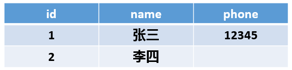
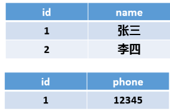
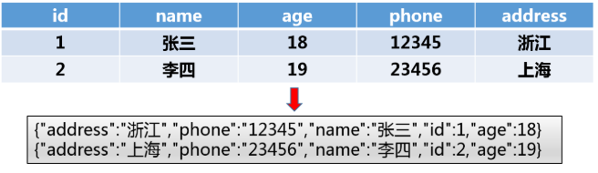
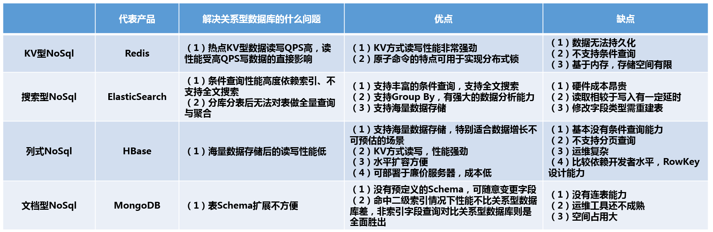

# Redis

## NoSQL介绍

Redis(Remote Dictionary Server),远程字典服务 。

开源的使用C语言编写的，支持网络，可基**于内存亦可持久化的日志型数据库**，提供多语言API，是**最热门的NoSQL之一**

**高性能的**key-value数据库，为了保证效率，数据都是**缓存在内存中**。区别的是redis会**周期性**的把更新的数据**写入磁盘**或者把修改操作写入追加的记录文件，并且在此基础上实现了master-slave(主从)同步。

读的速度：110000次/s，写的速度：81000次/s

Redis支持**主从同步**。数据可以从主服务器向任意数量的从服务器上同步，从服务器可以是关联其他从服务器的主服务器。

### 什么是NoSQL

> 背景

传统的关系数据库在处理web2.0网站，特别是超大规模和高并发的[SNS](https://baike.baidu.com/item/SNS/10242)类型的web2.0纯[动态网](https://baike.baidu.com/item/动态网)站已经显得			力不从心 


 NoSQL数据库的产生就是为了解决大规模数据集合多重数据种类带来的挑战，尤其是大数据应用难题 

> 区别

- **关系型数据库**
  - 事先建立数据库字段（数据库设计）
  - ACID
  - 数据和关系都在表中


- 非关系型数据库
  - 牺牲ACID换取高性能
  - 高性能，高可用，高可扩


> 优点

-  **易扩展** ： 去掉关系数据库的关系型特性。数据之间无关系，这样就非常容易扩展
-  **大数据量，高性能**：非常高的读写性能，尤其在大数据量下，同样表现优秀 
- **灵活的数据模型**： 无须事先为要存储的数据建立字段，随时可以存储自定义的数据格式 
- **高可用**： NoSQL在不太影响性能的情况，就可以方便地实现高可用的架构。


### 代表作品

==K-V型NoSQL==：Redis

以键值对存储数据

**优点**：最大优点高性能

- 数据基于内存，读写效率高
- KV型数据，时间复杂度为o（1），查询速度快

**缺点**

- 只能根据K查V，存储数据据缺少结构化
- 查询方式单一，只有KV方式，不支持条件查询，多条件查询浪费空间
- 内存有限，无法支持海量数据存储
- 基于内存，有丢失的风险

综上所述，K-V型NoSQL用于==缓存==的场景：读远多于写，读取能力强，读取可以容忍数据丢失

---


==搜索型NoSQL==：ElasticSearch

传统关系数据库主要通过索引达到快速查询的目的，但是全文搜索的场景下，like查询无法满足所有模糊查询需求，而且容易形成**慢查询**。

搜索型NoSQL为了解决全文搜索问题：原理是==倒排索引==

**优点**

- 支持分词场景，全文搜索，这是区别关系型数据库最大特点
- 支持条件查询，支持聚合操作，类似Group By，但是功能更加强大，适合做数据分析
- 集群环境下方便横向扩展

**缺点**

- 性能全靠内存，非常吃硬件资源
- 消耗大量内存
- 读写有延迟
- 数据结构灵活性不高，字段建立就没法修改类型

综上所述，搜索型NoSQL适用于==有条件搜索特别是全文搜索==，对分表之后的数据查询也非常强大

---


==列式NoSQL==：HBase

大数据时代最具代表性的计数之一

基于列式存储。：都有关系型数据库一样有主键概念

  

，通过主键连接各个属性

**优点**：

- 查询时只会读取指定的列，不会读取所有列，性能提高
- 海量数据无限存储，节约存储空间，null值不会被存储，当一列中有很多重复数据，可将其压缩
- 横向扩展是最方便的质疑，只要添加新机器就可以实现数据存储的现行增长，节省成本

**缺点**

- KV式，不支持条件搜索（很弱）
- 不支持分页查询

综上所述，列式NoSQL比较适合==K-V型且无法预估数据增长量==的场景


---


==文档型NoSQL==：MongoDB

将半结构化数据存储为结构的一种NoSQL，通常通过JSON过XML存储，没有Schema，可以随意存储和读取数据，用于==解决关系型数据库表结构扩展不方便的问题==。



使用index同样可以建立索引，且效率大大提高

**优点**

- 没有预定义字段，扩展字段容易
- 读写性能优越

**缺点**

- 不支持事务操作
- 不支持多表关联查询
- 空间张永达
- 运维工具少（例如navicat）

综上所述，==对标关系型数据库，比较适合处理没有多表查询，没有强一致性且表经常变化==的场景

  

  

> 使用场景

1、数据模型比较简单

2、需要灵活性更强的IT系统

3、对数据库性能要求较高

4、不需要高度的数据一致性

5、对于给定key，比较容易映射复杂值的环境


## 基础知识
redis可用作数据库，缓存和消息中间件MQ。它支持五种数据结构和范围查询。redis内置了**复制**，**LUA脚本**，**LRU驱动事件**，**事务**，不同级别的**持久化**，并通过**哨兵模式**和**自动分区**提供高可用性


redis是==单线程==的，CPU不是redis的瓶颈，不需要多线程，**瓶颈**是内存大小和带宽

> redis为什么单线程速度还这么快

**误区**：多线程一定比多线程速度快

redis存放在内存中，如果使用多线程（CU上下文切换），就会增加耗时，因此**对于内存来说，使用单线程的效率是最高的**

## redis配置文件
```bash
redis.conf 配置项说明如下：
1. Redis默认不是以守护进程的方式运行，可以通过该配置项修改，使用yes启用守护进程
    daemonize no

2. 当Redis以守护进程方式运行时，Redis默认会把pid写入/var/run/redis.pid文件，可以通过pidfile指定
    pidfile /var/run/redis.pid

3. 指定Redis监听端口，默认端口为6379，为什么选用6379作为默认端口，因为6379在手机按键上MERZ对应的号码，而MERZ取自意大利歌女Alessia Merz的名字
    port 6379

4. 绑定的主机地址
    bind 127.0.0.1

5. 当 客户端闲置多长时间后关闭连接，如果指定为0，表示关闭该功能
    timeout 300

6. 指定日志记录级别，Redis总共支持四个级别：debug、verbose、notice、warning，默认为verbose
    loglevel verbose

7. 日志记录方式，默认为标准输出，如果配置Redis为守护进程方式运行，而这里又配置为日志记录方式为标准输出，则日志将会发送给/dev/null
    logfile stdout

8. 设置数据库的数量，默认数据库为0，可以使用SELECT <dbid>命令在连接上指定数据库id
    databases 16

9. 指定在多长时间内，有多少次更新操作，就将数据同步到数据文件，可以多个条件配合
    save <seconds> <changes>
    Redis默认配置文件中提供了三个条件：
    save 900 1
    save 300 10
    save 60 10000
    分别表示900秒（15分钟）内有1个更改，300秒（5分钟）内有10个更改以及60秒内有10000个更改。
 
10. 指定存储至本地数据库时是否压缩数据，默认为yes，Redis采用LZF压缩，如果为了节省CPU时间，可以关闭该选项，但会导致数据库文件变的巨大
    rdbcompression yes

11. 指定本地数据库文件名，默认值为dump.rdb
    dbfilename dump.rdb

12. 指定本地数据库存放目录
    dir ./

13. 设置当本机为slav服务时，设置master服务的IP地址及端口，在Redis启动时，它会自动从master进行数据同步
    slaveof <masterip> <masterport>

14. 当master服务设置了密码保护时，slav服务连接master的密码
    masterauth <master-password>

15. 设置Redis连接密码，如果配置了连接密码，客户端在连接Redis时需要通过AUTH <password>命令提供密码，默认关闭
    requirepass foobared

16. 设置同一时间最大客户端连接数，默认无限制，Redis可以同时打开的客户端连接数为Redis进程可以打开的最大文件描述符数，如果设置 maxclients 0，表示不作限制。当客户端连接数到达限制时，Redis会关闭新的连接并向客户端返回max number of clients reached错误信息
    maxclients 128

17. 指定Redis最大内存限制，Redis在启动时会把数据加载到内存中，达到最大内存后，Redis会先尝试清除已到期或即将到期的Key，当此方法处理 后，仍然到达最大内存设置，将无法再进行写入操作，但仍然可以进行读取操作。Redis新的vm机制，会把Key存放内存，Value会存放在swap区
    maxmemory <bytes>

18. 指定是否在每次更新操作后进行日志记录，Redis在默认情况下是异步的把数据写入磁盘，如果不开启，可能会在断电时导致一段时间内的数据丢失。因为 redis本身同步数据文件是按上面save条件来同步的，所以有的数据会在一段时间内只存在于内存中。默认为no
    appendonly no

19. 指定更新日志文件名，默认为appendonly.aof
     appendfilename appendonly.aof

20. 指定更新日志条件，共有3个可选值： 
    no：表示等操作系统进行数据缓存同步到磁盘（快） 
    always：表示每次更新操作后手动调用fsync()将数据写到磁盘（慢，安全） 
    everysec：表示每秒同步一次（折中，默认值）
    appendfsync everysec
 

21. 指定是否启用虚拟内存机制，默认值为no，简单的介绍一下，VM机制将数据分页存放，由Redis将访问量较少的页即冷数据swap到磁盘上，访问多的页面由磁盘自动换出到内存中（在后面的文章我会仔细分析Redis的VM机制）
     vm-enabled no

22. 虚拟内存文件路径，默认值为/tmp/redis.swap，不可多个Redis实例共享
     vm-swap-file /tmp/redis.swap

23. 将所有大于vm-max-memory的数据存入虚拟内存,无论vm-max-memory设置多小,所有索引数据都是内存存储的(Redis的索引数据 就是keys),也就是说,当vm-max-memory设置为0的时候,其实是所有value都存在于磁盘。默认值为0
     vm-max-memory 0

24. Redis swap文件分成了很多的page，一个对象可以保存在多个page上面，但一个page上不能被多个对象共享，vm-page-size是要根据存储的 数据大小来设定的，作者建议如果存储很多小对象，page大小最好设置为32或者64bytes；如果存储很大大对象，则可以使用更大的page，如果不 确定，就使用默认值
     vm-page-size 32

25. 设置swap文件中的page数量，由于页表（一种表示页面空闲或使用的bitmap）是在放在内存中的，，在磁盘上每8个pages将消耗1byte的内存。
     vm-pages 134217728

26. 设置访问swap文件的线程数,最好不要超过机器的核数,如果设置为0,那么所有对swap文件的操作都是串行的，可能会造成比较长时间的延迟。默认值为4
     vm-max-threads 4

27. 设置在向客户端应答时，是否把较小的包合并为一个包发送，默认为开启
    glueoutputbuf yes

28. 指定在超过一定的数量或者最大的元素超过某一临界值时，采用一种特殊的哈希算法
    hash-max-zipmap-entries 64
    hash-max-zipmap-value 512

29. 指定是否激活重置哈希，默认为开启（后面在介绍Redis的哈希算法时具体介绍）
    activerehashing yes

30. 指定包含其它的配置文件，可以在同一主机上多个Redis实例之间使用同一份配置文件，而同时各个实例又拥有自己的特定配置文件
    include /path/to/local.conf
```
1.文件存储单位和大小写不敏感


2.包含文件，类似于java的import


3.网络配置


4.通用配置，配置守护进程和日志打印


5.持久化


6.aof设置


## 内存策略


由于数据都存储在内存中，随着数据的不断增大，可能导致内存溢出，服务宕机，所以要设置内存策略，维护内存空间
### 1.设置超时时间
设置存入内存的数据的存活时间

常用`expire key time`设置存活时间（秒）


### 2.采用LRU算法 
>LRU指最近最少使用算法，对最近一段时间内最少使用的数据进行清理

1.volatile-lru：设定超时时间的数据中,删除最不常使用的数据.

2.allkeys-lru：查询所有的key中最近最不常使用的数据进行删除，这是**应用最广泛的策略**.


# 命令和五大数据类型
redis支持**五种数据类型**：**string,hash,lis,set,zset**(sorted set：有序集合)。
key的**命名规范**：
- 不能太长，超过1024
- 不能太短，要便于理解
- 名称区分大小写
- 可以使用统一的命名规范来暗示数据之间的关系，统一使用：来分隔
  - 如class:06:cl 和class:06:yzy ,代表同为class：06的两个人，从命名上暗示了关系

## 基本命令
```bash
#     select index (0-15) 切换数据库
select 3   # 切换4号数据库


#      dbsize     获取当前数据库的大小
#一个key是1个长度
desize


##      flushdb清空数据库
flushdb       #return 0
##      flushall  清空所有数据库
```

## key键命令

```bash
#         keys    后面接正则表达式可以查询想要的结果
#         × 代表查询所有key
key *


#         del     删除命令
# 如果存在key，就返回1，不存在就返回0
del key


#         exists    判断是否存在
# 存在返回1，不存在返回0
exists key


#         tyep  查看key的值的类型
type key


#         rename  修改key名
rename oldKeyName new KeyName
```


### 设置过期时间
给定key设置过期时间 ,过期之后，key不存在

```bash
#      pexpire    单位毫秒
pexpire key time


#       expire      单位秒
expire key time


#       ttl   查看key还有多久过期
#  返回-1代表永久有效
ttl key


#       persist     取消过期时间
persist key
```


**过期时间应用场景**
- 限时的优惠活动
- 网站数据缓存（一些需要实时更新的数据，如排行榜）
- 手机验证码
- 展示网站访问频率

## 字符串类型

string数据结构是简单的K-V类型，value不仅可以是string，也可以是integer等其他的类型

string是二进制安全的即**string可以包含任何数据**

### 应用场景
- String通常用于保存单个字符串或JSON字符串
- String是二进制**安全的**，可以用来保存文件和图片
- **计数器**（自增自减）
  - incr指令具有**原子性**，同时有多个增加也能**正确得到结果**，不少网站利用redis这个特性来实现计数需求


### set
```bash
#   set  设置k-v
set key value
#设置name的值为"yzy"
set name "yzy"


#     mset      设置多个key的值，如果已存在就覆盖
mset key1 value1 key2 value2 


#     setnx       
#若key不存在则赋值并返回1，存在返回0不设值，用于解决分布锁的方案之一
setnx key value


#     setex       赋值key并附加过期时间,秒
#  setex   key  time  value
setex name 22 yzy 
#reutrn ok


#    msetnx
#设置多个key的值，当且仅当key都不存在
#原子性，一起成功，一起失败
msetnx key1 value1 key2 value2 ....


#    setrange  替换部分区间的字符
setrange  key  start  xx #将start开始到xx的长度为止的位置替换成xx
#return 字符串长度
```
setnx的情况
 

**msetnx**的情况
  


### get
```bash
# get    根据key获取value
get key
#获取name的值
get name


#     getrange
# 获取指定key的子字符串,从start-end,闭包区间
getrange key start end


#     mget
#返回一个或多个key的值
mget key1 key2 ....


#   getset   
#将key存储的值改成newValue，并返回oldValue
#如果没有key，返回nil
getset key newValue

```
getrange的范围
  

mget的返回值
  

getset的情况
  


### append/strlen
  ```bash
  #       append
 #指定key的value后面加上value，返回添加后的总长度
  append key value


  #      strlen
  # 获取key存储的字符串长度
  strlen key
  ```


### 自增自减
```shell
# decr/incr   使key存储的值-1/+1
decr/incr key


#decrby/incrby  使key存储的值-/+指定的值
decrby/incrby key value
```
  

  


## Hash类型
一个key存储一个map集合  k-v

**特别适合存储对象**，比存储在Strig中占用更少内存
每个hash可以存储2的32次方-1个键值对

### 添加修改
```bash
#       hset设置一个对象的一个属性
#hset key 字段 value
hset user:1 name yzy 


#       hmset 设置多个对象
#hmset key 字段1 value 字段2 value 
hmset user:3 name cl age 22 sex nan


```

### 查询
```bash
#       hget  获取一个key 的一个字段
hget user:1  name


#       hgetall   获得一个key的所有字段和value
#  按顺序返回字段1，value1，字段2，value2.。。
hgetall user:1
#return key1
#return value1
#return key2
#return value2
#...


#       hexists    是否存在字段
#存在返回1，不存在返回0
hexists user:3 name


#       hkeys key   获得一个key的所有字段
hkeys user:2


#         hvals     获取一个key的所有value
hvals hash


#       hlen  获取长度
hlen hash
```


### 其他方法
```bash
#      hincrby   数字增加
hincrby user:3 age  2
# return age+2


#       hdel   删除key的一个或多个字段
#  返回删除个数
hdel user:3 name age
```
## List
List是一个**双端链表**，只要功能有**push**，**pop**，获取元素等，我们可以对头部和尾部进行添加和删除操作，既可以作**栈**，也可以作**队列**，类似于java的linkedList

前面加L代表left头部操作，前面加R代表right尾部操作  
### 添加
```bash
#      LPUSH  key value1,value2...
#  向左边添加元素,先插入的先进去，list1的数据为：d c b a
lpush list1 a b c d
#  向右侧添加元素,先从插入的先进去，list1的数据为x y z
rpush list1 x y z
#return length


#          LPUSHX     将值插入已存在的列表中，不存在就操作无效
lpushx key value1 value2
# return 插入后列表的长度,不存在就返回0


```

### 查询
```bash
#       LRANGE  获取列表的元素
#LRANGE KEY START END 当end为-1时,代表结尾
lrange list1 0 -1   #0 -1 代表获得全部元素


#       LLEN   获取列表的长度
llen list1


#       LINDEX  获取指定下标的元素
lindex list1 2  #获取下标为2（第三个）的元素
```

### 删除
```bash
#      LPOP  删除并获取最左侧的元素
lpop list1  
#reutrn 删除的元素


#       BLPOP   
#     BLPOP   KEY1，KEY2...   TIME    当不存在该列表，就会阻塞该列表到时间结束，在这段时间内如果创建了这个列表，就会将左侧第一个元素弹出
blpop list2 10   #在10秒内弹出最左侧元素或阻塞list2


#     IREM   移除指定的元素，并返回删除个数
# lrem key count element    在key列表中，将值为elment的元素移除count个,如果超过，只移除光
lrem list2 2 3    #将list2中的3移除2个
#return 移除的个数

#         LTRIM    修剪，只留下区间内的元素
ltrim list1 1 -1   #留下第二个到最后的元素，最左侧的元素删除
```

### 修改
```bash
###      LSET     通过索引修改元素
#LSET KEY INDEX VALUE
lset list1 2 w   #将下标为2的元素修改成w


#      LINSERT  在一个元素的前或后插入值
#INSERT KEY BEFORE/AFTER  查找的value  插入的value
linsert list1 before w v    #从左找到第一个值为w的元素，在其左侧插入v
```

### 高级命令
```bash
#       RPOPLPUSH   移除一个列表右侧元素添加到另一个列表的左侧
#   rpoplpush  droplist  addlist  将droplist的右侧元素移到addlist的左侧，如addlist不存在，就会创建
rpoplush list1 list2 #将list1右侧元素移到list2左侧
#return 移动的元素

#举一反三
lpoplpush list1 list2     #将list1左侧元素移到list2左侧
lpoprpush list1 list2     #将list1左侧元素移到list2右侧
lpoprpush list1 list1     #也可以在同一个列表中转移


#         BRPOPLPUSH   如同上面的BPOP类似
brpoplpush list1 list2 22   #22秒内阻塞或可弹出

```

## set
**微信小程序抽奖**：点击加入抽奖，查看所有抽奖用户，随机选取一个用户

set的元素是不可重复的
### 添加
```bash 
#         sadd  添加元素
sadd set1 hi,hello    #向set1添加一个或多个元素，重复的只添加一次，并返回添加不重复元素的个数


#     smove 将元素从一个set移动到另一个
smove set1 set2 yzy   #将有助于从set1移动到set2（set2可以不存在）

```

### 查询
```bash
#       smembers key   查询set的所有内容
smembers set1 


#         sismember  查询set中是否有该元素，存在返回1，不存在返回0
sismember set1 hi    
#return 1


#       scard   查询set的个数
scard set1   


#     srandmember  随机获取指定数量的元素
srandmember set1 2   #从set1随机获取两个不同的元素，超出set长度就全部显示


```


### 删除
```bash
#      srem  移除元素,可以移除一个或多个，返回成功移除的个数
srem  set1 hi hello


#      spop  随机删除指定数量个元素
spop set1 
#return 删除的元素
```

### 其他
```bash
#       sdiff    多个set的差集(两者不同的，并集减去交集)
sdiff set1 set2 ...


#        sunion   多个set的并集
sunion set1 set2


#       sinter     多个set的交集


```

## zset
在set的基础上增加了一个排序zset key score value
### 添加
```bash
#        zadd      添加元素
#zadd  zset名  序号  value        序号用来排序，可以有多个值是相同的序号，不能为0
zadd zset 1 yzy
zadd zset 2 uu 3 xx


```

### 查询
```bash

#             zrange     获取指定顺序内的元素
# zrange zset start end withscores（可加，显示value的scores）     返回下标为start-end的范围内的元素，不是scores范围
zrange zset 0 -1 withscores    #全部元素和scores
zrange zset 2 5                   #下标为2-5的范围的元素


#           zrevrange   上面的倒序
zrange zset 0 -1         #全部元素下标倒序显示


#             zcard    获取个数
zcard zset      #获取zset元素个数


#     score排序显示
#           zrangebyscore    获取指定scores值的元素（从小到大）
#zrangebyscore zset min max  withscores  
zrangebyscore zset 10 1000      #显示scores 10-1000范围的元素
zrangebyscore zset -inf +inf     #显示所有scores范围的元素


#             zrevrangebyscore    从小到大
zrangebyscore zset 1000 10    #显示scores 从1000-10的倒序的元素


```

### 删除
```bash
#       zrem   删除指定元素
zrem zset uu      #删除名为uu的元素


#      zpopmax   删除score最大的元素
zpopmax zset


#       zpopmin   删除score最小的元素

```

# 特殊数据类型
## geospatial地理位置
朋友定位，打车距离

**geoadd**
将指定的地理空间位置（纬度、经度、名称）添加到指定的key中。这些数据将会**存储到sorted set**这样的目的是为了方便使用GEORADIUS或者GEORADIUSBYMEMBER命令对数据进行半径查询等操作
```bash
#      geoadd key 经度 纬度 元素
geoadd city 120.492736 30.08763 shaoxing
geoadd city 120.369557 36.094406 qingdao 113.852186 27.622946 pingxiang
#return 添加个数

```

**geopos**
获得添加城市的经纬度
```bash
#         geopos key element 


```

**geodist**
两个地点之间的距离
```bash
#         geodist key element1 element2 单位
geodist city shaoxing qingdao km   #青岛和绍兴之间的直线距离，单位km
```

**georadius**
以给定的经纬度，找出指定半径内的元素
```bash
#             georadius key 目标经度 目标纬度  半径长度 单位 （直线距离，经纬度，人数限制）
georadius city 120 32 600 km  withcoord  withdist #查询以经纬度为120 32为中心，半径600km的城市 并显示其经纬度和直线距离
1) 1) "qingdao"
   2) "456.6760"
   3) 1) "120.36955565214157104"
      2) "36.09440522913565275"
2) 1) "shaoxing"
   2) "217.8259"
   3) 1) "120.4927334189414978"
      2) "30.08763062989768144"

GEORADIUS city 120 32 600 km count 1   # 只显示一个城市


#             georadiusbymember     以指定城市为半径寻找
GEORADIUSBYMEMBER city qingdao 1000 km
1) "qingdao"
2) "tieling"
3) "shaoxing"
```

**geohash**
返回添加城市的11位Geohash字符串，相同的越多代表越接近
```bash

GEOHASH city shaoxing tieling
1) "wtmejvk1hh0"
2) "wz80d4u8sb0"
```
**基于zset**
我们可以通过zset的命令来进行查看和删除等操作
```bash
zrange city 0 -1 withscores
 1) "pingxiang"
 2) "4050732684790786"
 3) "yueyang"
 4) "4051712980858661"
 5) "shaoxing"
 6) "4054146532859139"
 7) "qingdao"
 8) "4067545426984382"
 9) "tieling"
10) "4078451035330941"

#删除
zrem city yueyang
(integer) 1


```


## hyperloglog
基数：一个集合中不重复的元素

用途：统计访问人数

>情景分析：一个网站一个IP可能访问多次，那么怎么统计网站的活跃人数？

传统方法：可以通过set保存用户的id，然后进行统计，但是很浪费，因为我们只需统计用户数量，不作其他用途。

hyperloglog：占用内存小，占用12KB大小，可能有一定错误率（能够容忍）


```bash
#         PFadd    添加元素
PFadd key a b c d e f
#return 1 添加成功


#         PFcount   统计不重复元素
PFcount key
#return 不重复元素个数


#           PFmerge   将并集添加到一个集合中
PFmerge key3 key2 key1     #将key1，key2的并集送到key3，如果key3有元素，就和key，key2的并集再并集给key3
PFmerge key2 key      #将key，key2的并集送到key2
```

## bitmap
用位存储，0  1

可以统计：登录，未登录；感染，未感染；打卡，未打卡。。。。

```bash
#           setbit     设置
setbit bit 0 1    #索引为0的位置设值1


#           getbit   获取指定索引的值
getbit bit 0      #获取索引0的值


#           bitcount   获取值为1的个数
bitcount bit 
#return 5
```

例如七天打卡


查询某天是否打卡


统计打卡天数


# 事务
redis事务：一组命令的集合。一个事务中的所有命令都会被**序列化**。事务执行**按照命令的先后顺序执行**。其他客户端的请求不会插入此次事务当中

==总结==：**redis事务是一次性，顺序性，排他性的一系列命令**

- **redis单条命令是原子性的，但是事务不保证原子性**

- **redis没有事务隔离级别**

## 事务的执行顺序
- 开始事务（）
- 命令入队，当命令被放入队列里时并不会被执行
- 执行事务

```bash
         MULTI        # 开启事务
OK
         set k1 v1     #指令入队
QUEUED
         set k2 v2      #指令入队
QUEUED
         get k2           #指令入队
QUEUED
         set k3 v3        #指令入队
QUEUED
         exec                 #执行
1) OK
2) OK
3) "v2"
4) OK


          discard    #取消事务
```
- **当将指令入队时并不会执行**，当exec时，才会**一次性执行完队列里的所有指令**。执行完事务之后该事务消失，不可再用。
- **放弃事务**，队列里的事务不会生效。
- **编译异常**,所有语句不会执行
  
- **执行异常**，异常语句不会执行抛出异常，其他正常执行
  


## 锁
- 悲观锁
  - 认为所有东西都会出问题，所以做什么都会加上锁，就会**特别影响性能**
- 乐观锁
  - 认为什么时候都不会出现问题，不会上锁。在**数据提交修改时才会检测**。如果发生冲突，就返回用户错误的信息，让用户决定如何去做
  - 步骤：
    - 获取version
    - 当更新时比较version，如果不一致，就发生冲突

### 以转账为例
>当会话1wathc时，获取了版本号1，而会话2进行转账后，版本号变成了2，当会话以执行事务时，获取的版本号1和更改时版本号2发生冲突，无法执行事务
```bash
#       money：1000    out：0
****************************会话1******************************
#       开启监听
watch money
#       开始业务
multi
DECRBY money 200
INCRBY out 200

****************************会话2******************************
#         此时，打开一个新的会话2也开始转账操作
incrby money 200


****************************会话1******************************
#   这时，另一边再执行事务
exec
#返回nil，意味着事务失败了
get money  #  这时再查看结果,1200    会话2的转账成功，会话1的转账失败了
```
如果想让会话2修改之后能够执行事务，就需要放弃监视unwatch，重新获取新的版本号


# 整合java
## jedis
redis官方推荐的连接java工具，使用redis操作redis中间件
1.导入依赖
```xml
<!-- https://mvnrepository.com/artifact/redis.clients/jedis -->
<dependency>
    <groupId>redis.clients</groupId>
    <artifactId>jedis</artifactId>
    <version>3.3.0</version>
</dependency>
```

2.测试连接
```java
//连接redis服务器,主机地址和端口
        Jedis j = new Jedis("8.129.161.77",6379);
        //如果设置了密码,就需要auth
        j.auth("665128");
        System.out.println(j.ping());
```
3.所有的API和redis命令类似
例如System.out.println(j.getbit("bit", 3));

```java
jedis.watch("money");
        //开始事务,事务的执行者不再是jedis,而是multi
        Transaction multi = jedis.multi();
        try {
            multi.incrBy("money", 200);
            multi.decrBy("out", 200);
            multi.exec();
            //如果出现异常,关闭事务
        }catch (Exception e){
            multi.discard();
            e.printStackTrace();
        }finally {
            jedis.unwatch();
            System.out.println(jedis.get("money"));
            System.out.println(jedis.get("out"));
            jedis.close();
        }
```

## 整合springboot

springboot操作数据库使用data，像redis，moongdb，jdbc等都在spring-data下

在springboot 2.X版本后，jedis替换成了lettuce
- jedis多线程不安全，想要避免不安全，需要使用jedis pool数据池 BIO模式。
- lettuce采用netty，可以多线程共享  NIO模式

### 源码分析
springboot的配置文件：如果没有**redisTemplate类**，就会自动帮你创建一个，也可以自己创建
```java
@Bean
	@ConditionalOnMissingBean(name = "redisTemplate")
	public RedisTemplate<Object, Object> redisTemplate(RedisConnectionFactory redisConnectionFactory)
			throws UnknownHostException {
		RedisTemplate<Object, Object> template = new RedisTemplate<>();
		template.setConnectionFactory(redisConnectionFactory);
		return template;
	}
```
观察，自动模板的参数是**RedisConnectionFactory**，点进去,发现他的实现类有两个，jedis和Lettuce


jedis中有些已经标红，spring没有注入，所以==底层使用的是lettuce==


#### redisTemplate
序列化


默认序列化，那么自己写序列化的时候（编写redisTemplate），这个就会失效


### 配置文件
```properties
      #Springboot的所有配置配都会有一个自动装配文件  RedisAutoConfigration
      #自动装备类会自动绑定一个配置文件   RedisProperties
      spring.redis.host=8.129.161.77
      spring.redis.port=6379
      spring.redis.password=665128
      #选择数据库0-15
      spring.redis.database=0
```

### 测试
前面讲了没有手动创建模板类，系统自动生成的模板类，所以将模板类**注入**
```java
@Autowired
    public RedisTemplate redisTemplate;
```

```java
//opsFor操作XXX:   opsFprSet:操作Set   后面的动作和redis命令类似,如opsForSet:add添加元素
        redisTemplate.opsForValue().set("name","yy");
        System.out.println(redisTemplate.opsForValue().get("name"));
```
opsFor操作指定类型


### 自定义redisConfig
上面源码分析的redisTemplate中指出可以自己创建，接下来我们来自己配置，先创建redisConfig配置文件和实体类

测试代码：

```java
		Teacher yzy = new Teacher(1, "yzy", 22);
        //将对象转换成json
        String json = new ObjectMapper().writeValueAsString(yzy);
        redisTemplate.opsForValue().set("name",json);
        System.out.println(redisTemplate.opsForValue().get("name"));
```
控制台显示正常，但是redis中乱码


如果将转换成json的语句去掉再执行，发现保存了，没有序列化，需要**实体类序列化**


之后，我们就自定配置文件
```java
@Configuration
public class RedisConfig {

    //创建自己的redisTemplate,固定模板
    @Bean
    @SuppressWarnings("all")
    public RedisTemplate<String, Object> redisTemplate(RedisConnectionFactory redisConnectionFactory)
            throws UnknownHostException {
        RedisTemplate<String, Object> template = new RedisTemplate<>();
        template.setConnectionFactory(redisConnectionFactory);

        //JSON序列化
        Jackson2JsonRedisSerializer objectJackson2JsonRedisSerializer = new Jackson2JsonRedisSerializer(Object.class);
        ObjectMapper objectMapper = new ObjectMapper();
        objectMapper.setVisibility(PropertyAccessor.ALL, JsonAutoDetect.Visibility.ANY);
        objectMapper.enableDefaultTyping(ObjectMapper.DefaultTyping.NON_FINAL);
        objectJackson2JsonRedisSerializer.setObjectMapper(objectMapper);
        //String的序列化
        StringRedisSerializer stringRedisSerializer = new StringRedisSerializer();
        //key采用string的方式序列化
        template.setKeySerializer(stringRedisSerializer);
        template.setHashKeySerializer(stringRedisSerializer);
        //value采用jackson的方式序列化
        template.setValueSerializer(objectJackson2JsonRedisSerializer);
        template.setHashValueSerializer(objectJackson2JsonRedisSerializer);
        template.afterPropertiesSet();
        return template;
    }
}
```
这时，再运行一次，正常了


### 工具类
在企业中，一般不会直接使用template的命令，而是会封装成工具类


```java
@Component
public class RedisUtil {

	@Autowired
	private RedisTemplate<String, Object> redisTemplate;
	@Autowired
	private StringRedisTemplate stringRedisTemplate;

	/**
	 * 指定缓存失效时间
	 *
	 * @param key  键
	 * @param time 时间(秒)
	 * @return
	 */
	public boolean expire(String key, long time) {
		try {
			if (time > 0) {
				redisTemplate.expire(key, time, TimeUnit.SECONDS);
			}
			return true;
		} catch (Exception e) {
			e.printStackTrace();
			return false;
		}
	}

	/**
	 * 根据key 获取过期时间
	 *
	 * @param key 键 不能为null
	 * @return 时间(秒) 返回0代表为永久有效
	 */
	public long getExpire(String key) {
		return redisTemplate.getExpire(key, TimeUnit.SECONDS);
	}

	/**
	 * 判断key是否存在
	 *
	 * @param key 键
	 * @return true 存在 false不存在
	 */
	public boolean hasKey(String key) {
		try {
			return redisTemplate.hasKey(key);
		} catch (Exception e) {
			e.printStackTrace();
			return false;
		}
	}

	/**
	 * 删除缓存
	 *
	 * @param key 可以传一个值 或多个
	 */
	@SuppressWarnings("unchecked")
	public void del(String... key) {
		if (key != null && key.length > 0) {
			if (key.length == 1) {
				redisTemplate.delete(key[0]);
			} else {
				redisTemplate.delete(CollectionUtils.arrayToList(key));
			}
		}
	}

	// ============================String=============================
	/**
	 * 普通缓存获取
	 *
	 * @param key 键
	 * @return 值
	 */
	public Object get(String key) {
		return key == null ? null : redisTemplate.opsForValue().get(key);
	}

	/**
	 * 普通缓存放入
	 *
	 * @param key   键
	 * @param value 值
	 * @return true成功 false失败
	 */
	public boolean set(String key, Object value) {
		try {
			redisTemplate.opsForValue().set(key, value);
			return true;
		} catch (Exception e) {
			e.printStackTrace();
			return false;
		}

	}

	/**
	 * 普通缓存放入并设置时间
	 *
	 * @param key   键
	 * @param value 值
	 * @param time  时间(秒) time要大于0 如果time小于等于0 将设置无限期
	 * @return true成功 false 失败
	 */
	public boolean set(String key, Object value, long time) {
		try {
			if (time > 0) {
				redisTemplate.opsForValue().set(key, value, time, TimeUnit.SECONDS);
			} else {
				set(key, value);
			}
			return true;
		} catch (Exception e) {
			e.printStackTrace();
			return false;
		}
	}

	/**
	 * 递增
	 *
	 * @param key 键
	 * @param by  要增加几(大于0)
	 * @return
	 */
	public long incr(String key, long delta) {
		if (delta < 0) {
			throw new RuntimeException("递增因子必须大于0");
		}
		return redisTemplate.opsForValue().increment(key, delta);
	}

	/**
	 * 递减
	 *
	 * @param key 键
	 * @param by  要减少几(小于0)
	 * @return
	 */
	public long decr(String key, long delta) {
		if (delta < 0) {
			throw new RuntimeException("递减因子必须大于0");
		}
		return redisTemplate.opsForValue().increment(key, -delta);
	}

	// ================================Map=================================
	/**
	 * HashGet
	 *
	 * @param key  键 不能为null
	 * @param item 项 不能为null
	 * @return 值
	 */
	public Object hget(String key, String item) {
		return redisTemplate.opsForHash().get(key, item);
	}

	/**
	 * 获取hashKey对应的所有键值
	 *
	 * @param key 键
	 * @return 对应的多个键值
	 */
	public Map<Object, Object> hmget(String key) {
		return redisTemplate.opsForHash().entries(key);
	}

	/**
	 * HashSet
	 *
	 * @param key 键
	 * @param map 对应多个键值
	 * @return true 成功 false 失败
	 */
	public boolean hmset(String key, Map<String, Object> map) {
		try {
			redisTemplate.opsForHash().putAll(key, map);
			return true;
		} catch (Exception e) {
			e.printStackTrace();
			return false;
		}
	}

	/**
	 * HashSet 并设置时间
	 *
	 * @param key  键
	 * @param map  对应多个键值
	 * @param time 时间(秒)
	 * @return true成功 false失败
	 */
	public boolean hmset(String key, Map<String, String> map, long time) {
		try {
			redisTemplate.opsForHash().putAll(key, map);
			if (time > 0) {
				expire(key, time);
			}
			return true;
		} catch (Exception e) {
			e.printStackTrace();
			return false;
		}
	}

	/**
	 * 向一张hash表中放入数据,如果不存在将创建
	 *
	 * @param key   键
	 * @param item  项
	 * @param value 值
	 * @return true 成功 false失败
	 */
	public boolean hset(String key, String item, Object value) {
		try {
			redisTemplate.opsForHash().put(key, item, value);
			return true;
		} catch (Exception e) {
			e.printStackTrace();
			return false;
		}
	}

	/**
	 * 向一张hash表中放入数据,如果不存在将创建
	 *
	 * @param key   键
	 * @param item  项
	 * @param value 值
	 * @param time  时间(秒) 注意:如果已存在的hash表有时间,这里将会替换原有的时间
	 * @return true 成功 false失败
	 */
	public boolean hset(String key, String item, Object value, long time) {
		try {
			redisTemplate.opsForHash().put(key, item, value);
			if (time > 0) {
				expire(key, time);
			}
			return true;
		} catch (Exception e) {
			e.printStackTrace();
			return false;
		}
	}

	/**
	 * 删除hash表中的值
	 *
	 * @param key  键 不能为null
	 * @param item 项 可以使多个 不能为null
	 */
	public void hdel(String key, Object... item) {
		redisTemplate.opsForHash().delete(key, item);
	}

	/**
	 * 判断hash表中是否有该项的值
	 *
	 * @param key  键 不能为null
	 * @param item 项 不能为null
	 * @return true 存在 false不存在
	 */
	public boolean hHasKey(String key, String item) {
		return redisTemplate.opsForHash().hasKey(key, item);
	}

	/**
	 * hash递增 如果不存在,就会创建一个 并把新增后的值返回
	 *
	 * @param key  键
	 * @param item 项
	 * @param by   要增加几(大于0)
	 * @return
	 */
	public double hincr(String key, String item, double by) {
		return redisTemplate.opsForHash().increment(key, item, by);
	}

	/**
	 * hash递减
	 *
	 * @param key  键
	 * @param item 项
	 * @param by   要减少记(小于0)
	 * @return
	 */
	public double hdecr(String key, String item, double by) {
		return redisTemplate.opsForHash().increment(key, item, -by);
	}

	// ============================set=============================
	/**
	 * 根据key获取Set中的所有值
	 *
	 * @param key 键
	 * @return
	 */
	public Set<Object> sGet(String key) {
		try {
			return redisTemplate.opsForSet().members(key);
		} catch (Exception e) {
			e.printStackTrace();
			return null;
		}
	}

	/**
	 * 根据value从一个set中查询,是否存在
	 *
	 * @param key   键
	 * @param value 值
	 * @return true 存在 false不存在
	 */
	public boolean sHasKey(String key, Object value) {
		try {
			return redisTemplate.opsForSet().isMember(key, value);
		} catch (Exception e) {
			e.printStackTrace();
			return false;
		}
	}

	/**
	 * 将数据放入set缓存
	 *
	 * @param key    键
	 * @param values 值 可以是多个
	 * @return 成功个数
	 */
	public long sSet(String key, Object... values) {
		try {
			return redisTemplate.opsForSet().add(key, values);
		} catch (Exception e) {
			e.printStackTrace();
			return 0;
		}
	}

	/**
	 * 将set数据放入缓存
	 *
	 * @param key    键
	 * @param time   时间(秒)
	 * @param values 值 可以是多个
	 * @return 成功个数
	 */
	public long sSetAndTime(String key, long time, Object... values) {
		try {
			Long count = redisTemplate.opsForSet().add(key, values);
			if (time > 0) {
				expire(key, time);
			}
			return count;
		} catch (Exception e) {
			e.printStackTrace();
			return 0;
		}
	}

	/**
	 * 获取set缓存的长度
	 *
	 * @param key 键
	 * @return
	 */
	public long sGetSetSize(String key) {
		try {
			return redisTemplate.opsForSet().size(key);
		} catch (Exception e) {
			e.printStackTrace();
			return 0;
		}
	}

	/**
	 * 移除值为value的
	 *
	 * @param key    键
	 * @param values 值 可以是多个
	 * @return 移除的个数
	 */
	public long setRemove(String key, Object... values) {
		try {
			Long count = redisTemplate.opsForSet().remove(key, values);
			return count;
		} catch (Exception e) {
			e.printStackTrace();
			return 0;
		}
	}
	// ===============================list=================================

	/**
	 * 获取list缓存的内容
	 *
	 * @param key   键
	 * @param start 开始
	 * @param end   结束 0 到 -1代表所有值
	 * @return
	 */
	public List<Object> lGet(String key, long start, long end) {
		try {
			return redisTemplate.opsForList().range(key, start, end);
		} catch (Exception e) {
			e.printStackTrace();
			return null;
		}
	}

	/**
	 * 获取list缓存的长度
	 *
	 * @param key 键
	 * @return
	 */
	public long lGetListSize(String key) {
		try {
			return redisTemplate.opsForList().size(key);
		} catch (Exception e) {
			e.printStackTrace();
			return 0;
		}
	}

	/**
	 * 通过索引 获取list中的值
	 *
	 * @param key   键
	 * @param index 索引 index>=0时， 0 表头，1 第二个元素，依次类推；index<0时，-1，表尾，-2倒数第二个元素，依次类推
	 * @return
	 */
	public Object lGetIndex(String key, long index) {
		try {
			return redisTemplate.opsForList().index(key, index);
		} catch (Exception e) {
			e.printStackTrace();
			return null;
		}
	}

	/**
	 * 将list放入缓存
	 *
	 * @param key   键
	 * @param value 值
	 * @param time  时间(秒)
	 * @return
	 */
	public boolean lSet(String key, Object value) {
		try {
			redisTemplate.opsForList().rightPush(key, value);
			return true;
		} catch (Exception e) {
			e.printStackTrace();
			return false;
		}
	}

	/**
	 * 将list放入缓存
	 *
	 * @param key   键
	 * @param value 值
	 * @param time  时间(秒)
	 * @return
	 */
	public boolean lSet(String key, Object value, long time) {
		try {
			redisTemplate.opsForList().rightPush(key, value);
			if (time > 0) {
				expire(key, time);
			}
			return true;
		} catch (Exception e) {
			e.printStackTrace();
			return false;
		}
	}

	/**
	 * 将list放入缓存
	 *
	 * @param key   键
	 * @param value 值
	 * @param time  时间(秒)
	 * @return
	 */
	public boolean lSet(String key, List<Object> value) {
		try {
			redisTemplate.opsForList().rightPushAll(key, value);
			return true;
		} catch (Exception e) {
			e.printStackTrace();
			return false;
		}
	}

	/**
	 * 将list放入缓存
	 *
	 * @param key   键
	 * @param value 值
	 * @param time  时间(秒)
	 * @return
	 */
	public boolean lSet(String key, List<Object> value, long time) {
		try {
			redisTemplate.opsForList().rightPushAll(key, value);
			if (time > 0) {
				expire(key, time);
			}
			return true;
		} catch (Exception e) {
			e.printStackTrace();
			return false;
		}
	}

	/**
	 * 根据索引修改list中的某条数据
	 *
	 * @param key   键
	 * @param index 索引
	 * @param value 值
	 * @return
	 */
	public boolean lUpdateIndex(String key, long index, Object value) {
		try {
			redisTemplate.opsForList().set(key, index, value);
			return true;
		} catch (Exception e) {
			e.printStackTrace();
			return false;
		}
	}

	/**
	 * 移除N个值为value
	 *
	 * @param key   键
	 * @param count 移除多少个
	 * @param value 值
	 * @return 移除的个数
	 */
	public long lRemove(String key, long count, Object value) {
		try {
			Long remove = redisTemplate.opsForList().remove(key, count, value);
			return remove;
		} catch (Exception e) {
			e.printStackTrace();
			return 0;
		}
	}
}

```


### 错误

1.没有将config文件夹放入启动项的同级目录下，注入不了，导致redisConnectFactor注入失败


# 持久化
redis是内存数据库，断电即失，需要持久化到硬盘中
## RDB（Redis DataBase）
在指定时间间隔内将数据快照写入磁盘，恢复数据时将快照直接读入内存

### 持久化过程


1.父进程先进行判断当前是否在进行save操作，如果在进行操作就bgsave命令直接返回。两个save子进程不能同时进行，同时进行大量磁盘写入写出操作，会引起严重的性能问题。

2.当前没有子进程在进行save，redis创建按一个子进程来进行持久化，创建期间redis 处于阻塞状态，不接受任何命令

3.fork完成，父进程可以接受命令

4.子进程将数据写入临时文件，完成后替换原有的文件

### 持久化机制
在配置文件中，rdb保存的文件名为


- 当使用shutdown关闭服务器时，会触发rdb持久化。
- 当kill进程时不会触发持久化
- 当满足配置文件中的持久化时间次数时会持久化
- 当flushall会触发持久化

当redis服务启动，就会去dir目录下寻找dump.rdb文件恢复数据


### 优缺点
优点：
- 适合大规模数据恢复
- 对数据的完整性要就不高

缺点
- 需要一定时间间隔进行操作，如果redis在此期间意外宕机，就会丢失数据
- fork会占用一部分空间

## AOF（Append only File）

将我们的所有命令记录下来，恢复时，就会将我们的命令全部执行一遍。

### 持久化过程
以日志的形式记录每一次写操作，将redis的所有写操作指令记录下来。所有写命令会添加到缓冲区，根据不同的持久化策略写入aof文件

当aof文件过大时，会重写。fork一个新进程，将当前数据通过写命令同步到文件中

### 优缺点
优点：
- aof的保存机制多种，可以满足不同的需求，每次修改保存使文件更完整
- 不保存是运行性能更好

缺点：
- 数据文件大小大于rdb，修复速度也比rdb慢
- aof的运行效率慢
- 所以默认使用rdb

## 注意点
- ==如果redis只做缓存用，可以不需要任何持久化==
- 同时开启两种持久化方式，会优先使用AOF，因为更加完整
- rdb文件作后备用途 


# 发布订阅
redis发布订阅是一种消息==通信模式==，发送者发送信息，订阅者接受信息。
可以可使用MQ消息队列来实现

redis客户客户端可以订阅任意数量的频道

如图，发布订阅由三部分组成：发布者，频道，订阅者


## 命令
1.**订阅者订阅了频道**，在推出之前都会收到频道的消息
`subscribe channel `


2.这里再创建一个客户端，**发布者在频道发布了消息**
`publish channel message`


3.此时，**订阅者就收到了消息**


# 主从复制
**将一台redis服务器的数据复制到其他redis服务器**。前者被称为**主节点**master，后者被称为**从节点**slave。

==数据的复制是单向的==，master写，slave读。

==读写分离==，大部分的压力都是读操作，将写的操作放到主节点上，**读的压力分散到从节点上**

默认情况下，**每台redis都是主节点**，一台主节点可以拥有多台从节点，**一个从节点只能有一个主节点**


## 主从复制的主要内容
- 数据冗余：
  - **主从复制实现了数据的热备份**，是持久化之外的一种数据冗余的方式
- 故障恢复：
  - 当主节点出现问题，**从节点也可以提供服务**，实现快速的故障恢复
- 负载均衡：
  - 主从复制的基础上**读写分离**，分担服务器压力。尤其是写少读多的情况下，大大提高redis服务器并发量
- 高可用（集群）：
  - 主从复制是哨兵和集群的基础

## 环境配置

```bash
127.0.0.1:6379> info replication            #查看当前库的信息
# Replication
role:master                                           #角色，主机
connected_slaves:0                                    #从机数量：0
master_replid:053c94da448e85be438ba8a29be8d42d71531cfb
master_replid2:0000000000000000000000000000000000000000
master_repl_offset:0
second_repl_offset:-1
repl_backlog_active:0
repl_backlog_size:1048576
repl_backlog_first_byte_offset:0
repl_backlog_histlen:0

```

如果想要创建多个redis服务器，就需要多个配置文件

1.复制配置文件并改名，修改里面的配置

```bash
port改成相对应的端口6379 6380 6381
dbfilename dump79.rdb  dump80.rdb dump81.rdb
pidfile redis_79.pid redis_80.pid redis_81.pid
logfile "redis79.log" "redis80.log" "redis81.log"
```

启动服务器并查看


## 设置主机

1.通过**命令**，是暂时的，关闭server就会消失`SLAVEOF 127.0.0.1 6379`，但是如果主机端需要密码就不能连接成功

取消设置主机命令`slaveof no one`


2.通过配置文件


从机端


主机端


主机能写入，从机只能读取，主机中写入k1,v1  那么在从机中可以读取到


即使主机断开时，从机的`master_link_status:down`断开，从机仍然是个从机，不能进行写操作。当主机上线，从机会立即获取主机的数据。从机断开再连接是一样的

### 复制原理
#### 全量复制：
1.slave连接到master之后会**发送一个sync同步命令**

2.master接收到同步命令，**执行bgsave命令生成快照文件**，并在**缓存区中记录**所有此后的**写命令**

4.master执行完bgsave后**将快照发送给所有slave**，slave**接受到快照用来替代原有的数据**。

5.master发送完快照，再将缓存区的**所有命令发送给slave**。slave完成所有写米光临，开始接收读命令

#### 增量复制：
slave正常启动后，主服务器的所有写操作同步到从服务器中

#### 执行策略
主从刚刚连接，执行全量同步。结束后执行增量同步。全量同步在任何时候都可以进行。当增量同步失败后，会执行全量同步
当

# 哨兵模式
当主机断开，从服务器可以使用`slaveof no one`使自己成为主机，让其他从服务器连接到自己。原来的主机恢复后，就重新连接

哨兵模式就是上面手动的**自动化版**。能够**后台监控主机是否发生故障**，根据投票数**自动将从库转换为主库**。

哨兵是一个**独立的进程**，通过发送命令，等待redis服务器响应来判断redis是否发生故障


**多哨兵模式**：一个哨兵也可能发生故障，可以设置多个哨兵互相监控来使系统更加稳定


**多哨兵运行原理**：
当一个哨兵检测到master下线时，并不会马上切换主机，而是等多数哨兵也发现了主机下线，就会发起投票，将一台slave切换成master并发布订阅通知其他slave。

>作用
- 通过发送命令，让服务器返回其运行状态来**监控服务器的运行情况**
- 当检测到master宕机，会**自动将一个slave切换成maste**r，并**发布订阅**通知其他slave修改配置文件切换主机

## 配置
创建一个sentinel.conf文件用于配置哨兵的信息，**如果设置了密码，还需要添加密码**

sential monitor 被监控的名称 ip地址 端口号 几票就能认为主机挂了
`sentinel monitor myredis 127.0.0.1 6379 1`
`sentinel auth-pass myredis 665128`

```bash
protected-mode no       #关闭保护模式      

port 26479                    #端口   

daemonize yes             #使用后台模式启动          

pidfile "/var/run/redis-sentinel_26479pid"               #进程id文件      

logfile "/usr/local/redis/sentinel/sentinel_26479.log"      #日志文件   

dir "/usr/local/redis/sentinel" 　　　　　　　　　　　　　　#工作目录

#         核心配置

sentinel monitor <master-name> <ip> <port> <quorum>
master-name：#  redis主节点昵称。
ip：#redis主机ip。
port：#redis主机端口。
quorum：#哨兵判断主节点是否发生故障的票数。如果设置为2，表示2个哨兵节点认为主节点发生了故障，一般设置为：哨兵节点数/2+1。


sentinel down-after-milliseconds <master-name> <times>
#哨兵会定期的向redis节点发送ping命令来判断redis是否可达，若超过指定的times毫秒内还未得到pong回复，则判读该redis不可达。


sentinel parallel-syncs <master-name> <nums>
#当redis主节点挂了后，哨兵会选出新的master，此时，剩余的slave会向新的master发起同步数据，这个设置表示允许并行同步的slave个数。

sentinel failover-timeout <master-name>  <times>
#进行故障转移时，如果超过设置的times毫秒，表示故障转移失败。

sentinel auth-pass <master-name> <password>
#如果redis主节点设置了密码，则需要进行这个配置。
```


## 步骤
启动哨兵
`./redis-sentinel sentinel.conf`


当断开主机后，过一会哨兵就会显示，最后切换到了6381


6381中输入`info replication`查看，变成了主机


如果主机回来了，也只能当现在主机的从机


## 优缺点
优点
- 哨兵集群，基于主从复制
- 主从转换，故障转移，可用性更好
- 主从模式的升级版，从手动到自动

缺点
- redis不好扩容，容量到达上线，扩容十分麻烦
- 哨兵模式的配置非常麻烦


# 缓存穿透和雪崩
## 缓存穿透
当用户查询一个数据，在redis数据库中没有，也就是缓存没有命中，于是去持久层数据库查询。发现也没有，于是本次查询失败。当这种查询很多时，都去持久层数据库查询，会给数据库造成很大的压力，相当于穿透了缓存

> 解决方法

**布隆过滤器**


## 缓存击穿
缓存击穿是指一个key热点非常高，不断扛着高并发，集中对着这个点进行访问，比如微薄热搜。当key刚失效时，大并发就穿破缓存直接访问数据库。

> 解决方法

**设置热点不过期**：但是这个方法很消耗内存空间，毕竟不知道这个key会不会成为热点

**加互斥锁**：使用分布式锁，保证每个可以同时只有一个线程去查询后端数据，其他线程没有权限查询。即流量限制，削峰

## 缓存雪崩
指在某一段时间内，缓存集中过期。此时所有访问都会进入数据库访问，压垮数据库。

> 解决方法

为key设置不同的缓存时间，分散集中过期大量访问数据库的压力

**搭建集群**：当其中某些服务器挂掉，就会使用其他服务器


# 安装和启动

## linux下载安装redis

1.打开官网下载stable

2.xftp传输到服务器

3.解压缩

tar -xvf redis-6.0.1.tar.gz

4.进入redis，make**编译**

```
cd redis-6.0.1

make
```

5.如果报错，可能是没有**安装gcc**，redis需要c实现

yum install -y gcc g++ gcc-c++ make

如果还是无法编译，升级gcc版本

```bash
yum -y install centos-release-scl  # 升级新版本 

yum -y install devtoolset-9-gcc devtoolset-9-gcc-c++ devtoolset-9-binutils

scl enable devtoolset-9 bash

#如果想要长期使用高版本
 echo "source /opt/rh/devtoolset-9/enable" >>/etc/profile
```

6.再次编译


7.进行**测试**

make test，发现出错

yum install tcl

再次测试成功


8.在src目录下**启动redis**

./redis-server


9.返回redis目录，修改配置文件，改为**后台启动**

vim redis.conf     

将daemonize no改成 yes


10.**查看目前运行redis进程**

ps -aux|grep redis| grep -v grep


**关闭**

- 杀死进程
  - kill -9 30179
- shutdown
  - 在使用redis时输入shutdown

11.在**src目录下**执行redis-cli**使用redis**

./redis-cli


## windos下安装redis

1.在github上下载reis的windows安装包

2.解压缩

3.打开redis-server（powershell下与linux相同，为.\redis-server）


4.如果想使用指定的配置文件，就在启动命令后面加上配置文件名

例如，指定的配置文件为redis.windows.conf

`.\redis-server redis.windows.conf` 


### 遇到的问题

运行项目时**报错**：连接redis错误：ERR Client sent AUTH, but no password is set

redis没有设置连接密码，但是项目连接数据库时发送了用户验证，导致冲突

**解决方案1**.项目发送用户请求时取消密码，删除配置文件中的密码

​						**失败**，删除密码会导致项目运行报错，没有设置密码

**解决方案2**：redis配置文件设置密码，与项目的连接密码相同

​						由于redis的配置文件没有显示出来，所以自己手动指定配置文件

​						redis.windows.conf文件中添加`requirepass 连接密码`

​						知道那个目录下cmd输入redis-server redis.windos.conf     

​					**成功**

## 启动关闭redis
### 开启
1.在redis的src目录下使用命令行打开redis服务端
`./redis -server`
2.src目录下打开redis-cli客户端
`./redis-cli`
3.ping检测redis是否启动


### 关闭
1.意外关闭，该情况下redis的数据不会保存
`ps -ef | grep -i redis`查看当前进程
`kill -9 进程号`关闭进程

2.正常关闭，数据会保存
在客户端命令行输入shutdown

再次启动访问时发现数据还保存了


# 使用redisdesktopManager工具
1.安装完成

2.获取ip地址

ip地址从服务其输入ifconfig获取(错误)


**阿里云实例查看公网ip（正确）**


3.开放防火墙（无关紧要）

**查看防火墙端口**,`firewall-cmd --list-ports`
显示FirewallD is not running 

**开启防火墙**
`systemctl start firewalld`，
没有提示代表成功

**查看防火墙状态**`systemctl status firewalld`，看到running已运行

**开启端口**`firewall-cmd --zone=public --add-port=6379/tcp --permanent`,显示success

**重新加载防火墙**`firewall-cmd --reload`

**查看端口**`firewall-cmd --list-ports`


4.设置密码

将配置文件的密码注释取消`requirepass password`

使用配置文件开启redis服务`./redis-server ./redis.conf`,需要指定配置文件


5.新建连接


