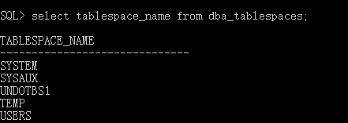

**登录超级管理员**

在sql plus中输入

`sys/manager as sysdba`


查询可插接数据库

`select  name , open_mode from v$pdbs;`看到有两个pcd数据库


## 表空间

查询表空间

` select tablespace_name from dba_tablespaces;`



创建表空间

```
  1	 create tablespace user_data
  2  datafile 'd:\oracle\oradata\orcl\bamboo_data.DBF'
  3   size 50m
  4  autoextend on
  5  next 50m maxsize 20480m
  6  extent management local;
```


## 用户

**创建用户**c##root

`create user c##root identified by 665128;`

要想创建的用户不需要加c##，那就是要求数据库不能为CDB。也就是要连接PDB，只有PDB中的数据库创建的时候才能不加C##。


授权

` grant connect,resource,dba to c##root;`

