#### **890888**

# 服务器购买与访问

1.购买

设置安全组，打开端口映射

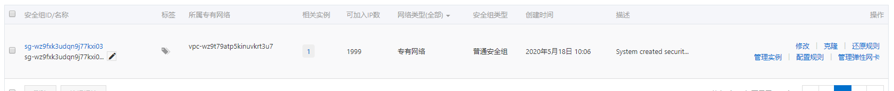

2.在实例设置密码（root,Yzy665128）

3.远程连接,输入账号密码

4.安装宝塔

```bash
yum install -y wget && wget -O install.sh http://download.bt.cn/install/install_6.0.sh && bash install.sh
```

5.根据ip登录宝塔

​	需要在安全组开启8888端口（配置规则）

```yaml
Bt-Panel: http://8.129.161.77:8888/50f573a4
username: u3y1zbf6
password: 3d1af4df
```

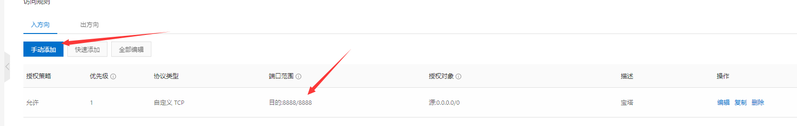

6.开放端口（安全）

mysql 3306

tomcat 8080

在阿里云安全组也要开放对应端口

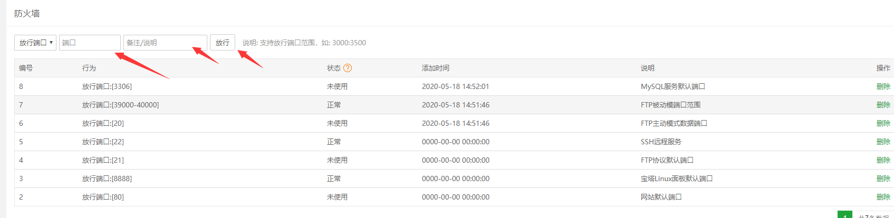


命令式：

使用xshell远程连接

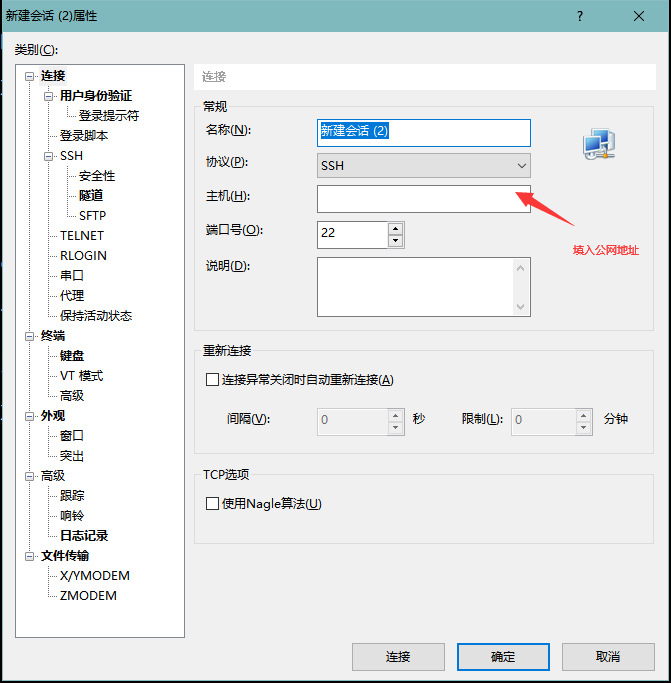

密码：yzy665128


# linux常用命令行

- cd 绝对路径  

  - cd /usr/local/mysql
  - cd ../返回上一层
  - cd ./当前目录
- ls 显示该目录下的文件

  - -a 显示所有文件
- rm 删除文件

  - -rf 删除其里面的文件
- mv 移动的文件 移动的目的地
- locate 查找位置

- netstat -anp|grep 8080  查看8080端口
  - kill -9 进程号   杀死进程号对应的端口

# 配置环境

## 下载jdk8


3.打开xftp将文件放到指定位置

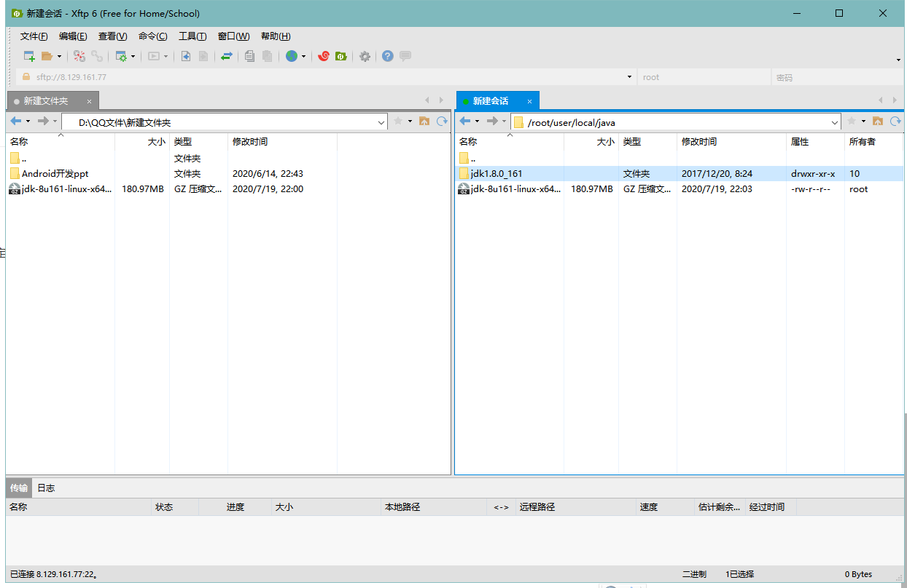

4.**解压**

tar -zxvf jdk-8u161-linux-x64.tar.gz

打开**配置文件**

vim /etc/profile

在最后加上几行代码：

```
export JAVA_HOME=/root/user/local/java/jdk1.8.0_161
export JRE_HOME=${JAVA_HOME}/jre
export CLASSPATH=.:${JAVA_HOME}/lib:${JRE_HOME}/lib:$CLASSPATH
export JAVA_PATH=${JAVA_HOME}/bin:${JRE_HOME}/bin
export PATH=$PATH:${JAVA_PATH}
```

使文件**生效**

source /etc/profile


## 下载安装mysql

### 问题

- 在线安装出了很多问题，使用xftp将压缩包放入然后解压。但是这个方法没有找到数据库配置文件。

- 在线安装将目录放在了root下，而不是usr下面

- 安装完成后运行service mysql start，报错

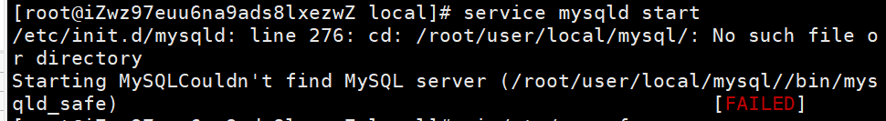

- my.cnf中的文件夹位置没有问题
- 按着错误的位置init.d文件下mysqld文件，将其删除，就可以运行了


### 在线安装

1. 下载 MySQL服务器yum包

cd /usr/local/
wget https://dev.mysql.com/get/mysql80-community-release-el7-1.noarch.rpm

2. 安转软件源

rpm -Uvh mysql80-community-release-el7-1.noarch.rpm
3. 安装mysql服务端，命令执行后会有较长时间等待

yum install  -y  mysql-community-server
4. 启动mysql

service mysqld start
5. 查看mysql 的运行状态

service mysqld status
6. 获取MySQL的临时密码

grep 'temporary password' /var/log/mysqld.log
root@localhost: 后面为MySQL的临时密码


**查看安装的mysql**

rpm -ql 列出软件包安装的文件，

rpm -qa|grep -i mysql   查看mysql所有安装包的文件存储位置

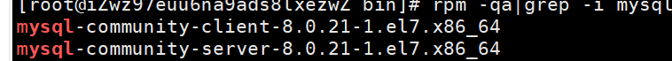

**卸载mysql**

rpm -ev --nodeps mysql-community-server-8.0.21-1.el7.x86_64

rpm -ev --nodeps mysql-community-common-8.0.21-1.el7.x86_64

rpm -ev --nodeps mysql-community-client-8.0.21-1.el7.x86_64

rpm -ev --nodeps mysql80-community-release-el7-1.noarch

rpm -ev --nodeps mysql-community-libs-8.0.21-1.el7.x86_64

全部卸载完


**修改密码**

alter user 'root'@'localhost' identified by 'yzy665128'

更新数据库

user mysql


### 使用sql文件

```
//登录
mysql -uroot -p 

//创建数据库
create database jeesite;

//选择数据库
use jeesite;

//使用sql文件
source /usr/local/bus.sql

//查看表
show tables;
+---------------------------+
| Tables_in_jeesite         |
+---------------------------+
| bus_car                   |
| bus_driver                |
| bus_message               |
| bus_route                 |
| bus_route_high_sell_day   |
| bus_route_high_sell_month |
| bus_security_check        |
| bus_sell                  |
| bus_station               |
+---------------------------+
9 rows in set (0.00 sec)
```


## 下载安装tomcat

1.下载tomca8.5.57安装包

2.使用xftp将压缩包放到服务器上

3.解压

```
  tar -xzvf  压缩包名
```

4.启动tomcat，进入tomcat里面的bin目录

./startup.sh

./shutdown.sh


## 下载安装redis

1.打开官网下载stable

2.xftp传输到服务器

3.解压缩

tar -xvf redis-6.0.1.tar.gz

4.进入redis，make**编译**

```
cd redis-6.0.1

make
```

5.如果报错，可能是没有**安装gcc**，redis需要c实现

yum install -y gcc g++ gcc-c++ make

如果还是无法编译，升级gcc版本

```bash
yum -y install centos-release-scl  # 升级新版本 

yum -y install devtoolset-9-gcc devtoolset-9-gcc-c++ devtoolset-9-binutils

scl enable devtoolset-9 bash

#如果想要长期使用高版本
 echo "source /opt/rh/devtoolset-9/enable" >>/etc/profile
```

6.再次编译

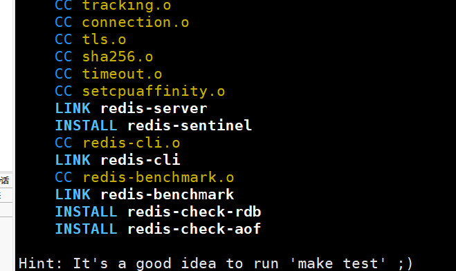

7.进行**测试**

make test，发现出错

yum install tcl

再次测试成功

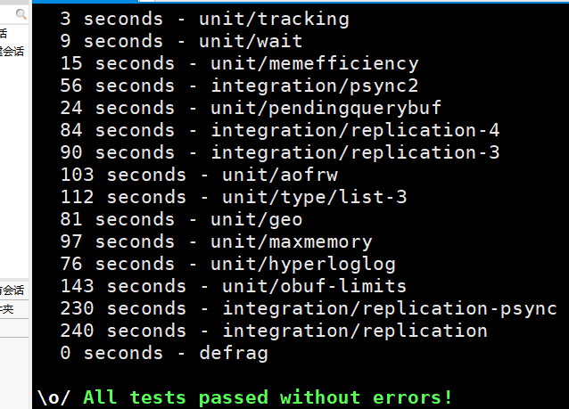

8.在src目录下**启动redis**

./redis-server

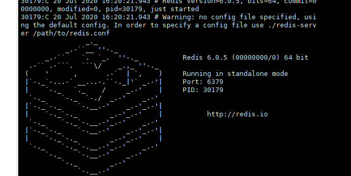

9.返回redis目录，修改配置文件，改为**后台启动**

vim redis.conf     

将daemonize no改成 yes

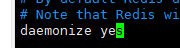

10.**查看目前运行redis进程**

ps -aux|grep redis| grep -v grep

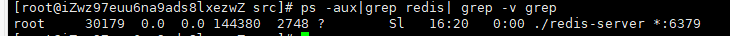

**关闭**

- 杀死进程
  - kill -9 30179
- shutdown
  - 在使用redis时输入shutdown

11.在**src目录下**执行redis-cli**使用redis**

./redis-cli

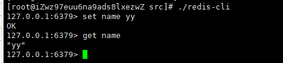


# 部署项目

## JAR包

1.打包springboot项目

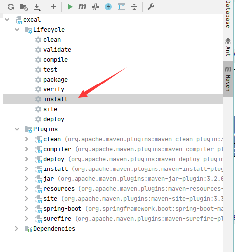

target下会生成一个jar包

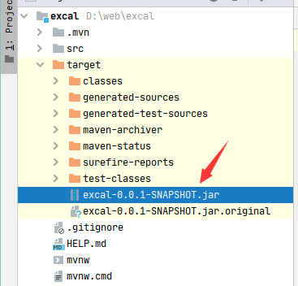

2.使用xft将文件放到服务器上

3.在放置文件的目录下执行语句

java -jar excal-0.0.1-SNAPSHOT.jar

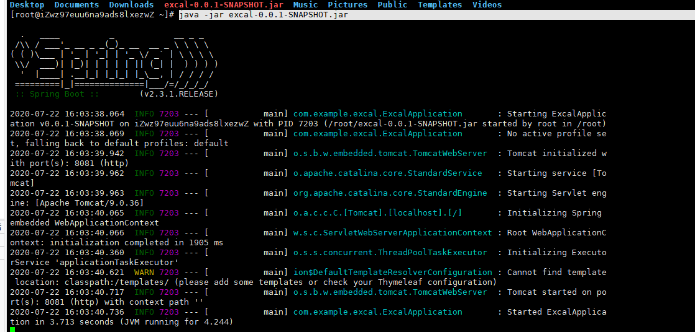

4.浏览器访问

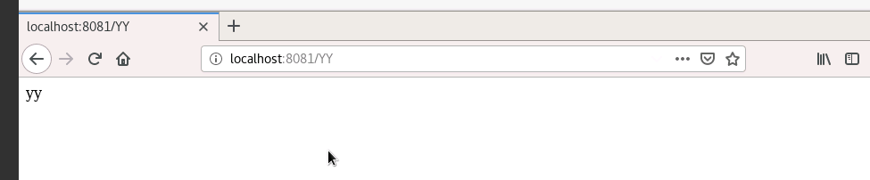

5.当断开连接时,就会关闭该jar包

## war包

将springboot达成war包

1.pom.xml文件中将默认jar方式改成war方式

```
<version>0.0.1-SNAPSHOT</version>
<packaging>war</packaging>
```

2.去掉web依赖中的tomcat,并增加tomcat依赖

```xml
<dependency>
            <groupId>org.springframework.boot</groupId>
            <artifactId>spring-boot-starter-web</artifactId>
            <exclusions>
                <exclusion>
                    <groupId>org.springframework.boot</groupId>
                    <artifactId>spring-boot-starter-tomcat</artifactId>
                </exclusion>
            </exclusions>
        </dependency>
```

```xml
<dependency>
            <groupId>org.apache.tomcat</groupId>
            <artifactId>tomcat-servlet-api</artifactId>
            <version>8.5.57</version>
            <scope>provided</scope>
        </dependency>
```

3.继承org.springframework.boot.web.servlet.support.SpringBootServletInitializer，实现configure方法

​	如果您正在构建WAR文件并部署它，则需要WebApplicationInitializer。

​	如果你喜欢运行一个嵌入式Web服务器，那么你根本不需要这个。

```java
@SpringBootApplication
public class ExcalApplication extends SpringBootServletInitializer {

    public static void main(String[] args) {
        SpringApplication.run(ExcalApplication.class, args);
    }

    @Override
    protected SpringApplicationBuilder configure(SpringApplicationBuilder builder) {
        return builder.sources(ExcalApplication.class);
    }
}
```

4.运行package

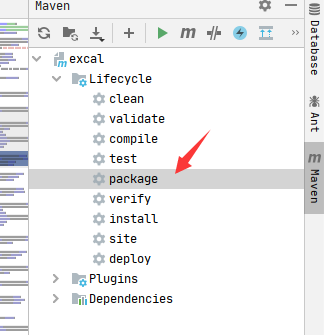

5.将war包放到tomcat的webapp目录下

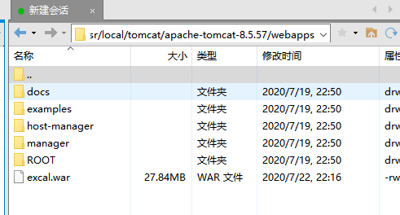

6.项目的访问地址lovalhost:8080/项目名/路径

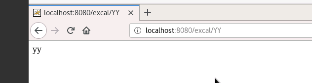


### 遇到的问题

1.无法打包

Failed to execute goal org.apache.maven.plugins:maven-resources-plugin:3.1.0:resources (default-resources) on project excal: Cannot create resource output directory: D:\web\excal\target\classes


解决方法:但是target的目录被打开,关闭即可


2.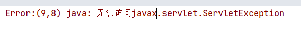

忘记导入tomcat依赖


## springboot 

1.打包

2.放入服务器，并在对应的目录下启动

3.访问公网ip:端口


### 无法访问

1.安全组策略加上需要的端口

2.查询指定端口是否已经开放
`firewall-cmd --query-port=8182/tcp`

需要打开防火墙才能设置

3.防火墙中将端口放入

`firewall-cmd --add-port=8182/tcp --permanent`

4.重载入添加的端口：
`firewall-cmd --reload`

5.移除指定端口：

`firewall-cmd --permanent --remove-port=3306/tcp`


### 跨域访问

这个CORS，是一个W3C标准，全称是"跨域资源共享"（Cross-origin resource sharing）需要浏览器和服务器同时支持。
所有浏览器都支持该功能。
服务器的话需要单独配置使用 @CrossOrigin 或 全局配置类

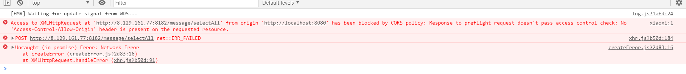

```java
@Configuration
@SuppressWarnings("unused")
public class CorsConfig {
    private CorsConfiguration buildConfig() {
        CorsConfiguration corsConfiguration = new CorsConfiguration();
        // 1允许任何域名使用
        corsConfiguration.addAllowedOrigin("*");
        // 2允许任何头
        corsConfiguration.addAllowedHeader("*");
        // 3.允许ajax异步请求带cookie信息
        corsConfiguration.setAllowCredentials(true);
        // 4允许任何方法（post、get等）
        corsConfiguration.addAllowedMethod("*");
        return corsConfiguration;
    }

    @Bean
    public CorsFilter corsFilter() {
        UrlBasedCorsConfigurationSource source = new UrlBasedCorsConfigurationSource();
        source.registerCorsConfiguration("/**", buildConfig());
        return new CorsFilter(source);
    }
}
```


## screen

1.安装screen

2.创建一个screen

​		`screen -S name`

3.进入screen之后即可进行操作

4.``ctrl+a+d `保存并退出screen，screen会在后台持续运行

5.访问screen空间

​		`screen -r name `

6.查看所有screen空间

​		`screen -ls`

7.退出不保存

​		`exit`

8.删除创建的screen空间

​		`screen -X -S name quit`

