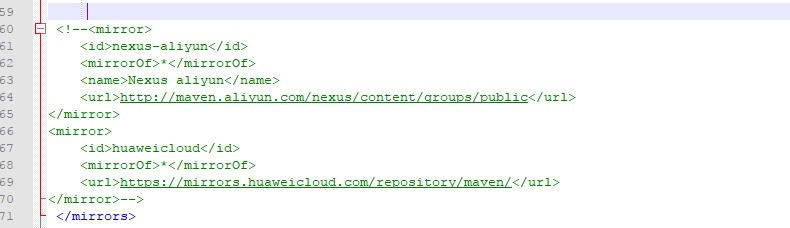

# maven

## 文件目录

D:\apache-maven-3.6.3

## maven配置镜像

D:\apache-maven-3.6.3\conf的conf里



添加阿里巴巴镜像

```
<mirror>
    <id>nexus-aliyun</id>
    <mirrorOf>*</mirrorOf>
    <name>Nexus aliyun</name>
    <url>http://maven.aliyun.com/nexus/content/groups/public</url>
</mirror>
```

