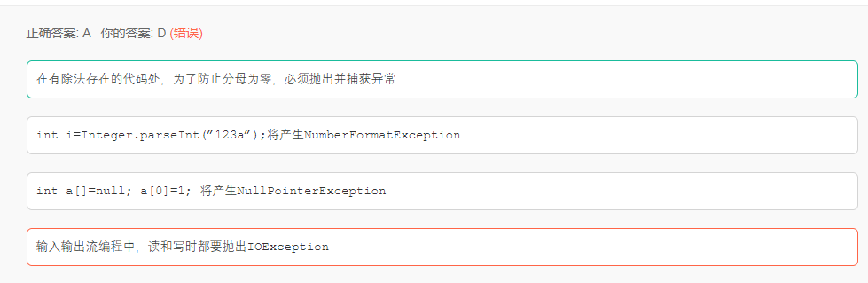

# JavaSE

## 数据类型

1.String 是final修饰的，不可变，每次都是创建一个新的对象

​	运行速度StringBuilder>StringBuffer>String

​	StringBuffer是线程安全的

2.float

​	由大到小需要强转，小到大不需要

​	所以double需要强转

​	long,short不需要强转float


3.String s = ``"祝你考出好成绩！"``;
	s.length = 8; 问的是字符串长度而不是所占字节


4.队列先进先出，栈先进后出

## 方法

static会在 the class is loaded into the Java virtual machine.时显示

### 重载
重载需要参数不同，仅仅返回类型不同，不算重载

## 类

 1.**接口**中声明的'变量'必须为public final static,所以为常量 

## 声明类

abstract 声明抽象类
final修饰的类不能改变，不能被继承，如String

### extends
继承类会先实现父类的方法再执行子类的方法
is-a表示继承
has-a表示包含（可以不写）
like-a表示接口


## 异常

> finally 语句块是在 try 或者 catch 中的 return 语句之前执行的 

>  关于异常的编程，以下描述错误的是 

​	

​	Java的异常分为两种，一种是运行时异常（RuntimeException），一种是非运行异常也叫检查式异常（CheckedException）。

​	1、运行时异常不需要程序员去处理，当异常出现时，JVM会帮助处理。常见的运行时异常有：

​	ClassCastException(类转换异常)

​	ClassNotFoundException

​	IndexOutOfBoundsException(数组越界异常)

​	NullPointerException(空指针异常)

​	ArrayStoreException(数组存储异常，即数组存储类型不一致)

​	还有IO操作的BufferOverflowException异常

​	2、非运行异常需要程序员手动去捕获或者抛出异常进行显示的处理，因为Java认为Checked异常都是可以被修	复的异常。常见的异常有：

​	IOException

​	SqlException

## 代码

1.输出的结果

```java
public static void main(String args[]) {
   System.out.println( 17 ^ 5 );
}
```

位异运算符号。

运算规则是：两个数转为二进制，然后从高位开始比较，如果相同则为0，不相同则为1。

17：0001 00015： 0000 0101结果：0001 0100 转10进制：20


2.假如某个JAVA进程的JVM参数配置如下：
-Xms1G -Xmx2G -Xmn500M -XX:MaxPermSize=64M -XX:+UseConcMarkSweepGC -XX:SurvivorRatio=3,
请问eden区最终分配的大小是多少 

java **-Xmx2G -Xms1G -Xmn500M** **-Xss128k**
**-**：设置JVM促使内存为1G。此值可以设置与-Xmx相同，以避免每次垃圾回收完成后JVM重新分配内存。

**-Xmn500M**：设置年轻代大小为2G。**整个JVM内存大小=年轻代大小 + 年老代大小 + 持久代大小**。

**-XX:SurvivorRatio=3****:**新生代中又会划分为 Eden 区，from Survivor、to Survivor 区。

其中 Eden 和 Survivor 区的比例默认是 8:1:1，当然也支持参数调整 -XX:SurvivorRatio=3的话就是3:1:1。

故该题为500*（3/5）=300M.


# JavaWeb

## 7种事务传播行为。

1、**PROPAGATION_REQUIRED：默认事务类型，如果没有，就新建一个事务；如果有，就加入当前事务。适合绝大多数情况。**

2、PROPAGATION_REQUIRES_NEW：如果没有，就新建一个事务；如果有，就将当前事务挂起。

 3、PROPAGATION_NESTED：如果没有，就新建一个事务；如果有，就在当前事务中嵌套其他事务。

4、PROPAGATION_SUPPORTS：如果没有，就以非事务方式执行；如果有，就使用当前事务。

5、PROPAGATION_NOT_SUPPORTED：如果没有，就以非事务方式执行；如果有，就将当前事务挂起。即无论如何不支持事务。

6、PROPAGATION_NEVER：如果没有，就以非事务方式执行；如果有，就抛出异常。

7、PROPAGATION_MANDATORY：如果没有，就抛出异常；如果有，就使用当前事务。


# 集合

1. List 是一个有序集合，可以存放重复的数据 (有序：存进是什么顺序，取出时还是什么顺序)
           (1).ArrayList 底层是数组适合查询，不适合增删元素。
           (2).LiskedList 底层是双向链表适合增删元素，不适合查询操作。
           (3).Vector 底层和ArrayList相同，但是Vector是线程安全的，效率较低很少使用
2. Set 是一个无序集合，不允许放重复的数据 (无序可重复，存进和取出的顺序不一样)
           (1).HashSet 底层是哈希表/散列表
           (2).TreeSet 继承sartedSet接口（无需不可重复，但存进去的元素可以按照元素的大小自动排序）
3.  Map 是一个无序集合，以键值对的方式存放数据，键对象不允许重复，值对象可以重复。

​        (1).HashMap实现不同步，线程不安全。 HashTable线程安全

​        (2).HashMap中的key-value都是存储在Entry中的。

​        (3).HashMap可以存null键和null值，不保证元素的顺序恒久不变，它的底层使用的是数组和链表，通过hashCode()方法和equals方法保证键的唯一性


# 数据库

使用索引，第一个字段不能省略（带头大哥不能死）