# 低级失误

1. web.xml导入filter，把filter标签写成servlet，导包报错找了半天，傻子！

2. namespace老是忘记加！

3. 直接把请求路径写到了注解上，极其低级的错误

   ```java
   @Controller(“/Login”)
   ```

   


# 设置汇总------------------------

## 热部署

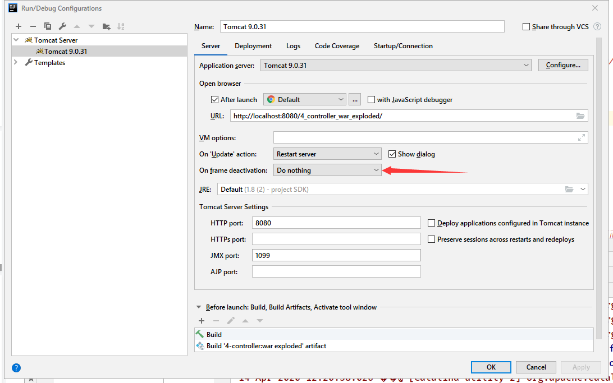

都改成update classes and resources

**改变java资源后怎么生效**：

1. debug状态下，update即可生效
2. run状态下，redeploy生效


## 关于idea控制台输出中文乱码

 解决方法：

网上找的方法都是在idea安装目录bin里的vmoptions里添加utf-8，我试了没有效果。然后在idea的help中的edit Custom VM option里添加就生效了。

---

# 空指针

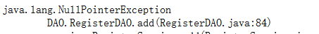

  这是原来的语句
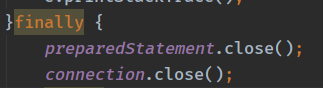

 解决方法：

一定要在前面加上判断是否关闭语句！！！


---


# git连接失败

idea cannot load information for github.com

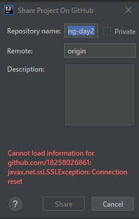

 解决方法：

找到setting github
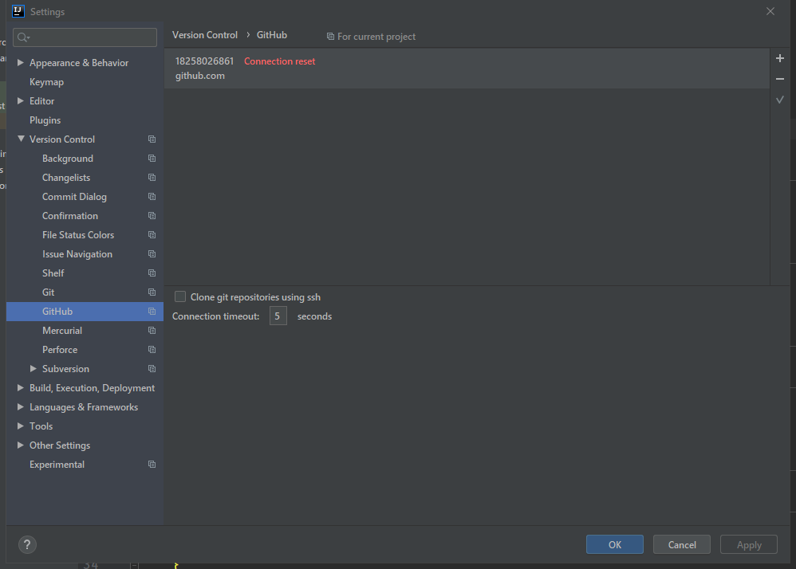
删除账号然后reset
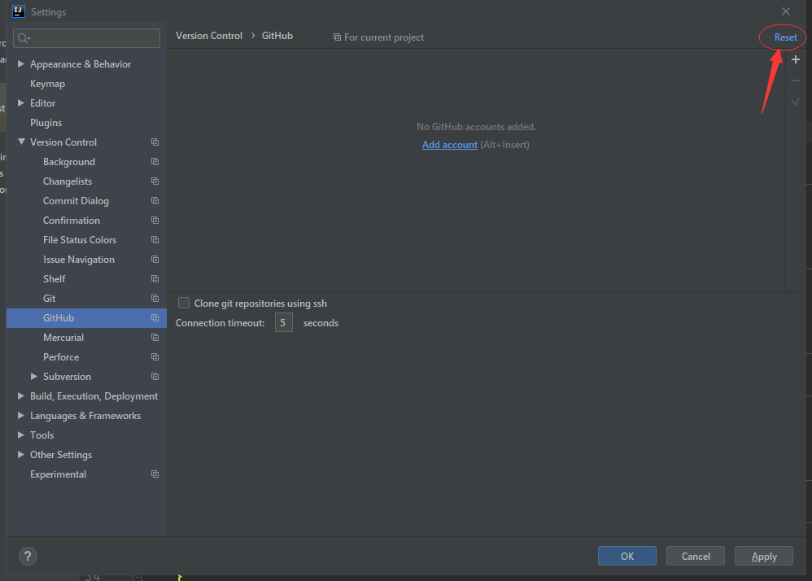
如果还是不行就重启电脑


# Maven问题--------------------------

## 新建的module没有导包

 解决方法：

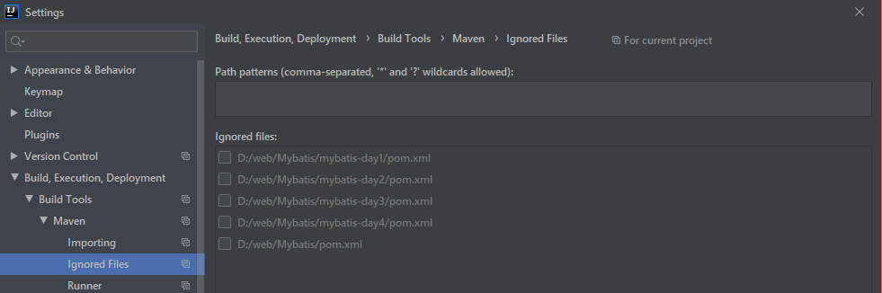
1.把勾都去掉

2.如果还是不行，删除main和test文件夹

3.选择project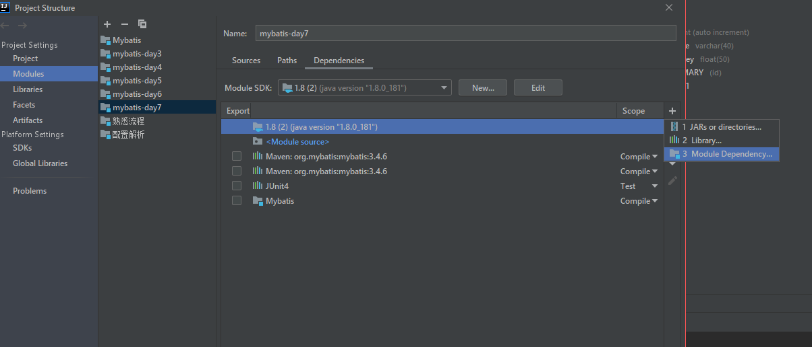

---

## maven飘红

 解决方法：

重启idea

---

## java compilation

 **解决方法**

将module的版本号和project一致

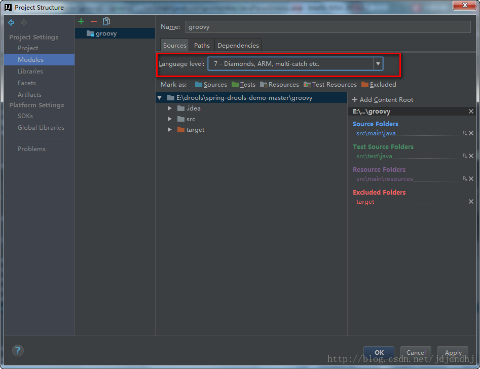 

# 数据库问题---------------------------

---

## 数据库url

Unknown initial character set index '255' received from server. Initial client character set can be forced via the 'characterEncoding' property.
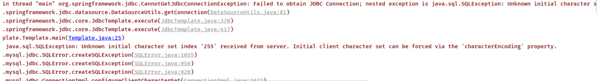

 解决方法

把url变成

```
"jdbc:mysql://localhost:3306/account?useUnicode=true&characterEncoding=utf-8"
```

---

## 数据库时区

Server returns invalid timezone. Go to 'Advanced' tab and set 'serverTimezone' prope

mysql时区没有设置

 **解决方法**

1.cmd，输入mysql -hlocalhost -uroot -p
输入密码


2.输入show variables like'%time_zone';


3.输入set global time_zone = '+8:00';

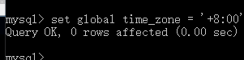


## 数据池连接失败

### 访问拒绝

we failed to succeed more than the maximum number of allowed acquisition attempts (2). Last acquisition attempt exception:  java.sql.SQLException: Access denied for user XXXXXX(using password: YES)
 意思是：我们连接数据库失败，尝试了最大的连接次数都没有成功，上一次获取的连接异常是：访问user XXX被拒绝

**解决方法：**

 确认了 driver、url、username、password信息是**正确**的，若是仍然有此错误，原因可能是没有读取到username 这些信息，可以修改jdbc.properties 文件和spring.xml 文件如下： 

```xml
<bean id="dataSource" class="com.mchange.v2.c3p0.ComboPooledDataSource">
		<property name="driverClass" value="${jdbc.driver}"/>
		<property name="jdbcUrl" value="${jdbc.url}"/>
		<property name="user" value="${jdbc.username}"/>
		<property name="password" value="${jdbc.password}"/>
```

```xml
jdbc.driver=com.mysql.jdbc.Driver
jdbc.url=jdbc:mysql://localhost:3306/account?useUnicode=true&characterEncoding=UTF-8
jdbc.username=root
jdbc.password=root
```


### No suitable driver

java.sql.SQLException: No suitable driver 

**前提**

：**junit单元测试可以访问数据库但是web项目中不可以**

**原因**：

在pom.xml更换依赖的时候**没有更换lib中的依赖jar包**


解决方法：

更换jar包


**成功！**


## 查询数据库字段输出的是类型

查询id，name输出的是这种类型


 **解决方法**

：如果使用了lombok可能失效了，手动添加构造，getter，setter，toString


# SSM------------------------------

## 注解忘加参数

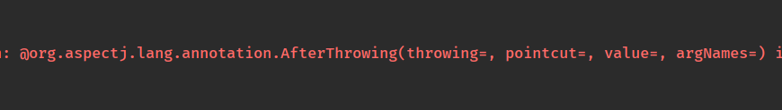

在括号内忘记写内容
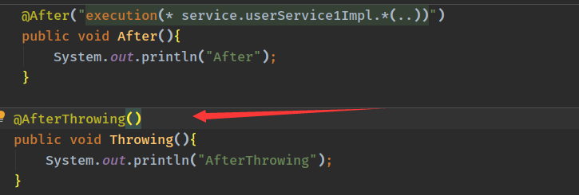

 解决方法

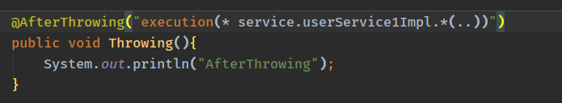


## bindingException：

​	Invalid bound statement（not found）

原因：target文件夹里没有映射文件

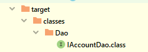

**解决方法**：放在pom.xml

```xml
<build>
<resources>
    <resource>
        <directory>src/main/java</directory>
        <includes>
            <include>**/*.properties</include>
            <include>**/*.xml</include>
        </includes>
        <filtering>false</filtering>
    </resource>
    <resource>
        <directory>src/main/resources</directory>
        <includes>
            <include>**/*.properties</include>
            <include>**/*.xml</include>
        </includes>
        <filtering>false</filtering>
    </resource>
</resources>
</build>
```


## mybatis增删改，数据库没反应

**解决方法**：

1. 设置自动提交事务

```java
//        true表示自动提交事务
        return sqlSessionFactory.openSession(true);
```

2. 手动在执行代码后件增加语句

```java
sqlSession.commit();
```


##  数据区插入的值都为0

问题原因

```xml
insert into account values (id=#{id},name=#{name},money=#{money})
```

插入语句写错，后面只要value，不需要k-v

**解决方法**

```xml
insert into account(id,name,money) values (#{id},#{name},#{money})
```


## servlet乱码

- 在提交页面传入中文参数


- 在视图发现乱码了

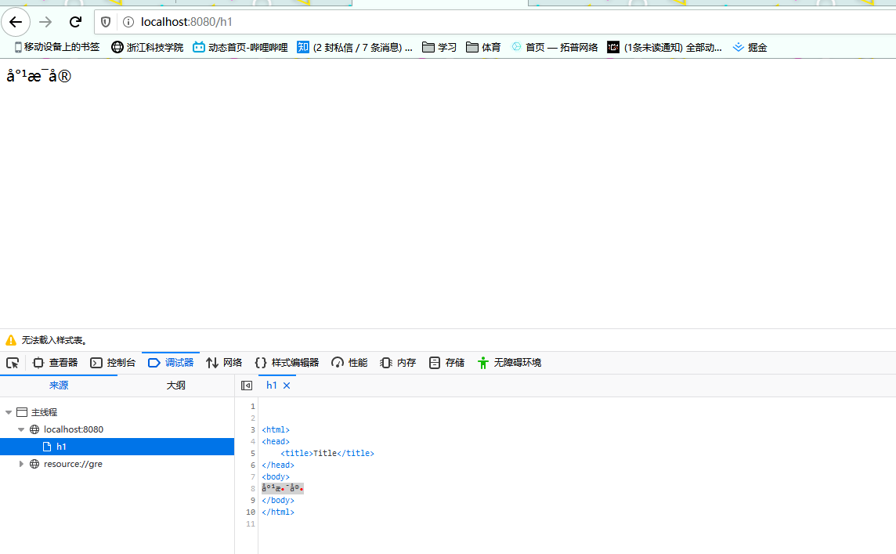

- 在控制台显示的也是乱码


 **解决方法**

- servlet的编码设置：

  ```
  request.setCharacterEncoding("utf-8");
  ```

  发现并没有什么卵用，说明在进入后端之前就乱码了

- 使用过滤器

  ```java
  public class EncodeFilter implements Filter {
      @Override
      public void init(FilterConfig filterConfig) throws ServletException {}
      @Override
      public void doFilter(ServletRequest servletRequest, ServletResponse servletResponse, FilterChain filterChain) throws IOException, ServletException {
          servletRequest.setCharacterEncoding("utf-8");
  //      继续往下走，不要中断
          filterChain.doFilter(servletRequest,servletResponse);
      }
      @Override
      public void destroy() {}
  }
  ```

  配置web.xml（这里犯了个低级错误，filter标签写成了servlet标签）

  ```xml
  <filter>
          <filter-name>encode</filter-name>
          <filter-class>filter.EncodeFilter</filter-class>
      </filter>
      <filter-mapping>
          <filter-name>encode</filter-name>
          <url-pattern>/*</url-pattern>
      </filter-mapping>
  ```

  解决问题！

- 使用spring提供的过滤器

  ```xml
  <filter>
          <filter-name>encoding</filter-name>
          <filter-class>org.springframework.web.filter.CharacterEncodingFilter</filter-class>
          <init-param>
              <param-name>encoding</param-name>
              <param-value>utf-8</param-value>
          </init-param>
      </filter>
      <filter-mapping>
          <filter-name>encoding</filter-name>
          <url-pattern>/*</url-pattern>
      </filter-mapping>
  ```

  也能解决，但是极端情况下get方法不生效

## No suitable driver

java.sql.SQLException: No suitable driver 

**前提**

：**junit单元测试可以访问数据库但是web项目中不可以**

**原因**：

在pom.xml更换依赖的时候**没有更换lib中的依赖jar包**


解决方法：

更换jar包


**成功！**


## tomcat1099端口占用

1. cmd --->>>> netstat -aon|findstr 1099

2. taskkill -f -pid 5608